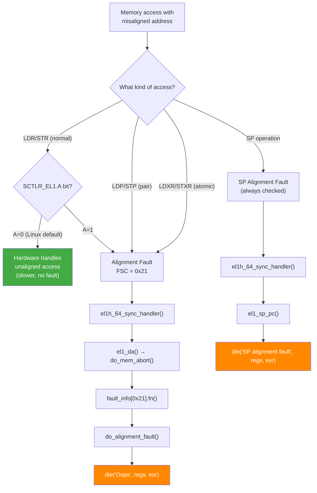

# Scenario 10: Alignment Fault — SP/PC Misaligned or Unhandled Alignment Exception

## Symptom

```
[ 4567.012345] Unable to handle kernel NULL pointer dereference at virtual address 0000000000000000
...or more specifically:

[ 4567.012345] Unhandled fault: alignment fault (0x96000021) at 0xffff000012345671
[ 4567.012352] Mem abort info:
[ 4567.012354]   ESR = 0x0000000096000021
[ 4567.012357]   EC = 0x25: DABT (current EL), IL = 32 bits
[ 4567.012360]   SET = 0, FnV = 0
[ 4567.012362]   EA = 0, S1PTW = 0
[ 4567.012364]   FSC = 0x21: alignment fault
[ 4567.012369] Data abort info:
[ 4567.012371]   ISV = 0, ISS = 0x00000021, ISS2 = 0x00000000
[ 4567.012373]   CM = 0, WnR = 0
[ 4567.012378] Internal error: Oops: 0000000096000021 [#1] PREEMPT SMP
[ 4567.012384] Modules linked in: buggy_mod(O) xhci_hcd usb_storage
[ 4567.012392] CPU: 2 PID: 9012 Comm: test_app Tainted: G           O      6.8.0 #1
[ 4567.012399] pc : my_read_register+0x24/0x60 [buggy_mod]
[ 4567.012405] lr : my_init_device+0x88/0x100 [buggy_mod]
[ 4567.012411] sp : ffff80001abcde00
[ 4567.012414] x0 : ffff000012345671  x1 : 0000000000000000
[ 4567.012419] ...
[ 4567.012425] Call trace:
[ 4567.012427]  my_read_register+0x24/0x60 [buggy_mod]
[ 4567.012432]  my_init_device+0x88/0x100 [buggy_mod]
[ 4567.012437]  my_probe+0xc0/0x180 [buggy_mod]
[ 4567.012442]  platform_probe+0x68/0xd0
[ 4567.012446]  really_probe+0xc0/0x2e0
[ 4567.012450]  __driver_probe_device+0x78/0x130
[ 4567.012454]  driver_probe_device+0x3c/0x120
[ 4567.012458] Code: f9400260 91000400 d503201f 52800021 (b9400000)
[ 4567.012464]                                            ^^^^^^^^^^
[ 4567.012466]                                            LDR w0, [x0]
[ 4567.012468]                                            x0=...5671 (not 4-byte aligned!)
[ 4567.012472] ---[ end trace 0000000000000000 ]---
```

### SP Alignment Fault Variant
```
[ 4567.012345] Internal error: SP alignment fault: 0000000000000000 [#1] PREEMPT SMP
[ 4567.012352] CPU: 1 PID: 1234 Comm: buggy_app Tainted: G           O      6.8.0 #1
[ 4567.012360] pc : corrupted_function+0x10/0x40 [buggy_mod]
[ 4567.012366] lr : caller_function+0x30/0x80 [buggy_mod]
[ 4567.012372] sp : ffff80001234bdf3    ← NOT 16-byte aligned!
[ 4567.012378] ...
```

### How to Recognize
- FSC = **`0x21`** — **alignment fault**
- Or **`SP alignment fault`** in the message
- Fault address is **not aligned** to the access size (e.g., odd address for 4-byte access)
- SP must be **16-byte aligned** in AArch64 (architectural requirement)
- ESR EC = `0x25` (DABT) or `0x26` (SP alignment from hardware)

---

## Background: ARM64 Alignment Rules

### AArch64 Alignment Requirements
```
Instruction          Required Alignment    Fault if Misaligned
─────────           ──────────────────    ───────────────────
LDR/STR Xn, [addr]   8-byte aligned        Depends on SCTLR_EL1.A
LDR/STR Wn, [addr]   4-byte aligned        Depends on SCTLR_EL1.A
LDRH/STRH Wn,[addr]  2-byte aligned        Depends on SCTLR_EL1.A
LDRB/STRB Wn,[addr]  1-byte aligned        Never faults (byte)
LDP/STP Xn, Xm       8-byte aligned        Always faults if misaligned
LDXR/STXR (atomic)    Natural alignment     Always faults if misaligned
SP (stack pointer)    16-byte aligned       ALWAYS faults (hardware)

SCTLR_EL1.A (Alignment check enable):
  A=0: Unaligned LDR/STR → hardware handles (slower but works)
  A=1: Unaligned LDR/STR → alignment fault
  Linux default: A=0 (alignment faults disabled for normal LDR/STR)
  But: atomics and SP alignment are ALWAYS checked regardless
```

### Why SP Must Be 16-Byte Aligned
```
AArch64 calling convention (AAPCS64):
- SP MUST be 16-byte aligned at all times
- LDP/STP used for push/pop → requires alignment
- Hardware checks SP alignment on EVERY exception entry
- Misaligned SP → immediate SP alignment fault

This is NOT configurable — it's an architectural requirement.

If SP becomes misaligned:
→ Any exception (interrupt, syscall, page fault) → SP alignment fault
→ The original task was already corrupted
```

---

## ARM64 Alignment Fault Path



### do_alignment_fault()
```c
// arch/arm64/mm/fault.c

static const struct fault_info fault_info[] = {
    // ...
    { do_alignment_fault, SIGBUS, BUS_ADRALN, "alignment fault" },  // FSC 0x21
};

static int do_alignment_fault(unsigned long far, unsigned long esr,
                              struct pt_regs *regs)
{
    if (IS_ENABLED(CONFIG_COMPAT_ALIGNMENT_FIXUPS) &&
        compat_user_mode(regs))
        return do_compat_alignment_fixup(far, regs);

    // No fixup for AArch64 kernel or user:
    // → falls through to die/force_signal

    if (!user_mode(regs))
        die("Oops - alignment fault", regs, esr);

    // User mode: send SIGBUS
    force_signal_inject(SIGBUS, BUS_ADRALN, far, 0);
    return 0;
}
```

### SP/PC Alignment Check
```c
// arch/arm64/kernel/entry-common.c

static void noinstr el1_sp_pc(struct pt_regs *regs, unsigned long esr)
{
    // SP or PC alignment exception:
    // This is always fatal in the kernel — SP corruption

    enter_from_kernel_mode(regs);
    local_daif_inherit(regs);

    die("SP/PC alignment exception", regs, esr);
}
```

---

## Common Causes

### 1. Incorrect Pointer Cast with Wrong Alignment
```c
void my_parse_packet(u8 *raw_data) {
    // raw_data might be at any byte alignment
    u32 *header = (u32 *)(raw_data + 3);  // Offset 3 → odd address!
    u32 value = *header;  // Alignment fault!
    // raw_data + 3 is NOT 4-byte aligned
}

// FIX: use get_unaligned:
#include <asm/unaligned.h>
void my_parse_packet(u8 *raw_data) {
    u32 value = get_unaligned((u32 *)(raw_data + 3));
    // get_unaligned handles misalignment safely
}
```

### 2. Packed Struct Access
```c
struct __packed my_wire_format {
    u8  type;
    u32 length;    // At offset 1 — NOT 4-byte aligned!
    u64 payload;   // At offset 5 — NOT 8-byte aligned!
};

void process(struct my_wire_format *pkt) {
    u64 payload = pkt->payload;  // May cause alignment fault!
    // Compiler should handle this for packed structs,
    // but direct pointer manipulation can bypass it
}

// If pointer arithmetic is used:
u64 *payload_ptr = &pkt->payload;  // Misaligned pointer!
u64 val = *payload_ptr;            // Alignment fault on strict platforms
```

### 3. Misaligned MMIO Access
```c
void __iomem *base = ioremap(phys, size);

// Hardware register at offset 0x11 (not 4-byte aligned):
u32 val = readl(base + 0x11);  // Alignment fault!
// MMIO must be naturally aligned for readl/writel

// Even if base is aligned, wrong offset causes misalignment:
// base = 0xffff000000000000 (aligned)
// base + 0x11 = 0xffff000000000011 (NOT 4-byte aligned)
```

### 4. Stack Corruption Causes SP Misalignment
```c
// If a buffer overflow corrupts the saved SP on stack:
void vulnerable_func(void) {
    char buf[8];
    // Overflow corrupts the frame pointer and return address:
    memcpy(buf, user_data, 64);  // Overflow!
    // When function returns:
    // SP restored from corrupted frame → misaligned
    // → SP alignment fault on next exception/function call
}
```

### 5. Atomic Operations on Misaligned Address
```c
struct my_state {
    u8 flags;
    atomic_t counter;  // At offset 1 if not padded!
} __packed;

// atomic_inc uses LDXR/STXR → requires natural alignment
atomic_inc(&state->counter);
// If counter is at odd offset → alignment fault
// LDXR/STXR ALWAYS require alignment (regardless of SCTLR.A)
```

### 6. Inline Assembly with Wrong Alignment
```c
void my_atomic_op(void *addr) {
    u64 result;
    asm volatile(
        "ldxr %0, [%1]\n"    // LDXR requires 8-byte alignment!
        "add %0, %0, #1\n"
        "stxr w2, %0, [%1]\n"
        : "=&r"(result)
        : "r"(addr)           // If addr is misaligned → fault!
        : "memory", "w2"
    );
}
```

---

## Alignment Fault vs Silent Misaligned Access

```
Linux on ARM64 with SCTLR_EL1.A = 0 (default):

                    Aligned?    Fault?    Performance
Normal LDR/STR:    No          No        Slower (HW handles)
Normal LDR/STR:    Yes         No        Full speed
LDP/STP (pair):    No          YES       ← Always faults
LDXR/STXR:        No          YES       ← Always faults
Atomic ops:        No          YES       ← Always faults
SP operations:     No          YES       ← Always faults

The kernel sets A=0 → most unaligned accesses "work" but are SLOW.
Only pair loads, atomics, and SP alignment cause actual faults.

Performance impact of unaligned access:
- Single unaligned LDR: ~2-4x slower than aligned
- Crosses cache line: even slower
- Crosses page: may cause TWO TLB lookups
```

---

## Debugging Steps

### Step 1: Check the Fault Address Alignment
```
Fault address: ffff000012345671
                              ^
                              1 → odd address (not 2/4/8 aligned)

For a 4-byte LDR (w0):
  Required: address % 4 == 0
  Actual: 0x671 % 4 == 1 → MISALIGNED

For SP alignment:
  sp: ffff80001234bdf3
                     ^
                     3 → not 16-byte aligned
  Required: SP % 16 == 0
```

### Step 2: Decode the Faulting Instruction
```
Code: ... (b9400000)
Decode: LDR w0, [x0]
        x0 = ffff000012345671 (from register dump)
        LDR w0 requires 4-byte alignment
        0x671 & 0x3 = 1 → misaligned → fault!
```

### Step 3: Find the Source of the Misaligned Address
```bash
# Look at the function source:
# my_read_register+0x24/0x60 [buggy_mod]

# Disassemble:
objdump -dS buggy_mod.ko | less
# Find my_read_register
# Trace where x0 gets its value
# Is it a pointer + offset? Which offset?
```

### Step 4: Check for Packed Structs
```bash
# Search for __packed in the source:
grep -n "__packed\|__attribute__.*packed" drivers/my_driver/*.h

# Packed structs are the #1 cause of alignment issues
# Compiler usually generates byte-by-byte access for packed members
# But pointer casts can bypass this
```

### Step 5: Check SP Corruption
```
If "SP alignment fault":
  SP value should be 16-byte aligned but isn't
  → SP was corrupted (stack overflow, buffer overflow, use-after-free)
  → Check for stack buffer overflows in callers
  → Check frame pointer chain for corruption

# In crash tool:
crash> bt -f   # Show full frame with stack contents
# Look for corrupted frame pointers
```

### Step 6: Enable Alignment Fault Reporting
```bash
# To catch ALL unaligned accesses (even normally-silent ones):
# WARNING: This will cause MANY faults in normal operation!

# Set SCTLR_EL1.A = 1:
# This is NOT a standard kernel option
# Used only for debugging alignment-sensitive code

# Alternative: use compiler sanitizer
CFLAGS += -fsanitize=alignment   # UBSan alignment check
```

---

## Fixes

| Cause | Fix |
|-------|-----|
| Misaligned pointer cast | Use `get_unaligned()` / `put_unaligned()` |
| Packed struct member access | Use `get_unaligned` for multi-byte access |
| Wrong MMIO offset | Fix register offset to be naturally aligned |
| Misaligned atomic | Ensure atomic_t is naturally aligned (remove `__packed`) |
| SP corruption | Fix stack buffer overflow |
| Inline asm | Validate alignment before LDXR/STXR |

### Fix Example: Use get_unaligned for Network Parsing
```c
#include <asm/unaligned.h>

/* BEFORE: direct cast → may fault on strict alignment */
void parse_header(u8 *data) {
    u32 length = *(u32 *)(data + 3);    // Offset 3 → misaligned!
    u64 cookie = *(u64 *)(data + 7);    // Offset 7 → misaligned!
}

/* AFTER: safe unaligned access */
void parse_header(u8 *data) {
    u32 length = get_unaligned_le32(data + 3);  // Safe at any offset
    u64 cookie = get_unaligned_le64(data + 7);  // Safe at any offset
}
// get_unaligned compiles to byte-by-byte load or unaligned LDR
// depending on architecture support
```

### Fix Example: Align Atomic Variables in Packed Structs
```c
/* BEFORE: atomic inside packed struct → misaligned */
struct __packed my_state {
    u8 flags;
    atomic_t counter;   // At offset 1 → MISALIGNED for LDXR/STXR
};

/* AFTER: explicit alignment for atomic */
struct __packed my_state {
    u8 flags;
    u8 __pad[3];               // Pad to 4-byte boundary
    atomic_t counter;           // Now at offset 4 → aligned
};

/* OR: don't pack the struct if alignment matters */
struct my_state {
    u8 flags;
    atomic_t counter;           // Compiler adds padding automatically
};
```

### Fix Example: Safe MMIO Access
```c
/* BEFORE: misaligned register offset */
u32 read_status(void __iomem *base) {
    return readl(base + 0x11);  // Not 4-byte aligned!
}

/* AFTER: verify offset alignment at compile time */
#define REG_STATUS  0x10   // Must be 4-byte aligned for readl

u32 read_status(void __iomem *base) {
    BUILD_BUG_ON(REG_STATUS & 0x3);  // Compile-time check
    return readl(base + REG_STATUS);
}

/* If hardware truly has registers at odd offsets: */
u32 read_odd_reg(void __iomem *base, unsigned offset) {
    // Read byte-by-byte:
    u32 val = readb(base + offset);
    val |= (u32)readb(base + offset + 1) << 8;
    val |= (u32)readb(base + offset + 2) << 16;
    val |= (u32)readb(base + offset + 3) << 24;
    return val;
}
```

---

## ARM64 Alignment: Summary Table

| Access Type | Required Alignment | SCTLR.A=0 (default) | SCTLR.A=1 |
|-------------|-------------------|---------------------|-----------|
| LDRB/STRB | 1 byte (any) | OK | OK |
| LDRH/STRH | 2 bytes | OK (slow if misaligned) | FAULT |
| LDR/STR W | 4 bytes | OK (slow if misaligned) | FAULT |
| LDR/STR X | 8 bytes | OK (slow if misaligned) | FAULT |
| LDP/STP | Natural | **FAULT** | **FAULT** |
| LDXR/STXR | Natural | **FAULT** | **FAULT** |
| SP | 16 bytes | **FAULT** | **FAULT** |
| PC | 4 bytes | **FAULT** | **FAULT** |

---

## Quick Reference

| Item | Value |
|------|-------|
| Message | `alignment fault` or `SP/PC alignment exception` |
| FSC | `0x21` — alignment fault |
| ESR EC | `0x25` (DABT) or `0x26` (SP/PC alignment) |
| SP alignment | Must be 16-byte aligned (architectural) |
| SCTLR_EL1.A | Linux default: 0 (unaligned LDR/STR OK but slow) |
| Always checked | LDP/STP, LDXR/STXR, SP, PC |
| Handler | `do_alignment_fault()` in `arch/arm64/mm/fault.c` |
| User signal | `SIGBUS` with `BUS_ADRALN` code |
| Safe unaligned | `get_unaligned()` / `put_unaligned()` |
| Header | `<asm/unaligned.h>` (or `<linux/unaligned.h>`) |
| Packed struct risk | Members at arbitrary offsets → misaligned |
| Atomics | ALWAYS require natural alignment on ARM64 |
