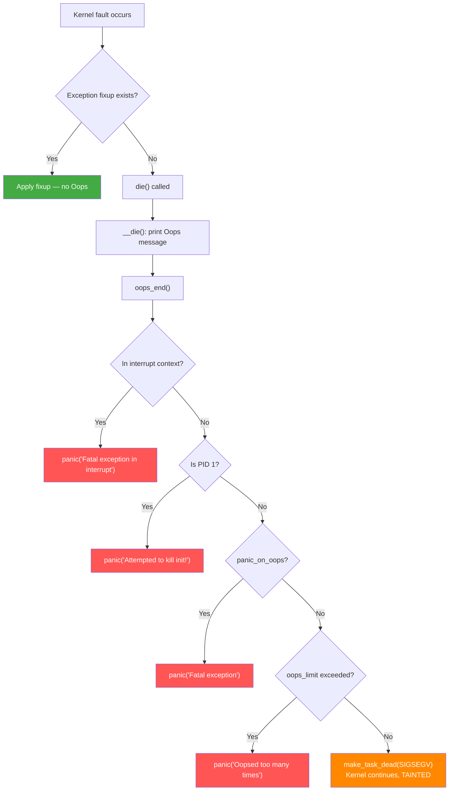
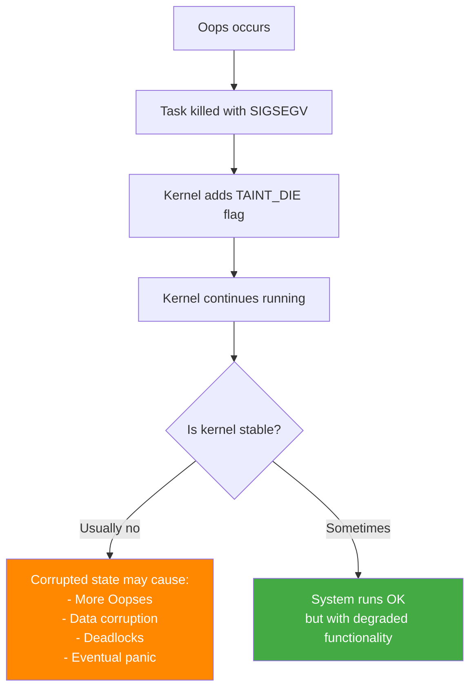
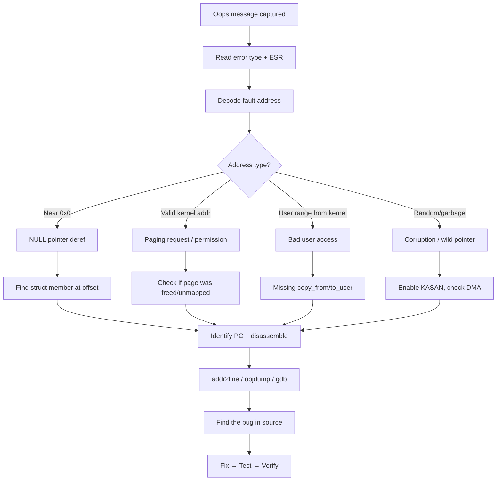

# Kernel Oops — In-Depth Guide

## What is a Kernel Oops?

A Kernel Oops is the kernel's response to a **non-fatal** error detected during execution. Unlike a panic, the kernel **does not halt** — it kills the faulting task, taints itself, and continues running in a degraded state. An Oops is a signal that something went wrong, but the kernel believes it can survive.

### Oops vs Panic vs Crash — When Does What Happen?

```
 Fault/Bug occurs
      │
      ▼
  die(msg, regs, esr)           [arch/arm64/kernel/traps.c]
      │
      ├─► __die()
      │    ├─► show_regs()       // dump registers
      │    ├─► dump_backtrace()  // print call trace
      │    └─► dump_instr()      // disassemble faulting instr
      │
      └─► oops_end(flags, regs, signr)
           │
           ├─► Check: oops_limit exceeded?
           │    └─► Yes → panic("Oopsed too many times")
           │
           ├─► Check: in_interrupt()?
           │    └─► Yes → panic("Fatal exception in interrupt")
           │
           ├─► Check: panic_on_oops?
           │    └─► Yes → panic("Fatal exception")
           │
           ├─► Check: is current PID 1 (init)?
           │    └─► Yes → panic("Attempted to kill init!")
           │
           └─► None of above → make_task_dead(signr)
                                │
                                └─► Task killed, kernel continues
                                    Kernel is TAINTED (flag 'G')
```

### Decision Matrix

| Condition | Outcome | Kernel State |
|-----------|---------|-------------|
| Fault in **process context**, non-init, `panic_on_oops=0` | **Oops** — kill task | Continues, tainted |
| Fault in **interrupt context** (hardirq, softirq, NMI) | **Panic** — must halt | Dead |
| Fault in **PID 1** (init/systemd) | **Panic** — can't kill init | Dead |
| `panic_on_oops=1` set | **Panic** — policy decision | Dead |
| Oops count > `oops_limit` (default 10000) | **Panic** — too many oopses | Dead |
| Fault recoverable + fixup available | **No Oops** — silently handled | Normal |



---

## Anatomy of an Oops Message

```
 ┌─ Error type
 │                          ┌─ Oops count (#1 = first)
 │                          │
Internal error: Oops: 0000000096000005 [#1] PREEMPT SMP
                │                            │        │
                └─ ESR value (ARM64)         │        └─ SMP kernel
                                             └─ Preemptible kernel

CPU: 2 PID: 1234 Comm: my_app Tainted: G        W  O      6.8.0 #1
│         │        │            │
│         │        │            └─ Taint flags (see below)
│         │        └─ Task command name
│         └─ Process ID
└─ CPU number

Hardware name: ARM Platform (DT)

pstate: 60400009 (nZCv daif +PAN -UAO -TCO -DIT -SSBS BTYPE=--)
│                  ││││ ││││
│                  ││││ │││└─ FIQ mask
│                  ││││ ││└── IRQ mask
│                  ││││ │└─── SError mask (Asynchronous abort)
│                  ││││ └──── Debug mask
│                  │││└────── Overflow
│                  ││└─────── Carry
│                  │└──────── Zero
│                  └───────── Negative

pc : faulting_function+0x4c/0x120 [module_name]     ← Program Counter
lr : calling_function+0xbc/0x2e0                     ← Link Register
sp : ffff80001234bcc0                                ← Stack Pointer

x29: ... x28: ... (ARM64 general purpose registers x0-x30)

Call trace:                    ← Stack backtrace (most recent first)
 faulting_function+0x4c/0x120
 calling_function+0xbc/0x2e0
 ...

Code: d2800000 f9000260 d503201f (f9400261)          ← Instruction bytes
                                  ^^^^^^^^^^
                                  Faulting instruction (in parentheses)
```

### Taint Flags

| Flag | Meaning |
|------|---------|
| `G` | Proprietary module loaded (vs `P` = all GPL) |
| `F` | Module force-loaded |
| `S` | SMP on non-SMP-safe hardware |
| `R` | Module force-unloaded |
| `M` | Machine check exception occurred |
| `B` | Bad page reference |
| `U` | User requested taint |
| `D` | Kernel recently died (OOPS or BUG) |
| `W` | Warning (WARN_ON) has been issued |
| `C` | staging driver loaded |
| `I` | Working around firmware bug |
| `O` | Out-of-tree module loaded |
| `E` | Unsigned module loaded |
| `T` | Kernel built with struct randomization |

---

## Oops Internals — Code Walkthrough

### die() — The Entry Point
```c
// arch/arm64/kernel/traps.c
void die(const char *str, struct pt_regs *regs, long err)
{
    struct die_args args = { .regs = regs, .str = str, .err = err };
    int ret;

    oops_enter();                              // mark: we're in an Oops

    raw_spin_lock_irq(&die_lock);              // serialize Oops output
    console_verbose();                          // raise console loglevel
    bust_spinlocks(1);                         // force output through

    ret = __die(str, err, regs);               // print the Oops

    bust_spinlocks(0);
    add_taint(TAINT_DIE, LOCKDEP_NOW_UNRELIABLE);  // taint the kernel
    raw_spin_unlock_irq(&die_lock);

    oops_exit();                               // Oops printing done

    if (in_interrupt())
        panic("Fatal exception in interrupt"); // can't recover in IRQ

    if (panic_on_oops)
        panic("Fatal exception");              // user wants panic

    do_exit(SIGSEGV);                         // kill the faulting task
}
```

### __die() — The Oops Printer
```c
static int __die(const char *str, long err, struct pt_regs *regs)
{
    static int die_counter;
    int ret;

    pr_emerg("Internal error: %s: %016lx [#%d] %s%s\n",
             str, err, ++die_counter,
             IS_ENABLED(CONFIG_PREEMPT) ? "PREEMPT " : "",
             IS_ENABLED(CONFIG_SMP) ? "SMP" : "");

    // Notify die chain (debuggers, kprobes, etc.):
    ret = notify_die(DIE_OOPS, str, regs, err, 0, SIGSEGV);

    // Print all the details:
    print_modules();                // loaded modules
    __show_regs(regs);              // all registers + pstate decode
    dump_backtrace(regs, NULL, KERN_EMERG);  // call trace
    dump_instr(KERN_EMERG, regs);   // instruction bytes at PC

    return ret;
}
```

### oops_end() — Decide Fate
```c
// kernel/panic.c (generic, called by arch code)
void oops_end(unsigned long flags, struct pt_regs *regs, int signr)
{
    oops_exit();

    // Increment Oops counter:
    if (atomic_inc_return(&oops_count) >= oops_limit) {
        pr_emerg("Oopsed too many times\n");
        panic("Oopsed too many times");
    }

    // Check fatal conditions:
    if (in_interrupt())
        panic("Fatal exception in interrupt");
    if (panic_on_oops)
        panic("Fatal exception");

    // Survivable: kill the task
    if (signr) {
        if (current->pid == 1)
            panic("Attempted to kill init! exitcode=0x%08x\n", signr);
        make_task_dead(signr);
    }
}
```

---

## Exception Fixup — When Oops is Avoided

The kernel has a mechanism to **pre-register fixup handlers** for instructions that might fault. If a fixup exists, no Oops occurs:

```c
// arch/arm64/mm/fault.c
static int __kprobes do_page_fault(unsigned long far, unsigned long esr,
                                    struct pt_regs *regs)
{
    // ...
    if (!user_mode(regs)) {
        // Check exception table for fixup:
        if (fixup_exception(regs))
            return 0;  // Fixed! No Oops.

        // No fixup → Oops:
        __do_kernel_fault(far, esr, regs);
    }
}

// Example: copy_from_user() registers fixups:
// If user pointer is bad → fixup returns -EFAULT instead of crashing
```

### Exception Table
```
Section: __ex_table
┌────────────────┬────────────────┐
│ insn address   │ fixup address  │
├────────────────┼────────────────┤
│ load_from_user │ return_EFAULT  │
│ store_to_user  │ return_EFAULT  │
│ get_user_asm   │ err_handler    │
└────────────────┴────────────────┘

If fault at "insn address" → jump to "fixup address" instead of Oops
```

---

## What Happens After an Oops? (Tainted Kernel)



**Key insight**: After an Oops, the kernel state is **untrusted**. The faulting task may have held locks, allocated memory, or been in the middle of modifying data structures. These resources may be leaked or corrupted:

```
Potential issues after Oops:
1. Locks held by dead task → other tasks deadlock waiting
2. Reference counts unbalanced → memory leaks or UAF
3. Partially updated data structures → future crashes
4. Open file descriptors → never closed
5. DMA in progress → buffer never unmapped
```

---

## Controlling Oops Behavior

### Sysctl Parameters
```bash
# Force panic on any Oops:
echo 1 > /proc/sys/kernel/panic_on_oops
# Or boot param: oops=panic

# Max Oopses before panic (default 10000):
echo 100 > /proc/sys/kernel/oops_limit

# Panic timeout (reboot after N seconds, 0=hang):
echo 10 > /proc/sys/kernel/panic
```

### Boot Parameters
```bash
# Force panic on oops:
oops=panic

# Reboot 10s after panic:
panic=10

# Increase console verbosity:
loglevel=7
```

---

## General Oops Debugging Workflow



---

## 10 Oops Scenarios

| # | Scenario | File | Key Symptom |
|---|----------|------|-------------|
| 1 | Page Fault in Process Context | [01_Page_Fault_Process_Ctx.md](01_Page_Fault_Process_Ctx.md) | Oops + task killed, kernel survives |
| 2 | BUG/BUG_ON Assertion Failure | [02_BUG_Assertion.md](02_BUG_Assertion.md) | `Oops - BUG`, `BRK #0x800` |
| 3 | Permission Fault (Write to RO) | [03_Permission_Fault.md](03_Permission_Fault.md) | FSC = permission fault, write to `.rodata`/RO page |
| 4 | Bad Kernel Paging Request | [04_Bad_Paging_Request.md](04_Bad_Paging_Request.md) | Access to unmapped kernel vmalloc/module address |
| 5 | Slab Out-of-Bounds (KASAN) | [05_Slab_OOB.md](05_Slab_OOB.md) | `KASAN: slab-out-of-bounds` |
| 6 | Stack Buffer Overflow (KASAN) | [06_Stack_OOB.md](06_Stack_OOB.md) | `KASAN: stack-out-of-bounds` |
| 7 | Bad Page State | [07_Bad_Page_State.md](07_Bad_Page_State.md) | `BUG: Bad page state in process` |
| 8 | Bad Page Map | [08_Bad_Page_Map.md](08_Bad_Page_Map.md) | `BUG: Bad page map`, corrupted PTE |
| 9 | List Corruption | [09_List_Corruption.md](09_List_Corruption.md) | `list_add corruption` / `list_del corruption` |
| 10 | Alignment Fault | [10_Alignment_Fault.md](10_Alignment_Fault.md) | `Unhandled fault: alignment fault`, SP/PC misaligned |

---

## See Also
- [../03_KernelCrash/README.md](../03_KernelCrash/README.md) — Kernel Crash scenarios (crashes that lead to panic)
- [../02_KernelPanic/README.md](../02_KernelPanic/README.md) — Kernel Panic in-depth guide
- [../01_BootTime/README.md](../01_BootTime/README.md) — Memory subsystem boot initialization
