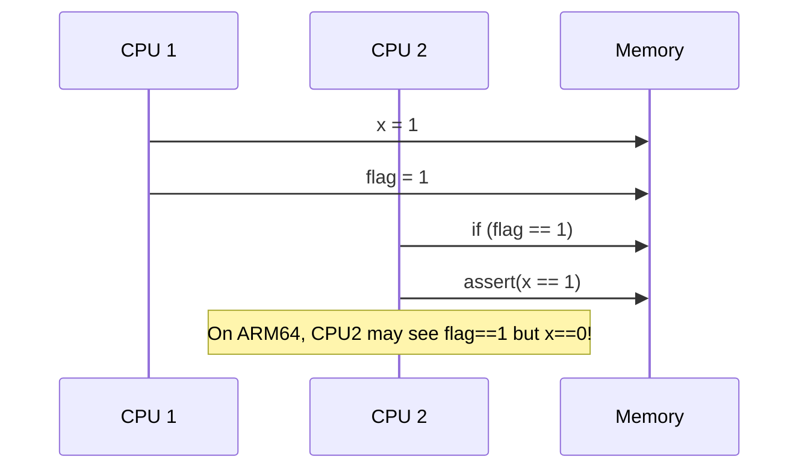

# Memory Ordering Fundamentals

## What is Memory Ordering?
Memory ordering refers to the rules that determine the visibility and sequencing of memory operations (loads and stores) performed by CPUs and observed by other CPUs or devices. In a single-threaded program, memory operations appear to execute in program order. However, in multi-core systems, both CPUs and compilers may reorder instructions for performance, leading to surprising results in concurrent code.

### Key Concepts
- **Program Order:** The order in which instructions appear in the source code.
- **Visibility:** When a write by one CPU becomes visible to another CPU.
- **Reordering:** CPUs and compilers may change the order of memory operations for optimization.

## Why Does Memory Ordering Matter?

### 1. Concurrency and Shared Data
When multiple CPUs or threads access shared data, the order in which memory operations become visible is critical. Without proper ordering, one CPU may see stale or inconsistent data, leading to data races, lost updates, or even system crashes.


#### Example: The Store-Load Reordering Problem
Suppose two threads execute the following code on different CPUs:

**Thread 1:**
```c
x = 1;
flag = 1;
```
**Thread 2:**
```c
if (flag == 1)
	assert(x == 1);
```
On a weakly ordered system, Thread 2’s assertion can fail if the store to `flag` becomes visible before the store to `x`.

##### Diagram: Store-Load Reordering (ARM64)



This diagram shows how, without barriers, CPU2 can observe the store to `flag` before the store to `x` is visible, violating program order.

### 2. Real-World Bugs
- **Lost wakeups in condition variables**
- **Double-checked locking failures**
- **Device driver race conditions**

## ARM64 vs x86: Memory Models

### x86 (Total Store Order, TSO)
- x86 provides a strong memory model: most memory operations are seen in order by all CPUs.
- Only a few reordering cases (e.g., store-load) are allowed.
- Many kernel and user-space codebases were written assuming x86’s strong ordering.

### ARM64 (Weakly Ordered)
- ARM64 allows much more aggressive reordering of loads and stores.
- Without explicit memory barriers, loads and stores can be observed out of order by other CPUs.
- This means code that works on x86 may break on ARM64 if it relies on implicit ordering.

## Interview Insights
- Be ready to explain why memory ordering is not just a theoretical concern, but a practical one that affects correctness and security.
- Understand the difference between strong (x86) and weak (ARM64) memory models, and why explicit barriers are essential on ARM64.

---

**Interview Tip:**
Use real-world examples and diagrams to illustrate how reordering can break code, and always relate your answer to the specific architecture in question.
