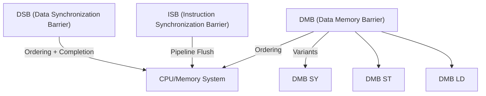

## Visualizing Barrier Relationships

This diagram shows how DMB, DSB, and ISB relate to the CPU/memory system and their specific effects.

# Types of Memory Barriers (ARM64)

## ARM64 Barrier Instructions: Deep Dive

### 1. DMB (Data Memory Barrier)
- Ensures that all explicit memory accesses before the barrier are globally observed before any memory accesses after the barrier.
- Does **not** wait for completion—just ordering.
- Used for synchronizing memory between CPUs or with devices.

### 2. DSB (Data Synchronization Barrier)
- Stronger than DMB: ensures all memory accesses before the barrier are globally observed **and** completed before any subsequent instructions are executed.
- Used when you need to guarantee completion (e.g., after device register writes, before power state changes).

### 3. ISB (Instruction Synchronization Barrier)
- Flushes the CPU pipeline and ensures that subsequent instructions are fetched anew.
- Used after modifying code, control registers, or system state that affects instruction execution.

## DMB Variants and Semantics
- **DMB SY:** Full system barrier (all memory accesses, all observers)
- **DMB ST:** Store barrier (only stores)
- **DMB LD:** Load barrier (only loads)

#### Example Table
| Barrier   | Orders | Use Case Example                |
|-----------|--------|---------------------------------|
| DMB SY    | L+S    | SMP synchronization, locks      |
| DMB ST    | S      | Write-side synchronization      |
| DMB LD    | L      | Read-side synchronization       |
| DSB SY    | L+S    | Device register, power mgmt     |
| ISB       | Inst   | After code/self-modifying code  |

## When to Use Which?
- **DMB SY:** Most kernel synchronization, SMP primitives, lock/unlock.
- **DSB SY:** Device drivers, MMIO, after cache maintenance, before/after power state changes.
- **ISB:** After writing to system control registers, TLB maintenance, or modifying code.

## ARM64 vs Other Architectures
- ARM64 requires explicit barriers for many cases where x86 does not.
- Misuse or omission can lead to bugs that only appear on ARM64 or other weakly ordered systems.

---

**Interview Tip:**
Be able to explain the semantics of each barrier, when to use them, and give real-world kernel or driver examples.
