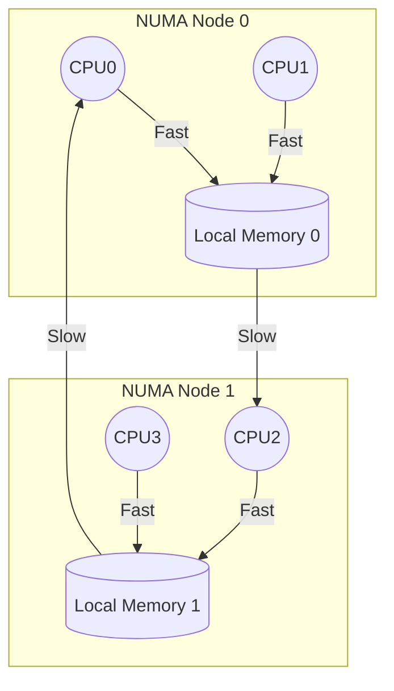

# NUMA Hardware Topology: How the System is Wired

## What is a NUMA Node in Hardware?

- A **NUMA node** is a physical grouping of CPUs (cores) and memory, usually with its own memory controller.
- In multi-socket systems, each socket is typically a node.
- On large ARMv8 SoCs (like Nvidia Grace), a node might be a cluster of cores with a local memory channel.

## How are Nodes Connected?

- Nodes are connected by high-speed interconnects (e.g., CCIX, CXL, NVLink, AMBA CHI).
- Each node can access all memory, but local access is much faster.
- The interconnect topology (ring, mesh, crossbar) affects remote access latency.

## Example: ARMv8 Server Topology

- 4 NUMA nodes, each with 16 CPUs and 128GB RAM.
- Nodes connected in a mesh; each node has direct links to neighbors.
- Local access: ~100ns, remote access: ~200-400ns.

## How Does the OS Discover Topology?

- Firmware tables (ACPI SRAT) or Device Tree (DT) describe the hardware layout.
- The kernel parses these tables during early boot to build the node/CPU/memory map.

---

## Diagram: NUMA Topology (Mermaid)

**Legend:**
- Fast: Local memory access
- Slow: Remote memory access

---

**Interview Tip:**
Be ready to explain how the OS learns about the hardware topology and why the interconnect matters for performance.
