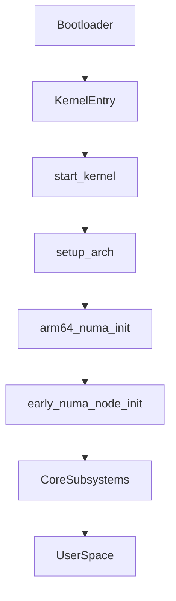

# Linux Kernel Boot Sequence (ARMv8): Where NUMA Fits

## Step-by-Step: From Power-On to User Space

1. **Bootloader (e.g., UEFI, U-Boot):**
	- Loads the kernel image and device tree (or ACPI tables) into memory.
	- Jumps to the kernel entry point.

2. **Kernel Entry Point:**
	- On ARMv8: `arch/arm64/kernel/head.S` sets up the CPU and jumps to `start_kernel()` in `init/main.c`.

3. **start_kernel():**
	- The main C entry point for the kernel.
	- Calls `setup_arch(&command_line)` for architecture-specific setup.

4. **setup_arch():**
	- Parses hardware tables (DT/ACPI) to discover CPUs, memory, and NUMA nodes.
	- Calls `arm64_numa_init()` to build the NUMA topology.

5. **early_numa_node_init():**
	- Sets up per-CPU NUMA node IDs so that memory allocation and scheduling can be NUMA-aware from the start.

6. **Initialize Core Subsystems:**
	- Memory allocator, scheduler, IRQs, timers, etc.

7. **Launch User Space:**
	- After all kernel initialization, the first user-space process is started.

---

## Why is NUMA Setup So Early?

- The kernel must know the NUMA topology before it allocates memory or schedules tasks.
- Early setup ensures all later allocations and scheduling decisions are NUMA-aware.

---

## Diagram: Kernel Boot Flow (with NUMA)

---

**Interview Tip:**
Be ready to walk through this sequence, pointing out exactly where and why NUMA is initialized.
