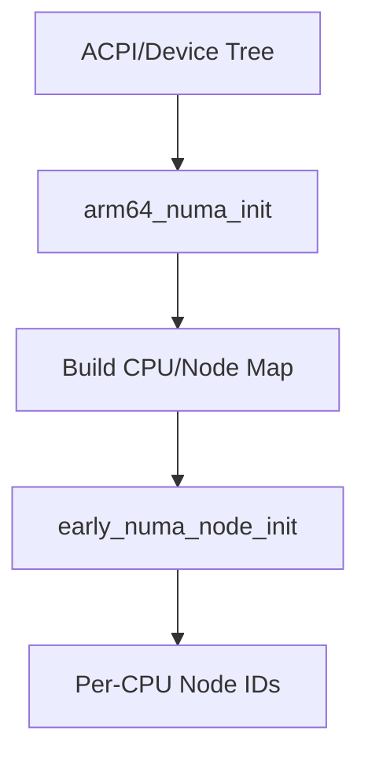

# ARMv8 NUMA Initialization Internals: Code and Flow

## Where is the ARMv8 NUMA Logic?

- The architecture-specific NUMA code for ARMv8 is in `arch/arm64/mm/numa.c`.
- This file contains the logic to discover NUMA nodes, parse hardware tables, and build the CPU/node/memory mappings.

## Key Functions and Their Roles

| Function                | Purpose                                                      |
|-------------------------|--------------------------------------------------------------|
| `arm64_numa_init()`     | Main entry for NUMA setup; called from `setup_arch()`        |
| `early_cpu_to_node()`   | Returns the NUMA node for a given CPU (used by early init)   |
| `set_cpu_numa_node()`   | Sets the per-CPU NUMA node mapping                           |

## How is the Mapping Built? (Step-by-Step)

1. **`setup_arch()`** (in `arch/arm64/kernel/setup.c`):
  - Parses the device tree (DT) or ACPI SRAT table to discover CPUs and memory regions.
  - Calls `arm64_numa_init()` if NUMA is enabled.
2. **`arm64_numa_init()`**:
  - Walks through the hardware tables, grouping CPUs and memory into nodes.
  - Builds the CPU-to-node and memory-to-node maps.
  - Stores these mappings for use by `early_cpu_to_node()`.
3. **`early_numa_node_init()`** (in `init/main.c`):
  - For each CPU, calls `early_cpu_to_node(cpu)` and sets the per-CPU node ID.

## Example Flow (ARMv8)

1. `start_kernel()` calls `setup_arch()`
2. `setup_arch()` calls `arm64_numa_init()`
3. `arm64_numa_init()` parses hardware tables, builds CPU/node map
4. `early_numa_node_init()` uses `early_cpu_to_node()` to set per-CPU node IDs

---

## Diagram: ARMv8 NUMA Initialization Flow

---

## Key Code References
- `arch/arm64/mm/numa.c` (NUMA discovery and mapping)
- `init/main.c` (kernel boot and early NUMA setup)
- `include/linux/topology.h` (per-CPU NUMA variables)

---

**Interview Tip:**
Be ready to walk through this flow, referencing both the architecture and the code, and explain why each step is necessary.
