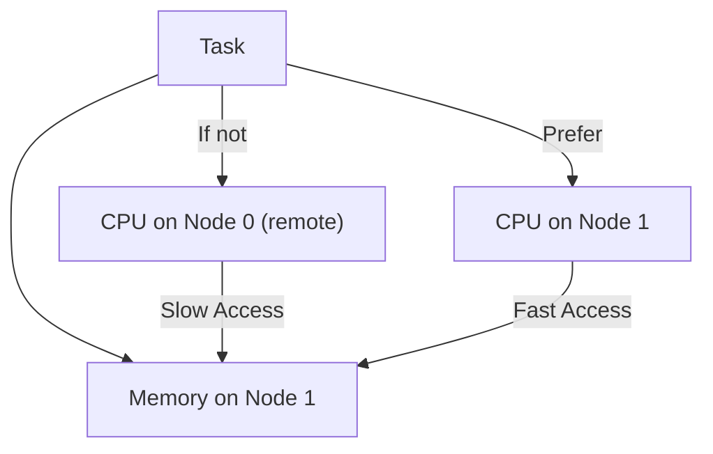

# NUMA-Aware Scheduling: Keeping Tasks Close to Their Data

## Why Does Scheduling Matter for NUMA?

- Running a process on a CPU close to its memory is critical for performance.
- If a process is scheduled on a remote node, every memory access is slower.

## How Does the Linux Scheduler Handle NUMA?

### Task Placement
- When a new task is created, the scheduler tries to place it on a CPU in the same node as its memory.

### Task Migration
- If a task starts accessing memory on a different node, the scheduler may migrate the task to a CPU closer to that memory.
- This is called **automatic NUMA balancing**.

### Balancing
- The scheduler periodically checks if tasks can be moved to improve locality and load balance.

---

## Key Kernel Functions

- `numa_migrate_preferred()` — Migrate a task to its preferred node
- `task_numa_fault()` — Track when a task accesses remote memory
- `sched_numa_find_closest()` — Find the closest CPU/node for a task

---

## User-space Hints

- `sched_setaffinity()` — Pin a task to a set of CPUs or nodes
- `numactl --cpunodebind=0 --membind=0 ./myapp` — Run a process on node 0

---

## Diagram: NUMA-Aware Scheduling

---

**Interview Tip:**
Be ready to explain how the scheduler keeps tasks close to their data, and what happens if it can't.
