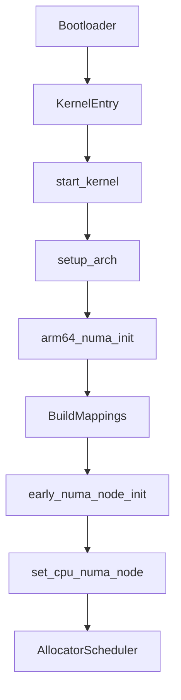

# Flow-by-Flow: ARMv8 NUMA Initialization (Code and Kernel References)

This document provides a step-by-step, flow-based explanation of how NUMA is initialized and used in the Linux kernel on ARMv8 platforms, with code and kernel references for each stage. Use this as a technical interview walkthrough.

---

## 1. Bootloader Loads Kernel and Hardware Tables
- Loads kernel image and device tree (DT) or ACPI tables (SRAT) into memory.
- Entry point: `arch/arm64/kernel/head.S` → `start_kernel()` in `init/main.c`

## 2. `start_kernel()` (init/main.c)
- Main kernel entry point.
- Calls `setup_arch(&command_line)` for architecture-specific setup.
- Calls `early_numa_node_init()` to set up per-CPU NUMA node IDs.

## 3. `setup_arch()` (arch/arm64/kernel/setup.c)
- Parses hardware description (DT/ACPI).
- Calls `arm64_numa_init()` if NUMA is enabled.

## 4. `arm64_numa_init()` (arch/arm64/mm/numa.c)
- Discovers NUMA nodes, CPUs, and memory regions.
- Builds CPU-to-node and memory-to-node mappings.
- Sets up data structures for early lookup.

## 5. `early_numa_node_init()` (init/main.c)
- For each possible CPU, sets the per-CPU NUMA node ID using `early_cpu_to_node()` and `set_cpu_numa_node()`.
- Ensures correct NUMA information for early memory allocation and scheduling.

## 6. Memory Allocator and Scheduler
- Use per-CPU NUMA node IDs for locality-aware allocation and scheduling.

---

## Key Code Snippets

### `early_numa_node_init()` (init/main.c)
```c
static void __init early_numa_node_init(void)
{
#ifdef CONFIG_USE_PERCPU_NUMA_NODE_ID
#ifndef cpu_to_node
    int cpu;
    for_each_possible_cpu(cpu)
        set_cpu_numa_node(cpu, early_cpu_to_node(cpu));
#endif
#endif
}
```

### `arm64_numa_init()` (arch/arm64/mm/numa.c)
- Parses ACPI SRAT or device tree to discover nodes and build mappings.

---

## Kernel Data Structures

- `cpu_to_node_map[]`: Maps CPUs to NUMA nodes
- `memnodemap[]`: Maps memory ranges to nodes
- Per-CPU variables: Store each CPU’s node ID

---

## Flow Diagram (Mermaid)


---

## References
- `init/main.c`
- `arch/arm64/kernel/setup.c`
- `arch/arm64/mm/numa.c`
- `include/linux/topology.h`

---

**This flow-based document is designed for deep technical interviews and kernel study. Be ready to walk through each step and reference the code.**
