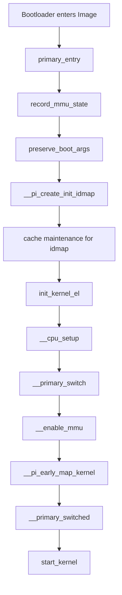
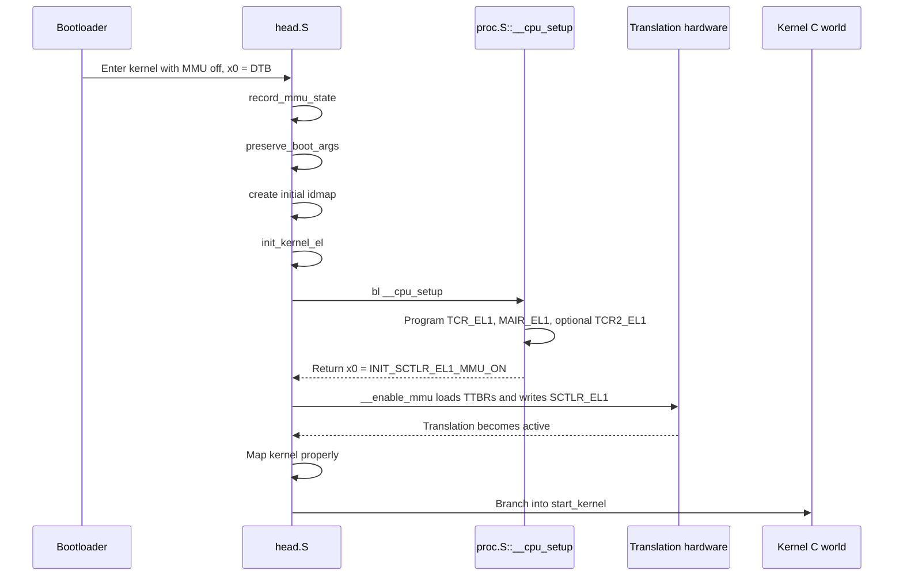

# Boot Overview Around bl __cpu_setup

`bl __cpu_setup` is one of the last critical assembly steps before the ARM64 Linux kernel turns on the MMU.

## High-level meaning

The branch instruction in `head.S` transfers control to `arch/arm64/mm/proc.S::__cpu_setup`.

That function does not boot the whole kernel by itself. Instead, it prepares the CPU's stage-1 memory-management control state so that `__enable_mmu` can safely make the transition from physical execution to translated execution.

## Primary CPU flow

## Sequence view

## State before __cpu_setup

At the point where `primary_entry` executes `bl __cpu_setup`:

- Linux is still executing early assembly
- `start_kernel()` has not run yet
- the MMU is still off
- the early identity map has already been built in memory
- the current exception level has been normalized by `init_kernel_el`
- boot arguments have been preserved, especially the FDT pointer in `x21`

## State after __cpu_setup returns

After `__cpu_setup` returns:

- `x0` contains the prepared `SCTLR_EL1` value for MMU-on operation
- `TCR_EL1` has been programmed with translation configuration
- `MAIR_EL1` has been programmed with memory-type encodings
- optional feature-dependent controls like `TCR2_EL1` and permission indirection registers may be programmed
- the MMU is still off until `__enable_mmu` executes

## Why this staging matters

If Linux enabled the MMU before the translation regime was fully defined, the CPU could interpret virtual addresses, attributes, and page-table walks incorrectly. The boot path therefore follows a strict order:

1. build an early idmap
2. normalize EL state
3. prepare translation-control registers in `__cpu_setup`
4. load TTBRs and enable MMU in `__enable_mmu`
5. build the final kernel mapping
6. jump into normal kernel execution

## Primary vs secondary CPUs

Both primary and secondary CPUs execute `__cpu_setup`, but their surrounding flows differ:

- the primary CPU creates the initial mapping and reaches `start_kernel()`
- secondary CPUs come through `secondary_holding_pen` or `secondary_entry`
- secondaries reuse the same low-level CPU preparation logic before entering `secondary_start_kernel()`

The important design point is that `__cpu_setup` is per-CPU preparation logic, not a one-time global kernel initializer.
