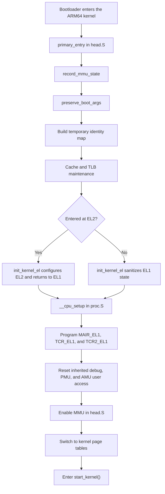

# ARM64 Linux Kernel CPU Setup and Early Boot

This document explains how the ARM64 Linux kernel reaches `__cpu_setup`, what the routine programs, and how early boot transitions from physical execution into the normal kernel virtual address space.

## Boot Flow Overview

proc.S is not the whole boot. It is the last major CPU-preparation step before Linux actually turns the MMU on. The full early path for the boot CPU is:

1. Bootloader enters the kernel at head.S.
2. Linux records whether it inherited MMU/cache state and preserves x0..x3 at head.S and head.S.
3. Linux builds a temporary identity map in head.S, using code in map_range.c.
4. Linux normalizes the exception level at head.S, so execution will continue in the right non-secure EL1/EL2 arrangement.
5. Linux calls proc.S. This programs the CPU’s memory-system control registers, but does not yet enable translation.
6. Linux enables the MMU in head.S from head.S.
7. Linux builds the real kernel mappings in map_kernel.c.
8. Linux switches into the fully mapped kernel world and calls start_kernel from head.S.

The clean way to think about `__cpu_setup` is:

It does not boot Linux by itself.
It does not create page tables by itself.
It prepares the processor so that the next write to SCTLR_EL1.M is safe and correct.

## Bootloader Preconditions

Linux assumes the ARM64 boot contract described in booting.rst:

- x0 points to the physical DTB.
- x1, x2, x3 are zero.
- Interrupts are masked.
- The CPU enters in non-secure EL1 or EL2.
- The MMU is off.
- I-cache may be on or off, but stale instructions for the kernel image must not exist.
- The kernel image must be cleaned to PoC.

That is why the comment at head.S says MMU off, D-cache off, I-cache on or off.

## Step-by-Step Path to `__cpu_setup`

At head.S, primary_entry begins with physical addressing only.

At head.S, record_mmu_state reads CurrentEL and SCTLR_EL1 or SCTLR_EL2 to detect whether the kernel was entered with MMU already on. That matters because Linux must do different cache maintenance depending on whether earlier table writes were cacheable.

At head.S, preserve_boot_args stores x0..x3, especially the DTB pointer in x21.

At head.S, Linux points x0 at __pi_init_idmap_pg_dir and calls the PI helper that creates the initial identity mapping. The tables are laid out in a reserved linker-script region declared at vmlinux.lds.S, and the actual mapper is map_range.c.

This identity map is critical. Before normal kernel virtual mappings exist, the CPU still needs a translation regime that maps the currently executing physical code to the same virtual value, so the instruction fetch stream does not break when MMU becomes enabled.

At head.S, Linux does cache maintenance on those temporary page tables or on the idmapped text, depending on how it entered.

At head.S, Linux calls init_kernel_el. That code at head.S handles the EL1 versus EL2 entry case.

If entered at EL1:
- It writes a known-safe MMU-off SCTLR_EL1 value.
- It programs SPSR_EL1 and ELR_EL1.
- It returns via ERET into EL1h.

If entered at EL2:
- It may clean hyp text if MMU had been on.
- It disables EL2 MMU.
- It sets up EL2 control state and vectors.
- It prepares EL1 SCTLR state, possibly via SCTLR_EL12 for VHE.
- It returns via ERET with a boot mode tag.

Only after that does Linux call proc.S.

## What `__cpu_setup` Actually Does

The function body is proc.S. Here is the exact meaning of each operation.

1. TLB invalidation

At proc.S, tlbi vmalle1 invalidates local EL1 stage-1 TLB entries, followed by dsb nsh.

Processor behavior:
The core discards cached translation results for the EL1 regime. Linux wants no stale walks, no stale attributes, and no chance that old translations are used once new page tables and TCR values go live.

Kernel reason:
The kernel is about to install a brand new translation setup. Carrying over old TLB state is dangerous.

2. Reset CPACR_EL1

At proc.S, cpacr_el1 is zeroed.

Processor behavior:
EL1 access control for FP/SIMD, SVE, SME-related state starts from a strict baseline. Nothing extra is granted implicitly.

Kernel reason:
Early boot should run with minimal architectural enablement. Linux will later turn on advanced execution features in a controlled way after feature discovery and per-CPU setup.

3. Reset MDSCR_EL1

At proc.S, mdscr_el1 is reset to MDSCR_EL1_TDCC.

Processor behavior:
Debug state is sanitized, and access to the Debug Communications Channel from EL0 is disabled.

Kernel reason:
Do not inherit unknown debug configuration from firmware. Early boot wants predictable debug and user access policy.

4. Disable EL0 PMU access

At proc.S, reset_pmuserenr_el0 checks whether a PMU exists and then clears PMUSERENR_EL0. The helper macro is in assembler.h.

Processor behavior:
User space cannot touch PMU registers.

Kernel reason:
Linux always starts from locked-down EL0 access and later enables anything explicitly through kernel policy.

5. Disable EL0 AMU access

At proc.S, reset_amuserenr_el0 clears AMUSERENR_EL0 if AMU exists. The helper macro is in assembler.h.

Processor behavior:
User space cannot access AMU counters.

Kernel reason:
Same pattern as PMU. Start secure, loosen later if desired.

6. Build default MAIR, TCR, and TCR2 values

At proc.S, Linux starts composing the core translation control state.

MAIR_EL1:
The default encoding comes from proc.S.

Processor behavior:
MAIR_EL1 tells the MMU what each memory attribute index means, such as:
- Device nGnRnE
- Device nGnRE
- Normal non-cacheable
- Normal cacheable
- Normal tagged placeholder

Kernel reason:
Page table entries only store attribute indexes. MAIR gives those indexes real semantics.

TCR_EL1:
The initial value is built at proc.S from:
- T0SZ for the idmap side
- T1SZ for the kernel side
- cacheability policy
- shareability policy
- translation granule size
- KASLR-related flags
- ASID behavior
- top-byte-ignore and tagging options
- MTE options

The flag definitions are at proc.S.

Processor behavior:
TCR_EL1 defines the entire stage-1 translation regime:
- address size on the TTBR0 side and TTBR1 side
- page size
- inner/outer cacheability of table walks
- inner-shareable versus other shareability
- whether top-byte-ignore is enabled
- physical address size field
- optional tagging or indirection support

Kernel reason:
Without a correct TCR_EL1, even valid page tables would be interpreted incorrectly.

TCR2_EL1:
Linux starts from zero at proc.S and only enables fields if the CPU reports support.

7. Clear errata-triggering TCR bits

At proc.S, Linux applies CPU errata handling via the macro in assembler.h.

Processor behavior:
Potentially unsafe TCR bits are cleared on affected implementations.

Kernel reason:
This is one place where Linux adapts architectural intent to real silicon bugs.

8. Handle 52-bit virtual addressing if supported

At proc.S, Linux adjusts T1SZ if the kernel was built with 52-bit VA support and the CPU has VA52. It may also set TCR_EL1.DS for LPA2.

Processor behavior:
The kernel-side address space may expand beyond 48 bits on capable systems.

Kernel reason:
One kernel image may need to boot on both 48-bit and 52-bit systems. Early boot therefore builds a conservative base, then extends it when hardware allows. The larger design is described in memory.rst.

9. Program physical address size into TCR_EL1

At proc.S, Linux calls the helper macro from assembler.h.

Processor behavior:
TCR_EL1.IPS is set to the highest supported PARange, with some limits if configuration requires fallback behavior.

Kernel reason:
The MMU must know how many physical address bits the system supports, otherwise page-table physical addresses and output addresses are interpreted incorrectly.

10. Enable hardware Access Flag update if available

At proc.S, Linux reads ID_AA64MMFR1_EL1 and enables TCR_EL1.HA if the CPU supports hardware Access Flag management. It may also enable HAFT in TCR2_EL1.

Processor behavior:
The hardware can automatically set access-flag state in page-table descriptors.

Kernel reason:
This improves normal VM behavior and reduces software overhead later.

11. Write MAIR_EL1 and TCR_EL1

At proc.S, Linux finally writes mair_el1 and tcr_el1.

Processor behavior:
The translation regime is now configured, but still inactive because SCTLR_EL1.M is not yet enabled.

Kernel reason:
This is the preparation phase. Tables and control registers must be ready before the MMU is turned on.

12. Enable permission indirection if supported

At proc.S, Linux checks ID_AA64MMFR3_EL1 for S1PIE support and, if present, programs PIRE0_EL1 and PIR_EL1, then sets TCR2_EL1.PIE.

Processor behavior:
The CPU can use permission indirection tables for stage-1 permission handling.

Kernel reason:
Newer ARMv8.x and ARMv9 memory permission features are integrated early if present.

13. Write TCR2_EL1 if supported

At proc.S, Linux checks for TCRX/TCR2 support and writes REG_TCR2_EL1.

Processor behavior:
Extended translation controls become active.

Kernel reason:
Feature-dependent extension of the base translation regime.

14. Return the desired SCTLR_EL1 value

At proc.S, Linux loads INIT_SCTLR_EL1_MMU_ON and returns it in x0. The bit definition is at sysreg.h.

This is very important:
__cpu_setup does not write SCTLR_EL1 itself.
It returns the value to the caller.
The actual MMU enable happens later in head.S via the helper macro at assembler.h.

## What `INIT_SCTLR_EL1_MMU_ON` Means for CPU Behavior

The bits in sysreg.h tell you how the core will behave once SCTLR_EL1 is written and takes effect.

The most important bits are:

- M: Enable stage-1 EL1 MMU.
- C: Enable data/unified cacheability for normal memory.
- I: Enable instruction cache.
- SA and SA0: Stack alignment checks.
- UCT, UCI, DZE and related controls: User-visible instruction/trap behavior defaults.
- IESB, ITFSB, EOS, EIS, EPAN and other architectural safety/control bits: Safer, more modern exception and permission behavior.
- Endianness bits if the kernel is built big-endian.

Processor behavior after SCTLR_EL1.M becomes 1:
- Instruction fetches and data accesses are translated through the page tables.
- Memory attributes from page descriptors and MAIR_EL1 now matter.
- Cacheability and shareability rules are applied according to the translation setup.
- The CPU stops behaving like a purely physical-address machine.

## How the MMU Actually Gets Turned On

The next important function is head.S.

At head.S, __primary_switch does:
- x1 = reserved_pg_dir for TTBR1
- x2 = __pi_init_idmap_pg_dir for TTBR0
- call __enable_mmu

Inside head.S:
- It checks whether the configured translation granule is supported by this CPU.
- It converts the TTBR physical addresses if 52-bit PA handling is needed.
- It writes TTBR0_EL1 from x2.
- It writes TTBR1_EL1 from x1 using the helper in assembler.h.
- It writes SCTLR_EL1 using the value previously returned by __cpu_setup.

The SCTLR helper in assembler.h does:
- msr sctlr_el1, value
- isb
- ic iallu
- dsb nsh
- isb

Processor behavior:
This is the exact moment the core begins doing virtual address translation for EL1 stage-1. The extra I-cache invalidation prevents speculatively fetched stale instructions from surviving across the MMU transition.

## Why `TTBR0` and `TTBR1` Are Set This Way

The architectural split is described in memory.rst.

In this early phase:
- TTBR0_EL1 points to the identity map so the currently executing low-level code remains reachable immediately after MMU-on.
- TTBR1_EL1 points to reserved_pg_dir, a minimal kernel-side root.

Shortly after that, Linux calls map_kernel.c to build the real kernel virtual mappings. That code eventually copies the finished root into swapper_pg_dir and installs it for TTBR1.

So the sequence is:
temporary idmap and placeholder TTBR1 first,
real kernel mapping second.

That staging is what makes the transition reliable.

## Processor State by Phase

Before primary_entry:
- The CPU is just executing at a physical entry point with MMU off.
- Instruction fetch is physical.
- Data accesses are physical.
- No Linux virtual addresses exist yet.

After create_init_idmap:
- Page tables exist in memory, but they are just data.
- The CPU is still not translating addresses because SCTLR_EL1.M is still zero.

After __cpu_setup:
- TCR_EL1, MAIR_EL1, optional TCR2/PIE state, and policy registers are programmed.
- The CPU now knows how it should translate, but translation is still not active.

After __enable_mmu:
- Stage-1 translation becomes active.
- TTBR0 identity map keeps the current code reachable.
- TTBR1 has early kernel-side mappings.
- I-cache/TLB state is synchronized.

After early_map_kernel:
- Linux builds the full proper kernel layout, including text, rodata, inittext, initdata, data, and relocation handling if needed, in map_kernel.c.

After __primary_switched:
- The CPU is now in the normal kernel virtual world.
- VBAR_EL1 is pointed at the kernel vectors at head.S.
- init_task and per-CPU stack context are installed at head.S.
- The DTB pointer and kimage offset are recorded at head.S.
- KASAN and EL2 finalization may run.
- Then start_kernel begins at head.S.

That is the point where generic kernel initialization starts. Before that, it is still architecture bring-up.

## What Starts Only After `start_kernel`

Before start_kernel:
- No scheduler.
- No driver model.
- No normal memory allocator behavior as users usually think of it.
- No interrupts handled through the normal kernel path.
- No device driver probing.

After start_kernel:
- setup_arch parses the DT and machine description.
- memblock and paging initialization become fully established.
- interrupt controller setup proceeds.
- timers, console, SMP, workqueues, slab, and subsystems come up.
- later, drivers probe against DT or ACPI descriptions.

So __cpu_setup is in the tiny “make the CPU sane enough to enter the real kernel” window.

## What Happens on Secondary CPUs

Secondary cores do not use the PI early map path. Their flow is at head.S:

- secondary_holding_pen or secondary_entry reaches secondary_startup.
- The secondary CPU saves boot mode.
- It may check 52-bit VA capability.
- It calls __cpu_setup again.
- It loads TTBR1 with swapper_pg_dir and TTBR0 with idmap_pg_dir.
- It enables the MMU with __enable_mmu.
- It jumps to __secondary_switched and then secondary_start_kernel.

So __cpu_setup is a generic “prepare this CPU’s translation/control state” function, not only a boot CPU function.

## Summary

- `__cpu_setup` programs control registers; it does not create the final kernel virtual memory layout.
- `__cpu_setup` returns the `SCTLR_EL1` value, while `__enable_mmu` is the code path that actually enables translated execution.
- The identity map exists so execution can continue safely across the MMU transition.
- `TTBR0` and `TTBR1` are staged separately so early boot can move from physical execution to the final kernel mapping without losing reachability.
- When `SCTLR_EL1.M` becomes `1`, the CPU changes from physical fetch/access behavior to page-table-driven translation semantics.
- Linux sequences TLB invalidation, table setup, TTBR writes, the `SCTLR_EL1` update, barriers, and I-cache invalidation to avoid inconsistent translation state during bring-up.