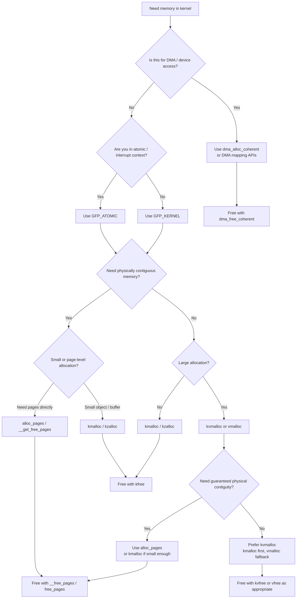

# Linux Kernel Memory Allocation Strategies and Decision Flow

## Overview

This document explains the main Linux kernel memory allocation strategies, how the common APIs differ, and how to select an allocator based on size, contiguity, execution context, and DMA requirements.

## First Principles: What Is Memory in the Kernel?

In the kernel, you deal with **two different realities of memory**:

### Physical Memory

* Actual RAM (hardware)
* Example: address like `0x1A3F000`
* Managed by kernel

### Virtual Memory

* Abstracted view given to kernel and processes
* Kernel **does NOT directly use physical addresses most of the time**
* Uses **virtual addresses → mapped to physical**

---

## Two Questions Every Allocation Answers

Whenever you allocate memory in kernel, you're deciding:

### Allocation Source

* Slab allocator
* Page allocator
* vmalloc area

### Allocation Requirements

* Contiguous (physically?)
* Size (small vs large)
* Performance
* Can sleep or not?

---

## Allocation Layers

Think of memory allocation as **layers**:

```
[ kmalloc / kzalloc ]   → Small, fast
[ vmalloc ]             → Large, flexible
[ alloc_pages ]         → Low-level page allocation
```

---

## Main Allocation APIs

---

### `kmalloc` and `kzalloc`

#### What It Does

* Allocates **physically contiguous memory**
* Very fast (uses slab allocator)

#### APIs

```c
void *kmalloc(size_t size, gfp_t flags);
void *kzalloc(size_t size, gfp_t flags); // zeroed
```

#### When to Use It

* Small allocations (typically < few KB)
* Need **physical contiguity** (DMA, hardware)
* Performance critical paths

#### Notes

* May fail for large sizes
* Uses slab allocator internally

---

### `vmalloc`

#### What It Does

* Allocates **virtually contiguous memory**
* NOT physically contiguous

#### API

```c
void *vmalloc(unsigned long size);
```

#### When to Use It

* Large allocations (MBs)
* Physical contiguity NOT required
* Example: buffers, tables

#### Tradeoffs

* Slower (page table setup)
* TLB overhead

---

### `alloc_pages` and the Page Allocator

#### What It Does

* Allocates memory in **pages (4KB units typically)**
* Low-level API

#### API

```c
struct page *alloc_pages(gfp_t flags, unsigned int order);
```

* `order = n → 2^n pages`

#### When to Use It

* Kernel subsystems
* Drivers needing page-level control
* Building your own allocator

#### Example

```c
alloc_pages(GFP_KERNEL, 2); // 4 pages (16KB)
```

---

### `__get_free_pages`

#### What It Does

* Wrapper over `alloc_pages`
* Returns **virtual address directly**

```c
unsigned long __get_free_pages(gfp_t flags, unsigned int order);
```

#### When to Use It

* Need contiguous pages
* Want simpler API than `alloc_pages`

---

### `kvmalloc` and `kvzalloc`

#### What It Does

* Tries `kmalloc` first
* Falls back to `vmalloc` if needed

```c
void *kvmalloc(size_t size, gfp_t flags);
```

#### When to Use It

* You don’t care about physical contiguity
* Want safe large allocation

`kvmalloc` is often a good default when physical contiguity is not required.

---

### `dma_alloc_coherent`

#### What It Does

* Allocates memory for **DMA devices**
* Physically contiguous + device-accessible

```c
dma_alloc_coherent(...)
```

#### When to Use It

* Hardware drivers
* Device DMA buffers

---

## GFP Flags

Every allocation uses **GFP flags**:

### Common Flags

| Flag           | Meaning                          |
| -------------- | -------------------------------- |
| `GFP_KERNEL`   | Normal allocation (can sleep)    |
| `GFP_ATOMIC`   | Cannot sleep (interrupt context) |
| `GFP_DMA`      | For DMA memory                   |
| `GFP_HIGHUSER` | User-space pages                 |

---

### Practical Rule

* **Interrupt context → use `GFP_ATOMIC`**
* **Normal kernel code → use `GFP_KERNEL`**

---

## Decision Flow

Use this sequence to choose an allocator:

1. If the memory is for DMA or direct device access, use `dma_alloc_coherent()` or the appropriate DMA mapping API.
2. If the caller cannot sleep, use `GFP_ATOMIC`; otherwise use `GFP_KERNEL`.
3. If physical contiguity is required, prefer `kmalloc()` for small allocations and `alloc_pages()` or `__get_free_pages()` for page-granular allocations.
4. If physical contiguity is not required and the allocation may be large, prefer `kvmalloc()` or `kvzalloc()`.



## Summary Table

| API | Size | Physical contiguity | Speed | Use case |
| --- | --- | --- | --- | --- |
| `kmalloc` | Small | Yes | Fast | General small allocations |
| `kzalloc` | Small | Yes | Fast | Zeroed small allocations |
| `vmalloc` | Large | No | Slower | Large buffers or tables |
| `kvmalloc` | Variable | No guarantee | Balanced | Safe general-purpose choice |
| `alloc_pages` | Page-granular | Yes | Low-level | Advanced page control |
| `dma_alloc_coherent` | Variable | DMA-safe | Platform-dependent | Device drivers |

## Why So Many APIs Exist

Kernel memory allocation has conflicting requirements:

| Constraint | Preferred family |
| --- | --- |
| Speed | `kmalloc` |
| Size | `vmalloc` |
| Hardware access | `dma_alloc_coherent` |
| Low-level control | `alloc_pages` |

No single API solves every case well.

## Mental Model

```text
fast + small + contiguous      -> kmalloc / kzalloc
large + flexible               -> kvmalloc / kvzalloc or vmalloc / vzalloc
hardware-visible buffer        -> dma_alloc_coherent
page-level control             -> alloc_pages / __get_free_pages
```

## Correct Free APIs

- `kfree()` for `kmalloc`, `kzalloc`, and usually `krealloc`
- `kvfree()` for `kvmalloc` and `kvzalloc`
- `vfree()` for `vmalloc` and `vzalloc`
- `__free_pages()` for `alloc_pages()`
- `free_pages()` for `__get_free_pages()`
- `dma_free_coherent()` for `dma_alloc_coherent()`

Device-managed APIs such as `devm_kmalloc()` and `devm_kzalloc()` are typically released automatically by the device core.

## Conclusion

The correct Linux kernel allocator is determined by constraints, not preference. Start with context, contiguity, and size, then select the matching free API so the allocation remains both correct and maintainable.

