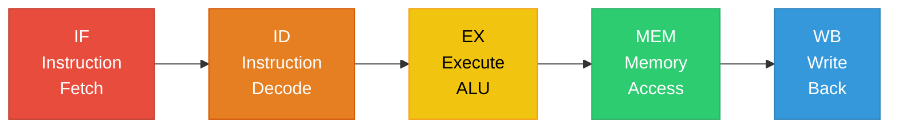

# Designing a Single-Threaded CPU — Complete Architecture Guide

## Table of Contents

1. [What Is a Single-Threaded CPU?](#1-what-is-a-single-threaded-cpu)
2. [Design Approach — Where to Start](#2-design-approach--where-to-start)
3. [ISA — Instruction Set Architecture](#3-isa--instruction-set-architecture)
4. [The Five-Stage Pipeline — Core of Single-Threaded CPU](#4-the-five-stage-pipeline--core-of-single-threaded-cpu)
5. [Stage 1: Instruction Fetch (IF)](#5-stage-1-instruction-fetch-if)
6. [Stage 2: Instruction Decode (ID)](#6-stage-2-instruction-decode-id)
7. [Stage 3: Execute (EX)](#7-stage-3-execute-ex)
8. [Stage 4: Memory Access (MEM)](#8-stage-4-memory-access-mem)
9. [Stage 5: Write Back (WB)](#9-stage-5-write-back-wb)
10. [Data Hazards and Forwarding](#10-data-hazards-and-forwarding)
11. [Control Hazards and Branch Prediction](#11-control-hazards-and-branch-prediction)
12. [Memory Hierarchy — Cache Design](#12-memory-hierarchy--cache-design)
13. [Interrupt and Exception Handling](#13-interrupt-and-exception-handling)
14. [Privilege Levels and Protection](#14-privilege-levels-and-protection)
15. [Complete CPU Block Diagram](#15-complete-cpu-block-diagram)
16. [Clock and Control Unit Design](#16-clock-and-control-unit-design)
17. [Single-Threaded vs Multi-Threaded — Why Start Here](#17-single-threaded-vs-multi-threaded--why-start-here)
18. [Real-World Examples — ARM Cortex-M and RISC-V](#18-real-world-examples--arm-cortex-m-and-risc-v)
19. [Deep Interview Q&A — 25 Questions](#19-deep-interview-qa--25-questions)

---

## 1. What Is a Single-Threaded CPU?

A **single-threaded CPU** executes exactly **one instruction stream** at a time. There is one Program Counter (PC), one set of architectural registers, and one thread of execution. Every instruction completes (or at least begins) before the next one is considered.

```
Single-Threaded CPU:

    Time ──────────────────────────────────────────►
    
    Instruction stream:  I1 → I2 → I3 → I4 → I5 → I6 → ...
                         │    │    │    │    │    │
    CPU executes:        I1   I2   I3   I4   I5   I6
                         
    ONE stream. ONE thread. ONE PC.
    
    Compare to Multi-Threaded CPU:
    
    Thread A stream:  A1 → A2 → A3 → A4 → ...
    Thread B stream:  B1 → B2 → B3 → B4 → ...
    
    CPU interleaves:  A1  B1  A2  B2  A3  B3  ...
                      (two PCs, two register files)
```

### Why Design a Single-Threaded CPU?

```
┌──────────────────────────────────────────────────────────────┐
│ 1. SIMPLICITY — easiest to understand, verify, debug        │
│ 2. FOUNDATION — all multi-core/multi-thread builds on this  │
│ 3. EMBEDDED   — many real chips are single-threaded          │
│    (ARM Cortex-M0, M3, M4, RISC-V RV32I)                   │
│ 4. INTERVIEW  — shows you understand CPU fundamentals       │
│ 5. POWER      — single thread = lowest power consumption    │
└──────────────────────────────────────────────────────────────┘
```

---

## 2. Design Approach — Where to Start

### Top-Down Design Strategy

```
Step 1: DEFINE THE ISA
    └── What instructions will the CPU support?
    └── Register count, instruction encoding, addressing modes

Step 2: DESIGN THE DATAPATH
    └── What hardware components are needed?
    └── ALU, registers, multiplexers, buses

Step 3: BUILD THE PIPELINE
    └── How do instructions flow through the CPU?
    └── Fetch → Decode → Execute → Memory → WriteBack

Step 4: HANDLE HAZARDS
    └── Data hazards (forwarding/stalling)
    └── Control hazards (branch prediction)
    └── Structural hazards (resource conflicts)

Step 5: ADD MEMORY SYSTEM
    └── Cache hierarchy (L1I, L1D)
    └── Memory interface (bus protocol)

Step 6: ADD INTERRUPT SUPPORT
    └── Exception handling
    └── Interrupt controller interface

Step 7: VERIFY AND OPTIMIZE
    └── Cycle-accurate simulation
    └── Timing closure (clock frequency target)
```

### Key Design Decisions Up Front

```
┌────────────────────────────────────────────────────────────────┐
│                    DESIGN DECISIONS                             │
│                                                                │
│  1. ISA choice:      RISC (simple) vs CISC (complex)?         │
│     → RISC for first design (fixed-length instructions)       │
│                                                                │
│  2. Word size:       32-bit or 64-bit?                        │
│     → 32-bit for simplicity                                   │
│                                                                │
│  3. Pipeline depth:  Single-cycle, 5-stage, or deeper?        │
│     → 5-stage classic (best learning, good performance)       │
│                                                                │
│  4. Register count:  8, 16, or 32 registers?                  │
│     → 32 general-purpose (RISC standard)                      │
│                                                                │
│  5. Endianness:      Little-endian or Big-endian?              │
│     → Little-endian (matches ARM, x86, RISC-V)               │
│                                                                │
│  6. Memory model:    Harvard or Von Neumann?                   │
│     → Modified Harvard (separate I-cache/D-cache,             │
│       unified main memory)                                     │
└────────────────────────────────────────────────────────────────┘
```

---

## 3. ISA — Instruction Set Architecture

The ISA is the **contract between software and hardware**. It defines what instructions exist, how they're encoded, and what they do.

### A Minimal RISC ISA (32-bit, similar to RISC-V RV32I)

```
INSTRUCTION TYPES:
─────────────────

1. R-type (Register-Register):  ADD, SUB, AND, OR, XOR, SLT, SLL, SRL
   ┌──────┬─────┬─────┬──────┬─────┬────────┐
   │funct7│ rs2 │ rs1 │funct3│  rd │ opcode │
   │7 bits│5 bit│5 bit│3 bits│5 bit│ 7 bits │
   └──────┴─────┴─────┴──────┴─────┴────────┘
   
   Example: ADD x3, x1, x2    →  x3 = x1 + x2

2. I-type (Immediate):  ADDI, LW, JALR
   ┌────────────┬─────┬──────┬─────┬────────┐
   │  imm[11:0] │ rs1 │funct3│  rd │ opcode │
   │  12 bits   │5 bit│3 bits│5 bit│ 7 bits │
   └────────────┴─────┴──────┴─────┴────────┘
   
   Example: ADDI x3, x1, 10   →  x3 = x1 + 10
   Example: LW x3, 0(x1)      →  x3 = Memory[x1 + 0]

3. S-type (Store):  SW, SH, SB
   ┌────────┬─────┬─────┬──────┬────────┬────────┐
   │imm[11:5]│ rs2 │ rs1 │funct3│imm[4:0]│ opcode │
   │ 7 bits  │5 bit│5 bit│3 bits│ 5 bits │ 7 bits │
   └────────┴─────┴─────┴──────┴────────┴────────┘
   
   Example: SW x3, 8(x1)      →  Memory[x1 + 8] = x3

4. B-type (Branch):  BEQ, BNE, BLT, BGE
   ┌───────────────────┬─────┬─────┬──────┬───────────────────┬────────┐
   │imm[12,10:5]       │ rs2 │ rs1 │funct3│imm[4:1,11]        │ opcode │
   └───────────────────┴─────┴─────┴──────┴───────────────────┴────────┘
   
   Example: BEQ x1, x2, label →  if (x1 == x2) PC = PC + offset

5. U-type (Upper Immediate):  LUI, AUIPC
   ┌─────────────────────┬─────┬────────┐
   │     imm[31:12]      │  rd │ opcode │
   │     20 bits         │5 bit│ 7 bits │
   └─────────────────────┴─────┴────────┘

6. J-type (Jump):  JAL
   ┌─────────────────────────────┬─────┬────────┐
   │  imm[20,10:1,11,19:12]     │  rd │ opcode │
   └─────────────────────────────┴─────┴────────┘
```

### Register File

```
32 General-Purpose Registers (x0 - x31), each 32-bit:

    x0  = ZERO (hardwired to 0, writes ignored)
    x1  = ra   (return address)
    x2  = sp   (stack pointer)
    x3  = gp   (global pointer)
    x4  = tp   (thread pointer)
    x5-x7   = t0-t2  (temporaries)
    x8  = s0/fp (saved register / frame pointer)
    x9  = s1   (saved register)
    x10-x11 = a0-a1  (function args / return values)
    x12-x17 = a2-a7  (function arguments)
    x18-x27 = s2-s11 (saved registers)
    x28-x31 = t3-t6  (temporaries)
    
    PC = Program Counter (separate, not in register file)
    
    Register file specs:
    ┌──────────────────────────────────┐
    │ 32 entries × 32 bits = 1024 bits │
    │ 2 read ports (rs1, rs2)          │
    │ 1 write port (rd)                │
    │ Read: combinational (instant)    │
    │ Write: on clock edge             │
    └──────────────────────────────────┘
```

---

## 4. The Five-Stage Pipeline — Core of Single-Threaded CPU

### Why Pipeline?

```
WITHOUT pipeline (single-cycle):
    Each instruction takes 1 long clock cycle
    Clock period = time of SLOWEST instruction (load = ~800 ps)
    
    Cycle:  |←─────── 800 ps ──────────►|←─────── 800 ps ──────────►|
    Instr:  |          I1                |          I2                |
    
    CPI = 1, but clock is slow → low throughput

WITH 5-stage pipeline:
    Each stage takes ~160 ps
    Clock period = time of SLOWEST stage (~200 ps with overhead)
    5 instructions overlap in different stages
    
    Cycle:  |200ps|200ps|200ps|200ps|200ps|200ps|200ps|
    I1:     | IF  | ID  | EX  | MEM | WB  |     |     |
    I2:           | IF  | ID  | EX  | MEM | WB  |     |
    I3:                 | IF  | ID  | EX  | MEM | WB  |
    I4:                       | IF  | ID  | EX  | MEM | WB |
    
    CPI ≈ 1 (ideally), but clock is 4x FASTER → 4x throughput!
    
    Speedup: pipeline_depth × (ideal) = up to 5x
    Real: ~3-4x due to hazards and stalls
```

### The Five Stages



### Pipeline Registers

```
Between each stage, we need PIPELINE REGISTERS to hold
intermediate results:

    ┌────┐  IF/ID   ┌────┐  ID/EX   ┌────┐  EX/MEM  ┌────┐  MEM/WB  ┌────┐
    │ IF │──┤REG├──►│ ID │──┤REG├──►│ EX │──┤REG├──►│MEM │──┤REG├──►│ WB │
    └────┘  └───┘   └────┘  └───┘   └────┘  └───┘   └────┘  └───┘   └────┘
    
    IF/ID Register holds:
      - Fetched instruction (32 bits)
      - PC + 4
    
    ID/EX Register holds:
      - Decoded control signals
      - Register values (rs1_data, rs2_data)
      - Immediate value (sign-extended)
      - rd address
      - PC
    
    EX/MEM Register holds:
      - ALU result
      - rs2_data (for store)
      - rd address
      - Control signals (MemRead, MemWrite, RegWrite)
    
    MEM/WB Register holds:
      - Memory read data (for load)
      - ALU result (for non-load)
      - rd address
      - Control signals (RegWrite, MemToReg)
```

---

## 5. Stage 1: Instruction Fetch (IF)

### What Happens

```
┌──────────────────────────────────────────────────────────────┐
│                    INSTRUCTION FETCH                          │
│                                                              │
│  Input:   PC (Program Counter)                               │
│  Output:  instruction[31:0], PC+4                            │
│                                                              │
│  Actions:                                                    │
│  1. Send PC to Instruction Memory (I-Cache)                  │
│  2. Read instruction at address PC                           │
│  3. Compute PC + 4 (next sequential instruction)             │
│  4. Select next PC:                                          │
│     - PC + 4 (normal)                                        │
│     - Branch target (if branch taken, from later stage)      │
│     - Jump target (if JAL/JALR)                              │
│  5. Write instruction + PC+4 to IF/ID pipeline register     │
└──────────────────────────────────────────────────────────────┘
```

### Hardware Components

```
                         ┌─────────────────┐
         ┌──────────┐   │                 │
    ┌───►│   MUX    │──►│  Instruction    │──► instruction[31:0]
    │    │ (PC src) │   │  Memory/Cache   │        │
    │    └──────────┘   │  (I-Cache)      │        │
    │         ▲         │                 │        ▼
    │    ┌────┴────┐    └─────────────────┘   ┌──────────┐
    │    │ branch  │                          │  IF/ID   │
    │    │ target  │                          │ Pipeline │
    │    │ jump    │    ┌──────────┐           │ Register │
    │    │ target  │    │  PC + 4  │──────────►│          │
    │    └─────────┘    │  Adder   │           └──────────┘
    │                   └──────────┘
    │                        ▲
    └────────────────────────┘
              PC Register
              (32-bit flip-flop)
```

---

## 6. Stage 2: Instruction Decode (ID)

### What Happens

```
┌──────────────────────────────────────────────────────────────┐
│                   INSTRUCTION DECODE                          │
│                                                              │
│  Input:   instruction[31:0], PC+4                            │
│  Output:  control signals, register values, immediate        │
│                                                              │
│  Actions:                                                    │
│  1. Extract fields: opcode, rd, rs1, rs2, funct3, funct7     │
│  2. Read Register File: data1 = Reg[rs1], data2 = Reg[rs2]  │
│  3. Sign-extend immediate field                              │
│  4. Generate control signals from opcode:                    │
│     - ALUSrc (reg or imm?)                                   │
│     - ALUOp (add, sub, and, or?)                             │
│     - MemRead, MemWrite                                      │
│     - RegWrite                                               │
│     - MemToReg (ALU result or memory data?)                  │
│     - Branch, Jump                                           │
│  5. Write all to ID/EX pipeline register                     │
└──────────────────────────────────────────────────────────────┘
```

### Control Signal Generation

```
CONTROL SIGNAL TABLE (generated by opcode decoder):

┌──────────┬────────┬────────┬────────┬─────────┬──────────┬────────┐
│ Instr    │ ALUSrc │ MemtoReg│ RegWrite│ MemRead │ MemWrite │ Branch │
├──────────┼────────┼────────┼────────┼─────────┼──────────┼────────┤
│ R-type   │   0    │   0    │   1    │    0    │    0     │   0    │
│ LW       │   1    │   1    │   1    │    1    │    0     │   0    │
│ SW       │   1    │   X    │   0    │    0    │    1     │   0    │
│ BEQ      │   0    │   X    │   0    │    0    │    0     │   1    │
│ ADDI     │   1    │   0    │   1    │    0    │    0     │   0    │
│ JAL      │   X    │   0    │   1    │    0    │    0     │   0    │
└──────────┴────────┴────────┴────────┴─────────┴──────────┴────────┘

ALUSrc:   0 = second operand from register
          1 = second operand from immediate

MemtoReg: 0 = write ALU result to register
          1 = write memory data to register

The control unit is combinational logic (no state).
Implemented as a lookup table (ROM) or logic gates.
```

### Immediate Generation Unit

```
Different instruction types encode immediates differently:

I-type:  inst[31:20]                    → sign-extend to 32 bits
S-type:  {inst[31:25], inst[11:7]}      → sign-extend to 32 bits  
B-type:  {inst[31], inst[7], inst[30:25], inst[11:8], 1'b0} → sign-extend
U-type:  {inst[31:12], 12'b0}           → already 32 bits
J-type:  {inst[31], inst[19:12], inst[20], inst[30:21], 1'b0} → sign-extend

The Immediate Generator is a MUX that selects and sign-extends
based on the instruction type (from opcode).
```

---

## 7. Stage 3: Execute (EX)

### What Happens

```
┌──────────────────────────────────────────────────────────────┐
│                       EXECUTE                                │
│                                                              │
│  Input:   control signals, reg values, immediate, PC         │
│  Output:  ALU result, branch decision                        │
│                                                              │
│  Actions:                                                    │
│  1. MUX selects ALU input B:                                 │
│     - Register value (R-type) or Immediate (I-type, Load)    │
│  2. ALU performs operation based on ALUOp + funct3 + funct7:  │
│     - ADD, SUB, AND, OR, XOR, SLT, SLL, SRL, SRA            │
│  3. For branches: compare rs1 and rs2 (BEQ, BNE, BLT, BGE) │
│     - Compute branch target: PC + immediate                  │
│     - Set branch_taken signal                                │
│  4. For JAL/JALR: compute jump target                        │
│  5. Write ALU result + branch info to EX/MEM register        │
└──────────────────────────────────────────────────────────────┘
```

### ALU Design

```
The ALU (Arithmetic Logic Unit) is the computational core:

    Input A ────►┌──────────────┐
                 │              │
                 │     ALU      │──────► Result (32 bits)
                 │              │──────► Zero flag
    Input B ────►│              │──────► Overflow flag
                 └──────┬───────┘──────► Carry flag
                        │
                  ALU Control
                  (4-bit select)

ALU Operations:
┌──────────┬───────────┬──────────────────────────────┐
│ ALU Ctrl │ Operation │ Description                   │
├──────────┼───────────┼──────────────────────────────┤
│  0000    │  AND      │ Result = A & B                │
│  0001    │  OR       │ Result = A / B (bitwise OR)   │
│  0010    │  ADD      │ Result = A + B                │
│  0110    │  SUB      │ Result = A - B                │
│  0111    │  SLT      │ Result = (A < B) ? 1 : 0      │
│  1000    │  XOR      │ Result = A ^ B                │
│  1001    │  SLL      │ Result = A << B[4:0]           │
│  1010    │  SRL      │ Result = A >> B[4:0] (logical) │
│  1011    │  SRA      │ Result = A >>> B[4:0] (arith)  │
└──────────┴───────────┴──────────────────────────────┘

Internal ALU structure (simplified):
    ┌───────────────────────────────────────┐
    │              32-bit ALU               │
    │                                       │
    │  ┌──────────┐  ┌──────────┐          │
    │  │ 32-bit   │  │ Shifter  │          │
    │  │ Adder    │  │ (barrel) │          │
    │  └──────────┘  └──────────┘          │
    │                                       │
    │  ┌──────────┐  ┌──────────┐          │
    │  │ AND gate │  │ OR gate  │          │
    │  │ array    │  │ array    │          │
    │  └──────────┘  └──────────┘          │
    │                                       │
    │  ┌────────────────────────┐           │
    │  │ Output MUX (selects   │──► Result │
    │  │ based on ALU control) │           │
    │  └────────────────────────┘           │
    └───────────────────────────────────────┘
```

---

## 8. Stage 4: Memory Access (MEM)

### What Happens

```
┌──────────────────────────────────────────────────────────────┐
│                     MEMORY ACCESS                            │
│                                                              │
│  Input:   ALU result, rs2 data (for store), control signals  │
│  Output:  memory data (for load) or ALU result (pass-thru)  │
│                                                              │
│  Actions:                                                    │
│  FOR LOAD (LW):                                              │
│    1. Send ALU result as address to Data Memory (D-Cache)    │
│    2. Assert MemRead signal                                  │
│    3. Read data from memory                                  │
│                                                              │
│  FOR STORE (SW):                                             │
│    1. Send ALU result as address to Data Memory              │
│    2. Send rs2 data as write data                            │
│    3. Assert MemWrite signal                                 │
│    4. Write data to memory                                   │
│                                                              │
│  FOR ALL OTHER instructions:                                 │
│    - Memory does nothing (MemRead=0, MemWrite=0)            │
│    - ALU result passes through to MEM/WB register           │
└──────────────────────────────────────────────────────────────┘
```

### Memory Interface

```
               ALU Result ──────► Address
                                     │
                                     ▼
                              ┌──────────────┐
    rs2 Data ────────────────►│              │
                              │  Data Memory │──────► Read Data
    MemRead ─────────────────►│  (D-Cache)   │
    MemWrite ────────────────►│              │
                              │  Aligned     │
                              │  access only │
                              └──────────────┘
    
    Memory operations:
    LW  (Load Word):     read 4 bytes from address
    LH  (Load Half):     read 2 bytes, sign-extend to 32
    LB  (Load Byte):     read 1 byte, sign-extend to 32
    SW  (Store Word):    write 4 bytes to address
    SH  (Store Half):    write 2 bytes  
    SB  (Store Byte):    write 1 byte
    
    Alignment requirement (simple design):
    Word access:  address must be divisible by 4
    Half access:  address must be divisible by 2
    Byte access:  any address OK
    Misaligned → exception (or hardware handles, slower)
```

---

## 9. Stage 5: Write Back (WB)

### What Happens

```
┌──────────────────────────────────────────────────────────────┐
│                      WRITE BACK                              │
│                                                              │
│  Input:   ALU result, memory data, control signals           │
│  Output:  data written to register file                      │
│                                                              │
│  Actions:                                                    │
│  1. MUX selects what to write to register rd:                │
│     - MemToReg = 0: write ALU result (ADD, SUB, ADDI, etc.) │
│     - MemToReg = 1: write memory data (LW, LH, LB)         │
│  2. If RegWrite = 1: write selected data to Reg[rd]         │
│  3. If rd = x0: write is ignored (x0 is always zero)        │
│                                                              │
│  NOTE: Write happens on the RISING edge of the clock        │
│  NOTE: Register file supports read-during-write             │
│        (new value available next cycle)                      │
└──────────────────────────────────────────────────────────────┘

    MEM/WB Register
    ┌──────────┐
    │ ALU Res  │──┐
    │ Mem Data │──┤──► MUX (MemToReg) ──► Write Data ───►┌──────────┐
    │ rd addr  │──┼─────────────────────► Write Reg  ───►│ Register │
    │ RegWrite │──┼─────────────────────► Write Enable──►│   File   │
    └──────────┘  │                                      └──────────┘
```

---

## 10. Data Hazards and Forwarding

### The Problem

```
Data Hazard: An instruction depends on the result of a 
previous instruction that hasn't written back yet.

    ADD x1, x2, x3     ← writes x1 in WB stage (cycle 5)
    SUB x4, x1, x5     ← reads x1 in ID stage (cycle 3!)
    
    Cycle:    1     2     3     4     5     6
    ADD:     IF    ID    EX   MEM   WB
    SUB:           IF    ID    EX   MEM   WB
                          │
                          └── SUB reads x1 HERE
                              But ADD hasn't written x1 yet!
                              SUB gets the OLD value of x1!
                              
    THIS IS A BUG — produces wrong results.
```

### Solution 1: Stalling (Simple but Slow)

```
Insert "bubbles" (NOP cycles) until data is ready:

    Cycle:    1     2     3     4     5     6     7     8
    ADD:     IF    ID    EX   MEM   WB
    bubble:              NOP   NOP
    SUB:                             IF    ID    EX   MEM   WB
    
    2 cycles wasted. CPI increases from 1.0 to ~1.5
    Simple but terrible for performance.
```

### Solution 2: Data Forwarding / Bypassing (The Real Solution)

```
Forward the result from EX or MEM stage back to the EX input
BEFORE it's written to the register file:

    Cycle:    1     2     3     4     5     6
    ADD:     IF    ID    EX   MEM   WB
                          │
    SUB:           IF    ID    EX   MEM   WB
                              ▲
                              │
                   FORWARD────┘
                   (ALU result from ADD's EX stage
                    is sent directly to SUB's EX input)
    
    NO stall! Both instructions execute at full speed.

Forwarding paths needed:
    ┌──────────────────────────────────────────────────┐
    │ EX/MEM.ALU_result  →  EX stage input A or B     │
    │ MEM/WB.ALU_result  →  EX stage input A or B     │
    │ MEM/WB.MemData     →  EX stage input A or B     │
    └──────────────────────────────────────────────────┘
```

### Forwarding Unit Logic

```c
// Forwarding unit (combinational logic):

// Forward from EX/MEM stage:
if (EX_MEM.RegWrite == 1 &&
    EX_MEM.rd != 0 &&
    EX_MEM.rd == ID_EX.rs1)
{
    ForwardA = EX/MEM.ALU_result;  // Forward to input A
}

if (EX_MEM.RegWrite == 1 &&
    EX_MEM.rd != 0 &&
    EX_MEM.rd == ID_EX.rs2)
{
    ForwardB = EX/MEM.ALU_result;  // Forward to input B
}

// Forward from MEM/WB stage (lower priority):
if (MEM_WB.RegWrite == 1 &&
    MEM_WB.rd != 0 &&
    MEM_WB.rd == ID_EX.rs1 &&
    !(EX_MEM.RegWrite && EX_MEM.rd == ID_EX.rs1))  // EX/MEM has priority
{
    ForwardA = MEM/WB.WriteData;
}
```

### Load-Use Hazard — The One Case Forwarding Can't Fix

```
    LW  x1, 0(x2)      ← x1 available AFTER MEM stage
    ADD x3, x1, x4     ← needs x1 in EX stage
    
    Cycle:    1     2     3     4     5     6     7
    LW:      IF    ID    EX   MEM   WB
                               │
    ADD:           IF    ID   STALL  EX   MEM   WB
                                     ▲
                                     │
                          FORWARD────┘
                          (from MEM/WB register)
    
    ONE bubble required. Data from memory isn't available
    until after MEM stage. We can forward from MEM/WB to EX,
    but we still need one stall cycle.
    
    The HAZARD DETECTION UNIT detects this:
    if (ID_EX.MemRead == 1 &&       // Previous instr is a LOAD
        (ID_EX.rd == IF_ID.rs1 || ID_EX.rd == IF_ID.rs2))
    {
        STALL;  // Insert bubble, freeze IF and ID stages
    }
```

---

## 11. Control Hazards and Branch Prediction

### The Problem

```
    BEQ x1, x2, target     ← branch decision made in EX stage
    ADD x3, x4, x5         ← already fetched! What if branch taken?
    SUB x6, x7, x8         ← already fetching!
    
    Cycle:    1     2     3     4     5
    BEQ:     IF    ID    EX   MEM   WB
                          │
    ADD:           IF    ID    ← WRONG if branch taken!
    SUB:                 IF    ← WRONG if branch taken!
    
    If branch is taken: 2 instructions fetched WRONG.
    Must flush them → 2-cycle penalty (branch penalty).
```

### Solution 1: Always Stall (Simple, Slow)

```
    Stall until branch decision is known:
    
    BEQ:     IF    ID    EX   MEM   WB
    bubble:              NOP   NOP
    target:                         IF    ID    EX   MEM   WB
    
    2 cycles wasted on EVERY branch.
    Branches are ~20% of instructions → CPI ≈ 1.4
    Terrible.
```

### Solution 2: Branch Prediction

```
STATIC PREDICTION — predict "not taken":
    Always fetch PC+4 (assume branch not taken)
    If wrong → flush 2 instructions (2-cycle penalty)
    If right → zero penalty
    
    Accuracy: ~50-60% → average penalty = 0.8-1.0 cycles per branch

DYNAMIC PREDICTION — 2-bit saturating counter:
    ┌────────────────────────────────────────────┐
    │        2-bit Branch Predictor              │
    │                                            │
    │  State machine per branch:                 │
    │                                            │
    │  00: Strongly Not Taken                    │
    │  01: Weakly Not Taken                      │
    │  10: Weakly Taken                          │
    │  11: Strongly Taken                        │
    │                                            │
    │  On taken: increment (max 11)              │
    │  On not-taken: decrement (min 00)          │
    │                                            │
    │  Predict: state >= 10 → taken              │
    │          state < 10  → not taken           │
    │                                            │
    │  Accuracy: ~85-90%                         │
    └────────────────────────────────────────────┘

BRANCH TARGET BUFFER (BTB):
    Cache that stores:
    - Branch instruction PC → target PC
    - Prediction state (2-bit counter)
    
    On fetch: check BTB with current PC
    If hit + predict taken: fetch from target PC next cycle
    If miss or predict not taken: fetch PC+4
```

### Move Branch Decision Earlier — Reduce Penalty

```
Optimization: resolve branch in ID stage instead of EX stage:

    Add comparator in ID stage (compare rs1 and rs2)
    Add adder in ID stage (compute PC + offset)
    
    Branch penalty: 1 cycle instead of 2!
    
    BEQ:     IF    ID   EX   MEM   WB
                    │ (branch decided here!)
    bubble:        NOP
    target:              IF   ID    EX   MEM   WB
    
    Only 1 wasted cycle.
    Tradeoff: ID stage becomes slower (more logic)
    → may reduce maximum clock frequency
```

---

## 12. Memory Hierarchy — Cache Design

### Why Cache?

```
Memory access times:
    Register:        ~0.3 ns
    L1 Cache:        ~1 ns      (on-chip, per-core)
    L2 Cache:        ~5 ns      (on-chip, per-core or shared)
    Main Memory:     ~100 ns    (off-chip DRAM)
    
    Without cache:
    Every LW/SW takes ~100 ns → pipeline stalls for ~100 cycles
    CPU spends 90% of time WAITING for memory
    
    With L1 cache (hit rate ~95%):
    95% of accesses = 1 cycle (L1 hit)
    5% of accesses = ~100 cycles (miss, go to DRAM)
    Average: 1 * 0.95 + 100 * 0.05 = 5.95 cycles
    → 17x faster than no cache!
```

### Cache Architecture for Single-Threaded CPU

```
Modified Harvard Architecture:

    ┌────────────────────────────────────────────────────────┐
    │                      CPU CORE                          │
    │                                                        │
    │  ┌──────┐    ┌──────────┐    ┌──────────┐    ┌──────┐ │
    │  │  IF  │◄──►│ L1 I-Cache│    │ L1 D-Cache│◄──►│ MEM  │ │
    │  │stage │    │ (8-64 KB)│    │ (8-64 KB)│    │stage │ │
    │  └──────┘    └────┬─────┘    └────┬─────┘    └──────┘ │
    │                    │               │                   │
    └────────────────────┼───────────────┼───────────────────┘
                         │               │
                    ┌────▼───────────────▼────┐
                    │     L2 Unified Cache    │
                    │       (256 KB - 1 MB)   │
                    └────────────┬────────────┘
                                │
                    ┌───────────▼─────────────┐
                    │    Main Memory (DRAM)    │
                    │    4 GB DDR4            │
                    └─────────────────────────┘
    
    Separate I-Cache and D-Cache:
    → IF stage and MEM stage access memory simultaneously
    → No structural hazard between fetch and load/store
    → This is why it's "Modified Harvard" (split cache, unified RAM)
```

### Direct-Mapped L1 Cache Example

```
L1 D-Cache: 16 KB, 64-byte cache lines, direct-mapped

    Address breakdown (32-bit address):
    
    [31          10][9        6][5       0]
    ├── Tag (22) ──┤├─Index(4)─┤├─Offset(6)┤
    
    Cache has: 16 KB / 64 bytes = 256 lines
    Index bits: log2(256) = 8 bits (selects cache line)
    Offset bits: log2(64) = 6 bits (selects byte within line)
    Tag bits: 32 - 8 - 6 = 18 bits
    
    Wait — let me recalculate: 16 KB = 16384 bytes
    Lines = 16384 / 64 = 256
    Index = 8 bits, Offset = 6 bits, Tag = 32 - 8 - 6 = 18 bits
    
    Cache lookup:
    1. Extract index from address → select cache line
    2. Compare tag in cache with tag from address
    3. If match AND valid bit = 1 → HIT! Return data
    4. If no match → MISS → fetch line from L2/DRAM → fill cache
```

---

## 13. Interrupt and Exception Handling

### How a Single-Threaded CPU Handles Interrupts

```
When an interrupt or exception occurs:

    ┌──────────────────────────────────────────────┐
    │           INTERRUPT / EXCEPTION FLOW         │
    │                                              │
    │  1. Complete or abort current instruction     │
    │  2. Save PC to special register (EPC/MEPC)   │
    │  3. Save cause to CAUSE register (MCAUSE)    │
    │  4. Disable further interrupts               │
    │  5. Set PC = interrupt vector address         │
    │  6. CPU begins fetching from vector address   │
    │                                              │
    │  Handler runs:                               │
    │  - Save registers to stack                   │
    │  - Handle the interrupt                      │
    │  - Restore registers                         │
    │  - Execute MRET/ERET → restore PC and mode   │
    └──────────────────────────────────────────────┘

Pipeline handling:
    IF      ID      EX      MEM     WB
    I5      I4      I3      I2      I1     ← Normal pipeline
                     │
                 EXCEPTION! (e.g., illegal instruction in I3)
                     │
    Action:          ▼
    1. Flush I4, I5 (instructions after I3 in pipeline)
    2. Let I1, I2 complete (before I3)
    3. Save I3's PC to MEPC
    4. Save cause to MCAUSE
    5. Redirect fetch to exception vector
    
    This is "precise exception" — all instructions before
    the exception have completed, none after have any effect.
```

### Exception Types

```
┌──────────────────────┬──────────────────────────────────────┐
│ Exception Type       │ Cause                                │
├──────────────────────┼──────────────────────────────────────┤
│ Illegal instruction  │ Unknown opcode                       │
│ Misaligned load      │ LW to non-4-byte-aligned address     │
│ Misaligned store     │ SW to non-4-byte-aligned address     │
│ Page fault           │ Virtual address not mapped (if MMU)  │
│ Arithmetic overflow  │ Signed overflow (if enabled)         │
│ Breakpoint           │ EBREAK instruction                   │
│ Environment call     │ ECALL (system call)                  │
│ Timer interrupt      │ Hardware timer expired (external)    │
│ External interrupt   │ Device signals IRQ (external)        │
└──────────────────────┴──────────────────────────────────────┘
```

---

## 14. Privilege Levels and Protection

### Why Privilege Levels?

```
Without privilege levels:
    Any code can:
    - Access all memory (overwrite kernel)
    - Disable interrupts
    - Modify page tables
    - Access I/O devices directly
    
    One buggy program can crash the entire system.

With privilege levels:
    ┌──────────────────────────────────────────┐
    │ Machine Mode (M-mode/Ring 0)             │
    │   Full hardware access                   │
    │   Firmware, bootloader                   │
    ├──────────────────────────────────────────┤
    │ Supervisor Mode (S-mode/Ring 1)          │
    │   Virtual memory, interrupts             │
    │   Operating system kernel                │
    ├──────────────────────────────────────────┤
    │ User Mode (U-mode/Ring 3)                │
    │   Restricted — no direct HW access       │
    │   Applications                           │
    └──────────────────────────────────────────┘
    
    CPU has a Current Privilege Level (CPL) register.
    Each instruction is checked against CPL.
    Privileged instructions in user mode → EXCEPTION.
```

### Transition Between Modes

```
User → Kernel:
    ECALL instruction (syscall) or Exception or Interrupt
    → CPU switches to M-mode/S-mode
    → PC jumps to trap vector
    → Handler runs with full privilege

Kernel → User:
    MRET / SRET instruction
    → CPU switches back to U-mode
    → PC restored to user's saved PC
    → Privilege level reduced

Hardware enforces:
    - User code cannot execute MRET (trap → exception)
    - User code cannot modify CSRs (Control/Status Registers)
    - User code cannot access certain memory regions
```

---

## 15. Complete CPU Block Diagram

```
┌─────────────────────────────────────────────────────────────────────────────────┐
│                         SINGLE-THREADED PIPELINED CPU                           │
│                                                                                 │
│  ┌─────────────┐                                                               │
│  │ PC Register │◄──────────── MUX (PC+4 / branch target / jump target)         │
│  └──────┬──────┘                     ▲           ▲           ▲                  │
│         │                            │           │           │                  │
│         ▼                            │           │           │                  │
│  ┌──────────────┐              ┌─────┘     ┌─────┘     ┌─────┘                  │
│  │  I-Cache     │              │           │           │                        │
│  │  (I-Memory)  │              │      Branch Comp  Jump Calc                   │
│  └──────┬───────┘              │           │           │                        │
│         │ instruction          │           │           │                        │
│  ═══════╪═══════════  IF/ID  ══╪═══════════╪═══════════╪════                   │
│         │                      │           │           │                        │
│         ▼                      │           │           │                        │
│  ┌──────────────┐       ┌──────┴───────────┴───────────┘                        │
│  │  Control     │       │                                                      │
│  │  Unit        │       │  ┌──────────────┐                                    │
│  └──────┬───────┘       └──┤ Register      │                                   │
│         │                  │ File          │──► rs1_data                        │
│  ctrl signals              │ (32 x 32-bit) │──► rs2_data                        │
│         │                  └──────┬────────┘                                    │
│         │                         │ (write port from WB)                        │
│         ▼                         │                                             │
│  ┌──────────────┐   ┌────────────┘                                             │
│  │  Imm Gen     │   │                                                          │
│  └──────┬───────┘   │                                                          │
│         │ imm       │                                                          │
│  ═══════╪═══════════╪════════  ID/EX  ══════════════════════                   │
│         │           │                                                          │
│         ▼           ▼                                                          │
│     ┌───────┐   ┌────────┐                                                     │
│     │  MUX  │──►│  ALU   │──► ALU Result                                       │
│     └───────┘   │(32-bit)│──► Zero/Flags                                       │
│     (ALUSrc)    └────────┘                                                     │
│         ▲                                                                      │
│  ┌──────┴───────────┐                                                          │
│  │ Forwarding Unit  │ (from EX/MEM and MEM/WB)                                 │
│  └──────────────────┘                                                          │
│                                                                                 │
│  ═══════════════════════════  EX/MEM  ══════════════════════                   │
│                                                                                 │
│         ALU Result ──────► Address                                              │
│         rs2_data   ──────► Write Data                                           │
│                            ┌──────────┐                                        │
│                            │ D-Cache  │──► Read Data                            │
│                            │(D-Memory)│                                        │
│                            └──────────┘                                        │
│                                                                                 │
│  ═══════════════════════════  MEM/WB  ══════════════════════                   │
│                                                                                 │
│         ALU Result ──┐                                                          │
│         Read Data  ──┤──► MUX (MemToReg) ──► Write Data to Reg File             │
│         rd address ──┴──► Write Register                                        │
│                                                                                 │
└─────────────────────────────────────────────────────────────────────────────────┘
```

---

## 16. Clock and Control Unit Design

### Clock Distribution

```
Single global clock drives the entire CPU:

    Clock source: PLL (Phase-Locked Loop)
    Target frequency: 100 MHz - 2 GHz (depends on technology)
    
    Clock period = 1 / frequency
    At 1 GHz: period = 1 ns
    
    Each pipeline stage must complete within 1 clock period.
    The SLOWEST stage determines the maximum frequency.
    
    Typical stage delays:
    ┌────────┬──────────────────────────────┬───────────┐
    │ Stage  │ Critical path               │ Delay     │
    ├────────┼──────────────────────────────┼───────────┤
    │ IF     │ I-Cache access              │ ~0.8 ns   │
    │ ID     │ Reg read + control decode   │ ~0.5 ns   │
    │ EX     │ ALU (32-bit add worst case) │ ~0.7 ns   │
    │ MEM    │ D-Cache access              │ ~0.8 ns   │
    │ WB     │ MUX + reg write setup       │ ~0.3 ns   │
    └────────┴──────────────────────────────┴───────────┘
    
    Slowest = 0.8 ns + register overhead (0.1 ns) = 0.9 ns
    Max frequency ≈ 1 / 0.9 ns ≈ 1.1 GHz
```

### Control Unit — FSM vs Hardwired

```
Two approaches:

1. HARDWIRED CONTROL (faster, used in RISC):
    - Combinational logic generates control signals from opcode
    - No state machine, no microcode
    - Fast: signals available within one gate delay after decode
    - Hard to modify (change logic = change hardware)
    
    Implementation: lookup table / decoder circuit
    
    Input:  opcode[6:0], funct3[2:0], funct7[6:0]
    Output: ALUSrc, MemtoReg, RegWrite, MemRead, 
            MemWrite, Branch, ALUOp, Jump

2. MICROPROGRAMMED CONTROL (flexible, used in CISC):
    - Control signals stored in control memory (ROM)
    - FSM sequences through microinstructions
    - Slower: one or more clock cycles to read microcode
    - Easy to modify (change ROM contents)
    - Used in x86 for complex instructions
    
    For our RISC single-threaded CPU: use HARDWIRED.
```

---

## 17. Single-Threaded vs Multi-Threaded — Why Start Here

### The Evolution

```
    Single-threaded          Multi-threaded (SMT)       Multi-core
    ────────────────         ──────────────────         ──────────
    One PC, one              Two+ PCs, two+             Two+ complete
    register file            register files,            CPU cores
                             SHARED ALU/cache
    
    ┌──────┐                 ┌──────┐                  ┌──────┐ ┌──────┐
    │ PC   │                 │ PC-A │                  │Core 0│ │Core 1│
    │ Regs │                 │ PC-B │                  │ PC   │ │ PC   │
    │ ALU  │                 │Regs-A│                  │ Regs │ │ Regs │
    │Cache │                 │Regs-B│                  │ ALU  │ │ ALU  │
    └──────┘                 │ ALU  │ (shared!)        │Cache │ │Cache │
                             │Cache │ (shared!)        └──────┘ └──────┘
                             └──────┘
    
    Performance:
    Single:  1.0x (baseline)
    SMT:     ~1.3x (share pipeline bubbles between threads)
    Dual:    ~1.8x (almost 2x, limited by shared memory)
```

### Why Single-Threaded Matters

```
┌──────────────────────────────────────────────────────────────┐
│                                                              │
│  1. SINGLE-THREAD PERFORMANCE IS STILL KING                  │
│     Many workloads are inherently sequential                 │
│     Database queries, compilation, game logic loops           │
│     "Amdahl's Law" — serial portion limits parallel speedup  │
│                                                              │
│  2. EVERY MULTI-CORE CPU IS MULTIPLE SINGLE-THREADED CORES  │
│     ARM Cortex-A78: each core is a single-thread pipeline    │
│     x86: each core has complex single-thread pipeline +      │
│          optional SMT (HyperThreading = 2 threads/core)      │
│                                                              │
│  3. EMBEDDED SYSTEMS ARE SINGLE-THREADED                     │
│     ARM Cortex-M0/M3/M4 — no multi-threading               │
│     RISC-V minimal cores — single-threaded                   │
│     Billions of these chips in IoT, automotive, medical      │
│                                                              │
│  4. DESIGN COMPLEXITY                                        │
│     Single-threaded: ~50K gates (manageable)                 │
│     Multi-threaded: thread scheduling, coherence → 2-3x      │
│     Multi-core: cache coherence, interconnect → 10x+         │
│                                                              │
└──────────────────────────────────────────────────────────────┘
```

---

## 18. Real-World Examples — ARM Cortex-M and RISC-V

### ARM Cortex-M4 — Real Single-Threaded CPU

```
ARM Cortex-M4 specifications:
    Architecture:     ARMv7-M (Thumb-2 ISA)
    Pipeline:         3-stage (Fetch, Decode, Execute)
    Registers:        16 × 32-bit (R0-R15)
    Word size:        32-bit
    Cache:            Optional (0-64 KB I/D)
    FPU:              Optional single-precision
    Clock:            Up to ~200 MHz
    Power:            ~50 uW/MHz
    Transistors:      ~100K gates
    Area:             ~0.5 mm² (40nm)
    
    Used in:
    - STM32 microcontrollers (millions shipped)
    - Nordic nRF52 (Bluetooth SoCs)
    - NXP LPC series
    - Automotive ECUs
    
    Pipeline:
    ┌──────────┐   ┌──────────┐   ┌──────────┐
    │  Fetch   │──►│  Decode  │──►│ Execute  │
    │          │   │          │   │ +MemAccess│
    │  I-bus   │   │ Regs read│   │ +WriteBack│
    └──────────┘   └──────────┘   └──────────┘
    
    3-stage → simpler than 5-stage, lower power
    Branch penalty: 1-3 cycles (depending on prediction)
    CPI: ~1.2 average (Dhrystone benchmark)
```

### RISC-V RV32I — Open-Source Single-Threaded CPU

```
RISC-V RV32I (minimal integer ISA):
    Registers:        32 × 32-bit (x0-x31, x0 = zero)
    Instruction size: 32-bit fixed
    Instructions:     ~47 base instructions
    Pipeline:         Typically 5-stage (academic)
    Extensions:       M (multiply), A (atomic), F (float), 
                      D (double), C (compressed 16-bit)
    
    Open-source implementations:
    ┌────────────────┬──────────┬──────────┬──────────┐
    │ Core           │ Stages   │ Target   │ Size     │
    ├────────────────┼──────────┼──────────┼──────────┤
    │ PicoRV32       │ varies   │ FPGA     │ ~2K LUTs │
    │ VexRiscv       │ 2-5      │ FPGA     │ ~1K LUTs │
    │ BOOM           │ 6-10     │ ASIC     │ OoO core │
    │ Rocket         │ 5-6      │ ASIC     │ In-order │
    │ SweRV EH1      │ 9        │ ASIC     │ 2-way SS │
    └────────────────┴──────────┴──────────┴──────────┘
    
    PicoRV32: smallest practical CPU core
    - ~2000 LUTs on FPGA
    - Runs Linux (slowly)
    - Single-threaded, in-order
    - Perfect for learning CPU design
```

---

## 19. Deep Interview Q&A — 25 Questions

### Q1: How would you approach designing a single-threaded CPU from scratch?

**A:** I would follow this systematic approach:
1. **Choose ISA**: RISC-V RV32I — simple, open, well-documented, 32-bit fixed-length instructions, 32 registers
2. **Design datapath**: Start with a single-cycle design (all in one clock), then pipeline to 5 stages
3. **Implement pipeline stages**: IF → ID → EX → MEM → WB with pipeline registers between each
4. **Add hazard handling**: Forwarding unit for data hazards, stall logic for load-use, branch prediction for control hazards
5. **Add memory hierarchy**: L1 I-cache and D-cache (direct-mapped, 4-16 KB), then L2 unified
6. **Add interrupts/exceptions**: Trap vector, CSR registers (MEPC, MCAUSE, MSTATUS), precise exceptions
7. **Verify**: Write test programs, run cycle-accurate simulation, verify correctness against ISA spec

---

### Q2: What is the difference between single-cycle, multi-cycle, and pipelined CPU?

**A:**

| Feature | Single-cycle | Multi-cycle | Pipelined |
|---------|-------------|-------------|-----------|
| Clock period | Slowest instruction | Fastest stage | Slowest stage |
| CPI | 1 | 3-5 (varies) | ~1 (ideal) |
| Hardware sharing | No | Yes (reuse ALU) | No (each stage has own) |
| Throughput | Low | Medium | High |
| Complexity | Lowest | Medium | Highest |
| Used in practice | Teaching only | Simple MCUs | All modern CPUs |

Pipelined is the standard for any performance-oriented design. Single-cycle wastes time (fast instructions padded to slow instruction's time). Multi-cycle reduces clock period but increases CPI.

---

### Q3: What are the three types of hazards in a pipeline?

**A:**

1. **Data hazard**: Instruction depends on result of previous instruction still in pipeline. Solution: forwarding/bypassing + stall for load-use.

2. **Control hazard**: Branch changes PC, but subsequent instructions already fetched. Solution: branch prediction, flush on misprediction.

3. **Structural hazard**: Two instructions need the same hardware resource at the same time. Solution: duplicate resources (separate I-cache/D-cache, separate read/write ports on register file).

---

### Q4: Explain data forwarding. Why can't it solve the load-use hazard?

**A:** Data forwarding sends a result from a later pipeline stage back to the EX stage input, bypassing the register file write. For example, ADD produces result in EX stage → forwarded to the next instruction's EX input.

**Load-use hazard**: LW produces data after MEM stage, but the next instruction needs it at the beginning of EX stage — one cycle too late. We can forward from MEM/WB to EX, but we still need one stall cycle because the data isn't available until the end of MEM, which is the same time the dependent instruction enters EX.

```
LW:   IF  ID  EX  MEM  WB
                   ↑ data available HERE
ADD:      IF  ID  [stall] EX  MEM  WB
                          ↑ data needed HERE → 1 cycle gap
```

---

### Q5: What is branch prediction? Describe a 2-bit saturating counter predictor.

**A:** Branch prediction guesses whether a branch will be taken or not taken BEFORE the branch is resolved, allowing the pipeline to keep fetching instructions speculatively.

A 2-bit saturating counter per branch:
- **States**: 00 (strongly not taken), 01 (weakly not taken), 10 (weakly taken), 11 (strongly taken)
- **Predict**: taken if state >= 10, not taken if state < 10
- **Update**: increment on taken, decrement on not taken (saturates at 00 and 11)
- **Advantage**: A single misprediction doesn't flip the prediction (must see 2 consecutive mispredictions to change)
- **Accuracy**: ~85-90% for typical workloads

---

### Q6: Why separate I-cache and D-cache? Why not one unified cache?

**A:** This is the Modified Harvard Architecture. Separating caches eliminates a **structural hazard**: the IF stage needs to access memory (fetch instruction) at the same time the MEM stage accesses memory (load/store data). With one unified cache, one of them would stall every cycle.

With separate caches: both stages access their own cache simultaneously — no structural hazard, no stalls. The tradeoff: more silicon area, but the performance gain far outweighs the cost.

Main memory is still unified — only the L1 caches are split.

---

### Q7: What is a pipeline register? Why is it needed?

**A:** Pipeline registers are flip-flop banks between pipeline stages that hold intermediate results. They're clocked on the rising edge. They exist because:

1. **Isolation**: Each stage processes a DIFFERENT instruction. Without pipeline registers, signals from stage N would interfere with stage N+1.
2. **Synchronization**: All stages advance simultaneously on each clock edge. Pipeline registers capture each stage's output and present it to the next stage.
3. **Contents**: They hold everything the next stage needs — instruction bits, register values, control signals, ALU results, addresses.

Without pipeline registers, the pipeline collapses to a single-cycle design.

---

### Q8: What is the Critical Path? How does it determine clock speed?

**A:** The critical path is the longest combinational logic delay between any two sequential elements (flip-flops/registers). The clock period must be longer than the critical path; otherwise, data won't reach the destination in time (setup time violation).

In a 5-stage pipeline, the critical path is the **slowest stage**:
- IF: I-cache access (~0.8 ns)
- MEM: D-cache access (~0.8 ns)
- EX: ALU (32-bit add carry propagation ~0.7 ns)

Clock period ≥ max(stage delays) + setup/hold time overhead.
Max frequency = 1 / clock period.

To increase frequency: break long stages into sub-stages (deeper pipeline), or use faster transistors/technology.

---

### Q9: What does CPI mean? What affects it in a single-threaded pipeline?

**A:** CPI = Cycles Per Instruction. Ideal CPI for a pipeline = 1.0 (one instruction completes per cycle once pipeline is full).

Real CPI > 1.0 due to:
- **Data hazard stalls**: load-use → +1 cycle per occurrence
- **Control hazard stalls**: branch misprediction → +1-2 cycles per misprediction
- **Cache misses**: L1 miss → +10-100 cycles per miss
- **Structural hazards**: resource conflicts → +1 cycle (rare with good design)

Typical CPI: 1.2 – 2.0 for in-order single-threaded pipelines.

Performance formula: **Execution time = Instruction count × CPI × Clock period**

---

### Q10: What is precise exception? Why is it important?

**A:** A precise exception guarantees that when an exception occurs at instruction N:
1. All instructions before N (N-1, N-2, ...) have completed and their results are committed
2. Instruction N and all after (N+1, N+2, ...) have NO visible architectural effect

**Why important**: The exception handler sees a consistent architectural state. It can inspect registers, fix the problem (page fault → map page), and restart instruction N. Without precise exceptions, the handler would see a corrupted state and couldn't recover.

Implementation: In-order pipeline → naturally precise (instructions complete in order). Out-of-order pipeline requires a reorder buffer (ROB) to make exceptions precise.

---

### Q11: How does a CPU handle a cache miss?

**A:** When a load instruction misses L1 D-cache:
1. Pipeline **stalls** the MEM stage (and everything behind it)
2. Cache controller sends request to L2 cache (or main memory)
3. L2 responds with the cache line (64 bytes typically)
4. Line is installed in L1 cache, requested word extracted
5. Pipeline **resumes** — the load finally gets its data

Miss penalty:
- L1 hit: 1 cycle
- L1 miss, L2 hit: ~10 cycles
- L1+L2 miss, DRAM: ~100 cycles

For a single-threaded CPU, the core does NOTHING during a cache miss — it stalls and wastes cycles. This is the main motivation for multi-threading (use stall cycles to run another thread).

---

### Q12: What is the Von Neumann bottleneck?

**A:** The Von Neumann bottleneck is the limitation where the CPU must fetch both instructions and data through the SAME memory bus. Since the bus has limited bandwidth, instruction fetches compete with data accesses.

In a pipelined CPU: IF stage and MEM stage both need memory access every cycle. With a single bus, one must wait → structural hazard → stall.

Solution: Modified Harvard architecture — separate I-cache and D-cache give independent access paths, eliminating the bottleneck at the L1 level. The unified L2 and DRAM still share a bus, but L1 hit rates of 95%+ make this acceptable.

---

### Q13: What is the difference between RISC and CISC? Why choose RISC for a simple CPU?

**A:**

| Feature | RISC | CISC |
|---------|------|------|
| Instructions | Simple, fixed-length | Complex, variable-length |
| Operands | Register-register | Register-memory |
| Addressing modes | Few (3-5) | Many (10+) |
| Instruction count | ~50-200 | ~500-1500 |
| CPI | ~1 (pipelined) | ~1-10 (varies) |
| Pipeline | Easy (fixed format) | Hard (variable decode) |
| Compiler complexity | Higher | Lower |
| Examples | ARM, RISC-V, MIPS | x86, VAX, IBM 360 |

**Why RISC for a simple CPU**: Fixed-length instructions make the IF stage trivial (always fetch 4 bytes). Simple decode (one clock cycle). Regular pipeline — each instruction follows the same path. Much easier to design, verify, and optimize.

---

### Q14: How would you add memory protection to your CPU?

**A:** Add a **Memory Management Unit (MMU)** between the CPU core and cache:

1. **Page tables**: Map virtual addresses to physical addresses
2. **TLB** (Translation Lookaside Buffer): Cache for page table entries
3. **Permission bits**: Each page has Read/Write/Execute + User/Supervisor flags
4. **Address translation**: Every memory access goes through the TLB

On access: check permissions against current privilege level. If violated → **page fault exception**. The OS handler decides: allocate page, load from disk, or kill the process (SIGSEGV).

Required CSRs: SATP (page table base address), SSTATUS (privilege mode).

---

### Q15: What is the register file? How many read and write ports does it need?

**A:** The register file is a small, fast SRAM array holding the architectural registers (32 × 32-bit for RV32I = 128 bytes).

**Ports needed:**
- **2 read ports**: For rs1 and rs2 (both read in the ID stage simultaneously)
- **1 write port**: For rd (write in the WB stage)

The read ports are combinational (data available immediately). The write port is edge-triggered (writes on clock edge). This leads to a read-during-write hazard: if WB writes x5 and ID reads x5 in the same cycle, we need "write-first" behavior (new value is read).

Total storage: 32 × 32 = 1024 bits. In ASIC: ~1000 transistors.

---

### Q16: How do you calculate the ideal speedup of a pipeline?

**A:** Ideal speedup = pipeline depth.

For a 5-stage pipeline:
- Single-cycle: 1 instruction every T nanoseconds
- 5-stage pipeline: 1 instruction every T/5 nanoseconds (each stage is T/5)
- Speedup = T / (T/5) = 5x

In practice: speedup < pipeline depth because:
- Pipeline register overhead adds to cycle time
- Hazard stalls increase CPI above 1.0
- Unbalanced stages mean fastest stages wait for slowest

Real speedup: ~3-4x for a 5-stage pipeline.

---

### Q17: What happens if you make the pipeline deeper (more stages)?

**A:**

**Benefits:**
- Each stage does less work → shorter critical path → higher clock frequency
- Intel Pentium 4 had 31 stages → very high clock speed (3.8 GHz)

**Costs:**
- More pipeline registers → more power, more area
- Branch misprediction penalty increases (more stages to flush)
- Data hazard penalty may increase (more forwarding paths)
- Diminishing returns: pipeline register overhead becomes significant

Modern sweet spot: 10-15 stages (ARM Cortex-A78: ~11 stages, x86: ~14-20 stages).

---

### Q18: What is out-of-order execution? How does it differ from our in-order design?

**A:** Our single-threaded design is **in-order**: instructions execute strictly in program order (IF → ID → EX → MEM → WB, one behind another).

**Out-of-order** (OoO): Instructions execute as soon as their operands are ready, regardless of program order:
1. **Issue queue**: Decoded instructions wait for operands
2. **Reservation stations**: Instructions dispatch to functional units when ready
3. **Reorder Buffer (ROB)**: Tracks original order for precise exceptions
4. **Commit in order**: Results written to architectural state only in program order

OoO hides cache miss latency (execute other instructions while waiting), resolves data hazards dynamically, and achieves CPI < 1.0 (superscalar + OoO).

Complexity: ~10x more transistors than in-order.

---

### Q19: How does the CPU handle a system call (ECALL)?

**A:** ECALL is like a synchronous exception:
1. CPU is in user mode (U-mode), executing ECALL instruction
2. Pipeline flushes instructions after ECALL
3. CPU saves: `MEPC = PC of ECALL`, `MCAUSE = 8 (environment call from U-mode)`
4. CPU switches to Machine mode (M-mode)
5. CPU sets `PC = MTVEC` (trap vector base address)
6. Trap handler runs in M-mode → dispatches to appropriate syscall handler
7. After handling: `MRET` → restores `PC = MEPC + 4`, switches back to U-mode

This is how user programs request kernel services (read, write, fork, exit).

---

### Q20: What test program would you write to verify your CPU?

**A:** A systematic verification suite:

```
1. Basic ALU:     ADD, SUB, AND, OR — verify each with known values
2. Immediates:    ADDI, ORI — verify sign extension
3. Load/Store:    SW x1 → LW x2 → verify x2 == x1
4. Branches:      BEQ taken, BEQ not-taken, BNE, BLT
5. Forwarding:    ADD x1,... → ADD x2,x1,... (back-to-back dependency)
6. Load-use:      LW x1 → ADD x2,x1 (must stall 1 cycle)
7. Branch hazard:  BEQ label → verify correct target, flushed instrs
8. Corner cases:  Write to x0 (must be ignored), overflow, max/min values
9. Fibonacci:     Compute F(10) → verify result = 55
10. Sort program:  Bubble sort array → verify sorted output
```

---

### Q21: What is the Instruction Mix? Why does it matter for CPU design?

**A:** Instruction mix is the distribution of instruction types in typical programs:

```
Typical RISC instruction mix:
    ALU (R-type):    30-35%
    Load:            25-30%
    Store:           10-15%
    Branch:          15-20%
    Jump:            2-5%
```

It matters because:
- **Branches are ~20%**: Branch prediction quality directly affects performance
- **Loads are ~30%**: L1 D-cache hit rate is critical
- **Data hazards**: ~30% of instructions depend on the immediately preceding instruction
- **Memory bandwidth**: 35-40% of instructions access memory → cache design is paramount

---

### Q22: What is the power consumption breakdown of a CPU?

**A:**

```
Typical power breakdown:
    Clock network:     25-35%  (clock tree drives every flip-flop)
    Caches/Memory:     25-30%  (SRAM read/write is expensive)
    Datapath (ALU):    15-20%  (computation)
    Control logic:     5-10%   (decode, FSM)
    Leakage:           10-20%  (static power, always on)
```

For a single-threaded CPU, the biggest power savings come from:
1. **Clock gating**: Don't toggle unused pipeline stages
2. **Cache size**: Smaller cache = less power, but more misses
3. **Voltage scaling**: Lower Vdd = quadratic power reduction (P ∝ V²)
4. **Technology node**: Smaller transistors = less capacitance = less power

ARM Cortex-M0 achieves ~12 uW/MHz because of minimal pipeline (3 stages) and small caches.

---

### Q23: How would you add multiplication to your CPU?

**A:** Several options with different tradeoffs:

1. **Single-cycle multiplier**: 32×32 → 64-bit result in one cycle. Uses ~32 × 32 = 1024 full adders arranged in a tree. Very fast but huge area and may increase critical path.

2. **Multi-cycle multiplier**: Booth's algorithm or shift-and-add. Takes 32 cycles for 32-bit multiply. Small area but stalls pipeline for 32 cycles.

3. **Pipelined multiplier**: Break multiplication into 3-4 pipeline stages. One result every cycle after initial latency. Good throughput, moderate area.

For production: Use a 3-4 stage pipelined multiplier. Stall the pipeline until result is ready, or use a separate execution unit with its own pipeline.

RISC-V M extension adds: MUL, MULH, MULHSU, MULHU, DIV, DIVU, REM, REMU.

---

### Q24: What is the difference between Harvard and Von Neumann architecture?

**A:**

| Feature | Von Neumann | Harvard | Modified Harvard |
|---------|-------------|---------|-----------------|
| Memory buses | 1 (shared) | 2 (separate I/D) | Separate caches, unified RAM |
| Memory space | Unified | Separate I and D | Unified address space |
| Structural hazard | Yes (IF vs MEM) | No | No (at L1 level) |
| Self-modifying code | Yes | Difficult | Yes (through coherence) |
| Used in | Original computers | DSPs, MCUs | All modern CPUs |

Most modern CPUs use Modified Harvard: separate L1 I-cache and D-cache (Harvard benefit: no structural hazard), but unified address space and L2+ cache (Von Neumann benefit: can execute code from anywhere, self-modifying code works).

---

### Q25: If you were designing a CPU for an embedded automotive ECU, what choices would you make?

**A:**
- **ISA**: RISC-V RV32IMC or ARM Cortex-M4 — minimal, proven, safety-certified
- **Pipeline**: 3-5 stages — balance of performance and simplicity
- **Clock**: 100-300 MHz — sufficient for control loops, low power
- **Cache**: 8-32 KB I-cache, 8-16 KB D-cache — small for deterministic timing
- **Memory protection**: MPU (Memory Protection Unit, not full MMU) — regions, not pages
- **Interrupts**: Nested vectored interrupt controller (NVIC) — fast, deterministic response
- **No virtual memory**: Direct physical addressing — reduces latency, no page fault jitter
- **No branch prediction**: Static prediction or always-not-taken — deterministic timing
- **Tightly-coupled memory (TCM)**: Small SRAM for critical code — guaranteed 1-cycle access
- **Lockstep mode**: Duplicate core for safety (compare outputs, detect faults)
- **Verification**: ISO 26262 ASIL-D safety standard compliance

The key design principle for automotive: **determinism over performance**. Worst-case execution time must be predictable and bounded.

---

## Summary

```
┌──────────────────────────────────────────────────────────────────┐
│            SINGLE-THREADED CPU DESIGN CHEAT SHEET                │
│                                                                  │
│  1. Start with ISA: RISC-V RV32I (47 instructions, fixed 32b)  │
│                                                                  │
│  2. Build 5-stage pipeline: IF → ID → EX → MEM → WB            │
│     Each stage separated by pipeline registers                   │
│     Target: CPI = 1.0 (one instruction per cycle)               │
│                                                                  │
│  3. Handle hazards:                                              │
│     Data:    forwarding + stall for load-use                    │
│     Control: branch prediction (2-bit counter, BTB)             │
│     Struct:  separate I-cache and D-cache                       │
│                                                                  │
│  4. Memory hierarchy:                                            │
│     L1 I/D cache: 8-64 KB, 1 cycle hit                         │
│     L2 unified:   256 KB-1 MB, ~10 cycle hit                   │
│     DRAM:          GB scale, ~100 cycle access                  │
│                                                                  │
│  5. Exceptions: precise, save PC + cause, vector jump           │
│                                                                  │
│  6. Protection: privilege levels (M/S/U), MMU or MPU            │
│                                                                  │
│  Key equations:                                                  │
│     Exec Time = Instr Count × CPI × Clock Period               │
│     Speedup = Pipeline Depth (ideal)                            │
│     Avg Mem Access = Hit_time + Miss_rate × Miss_penalty        │
│                                                                  │
│  Real-world: ARM Cortex-M (3-stage), RISC-V (5-stage),         │
│  All modern multi-core CPUs are built from single-thread cores  │
└──────────────────────────────────────────────────────────────────┘
```

---

*This guide covers complete single-threaded CPU design — from ISA definition through pipeline stages, hazard handling, cache hierarchy, interrupt support, and real-world examples with 25 deep interview Q&A.*
