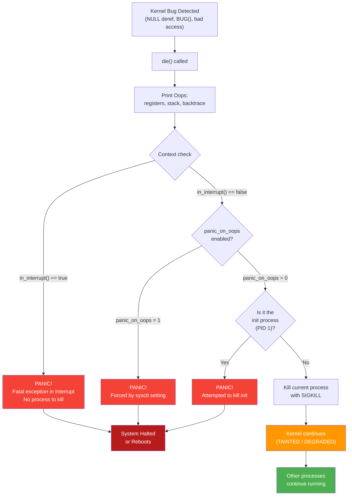
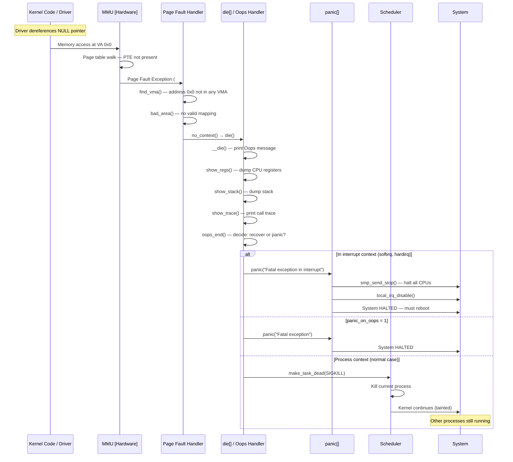
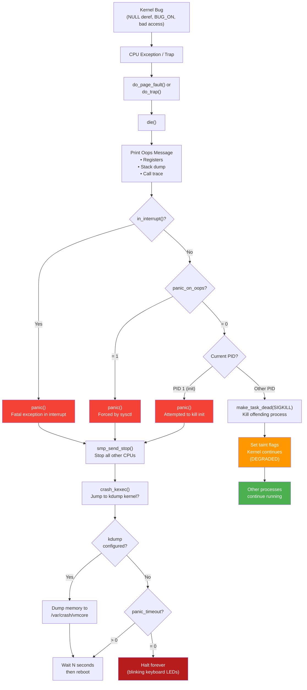

# Linux Kernel Panic vs Kernel Oops — Complete Guide

## Table of Contents

1. [Introduction](#introduction)
2. [Kernel Oops](#kernel-oops)
3. [Kernel Panic](#kernel-panic)
4. [Oops vs Panic — Comparison](#oops-vs-panic--comparison)
5. [When Oops Becomes Panic](#when-oops-becomes-panic)
6. [Practical Examples — Triggering and Debugging](#practical-examples--triggering-and-debugging)
   - [Example 1: NULL Pointer Dereference (Oops)](#example-1-null-pointer-dereference-oops)
   - [Example 2: Oops in Interrupt Context (Panic)](#example-2-oops-in-interrupt-context-panic)
   - [Example 3: Explicit Panic](#example-3-explicit-panic)
   - [Example 4: BUG_ON Macro](#example-4-bug_on-macro)
   - [Example 5: Use-After-Free (Oops)](#example-5-use-after-free-oops)
   - [Example 6: Stack Overflow (Panic)](#example-6-stack-overflow-panic)
7. [Reading an Oops Message — Practical Decode](#reading-an-oops-message--practical-decode)
8. [Flow Diagram — Oops and Panic Paths](#flow-diagram--oops-and-panic-paths)
9. [Sequence Diagram — Oops Lifecycle](#sequence-diagram--oops-lifecycle)
10. [Debugging Tools and Techniques](#debugging-tools-and-techniques)
11. [Kernel Configuration Options](#kernel-configuration-options)
12. [Practical Sysctl Settings](#practical-sysctl-settings)
13. [Interview Q&A](#interview-qa)
14. [Summary](#summary)

---

## Introduction

The Linux kernel has two mechanisms for reporting fatal or semi-fatal errors:

- **Kernel Oops:** A non-fatal error — the kernel detected a bug, kills the offending process, and continues running in a degraded state.
- **Kernel Panic:** A fatal, unrecoverable error — the kernel halts the entire system (or reboots).

Understanding the difference is critical for **kernel driver development**, **debugging**, and **interview preparation**.

---

## Kernel Oops

### What Is It?

An **Oops** is the kernel's way of saying: *"Something went wrong, but I can try to keep running."*

- The kernel detects an illegal operation (e.g., NULL pointer dereference).
- It prints a diagnostic message (registers, stack trace, backtrace).
- It kills the offending process/thread.
- The kernel continues running but is now **tainted** (potentially unstable).

### What Triggers an Oops?

| Trigger | Description |
|---------|-------------|
| NULL pointer dereference | Accessing address `0x0` or near-zero address |
| Invalid memory access | Reading/writing unmapped virtual address |
| `BUG()` / `BUG_ON()` | Explicit assertion failure in kernel code |
| `WARN_ON()` with side effects | Conditional warning that detects corruption |
| Use-after-free | Accessing memory after `kfree()` |
| Buffer overflow | Writing beyond allocated bounds |

### Oops Internal Flow

```c
// Simplified kernel code path (x86_64)

do_page_fault()            // CPU exception #14
  → __do_page_fault()
    → bad_area_nosemaphore()
      → __bad_area_nosemaphore()
        → no_context()
          → die()          // ← This prints the Oops
            → __die()
              → show_regs()        // Print CPU registers
              → show_stack()       // Print stack dump
              → show_trace()       // Print call trace
            → oops_end()
              → if (in_interrupt() || panic_on_oops)
                  panic("Fatal exception");    // ← Escalate to panic
              → else
                  make_task_dead(SIGKILL);     // ← Kill process, continue
```

### Kernel State After Oops

After an oops, the kernel:
- Sets the **taint flag** (`P` for proprietary, `D` for die, `G` for GPL)
- The `current` process is killed with `SIGKILL`
- Locks held by the dead process **may not be released** → potential deadlocks
- System is **degraded** — another oops is more likely
- `/proc/sys/kernel/tainted` shows non-zero value

---

## Kernel Panic

### What Is It?

A **Panic** is the kernel's way of saying: *"I cannot continue safely — halting the system."*

- The kernel encounters an unrecoverable error.
- It prints a panic message.
- It halts all CPUs (or reboots if configured).
- **No recovery** is possible — must reboot.

### What Triggers a Panic?

| Trigger | Description |
|---------|-------------|
| Oops in interrupt context | No process to kill — cannot recover |
| `panic()` called explicitly | Subsystem detects unrecoverable corruption |
| Init process (PID 1) dies | System cannot function without init |
| Double fault | CPU exception while handling another exception |
| Out-of-memory (extreme) | OOM killer cannot free memory, no init |
| `panic_on_oops=1` | Sysctl forces every oops to become a panic |
| Hardware error (MCE) | Machine Check Exception — hardware failure |
| Kernel stack overflow | Stack grows beyond allocated kernel stack |
| VFS: Unable to mount root fs | Boot cannot continue |

### Panic Internal Flow

```c
// kernel/panic.c

void panic(const char *fmt, ...)
{
    /* 1. Disable all other CPUs */
    smp_send_stop();           // Send IPI to stop all other cores

    /* 2. Disable local interrupts */
    local_irq_disable();

    /* 3. Print the panic message */
    printk(KERN_EMERG "Kernel panic - not syncing: %s\n", buf);

    /* 4. Print stack trace */
    dump_stack();

    /* 5. Run panic notifier chain */
    atomic_notifier_call_chain(&panic_notifier_list, 0, buf);

    /* 6. Trigger kdump if configured */
    crash_kexec(NULL);         // Jump to crash kernel for dump

    /* 7. Reboot or halt */
    if (panic_timeout > 0) {
        emergency_restart();   // Reboot after timeout
    } else {
        /* Halt forever — blinking keyboard LEDs */
        while (1) {
            /* System is dead */
        }
    }
}
```

---

## Oops vs Panic — Comparison

| Aspect | Kernel Oops | Kernel Panic |
|--------|------------|--------------|
| **Severity** | Non-fatal (degraded) | Fatal (system halts) |
| **Recovery** | Kills offending process, kernel continues | No recovery — must reboot |
| **System state** | Tainted but running | Completely frozen |
| **Cause** | Bug in non-critical path | Unrecoverable error |
| **Context matters?** | Yes — process context only | Any context |
| **Interrupts after** | Still enabled | All disabled |
| **Other CPUs** | Still running | Stopped via IPI |
| **User processes** | Other processes continue | All processes frozen |
| **Can trigger panic?** | Yes — if in interrupt context or `panic_on_oops=1` | N/A — already the worst |
| **Kernel tainted?** | Yes | System is dead |
| **dmesg available?** | Yes | Only if `panic_timeout` allows reboot, or via kdump |

---

## When Oops Becomes Panic



---

## Practical Examples — Triggering and Debugging

### Example 1: NULL Pointer Dereference (Oops)

```c
#include <linux/module.h>
#include <linux/kernel.h>

/* ──────────────────────────────────────────────
 * This module deliberately dereferences NULL
 * to demonstrate a kernel OOPS.
 *
 * Result: Oops printed, insmod process killed,
 *         kernel continues running.
 * ────────────────────────────────────────────── */

static int __init oops_null_init(void)
{
    int *ptr = NULL;

    printk(KERN_INFO "About to dereference NULL pointer...\n");

    /* This triggers a page fault at address 0x0
     * → do_page_fault() → die() → Oops
     * → Current process killed, kernel continues */
    *ptr = 42;   /* ← OOPS HERE */

    /* This line never executes */
    printk(KERN_INFO "This will never print\n");
    return 0;
}

static void __exit oops_null_exit(void)
{
    printk(KERN_INFO "Module unloaded\n");
}

module_init(oops_null_init);
module_exit(oops_null_exit);
MODULE_LICENSE("GPL");
MODULE_DESCRIPTION("NULL pointer Oops demo");
```

**Expected dmesg output:**
```
[  123.456789] BUG: kernel NULL pointer dereference, address: 0000000000000000
[  123.456790] #PF: supervisor write access in kernel mode
[  123.456791] #PF: error_code(0x0002) - not-present page
[  123.456792] Oops: 0002 [#1] SMP NOPTI
[  123.456793] CPU: 2 PID: 1234 Comm: insmod Tainted: G           O
[  123.456794] RIP: 0010:oops_null_init+0x1a/0x30 [oops_null]
[  123.456795] ...
[  123.456796] Call Trace:
[  123.456797]  do_one_initcall+0x46/0x1d0
[  123.456798]  do_init_module+0x52/0x200
[  123.456799]  ...
```

**What happens:**
- `insmod` process is killed
- Kernel prints full register dump and call trace
- Kernel continues running — you can still use the system
- `dmesg` shows the full oops

---

### Example 2: Oops in Interrupt Context (→ Panic)

```c
#include <linux/module.h>
#include <linux/interrupt.h>
#include <linux/kernel.h>

/* ──────────────────────────────────────────────
 * This module triggers a NULL dereference inside
 * a TASKLET (softirq context = interrupt context).
 *
 * Result: Oops → PANIC! (because in_interrupt())
 *         System HALTS — must reboot.
 * ────────────────────────────────────────────── */

static struct tasklet_struct my_tasklet;

static void tasklet_oops_handler(unsigned long data)
{
    int *ptr = NULL;

    printk(KERN_INFO "Tasklet running in softirq context...\n");

    /* This Oops occurs in interrupt context
     * → die() checks in_interrupt() == true
     * → panic("Fatal exception in interrupt") */
    *ptr = 42;   /* ← OOPS → PANIC! */
}

static int __init oops_interrupt_init(void)
{
    printk(KERN_INFO "Loading module — will panic in tasklet\n");

    tasklet_init(&my_tasklet, tasklet_oops_handler, 0);
    tasklet_schedule(&my_tasklet);

    return 0;
}

static void __exit oops_interrupt_exit(void)
{
    tasklet_kill(&my_tasklet);
}

module_init(oops_interrupt_init);
module_exit(oops_interrupt_exit);
MODULE_LICENSE("GPL");
MODULE_DESCRIPTION("Oops in interrupt context → Panic demo");
```

**Expected result:**
```
[  123.456789] BUG: kernel NULL pointer dereference, address: 0000000000000000
[  123.456790] Oops: 0002 [#1] SMP NOPTI
[  123.456791] ...
[  123.456792] Kernel panic - not syncing: Fatal exception in interrupt
[  123.456793] ---[ end Kernel panic - not syncing: Fatal exception in interrupt ]---
```

**System is completely frozen — must hard reboot.**

---

### Example 3: Explicit Panic

```c
#include <linux/module.h>
#include <linux/kernel.h>

/* ──────────────────────────────────────────────
 * Calling panic() directly — demonstrates
 * explicit kernel panic.
 *
 * ⚠️ WARNING: This WILL crash your system!
 * ────────────────────────────────────────────── */

static int __init explicit_panic_init(void)
{
    printk(KERN_EMERG "About to call panic()...\n");

    /* Direct panic — system halts immediately */
    panic("Intentional panic for demonstration purposes!");

    /* Never reached */
    return 0;
}

static void __exit explicit_panic_exit(void)
{
    /* Never called — system is dead */
}

module_init(explicit_panic_init);
module_exit(explicit_panic_exit);
MODULE_LICENSE("GPL");
MODULE_DESCRIPTION("Explicit panic() demo");
```

---

### Example 4: BUG_ON Macro

```c
#include <linux/module.h>
#include <linux/kernel.h>

/* ──────────────────────────────────────────────
 * BUG_ON(condition) — if condition is true,
 * triggers an Oops with a "BUG:" message.
 *
 * Use BUG_ON for conditions that should NEVER
 * happen. If they do, something is severely wrong.
 *
 * WARN_ON is the softer version — prints a warning
 * but does not kill the process.
 * ────────────────────────────────────────────── */

static int my_value = 0;

static int __init bug_on_demo_init(void)
{
    printk(KERN_INFO "Demonstrating BUG_ON and WARN_ON\n");

    /* WARN_ON: prints warning + stack trace but continues */
    WARN_ON(my_value == 0);
    printk(KERN_INFO "After WARN_ON — still running!\n");

    /* BUG_ON: triggers an Oops — kills the process */
    BUG_ON(my_value == 0);   /* ← OOPS HERE */
    printk(KERN_INFO "This never prints\n");

    return 0;
}

static void __exit bug_on_demo_exit(void)
{
    printk(KERN_INFO "Module unloaded\n");
}

module_init(bug_on_demo_init);
module_exit(bug_on_demo_exit);
MODULE_LICENSE("GPL");
MODULE_DESCRIPTION("BUG_ON and WARN_ON demo");
```

**dmesg output:**
```
[  10.001] Demonstrating BUG_ON and WARN_ON
[  10.002] WARNING: ... at bug_on_demo_init+0x20/0x40     ← WARN_ON (continues)
[  10.003] Call Trace: ...
[  10.004] After WARN_ON — still running!                  ← Continues after WARN_ON
[  10.005] kernel BUG at bug_on_demo.c:25!                 ← BUG_ON (Oops, process dies)
[  10.006] Oops: ...
```

### BUG / WARN Macros Reference

```c
/* ── Fatal (Oops) ── */
BUG();                     /* Unconditional Oops */
BUG_ON(condition);         /* Oops if condition is true */

/* ── Non-fatal (Warning) ── */
WARN_ON(condition);        /* Print warning + stack if true, continue */
WARN_ON_ONCE(condition);   /* Warn only the first time */
WARN(condition, fmt, ...); /* Warn with custom message */

/* ── Recoverable ── */
pr_err("error: ...\n");   /* Just print — no stack trace, no kill */
```

---

### Example 5: Use-After-Free (Oops)

```c
#include <linux/module.h>
#include <linux/slab.h>

/* ──────────────────────────────────────────────
 * Use-after-free bug — common driver mistake.
 * With KASAN enabled, this is caught immediately.
 * Without KASAN, may cause a delayed Oops or
 * silent data corruption.
 * ────────────────────────────────────────────── */

static int __init uaf_demo_init(void)
{
    char *buf;

    buf = kmalloc(64, GFP_KERNEL);
    if (!buf)
        return -ENOMEM;

    strcpy(buf, "Hello, kernel!");
    printk(KERN_INFO "Before free: %s\n", buf);

    kfree(buf);    /* ← Memory freed */

    /* ⚠️ BUG: Accessing freed memory! */
    printk(KERN_INFO "After free: %s\n", buf);   /* ← USE-AFTER-FREE */

    /* With KASAN enabled:
     * BUG: KASAN: use-after-free in uaf_demo_init+0x...
     *
     * Without KASAN:
     * May print garbage, or may appear to work (DANGEROUS!)
     * because the memory hasn't been reclaimed yet */

    return 0;
}

static void __exit uaf_demo_exit(void)
{
    printk(KERN_INFO "UAF demo unloaded\n");
}

module_init(uaf_demo_init);
module_exit(uaf_demo_exit);
MODULE_LICENSE("GPL");
MODULE_DESCRIPTION("Use-after-free demo (enable KASAN to catch)");
```

---

### Example 6: Stack Overflow (→ Panic)

```c
#include <linux/module.h>
#include <linux/kernel.h>

/* ──────────────────────────────────────────────
 * Kernel stack is small (typically 8 KB or 16 KB).
 * Deep recursion or large local arrays will
 * overflow it → PANIC or double fault.
 *
 * ⚠️ WARNING: This WILL crash your system!
 * ────────────────────────────────────────────── */

static noinline void recursive_bomb(int depth)
{
    char large_buffer[2048];  /* Eats stack space */

    /* Prevent compiler optimization */
    memset(large_buffer, depth & 0xFF, sizeof(large_buffer));

    printk(KERN_INFO "Recursion depth: %d\n", depth);

    /* Eventually overflows the kernel stack (8-16 KB) */
    recursive_bomb(depth + 1);   /* ← STACK OVERFLOW → PANIC */
}

static int __init stack_overflow_init(void)
{
    printk(KERN_EMERG "About to overflow kernel stack...\n");
    recursive_bomb(0);
    return 0;
}

static void __exit stack_overflow_exit(void) {}

module_init(stack_overflow_init);
module_exit(stack_overflow_exit);
MODULE_LICENSE("GPL");
MODULE_DESCRIPTION("Stack overflow → Panic demo");
```

**Result:** Double fault → Panic. Kernel stack is only 8–16 KB.

---

## Reading an Oops Message — Practical Decode

```
[  123.456789] BUG: kernel NULL pointer dereference, address: 0000000000000000
                │                                               └─ Faulting VA
                └─ Type of bug

[  123.456790] #PF: supervisor write access in kernel mode
                     │          │              └─ Ring 0 code caused it
                     │          └─ Was a WRITE operation
                     └─ Page Fault

[  123.456791] #PF: error_code(0x0002) - not-present page
                              │           └─ Page not mapped
                              └─ Bits: bit1=write, bit0=not-present

[  123.456792] Oops: 0002 [#1] SMP NOPTI
                     │     │   │    └─ No Page Table Isolation
                     │     │   └─ SMP kernel
                     │     └─ First oops (counter)
                     └─ Error code (write to not-present page)

[  123.456793] CPU: 2 PID: 1234 Comm: insmod Tainted: G           O
                   │       │          │                  │           │
                   │       │          │                  │           └─ Out-of-tree module
                   │       │          │                  └─ GPL modules loaded
                   │       │          └─ Name of process that triggered oops
                   │       └─ Process ID
                   └─ CPU number

[  123.456794] RIP: 0010:oops_null_init+0x1a/0x30 [oops_null]
                     │    │                │   │    └─ Module name
                     │    │                │   └─ Function size
                     │    │                └─ Offset into function
                     │    └─ Function name (← KEY INFORMATION)
                     └─ Code segment selector (0x10 = kernel code)

[  123.456795] RSP: 0018:ffffc90001234567 EFLAGS: 00010246
               └─ Stack pointer                    └─ CPU flags

[  123.456796] RAX: 0000000000000000 RBX: ffff8881234abcde
               └─ RAX was NULL — this was the pointer we dereferenced!

[  123.456797] Call Trace:
[  123.456798]  <TASK>
[  123.456799]  do_one_initcall+0x46/0x1d0          ← Called our init function
[  123.456800]  do_init_module+0x52/0x200            ← Module loading path
[  123.456801]  load_module+0x1234/0x1500
[  123.456802]  __do_sys_finit_module+0xab/0x120
[  123.456803]  do_syscall_64+0x35/0x80              ← Syscall entry
[  123.456804]  entry_SYSCALL_64_after_hwframe+0x44/0xa9
[  123.456805]  </TASK>
```

### Quick Decode Checklist

1. **RIP line** → Which function crashed and at what offset
2. **address** → What virtual address was accessed (0 = NULL deref)
3. **PID / Comm** → Which process triggered it
4. **Call Trace** → Read bottom-up to understand the call chain
5. **RAX/RBX/...** → Check for NULL or suspicious values
6. **[#1]** → Oops counter — first oops or has system oopsed before?
7. **Tainted** → Was a proprietary module loaded?

### Decode with `addr2line`

```bash
# Convert RIP offset to source line number
addr2line -e drivers/my_driver/my_driver.ko -f 0x1a

# Or use the kernel's faddr2line script
./scripts/faddr2line vmlinux oops_null_init+0x1a/0x30
```

---

## Sequence Diagram — Oops Lifecycle



---

## Flow Diagram — Oops and Panic Paths



---

## Debugging Tools and Techniques

### 1. dmesg — View Kernel Logs

```bash
# View last oops
dmesg | tail -50

# Filter for oops/panic/BUG
dmesg | grep -iE "oops|panic|bug|fault|die"

# Follow kernel log in real-time
dmesg -w
```

### 2. addr2line — Map Address to Source

```bash
# Find exact source line from oops RIP
addr2line -e vmlinux ffffffff81234567
# Output: drivers/my_driver/my_driver.c:42

# For module (.ko file)
addr2line -e my_driver.ko 0x1a
```

### 3. objdump — Disassemble Around Crash

```bash
# Disassemble the function that crashed
objdump -dS my_driver.ko | grep -A 20 "oops_null_init"
```

### 4. GDB — Kernel Debugging

```bash
# Attach GDB to vmlinux for symbol resolution
gdb vmlinux
(gdb) list *(oops_null_init+0x1a)
# Shows the exact source line
```

### 5. KASAN — Runtime Memory Bug Detector

```bash
# Enable in kernel config
CONFIG_KASAN=y
CONFIG_KASAN_GENERIC=y

# Detects:
# - Use-after-free
# - Out-of-bounds access
# - Double-free
```

### 6. kdump/crash — Post-Mortem Analysis

```bash
# Install kdump tools
apt install kdump-tools   # Debian/Ubuntu
yum install kexec-tools   # RHEL/CentOS

# After a panic with kdump configured:
crash /var/crash/vmcore /boot/vmlinux

# In crash tool:
crash> bt            # Backtrace
crash> log           # Kernel log
crash> mod           # Loaded modules
crash> vm            # Virtual memory info
crash> task          # Current task
```

### 7. KGDB — Live Kernel Debugging

```bash
# Enable in kernel config
CONFIG_KGDB=y
CONFIG_KGDB_SERIAL_CONSOLE=y

# Boot parameter
kgdboc=ttyS0,115200 kgdbwait

# Connect from host
gdb vmlinux
(gdb) target remote /dev/ttyS0
```

---

## Kernel Configuration Options

```bash
# ── Oops/Panic related ──
CONFIG_BUG=y                    # Enable BUG()/BUG_ON()
CONFIG_DEBUG_BUGVERBOSE=y       # Verbose BUG() output with file:line
CONFIG_PANIC_ON_OOPS=y          # Every oops → panic (set at compile time)
CONFIG_PANIC_TIMEOUT=0          # Seconds before reboot (0 = never)

# ── Memory debugging ──
CONFIG_KASAN=y                  # Kernel Address Sanitizer
CONFIG_KFENCE=y                 # Lightweight memory error detector
CONFIG_DEBUG_SLAB=y             # Slab allocator debugging
CONFIG_DEBUG_PAGEALLOC=y        # Page allocator debugging
CONFIG_SLUB_DEBUG=y             # SLUB extra checks

# ── Stack overflow detection ──
CONFIG_VMAP_STACK=y             # Guard pages around kernel stack
CONFIG_STACK_TRACER=y           # Stack usage tracing

# ── Lock debugging ──
CONFIG_PROVE_LOCKING=y          # Lockdep — deadlock detector
CONFIG_DEBUG_LOCK_ALLOC=y       # Lock allocation debugging
CONFIG_LOCKUP_DETECTOR=y       # Detect soft/hard lockups

# ── Crash dump ──
CONFIG_CRASH_DUMP=y             # kdump support
CONFIG_KEXEC=y                  # kexec for crash kernels
```

---

## Practical Sysctl Settings

```bash
# ── View current settings ──
cat /proc/sys/kernel/panic              # panic_timeout (seconds)
cat /proc/sys/kernel/panic_on_oops      # 0=oops continues, 1=oops→panic
cat /proc/sys/kernel/tainted            # Taint flags (0 = clean)

# ── Configure for development (see errors, keep running) ──
sysctl -w kernel.panic_on_oops=0        # Don't panic on oops
sysctl -w kernel.panic=0                # Don't auto-reboot on panic

# ── Configure for production (strict, auto-reboot) ──
sysctl -w kernel.panic_on_oops=1        # Any oops → panic (reboot)
sysctl -w kernel.panic=10               # Reboot 10 seconds after panic

# ── Persist settings ──
echo "kernel.panic_on_oops = 1" >> /etc/sysctl.conf
echo "kernel.panic = 10" >> /etc/sysctl.conf
sysctl -p
```

### Taint Flags Reference

```bash
# cat /proc/sys/kernel/tainted
# Non-zero means kernel is tainted

# Common flags:
# G — All modules are GPL-licensed
# P — Proprietary module loaded
# F — Module was loaded by force (modprobe --force)
# O — Out-of-tree module loaded
# E — Unsigned module loaded
# D — Kernel has oopsed (die() was called)
# W — Warning has previously been issued
# C — Staging driver loaded
# K — Kernel live-patched
```

---

## Interview Q&A

### Q1: What is the difference between kernel oops and kernel panic?
**A:** An **oops** is a non-fatal error — the kernel kills the offending process and continues in a degraded state. A **panic** is a fatal, unrecoverable error — the kernel halts or reboots. An oops in interrupt context automatically becomes a panic because there's no process to kill.

### Q2: Can kernel continue after an oops?
**A:** Yes, but in a **degraded/tainted** state. Locks held by the killed process may not be released, leading to potential deadlocks later. The system should be rebooted as soon as possible.

### Q3: Why does an oops in interrupt context cause a panic?
**A:** In interrupt context, there is no "current process" that can be safely killed. The kernel's recovery mechanism for an oops is to kill the offending process with `SIGKILL`, but interrupt context doesn't have a process context to kill. Therefore, the kernel must panic.

### Q4: What is `panic_on_oops` and when would you use it?
**A:** It's a sysctl setting (`/proc/sys/kernel/panic_on_oops`). When set to `1`, every oops is escalated to a panic. **Production servers** use this because a degraded kernel with potential resource leaks is more dangerous than a clean reboot.

### Q5: How do you debug a kernel oops?
**A:** (1) Read the oops message from `dmesg` — note the RIP (faulting function), faulting address, and call trace. (2) Use `addr2line` or `gdb` to map the instruction offset to source code. (3) Check register values for NULL or suspicious pointers. (4) Enable KASAN for memory bugs. (5) Use kdump for post-mortem analysis of panics.

### Q6: What happens to locks when a process is killed by an oops?
**A:** Any **mutexes**, **semaphores**, or **spinlocks** held by the killed process are **NOT released**. This can cause other threads to deadlock when they try to acquire those locks. This is why the kernel is considered "tainted" after an oops — it's potentially unstable.

### Q7: What is the difference between BUG_ON and WARN_ON?
**A:** `BUG_ON(cond)` triggers an **oops** (kills the process) if the condition is true. `WARN_ON(cond)` only prints a **warning with stack trace** but the code continues executing. Use `WARN_ON` for unexpected-but-survivable conditions, `BUG_ON` for should-never-happen conditions.

---

## Summary

| Aspect | Oops | Panic |
|--------|------|-------|
| **What** | Non-fatal kernel error | Fatal kernel error |
| **Action** | Kill offending process | Halt/reboot system |
| **Recovery** | Kernel continues (degraded) | No recovery |
| **When** | Bug in process context | Bug in interrupt context, or explicit |
| **Debug** | `dmesg`, `addr2line`, KASAN | `kdump`, serial console |
| **Production** | Set `panic_on_oops=1` to escalate | Set `panic=10` to auto-reboot |

### Key Takeaways

1. **Oops = recoverable** (but kernel is damaged). **Panic = game over.**
2. **Oops in interrupt context = automatic panic** — no process to kill.
3. **Production:** Use `panic_on_oops=1` + `panic=10` — reboot cleanly instead of running degraded.
4. **Development:** Use `panic_on_oops=0` + KASAN + lockdep — catch bugs early without losing the system.
5. **Always read RIP line first** in an oops — it tells you exactly which function and offset crashed.
6. **BUG_ON → Oops, WARN_ON → Warning** — choose based on severity.

---

*Document prepared for Linux kernel interview preparation.*
*Covers: kernel oops, kernel panic, BUG_ON/WARN_ON, oops decoding, debugging tools, practical module examples, kdump, KASAN.*
