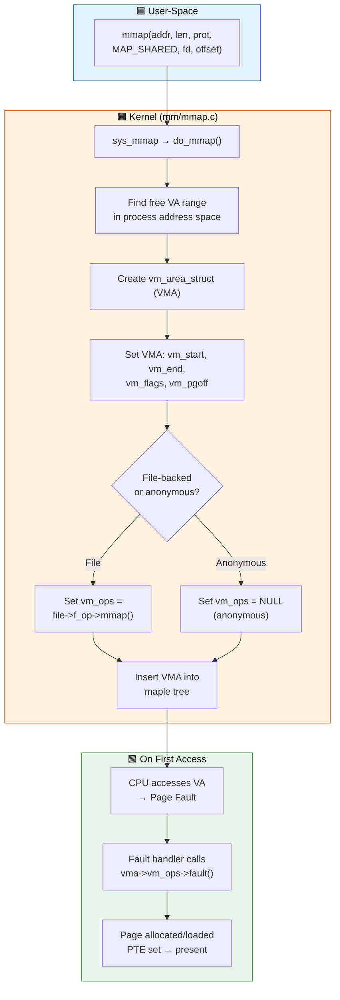
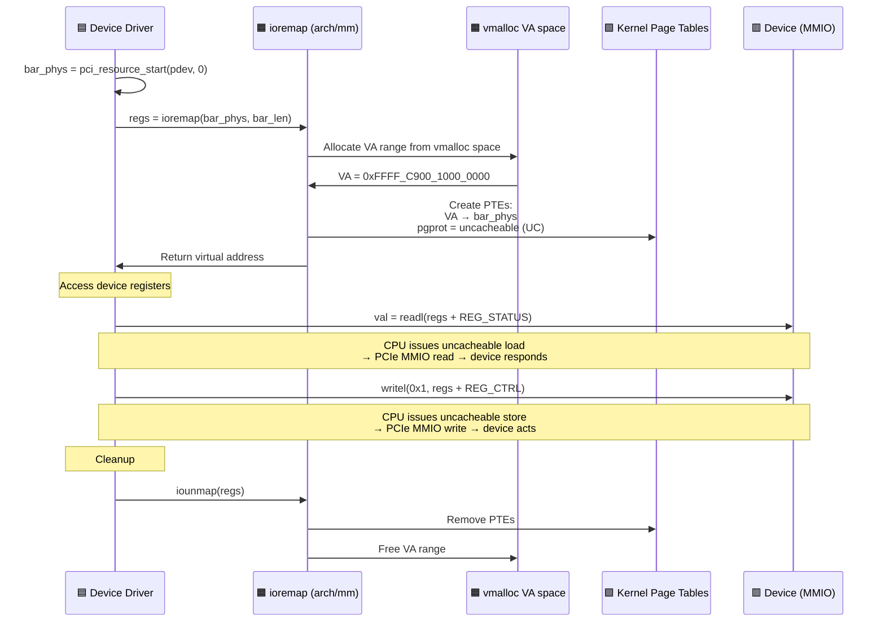

# Q4: Memory Mapping in Linux Kernel — mmap, ioremap, remap_pfn_range

## Interview Question
**"Explain how memory mapping works in the Linux kernel from a device driver perspective. How does mmap() work end-to-end? What is ioremap and when do you use it? How do you implement mmap in a character device driver to share kernel memory with user space?"**

---

## 1. Overview of Memory Mapping

Memory mapping establishes a direct correspondence between a range of virtual addresses and some backing store (physical memory, device registers, or a file).

```
User Space                    Kernel / Hardware
┌────────────────┐
│ mmap() syscall │ ──────→ Creates virtual → physical mapping
│ returns vaddr  │         in the process page tables
└────────┬───────┘
         │
         ▼
┌────────────────┐            ┌──────────────┐
│ User virtual   │ ────MMU───→│ Physical RAM  │
│ addr: 0x7f... │            │ or Device MMIO│
└────────────────┘            └──────────────┘
```

### Types of Mappings

```
┌──────────────────────────────────────────────────────────────┐
│                    Memory Mappings                            │
├──────────────────────┬───────────────────────────────────────┤
│   User Space         │       Kernel Space                    │
│                      │                                       │
│ • mmap() syscall     │ • ioremap() — device MMIO             │
│ • File-backed mmap   │ • Direct mapping (PAGE_OFFSET)        │
│ • Anonymous mmap     │ • vmalloc region                      │
│ • Device mmap        │ • fixmap                              │
│   (via driver)       │ • kmap (highmem on 32-bit)            │
└──────────────────────┴───────────────────────────────────────┘
```

---

## 2. mmap() System Call — End-to-End

### User Space API

```c
#include <sys/mman.h>

void *mmap(void *addr,        /* Hint address (usually NULL) */
           size_t length,      /* Size of mapping */
           int prot,           /* PROT_READ | PROT_WRITE | PROT_EXEC */
           int flags,          /* MAP_SHARED | MAP_PRIVATE | MAP_ANONYMOUS */
           int fd,             /* File descriptor (or -1 for anonymous) */
           off_t offset);      /* Offset in file/device */

int munmap(void *addr, size_t length);
```

### Kernel Path of mmap()

```
User: mmap(NULL, 4096, PROT_READ|PROT_WRITE, MAP_SHARED, fd, 0)
│
▼
sys_mmap() → ksys_mmap_pgoff()
│
▼
do_mmap()
├── 1. Find free virtual address range (get_unmapped_area)
├── 2. Create vm_area_struct (VMA) describing the mapping
├── 3. Link VMA into mm->mmap (maple tree, since 6.1)
├── 4. Call file->f_op->mmap(file, vma) if file-backed
│       └── Driver's mmap callback
│           └── Sets up page table entries
│               (remap_pfn_range, vm_insert_page, etc.)
└── 5. Return virtual address to user space

NOTE: Pages may NOT be mapped yet!
      They are faulted in lazily on first access.
```

---

## 3. vm_area_struct (VMA) — The Mapping Descriptor

Every memory mapping in a process is described by a VMA:

```c
struct vm_area_struct {
    unsigned long vm_start;          /* Start virtual address */
    unsigned long vm_end;            /* End virtual address (exclusive) */
    struct mm_struct *vm_mm;         /* Owning address space */

    pgprot_t vm_page_prot;           /* Page protection (R/W/X, caching) */
    unsigned long vm_flags;          /* VM_READ, VM_WRITE, VM_EXEC, VM_SHARED... */

    const struct vm_operations_struct *vm_ops;  /* Fault handlers, etc. */
    unsigned long vm_pgoff;          /* Offset in PAGE_SIZE units */
    struct file *vm_file;            /* Associated file (NULL for anonymous) */
    void *vm_private_data;           /* Driver private data */
    /* ... */
};
```

### VMA Operations

```c
struct vm_operations_struct {
    void (*open)(struct vm_area_struct *vma);     /* VMA is dup'd (fork) */
    void (*close)(struct vm_area_struct *vma);    /* VMA is removed */

    /* Called on page fault — THE key function */
    vm_fault_t (*fault)(struct vm_fault *vmf);

    /* Huge page fault */
    vm_fault_t (*huge_fault)(struct vm_fault *vmf, unsigned int order);

    /* Called before pages are mapped/unmapped */
    void (*map_pages)(struct vm_fault *vmf, pgoff_t start_pgoff, pgoff_t end_pgoff);

    /* Page accessed/dirty notifiers */
    vm_fault_t (*page_mkwrite)(struct vm_fault *vmf);  /* Write to shared mapping */
    vm_fault_t (*pfn_mkwrite)(struct vm_fault *vmf);
    /* ... */
};
```

---

## 4. Implementing mmap in a Device Driver

### Method 1: remap_pfn_range (Most Common for I/O Memory)

```c
#include <linux/mm.h>

static int my_device_mmap(struct file *filp, struct vm_area_struct *vma)
{
    struct my_device *dev = filp->private_data;
    unsigned long size = vma->vm_end - vma->vm_start;
    unsigned long pfn = dev->phys_base >> PAGE_SHIFT;

    /* Sanity check: don't map more than device has */
    if (size > dev->mem_size)
        return -EINVAL;

    /* For device memory, set uncacheable */
    vma->vm_page_prot = pgprot_noncached(vma->vm_page_prot);

    /* Prevent fork()'d child from inheriting */
    vm_flags_set(vma, VM_IO | VM_DONTEXPAND | VM_DONTDUMP);

    /* Map the physical pages into user space */
    if (remap_pfn_range(vma,
                        vma->vm_start,          /* User virtual address */
                        pfn + vma->vm_pgoff,    /* Physical frame number */
                        size,                    /* Size */
                        vma->vm_page_prot))     /* Page protection */
        return -EAGAIN;

    return 0;
}

static const struct file_operations my_fops = {
    .owner = THIS_MODULE,
    .mmap = my_device_mmap,
    /* ... */
};
```

### Method 2: vm_insert_page (For Kernel-Allocated Pages)

```c
/* When you want to map kernel pages (alloc_page) into user space */
static int my_mmap(struct file *filp, struct vm_area_struct *vma)
{
    struct my_device *dev = filp->private_data;
    unsigned long size = vma->vm_end - vma->vm_start;
    unsigned long uaddr = vma->vm_start;
    int i;

    if (size > dev->num_pages * PAGE_SIZE)
        return -EINVAL;

    for (i = 0; i < dev->num_pages && uaddr < vma->vm_end; i++) {
        int ret = vm_insert_page(vma, uaddr, dev->pages[i]);
        if (ret)
            return ret;
        uaddr += PAGE_SIZE;
    }

    return 0;
}
```

### Method 3: Fault Handler (Lazy Mapping — Most Flexible)

```c
static vm_fault_t my_fault(struct vm_fault *vmf)
{
    struct vm_area_struct *vma = vmf->vma;
    struct my_device *dev = vma->vm_private_data;
    unsigned long offset = vmf->pgoff << PAGE_SHIFT;
    struct page *page;

    if (offset >= dev->mem_size)
        return VM_FAULT_SIGBUS;

    /* Get the page for this offset */
    page = dev->pages[vmf->pgoff];
    if (!page)
        return VM_FAULT_SIGBUS;

    get_page(page);         /* Increment reference count */
    vmf->page = page;       /* Tell the fault handler which page to map */

    return 0;               /* Kernel will create the PTE */
}

static const struct vm_operations_struct my_vm_ops = {
    .fault = my_fault,
    .open = my_vma_open,
    .close = my_vma_close,
};

static int my_mmap(struct file *filp, struct vm_area_struct *vma)
{
    vma->vm_ops = &my_vm_ops;
    vma->vm_private_data = filp->private_data;
    vm_flags_set(vma, VM_DONTEXPAND | VM_DONTDUMP);
    return 0;
}
```

**Advantage of fault handler**: Pages are mapped on demand. Good for large sparse mappings. Also allows custom page allocation logic.

---

## 5. ioremap — Mapping Device I/O Memory

### What is ioremap?

Device registers and memory-mapped I/O (MMIO) regions exist at physical addresses but have no kernel virtual address. `ioremap()` creates a mapping in the kernel's vmalloc region:

```
Physical Memory Map:
0x00000000 ─┬── RAM
             │
0x3FFFFFFF ─┘
0x40000000 ─┬── Device registers (MMIO)  ← No RAM here!
             │   (e.g., UART, SPI, GPIO)
0x40001FFF ─┘
0x80000000 ─┬── More RAM
             │
0xFFFFFFFF ─┘

After ioremap(0x40000000, 0x2000):

Kernel virtual space:
0xFFFFC90000100000 ──→ maps to physical 0x40000000 (device registers)
```

### ioremap Variants

```c
#include <linux/io.h>

/* Standard ioremap — uncacheable, strongly ordered */
void __iomem *ioremap(phys_addr_t phys_addr, size_t size);

/* Write-combining (good for frame buffers) */
void __iomem *ioremap_wc(phys_addr_t phys_addr, size_t size);

/* Write-through */
void __iomem *ioremap_wt(phys_addr_t phys_addr, size_t size);

/* Cached (use ONLY for actual RAM accessed via MMIO BAR) */
void __iomem *ioremap_cache(phys_addr_t phys_addr, size_t size);

/* Unmap */
void iounmap(void __iomem *addr);
```

### Accessing ioremap'd Memory

**NEVER** dereference `__iomem` pointers directly. Use accessor functions:

```c
void __iomem *base = ioremap(phys, size);

/* Read */
u8  val8  = readb(base + offset);      /* 8-bit */
u16 val16 = readw(base + offset);      /* 16-bit */
u32 val32 = readl(base + offset);      /* 32-bit */
u64 val64 = readq(base + offset);      /* 64-bit */

/* Write */
writeb(val, base + offset);
writew(val, base + offset);
writel(val, base + offset);
writeq(val, base + offset);

/* Relaxed versions (no memory barrier) */
u32 val = readl_relaxed(base + offset);
writel_relaxed(val, base + offset);

/* Repeat (string) I/O */
readsl(base + offset, buffer, count);  /* Read count u32s */
writesl(base + offset, buffer, count); /* Write count u32s */
```

### Why __iomem Annotation?

```c
void __iomem *base;

/* The __iomem type marks pointers to I/O memory */
/* Sparse (static analyzer) catches misuse: */
u32 val = *(u32 *)base;         /* WARNING: direct dereference of __iomem */
u32 val = readl(base);          /* CORRECT */

/* This prevents bugs where:
   - CPU caching hides device register changes
   - Compiler reorders accesses
   - Byte ordering is wrong on different architectures */
```

---

## 6. Device Tree and Resource Management

### Modern Platform Driver Pattern

```c
#include <linux/platform_device.h>
#include <linux/of.h>

static int my_probe(struct platform_device *pdev)
{
    struct resource *res;
    void __iomem *base;

    /* Method 1: devm_platform_ioremap_resource (preferred since 5.1) */
    base = devm_platform_ioremap_resource(pdev, 0);
    if (IS_ERR(base))
        return PTR_ERR(base);

    /* Method 2: Manual (older code) */
    res = platform_get_resource(pdev, IORESOURCE_MEM, 0);
    if (!res)
        return -ENODEV;

    /* Request the memory region (prevents conflicts) */
    if (!devm_request_mem_region(&pdev->dev, res->start,
                                 resource_size(res), "my_device"))
        return -EBUSY;

    /* Map it */
    base = devm_ioremap(&pdev->dev, res->start, resource_size(res));
    if (!base)
        return -ENOMEM;

    /* Or combined: */
    base = devm_ioremap_resource(&pdev->dev, res);
    if (IS_ERR(base))
        return PTR_ERR(base);

    /* Use base for register access */
    writel(0x1, base + REG_CTRL);

    return 0;
}
```

### Device Tree Example

```dts
my_device@40000000 {
    compatible = "myvendor,mydevice";
    reg = <0x40000000 0x2000>;  /* base=0x40000000, size=0x2000 */
    interrupts = <GIC_SPI 42 IRQ_TYPE_LEVEL_HIGH>;
};
```

---

## 7. Sharing Kernel Buffers with User Space

### Pattern: DMA Buffer → User Space

```c
static int my_probe(struct platform_device *pdev)
{
    struct my_dev *dev;

    /* Allocate coherent DMA buffer */
    dev->dma_buf = dma_alloc_coherent(&pdev->dev, BUF_SIZE,
                                       &dev->dma_handle, GFP_KERNEL);
    if (!dev->dma_buf)
        return -ENOMEM;

    return 0;
}

static int my_mmap(struct file *filp, struct vm_area_struct *vma)
{
    struct my_dev *dev = filp->private_data;
    unsigned long size = vma->vm_end - vma->vm_start;

    if (size > BUF_SIZE)
        return -EINVAL;

    /* dma_mmap_coherent handles all the complexity:
       - Sets correct cache attributes
       - Maps the DMA buffer pages into user space */
    return dma_mmap_coherent(dev->dev, vma, dev->dma_buf,
                              dev->dma_handle, size);
}
```

### Pattern: vmalloc Buffer → User Space

```c
static int my_mmap(struct file *filp, struct vm_area_struct *vma)
{
    unsigned long size = vma->vm_end - vma->vm_start;
    char *buf = filp->private_data;  /* vmalloc'd buffer */
    unsigned long uaddr = vma->vm_start;
    unsigned long pos = 0;

    if (size > BUF_SIZE)
        return -EINVAL;

    /* vmalloc pages are NOT physically contiguous,
       so remap_pfn_range won't work. Map page-by-page: */
    while (pos < size) {
        struct page *page = vmalloc_to_page(buf + pos);
        if (!page)
            return -ENOMEM;

        if (vm_insert_page(vma, uaddr, page))
            return -EAGAIN;

        uaddr += PAGE_SIZE;
        pos += PAGE_SIZE;
    }

    return 0;
}

/* Alternative: remap_vmalloc_range() (simpler) */
static int my_mmap_v2(struct file *filp, struct vm_area_struct *vma)
{
    return remap_vmalloc_range(vma, filp->private_data, vma->vm_pgoff);
}
```

---

## 8. Cache Considerations

### Why Caching Matters for Mappings

```
CPU ←→ Cache ←→ RAM ←→ Device

Problem: If CPU caches device memory writes, CPU sees stale data
         If device writes RAM, CPU cache has stale copy
```

### Protection Types

```c
/* pgprot_t controls caching for mapped pages */

pgprot_noncached(prot)      /* Uncacheable — for MMIO registers */
                             /* Every read/write goes to device */

pgprot_writecombine(prot)   /* Write-combining — for frame buffers */
                             /* Writes batched, reads uncached */

pgprot_writethrough(prot)   /* Write-through — writes go to both cache & memory */

pgprot_kernel               /* Normal cached — for RAM */

/* Example usage in mmap: */
vma->vm_page_prot = pgprot_noncached(vma->vm_page_prot);
```

### Cache Attribute Summary

| Type | Read | Write | Use Case |
|------|------|-------|----------|
| Cached | Fast (from cache) | Fast (to cache) | Normal RAM |
| Write-through | Fast (from cache) | Medium (cache + memory) | Shared memory |
| Write-combining | Slow (from memory) | Medium (batched) | Frame buffers, GPU |
| Uncached | Slow (from device) | Slow (to device) | MMIO registers |

---

## 9. Common Pitfalls

### 1. Missing VM_IO Flag

```c
/* BAD: Omitting VM_IO for device memory */
remap_pfn_range(vma, ...);

/* GOOD: Set VM_IO for device/MMIO mappings */
vm_flags_set(vma, VM_IO | VM_DONTEXPAND | VM_DONTDUMP);
remap_pfn_range(vma, ...);

/* VM_IO prevents:
   - core dumps from trying to read device memory
   - /proc/<pid>/mem from accessing it
   - get_user_pages from pinning it */
```

### 2. Mapping Kernel Linear Addresses to User Space

```c
/* BAD: virt_to_phys on vmalloc address */
void *buf = vmalloc(size);
unsigned long pfn = virt_to_phys(buf) >> PAGE_SHIFT;  /* WRONG! */
remap_pfn_range(vma, vma->vm_start, pfn, size, vma->vm_page_prot);

/* GOOD: Use vmalloc_to_page per-page or remap_vmalloc_range */
remap_vmalloc_range(vma, buf, vma->vm_pgoff);
```

### 3. Security — Validate Offsets

```c
static int my_mmap(struct file *filp, struct vm_area_struct *vma)
{
    unsigned long size = vma->vm_end - vma->vm_start;
    unsigned long offset = vma->vm_pgoff << PAGE_SHIFT;

    /* ALWAYS validate! User controls offset and size */
    if (offset + size > dev->mem_size)
        return -EINVAL;
    if (offset + size < offset)   /* Overflow check */
        return -EINVAL;

    /* Now safe to map */
    return remap_pfn_range(vma, vma->vm_start,
                           (dev->phys_base + offset) >> PAGE_SHIFT,
                           size, vma->vm_page_prot);
}
```

---

## 10. Common Interview Follow-ups

**Q: Difference between ioremap and phys_to_virt?**
`phys_to_virt()` / `__va()` only works for RAM in the direct mapping (linear region). It's a compile-time offset, not an actual mapping. `ioremap()` creates a new virtual mapping for any physical address (including device MMIO) in the vmalloc region, with appropriate cache attributes.

**Q: What happens when user calls munmap()?**
`munmap()` → `do_munmap()` → removes the VMA → unmaps page tables (`unmap_region`) → calls `vma->vm_ops->close()` → frees the VMA structure.

**Q: Can two processes mmap the same device?**
Yes. Each gets its own VMA and page table entries pointing to the same physical pages. This is how shared memory and shared device buffers work. The driver must handle concurrent access.

**Q: How does mmap relate to zero-copy?**
Instead of `copy_to_user()` (CPU copies data kernel→user), mmap lets user space directly access kernel/device memory. Zero CPU copy overhead. Used in networking (packet mmap), video capture (V4L2), and GPU drivers.

---

## 11. Key Source Files

| File | Purpose |
|------|---------|
| `mm/mmap.c` | mmap system call, VMA management |
| `mm/memory.c` | remap_pfn_range, vm_insert_page |
| `arch/x86/mm/ioremap.c` | ioremap implementation (x86) |
| `arch/arm64/mm/ioremap.c` | ioremap implementation (ARM64) |
| `include/linux/mm.h` | VMA, page table manipulation APIs |
| `include/linux/io.h` | ioremap, readl/writel |
| `include/linux/mm_types.h` | vm_area_struct definition |
| `include/asm-generic/io.h` | Generic I/O accessors |

---

## Mermaid Diagrams

### mmap System Call Flow



### ioremap and Device Memory Access Sequence


