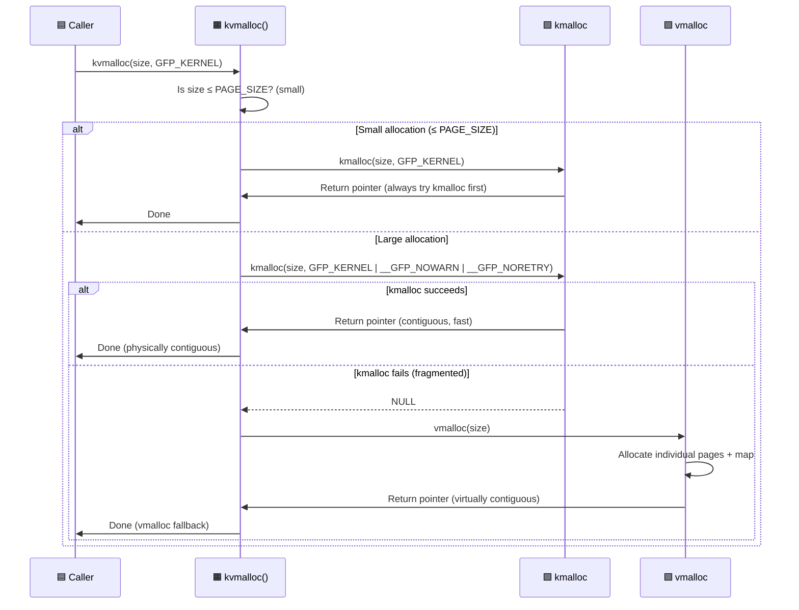

# Q6: vmalloc vs kmalloc — When and How to Use Each

## Interview Question
**"Compare vmalloc and kmalloc in detail. When would you choose one over the other? What are the internal differences in how they allocate memory? What is kvmalloc and when should it be used?"**

---

## 1. Fundamental Difference

```
kmalloc:
  ✓ Physically contiguous
  ✓ Virtually contiguous
  ✓ Fast allocation (slab fast path)
  ✗ Limited size (typically ≤ 4MB)
  ✗ Fails easily for large allocations (fragmentation)

vmalloc:
  ✗ NOT physically contiguous
  ✓ Virtually contiguous
  ✗ Slower (page table manipulation, TLB pressure)
  ✓ Can allocate very large buffers
  ✓ Succeeds even with fragmented physical memory
```

### Memory Layout

```
kmalloc returns memory from the direct mapping (linear mapping):

Kernel Virtual Space:
┌──────────────────────────────────────────────────────────────┐
│ Direct Mapping (PAGE_OFFSET)                                  │
│ Phys 0 → Virt PAGE_OFFSET                                    │
│ virt = phys + PAGE_OFFSET  (simple offset!)                   │
│ kmalloc lives here                                            │
├──────────────────────────────────────────────────────────────┤
│ vmalloc Region                                                │
│ Random virtual addresses                                      │
│ Each page mapped individually via page tables                 │
│ vmalloc lives here                                            │
├──────────────────────────────────────────────────────────────┤
│ Other kernel regions (vmemmap, fixmap, modules, etc.)         │
└──────────────────────────────────────────────────────────────┘
```

---

## 2. Physical Layout Comparison

```
kmalloc(16384, GFP_KERNEL) — 4 pages:

Physical RAM:
... [A][B][C][D] ...    ← 4 CONTIGUOUS physical pages
     ↕  ↕  ↕  ↕
Virtual:
... [A][B][C][D] ...    ← Also contiguous in virtual space (direct mapping)

virt_to_phys() works ✓
Can be used for DMA without IOMMU ✓


vmalloc(16384) — 4 pages:

Physical RAM:
[A] . . . [B] . . [C] . . . . [D]    ← SCATTERED physical pages
 ↕              ↕         ↕              ↕
Virtual (vmalloc region):
[A][B][C][D]                            ← Contiguous in virtual space only

virt_to_phys() does NOT work ✗
Cannot be used for direct DMA ✗
Must use vmalloc_to_page() per page
```

---

## 3. kmalloc Internals

```c
void *kmalloc(size_t size, gfp_t flags)
{
    /* Small sizes (≤ KMALLOC_MAX_CACHE_SIZE, typically 8KB-32KB):
       → SLUB slab allocator
       → Pre-created kmalloc-N caches */

    /* Large sizes (> KMALLOC_MAX_CACHE_SIZE):
       → Direct buddy allocator (alloc_pages)
       → Must be order-aligned (wastes memory for non-power-of-2) */
}
```

Path:
```
kmalloc(100) → SLUB → kmalloc-128 cache → ~20-50ns
kmalloc(4096) → SLUB → kmalloc-4096 cache → ~50-100ns
kmalloc(16384) → alloc_pages(order=2) → ~100-500ns
kmalloc(1048576) → alloc_pages(order=8) → Might fail!
```

---

## 4. vmalloc Internals

```c
void *vmalloc(unsigned long size)
{
    return __vmalloc_node(size, 1, GFP_KERNEL, NUMA_NO_NODE,
                          __builtin_return_address(0));
}

void *__vmalloc_node(unsigned long size, unsigned long align,
                     gfp_t gfp_mask, int node, const void *caller)
{
    /* 1. Round up size to PAGE_SIZE */
    size = PAGE_ALIGN(size);
    unsigned int nr_pages = size >> PAGE_SHIFT;

    /* 2. Allocate a vm_struct (describes the vmalloc area) */
    struct vm_struct *area = __get_vm_area_node(size, align,
                                                 VM_ALLOC, ...);

    /* 3. Allocate individual pages (order 0 — always succeeds) */
    struct page **pages = kmalloc_array(nr_pages, sizeof(*pages), ...);
    for (i = 0; i < nr_pages; i++) {
        pages[i] = alloc_page(gfp_mask);  /* Single page at a time */
        if (!pages[i])
            goto fail;
    }

    /* 4. Map pages into vmalloc virtual address range */
    /*    Creates page table entries in kernel page tables */
    vmap_pages_range(addr, addr + size, prot, pages, PAGE_SHIFT);

    /* 5. Return the virtual address */
    return area->addr;
}
```

### vmalloc Address Range

```
x86_64:
  VMALLOC_START = 0xFFFFC90000000000
  VMALLOC_END   = 0xFFFFE8FFFFFFFFFF
  Size: ~32 TB of vmalloc space

ARM64 (48-bit VA):
  VMALLOC_START = varies
  Size: ~256 GB typically
```

---

## 5. Performance Comparison

```
Operation          kmalloc              vmalloc
────────────────────────────────────────────────────────────
Allocation speed   ~20-100 ns           ~1000-10000 ns
                   (slab fast path)     (page alloc + map)

Deallocation       ~20-100 ns           ~500-5000 ns
                   (slab free)          (unmap + page free)

Access speed       Normal               Slightly slower
                   (part of direct map, (separate page table
                    big TLB entries)      entries, TLB pressure)

TLB usage          Efficient            Wasteful
                   (2MB/1GB huge TLB     (4KB page entries
                    entries cover it)     in vmalloc range)

Max size           ~4 MB (MAX_ORDER)    ~32 TB (vmalloc space)
                   May fail for > 64KB   Almost always succeeds

Physical           Contiguous ✓          Non-contiguous ✗
DMA-capable        Yes (direct)          No (need scatter-gather)
```

---

## 6. kvmalloc — Best of Both Worlds

```c
/*
 * kvmalloc: tries kmalloc first (fast, contiguous),
 * falls back to vmalloc if kmalloc fails.
 * Introduced in Linux 4.12.
 */
void *kvmalloc(size_t size, gfp_t flags);
void *kvzalloc(size_t size, gfp_t flags);
void *kvmalloc_array(size_t n, size_t size, gfp_t flags);
void *kvcalloc(size_t n, size_t size, gfp_t flags);
void *kvrealloc(const void *p, size_t size, gfp_t flags);
void kvfree(const void *addr);
```

### Internal Logic

```c
void *kvmalloc_node(size_t size, gfp_t flags, int node)
{
    void *ret;

    /* For small sizes, just use kmalloc */
    /* For larger sizes, try kmalloc first with __GFP_NORETRY */
    if (size <= PAGE_SIZE ||
        (flags & __GFP_NORETRY) == 0) {
        /* Try kmalloc — but don't try too hard */
        gfp_t kmalloc_flags = flags | __GFP_NOWARN;
        if (size > PAGE_SIZE)
            kmalloc_flags |= __GFP_NORETRY;

        ret = kmalloc_node(size, kmalloc_flags, node);
        if (ret || size <= PAGE_SIZE)
            return ret;
    }

    /* kmalloc failed — fall back to vmalloc */
    return __vmalloc_node(size, 1, flags, node,
                          __builtin_return_address(0));
}
```

### When to Use kvmalloc

```
Use kvmalloc when:
  ✓ You don't need physically contiguous memory
  ✓ You don't need to use the buffer for DMA
  ✓ The size might be large or variable
  ✓ You want best-effort performance

Don't use kvmalloc when:
  ✗ You need physical contiguity (DMA without IOMMU)
  ✗ You're in atomic context (vmalloc sleeps!)
  ✗ Size is always small and known (just use kmalloc)
```

---

## 7. vfree vs kfree

```c
/* Rule: MATCH your allocator */
kmalloc()  → kfree()
vmalloc()  → vfree()
kvmalloc() → kvfree()

/* kvfree knows whether to call kfree or vfree: */
void kvfree(const void *addr)
{
    if (is_vmalloc_addr(addr))
        vfree(addr);
    else
        kfree(addr);
}

/* NOTE: vfree() can be called from interrupt context (deferred via work queue) */
/* But vmalloc() CANNOT be called from interrupt context */
```

---

## 8. vzalloc, vmalloc_user, vmalloc_node

```c
/* Zero-filled vmalloc */
void *vzalloc(unsigned long size);

/* vmalloc for user-space mapping (sets VM_USERMAP flag) */
void *vmalloc_user(unsigned long size);

/* NUMA-aware vmalloc */
void *vmalloc_node(unsigned long size, int node);

/* vmalloc with specific page protection */
void *__vmalloc(unsigned long size, gfp_t gfp_mask);

/* Map existing pages into vmalloc space */
void *vmap(struct page **pages, unsigned int count,
           unsigned long flags, pgprot_t prot);
void vunmap(const void *addr);
```

---

## 9. Decision Matrix

```
┌──────────────────┬──────────────────────────────────────┐
│ Requirement      │ Allocator                            │
├──────────────────┼──────────────────────────────────────┤
│ < 4KB            │ kmalloc (always)                     │
│ 4KB - 128KB      │ kmalloc (preferred) or kvmalloc      │
│ 128KB - 4MB      │ kvmalloc (vmalloc fallback likely)   │
│ > 4MB            │ vmalloc or kvmalloc                  │
│ DMA buffer       │ dma_alloc_coherent / dma_map_single  │
│ Must be atomic   │ kmalloc(GFP_ATOMIC) only             │
│ Many same-size   │ kmem_cache_create + kmem_cache_alloc │
│ User-mappable    │ vmalloc_user + remap_vmalloc_range   │
│ Variable size    │ kvmalloc (handles both paths)        │
│ Page-aligned     │ alloc_pages / __get_free_pages       │
└──────────────────┴──────────────────────────────────────┘
```

---

## 10. Practical Driver Examples

### Example: Allocating a large firmware buffer

```c
/* BAD: may fail on fragmented system */
fw_buf = kmalloc(256 * 1024, GFP_KERNEL);  /* 256KB contiguous! */

/* GOOD: falls back to vmalloc if needed */
fw_buf = kvmalloc(256 * 1024, GFP_KERNEL);
/* ... */
kvfree(fw_buf);
```

### Example: Ring buffer for high-speed data

```c
/* Need physically contiguous for DMA */
ring = dma_alloc_coherent(dev, RING_SIZE, &ring_dma, GFP_KERNEL);

/* For CPU-only ring buffer, vmalloc is fine */
ring = vzalloc(RING_SIZE);  /* Zero-initialized, large buffer */
```

### Example: Sharing buffer with user space

```c
/* Allocate with vmalloc_user */
buf = vmalloc_user(BUF_SIZE);

/* In mmap handler: */
static int my_mmap(struct file *f, struct vm_area_struct *vma)
{
    return remap_vmalloc_range(vma, dev->buf, vma->vm_pgoff);
}
```

---

## 11. Common Interview Follow-ups

**Q: Can you convert between vmalloc and physical addresses?**
Not directly with `virt_to_phys()`. Use `vmalloc_to_page()` or `vmalloc_to_pfn()` to get the struct page / PFN for each page individually.

**Q: Why does vmalloc cause TLB pressure?**
The direct mapping uses huge page entries (2MB or 1GB) in the TLB, covering large ranges with few entries. vmalloc uses 4KB page mappings, requiring one TLB entry per page — draining the limited TLB capacity.

**Q: Is vmalloc memory visible to all CPUs?**
Yes. vmalloc modifies the kernel page tables which are shared across all CPUs. However, after creating the mapping, TLB entries must be propagated. The kernel handles this via `flush_tlb_kernel_range()`.

**Q: Can vmalloc fail?**
Yes, but much less likely than high-order kmalloc. It can fail if: (1) vmalloc address space is exhausted, (2) no single pages available, (3) page table allocation fails.

**Q: What about kernel stack allocation?**
Kernel stacks use `vmalloc` (since Linux 4.9 on x86_64, `CONFIG_VMAP_STACK`). This adds guard pages to detect stack overflows — a vmapped stack will fault on overflow instead of silently corrupting adjacent memory.

---

## 12. Key Source Files

| File | Purpose |
|------|---------|
| `mm/vmalloc.c` | vmalloc implementation |
| `mm/slab_common.c` | kmalloc implementation |
| `mm/util.c` | kvmalloc, kvfree |
| `include/linux/vmalloc.h` | vmalloc API |
| `include/linux/slab.h` | kmalloc API |
| `include/linux/mm.h` | is_vmalloc_addr, vmalloc_to_page |
| `arch/x86/mm/ioremap.c` | vmalloc area page table setup |

---

## Mermaid Diagrams

### vmalloc vs kmalloc Memory Layout

```mermaid
flowchart TB
    subgraph kmalloc_path["🟩 kmalloc Path"]
        KM1["kmalloc(16384, GFP_KERNEL)"]
        KM2["SLUB → alloc_pages(order=2)"]
        KM3["4 CONTIGUOUS pages\nin direct mapping"]
        KM4["Physical:\n|P100|P101|P102|P103|"]
        KM5["Virtual = PAGE_OFFSET + phys\n(linear mapping, no new PTEs)"]
        KM1 --> KM2 --> KM3 --> KM4 --> KM5
    end

    subgraph vmalloc_path["🟧 vmalloc Path"]
        VM1["vmalloc(16384)"]
        VM2["alloc_page() × 4\n(individual pages)"]
        VM3["4 NON-CONTIGUOUS pages"]
        VM4["Physical:\n|P200| |P507| |P42| |P999|"]
        VM5["Virtual = vmalloc VA range\n(new PTEs map scattered pages)"]
        VM1 --> VM2 --> VM3 --> VM4 --> VM5
    end

    style kmalloc_path fill:#e8f5e9,stroke:#2e7d32,color:#000
    style vmalloc_path fill:#fff3e0,stroke:#e65100,color:#000
```



### kvmalloc Decision Sequence


