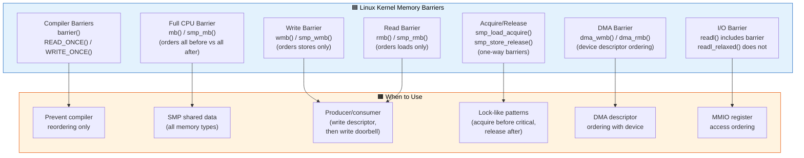
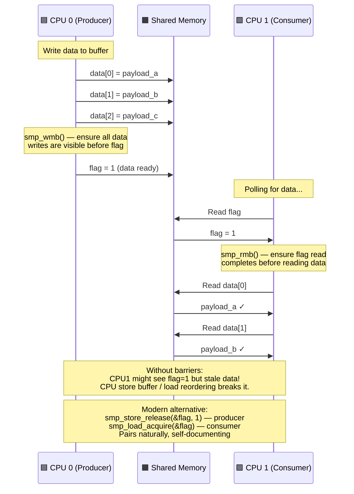

# Q9: Memory Barriers and Cache Coherency in Linux Kernel

## Interview Question
**"Explain memory barriers in the Linux kernel. Why are they needed? What types exist — compiler barriers, CPU barriers, DMA barriers? How do memory ordering issues manifest in device drivers? What is cache coherency and how does it relate to barriers?"**

---

## 1. Why Memory Barriers Exist

### The Reordering Problem

Modern CPUs and compilers reorder memory operations for performance. This is invisible to single-threaded code but breaks multi-core and device-driver assumptions.

```
CPU writes:                       What may actually happen:
  store A = 1                       store B = 2     ← reordered!
  store B = 2                       store A = 1

Compiler may also reorder:
  x = ptr->data;                    y = ptr->flag;  ← compiler reordered!
  y = ptr->flag;                    x = ptr->data;
```

### When This Matters for Drivers

```
CPU                              Device
─────                            ──────
1. Write data to buffer          
2. Write "start" to doorbell     
                                 Device reads doorbell → starts
                                 Device reads buffer → STALE DATA!
                                 (because write #2 arrived before #1)

Fix:
1. Write data to buffer          
   wmb()  ← memory barrier       
2. Write "start" to doorbell     
                                 Device guaranteed to see data before doorbell
```

---

## 2. Types of Memory Ordering

### CPU Memory Model Spectrum

```
Strict ordering ◄──────────────────────────────► Weak ordering
(Intel x86/x64)                                  (ARM, RISC-V, PowerPC)

x86/x64 (TSO - Total Store Order):
  ✓ Stores are ordered with respect to other stores
  ✓ Loads are ordered with respect to other loads
  ✗ A load CAN be reordered before an earlier store
  → Need barriers mainly for store-load ordering

ARM/ARM64 (Weakly ordered):
  ✗ Any operation can be reordered with any other
  → Need barriers much more frequently
  → Code that works on x86 may break on ARM!
```

### Reordering Types

```
1. Store-Store:  Two writes reordered
   [x86: NO]  [ARM: YES]

2. Load-Load:   Two reads reordered
   [x86: NO]  [ARM: YES]

3. Load-Store:  Read reordered after a write
   [x86: NO]  [ARM: YES]

4. Store-Load:  Write reordered after a read
   [x86: YES] [ARM: YES]  ← Even x86 does this!
```

---

## 3. Linux Kernel Barrier API

### Compiler Barriers

```c
#include <linux/compiler.h>

/* barrier() — prevents compiler from reordering across this point */
barrier();

/* Prevents compiler from:
   - Reordering memory accesses across the barrier
   - Caching values in registers across the barrier
   - Optimizing away "redundant" loads/stores */

/* Example: polling a hardware register */
while (1) {
    u32 status = readl(base + STATUS_REG);
    if (status & DONE_BIT)
        break;
    barrier();  /* Force re-read; don't let compiler optimize loop */
    cpu_relax();
}

/* READ_ONCE / WRITE_ONCE — single-access compiler barriers */
int val = READ_ONCE(shared_var);    /* Force single load, no tearing */
WRITE_ONCE(shared_var, new_val);    /* Force single store, no tearing */
```

### CPU Memory Barriers

```c
#include <asm/barrier.h>

/* Full memory barrier — orders ALL memory operations */
mb();       /* rmb + wmb: no loads or stores cross this point */

/* Read (load) memory barrier */
rmb();      /* No loads can be reordered across this point */

/* Write (store) memory barrier */
wmb();      /* No stores can be reordered across this point */

/* SMP variants (no-op on uniprocessor, barrier on SMP) */
smp_mb();
smp_rmb();
smp_wmb();

/* These are for inter-CPU ordering.
   Device drivers should use dma_*mb() or mb()/rmb()/wmb() instead. */
```

### Device I/O Barriers

```c
/* For ordering between device MMIO accesses */
/* readl/writel already include implicit barriers on most architectures */

/* But readl_relaxed/writel_relaxed do NOT: */
writel_relaxed(data, base + DATA_REG);
/* Need explicit barrier before doorbell: */
wmb();   /* Ensure data write is visible before doorbell */
writel_relaxed(1, base + DOORBELL_REG);

/* Or use non-relaxed accessors (include barriers automatically): */
writel(data, base + DATA_REG);      /* Has implicit wmb */
writel(1, base + DOORBELL_REG);     /* Has implicit wmb */
```

### DMA Barriers

```c
/* For ordering between DMA buffer writes and device kicks */
dma_wmb();   /* Ensures DMA descriptor writes are ordered */
dma_rmb();   /* Ensures DMA descriptor reads are ordered */

/* These are specifically for ordering writes/reads to coherent DMA memory
   (descriptors) as seen by both CPU and device */

/* Example: Writing a DMA descriptor ring */
desc->buf_addr = dma_addr;
desc->buf_len = len;
desc->flags = flags;
dma_wmb();                        /* All descriptor fields visible before... */
desc->ownership = DEVICE_OWNED;   /* ...handing ownership to device */
```

---

## 4. Barrier Semantics Illustrated

### Store-Store Barrier (wmb)

```
Without wmb():
  CPU writes:    Store A → Store B
  Memory sees:   Store B → Store A  (possible reorder!)

With wmb():
  CPU writes:    Store A → wmb() → Store B
  Memory sees:   Store A → Store B  (guaranteed order)
```

### Load-Load Barrier (rmb)

```
Without rmb():
  CPU reads:     Load A → Load B
  CPU may see:   Load B → Load A  (speculative execution)

With rmb():
  CPU reads:     Load A → rmb() → Load B
  CPU sees:      Load A → Load B  (guaranteed order)
```

### Full Barrier (mb)

```
With mb():
  All loads and stores before mb() complete before
  any loads and stores after mb() begin.
  Most expensive — use only when needed.
```

---

## 5. Practical Driver Examples

### Example 1: Ring Buffer (Producer-Consumer)

```c
/* CPU (producer) writes data, device (consumer) reads */

struct ring_desc {
    __le32 buf_addr_lo;
    __le32 buf_addr_hi;
    __le32 length;
    __le32 flags;        /* Bit 0: ownership (0=CPU, 1=Device) */
};

void submit_to_device(struct ring_desc *desc, dma_addr_t buf, u32 len)
{
    /* Write all descriptor fields BEFORE setting ownership */
    desc->buf_addr_lo = cpu_to_le32(lower_32_bits(buf));
    desc->buf_addr_hi = cpu_to_le32(upper_32_bits(buf));
    desc->length = cpu_to_le32(len);

    /* CRITICAL: Ensure all above writes are visible to device
       before ownership transfer */
    dma_wmb();

    desc->flags = cpu_to_le32(DESC_OWN_DEVICE);

    /* Now kick the device */
    writel(1, base + DOORBELL);
}

void process_from_device(struct ring_desc *desc)
{
    /* Read ownership flag */
    if (!(le32_to_cpu(desc->flags) & DESC_OWN_CPU))
        return;  /* Still owned by device */

    /* CRITICAL: Ensure we read fresh descriptor data
       AFTER seeing ownership change */
    dma_rmb();

    u32 len = le32_to_cpu(desc->length);
    dma_addr_t buf = le32_to_cpu(desc->buf_addr_lo) |
                     ((u64)le32_to_cpu(desc->buf_addr_hi) << 32);

    /* Process the data */
}
```

### Example 2: Status Register Polling

```c
/* BAD: Compiler may optimize away repeated reads */
while (!(readl(base + STATUS) & DONE))
    ;   /* Infinite loop — readl includes barrier, actually OK for MMIO */

/* But for shared memory (not MMIO): */
while (!(READ_ONCE(shared_mem->status) & DONE))
    cpu_relax();
/* READ_ONCE prevents compiler from caching the value */
/* cpu_relax() hints to CPU (pause instruction on x86) */
```

### Example 3: Lock-Free Communication

```c
/* Thread 1 (writer): */
WRITE_ONCE(data_buffer[idx], value);
smp_wmb();                              /* Data visible before flag */
WRITE_ONCE(data_ready, true);

/* Thread 2 (reader): */
while (!READ_ONCE(data_ready))
    cpu_relax();
smp_rmb();                              /* Flag read before data */
value = READ_ONCE(data_buffer[idx]);    /* Guaranteed to see writer's data */
```

---

## 6. Cache Coherency

### What is Cache Coherency?

```
CPU 0 Cache         CPU 1 Cache          Memory
┌─────────┐        ┌─────────┐        ┌─────────┐
│ X = 42  │        │ X = 42  │        │ X = 42  │
└─────────┘        └─────────┘        └─────────┘

CPU 0 writes X = 100:
┌─────────┐        ┌─────────┐        ┌─────────┐
│ X = 100 │        │ X = 42  │ ← STALE! │ X = 42 │ ← STALE!
└─────────┘        └─────────┘        └─────────┘

Cache coherency protocol (MESI/MOESI) ensures:
 - CPU 1's cache line is invalidated
 - CPU 1 re-reads from memory or CPU 0's cache
```

### MESI Protocol States

```
M (Modified):  Cache has only copy, modified. Memory is STALE.
E (Exclusive): Cache has only copy, clean. Memory matches.
S (Shared):    Multiple caches have copies, all clean.
I (Invalid):   Cache line is invalid, must fetch from memory/other cache.

CPU 0 writes X:
  CPU 0's line: M (Modified)
  CPU 1's line: I (Invalidated via bus snoop)
  
CPU 1 reads X:
  CPU 0 writes back (or forwards)
  CPU 0's line: S
  CPU 1's line: S
```

### Cache Coherency vs Memory Ordering

```
Cache coherency ≠ Memory ordering!

Coherency: Eventually, all CPUs see the same value for a given address.
Ordering:  The ORDER in which writes to DIFFERENT addresses become visible.

Modern CPUs have coherent caches but weak memory ordering!
Store buffers allow writes to be locally visible before globally visible.

CPU 0:                              CPU 1:
  Store A = 1      ← in store buffer    
  Store B = 2      ← in store buffer    Load B = 2  (sees new B)
                                         Load A = 0  (doesn't see new A yet!)
                                         
This is why you need memory barriers!
```

---

## 7. Cache and DMA

### The DMA Cache Problem

```
Without hardware cache coherency (e.g., some ARM platforms):

CPU writes data to buffer:
  CPU Cache: [new data]
  RAM:       [old data]       ← Device sees OLD data via DMA!

Device writes data via DMA:
  RAM:       [new data from device]
  CPU Cache: [old cached data]  ← CPU reads OLD data from cache!
```

### Solutions

```
1. Coherent DMA (dma_alloc_coherent):
   → Memory is mapped uncached or with hardware coherence
   → No manual cache management needed
   → Slower CPU access (uncached)

2. Streaming DMA (dma_map_single):
   → Memory stays cached
   → Cache ops happen automatically in map/unmap:
     DMA_TO_DEVICE:   dma_map → cache clean (flush to RAM)
     DMA_FROM_DEVICE: dma_unmap → cache invalidate (discard stale)
   → Faster CPU access

3. Manual sync (between map and unmap):
   dma_sync_single_for_cpu()    → invalidate cache
   dma_sync_single_for_device() → clean cache
```

---

## 8. readl/writel vs readl_relaxed/writel_relaxed

```c
/* readl/writel — ordered, safe, default choice */
static inline u32 readl(const volatile void __iomem *addr)
{
    u32 val = __raw_readl(addr);
    rmb();        /* Prevent subsequent reads from passing this read */
    return val;
}

static inline void writel(u32 val, volatile void __iomem *addr)
{
    wmb();        /* Prevent preceding writes from being reordered after */
    __raw_writel(val, addr);
}

/* readl_relaxed/writel_relaxed — NO barriers */
/* Use when you handle ordering yourself */
/* Faster in hot paths with many register accesses */

/* Example: reading multiple status registers */
u32 a = readl_relaxed(base + REG_A);
u32 b = readl_relaxed(base + REG_B);
u32 c = readl_relaxed(base + REG_C);
rmb();  /* One barrier instead of three */
/* Now use a, b, c */
```

---

## 9. Atomic Operations and Barriers

```c
#include <linux/atomic.h>

/* atomic_read/atomic_set — NO memory barriers */
int val = atomic_read(&counter);
atomic_set(&counter, 0);

/* atomic_add_return — includes FULL memory barrier */
int new = atomic_add_return(1, &counter);

/* Explicit ordered atomics: */
atomic_set_release(&flag, 1);      /* Store with release semantics */
int f = atomic_read_acquire(&flag); /* Load with acquire semantics */

/* smp_store_release / smp_load_acquire — for non-atomic variables */
smp_store_release(&shared_var, new_value);  /* write + release barrier */
val = smp_load_acquire(&shared_var);         /* read + acquire barrier */

/* Release: all prior writes visible before this store */
/* Acquire: all subsequent reads happen after this load */
/* Together they form the recommended pattern: */

/* Producer: */
WRITE_ONCE(data, new_data);
smp_store_release(&flag, 1);           /* data write before flag write */

/* Consumer: */
while (!smp_load_acquire(&flag))       /* flag read before data read */
    cpu_relax();
use(READ_ONCE(data));                  /* guaranteed to see new_data */
```

---

## 10. Common Mistakes

### Mistake 1: Missing barrier between DMA buffer and doorbell

```c
/* BAD */
memcpy(dma_buf, data, len);
writel(1, base + DOORBELL);     /* Device may not see memcpy data! */

/* GOOD */
memcpy(dma_buf, data, len);
wmb();                          /* Ensure data is in memory */
writel(1, base + DOORBELL);     /* Now kick device */
```

### Mistake 2: Assuming x86 ordering on ARM

```c
/* Works on x86 (strong ordering), BREAKS on ARM (weak ordering) */
producer: a = 1; b = 1;
consumer: if (b) use(a);   /* 'a' might be 0 on ARM! */

/* Correct on all architectures */
producer: WRITE_ONCE(a, 1); smp_wmb(); WRITE_ONCE(b, 1);
consumer: if (smp_load_acquire(&b)) use(READ_ONCE(a));
```

### Mistake 3: Using volatile instead of barriers

```c
/* BAD — volatile prevents compiler reorder but NOT CPU reorder */
volatile int *ptr = ...;
*ptr = data;
*ptr = doorbell;  /* CPU may still reorder! */

/* GOOD — use proper kernel primitives */
WRITE_ONCE(*data_ptr, data);
smp_wmb();
WRITE_ONCE(*doorbell_ptr, 1);
```

---

## 11. Common Interview Follow-ups

**Q: Difference between smp_mb(), mb(), and barrier()?**
`barrier()`: compiler only. `mb()`: compiler + CPU (all contexts). `smp_mb()`: compiler + CPU on SMP; degrades to `barrier()` on UP (uniprocessor). For device drivers, use `mb()`/`wmb()`/`rmb()` (not smp_ variants) because device interactions aren't SMP-only.

**Q: When should I use acquire/release vs rmb/wmb?**
Acquire/release are paired and more efficient on modern architectures (single instruction on ARM64). Use them for flag-based synchronization. Use rmb/wmb for bulk ordering or legacy code patterns.

**Q: Does spinlock include memory barriers?**
Yes! `spin_lock()` includes an acquire barrier. `spin_unlock()` includes a release barrier. Memory accesses inside the critical section cannot leak out. You rarely need explicit barriers within lock-protected code.

**Q: What about atomic_t — do atomics provide barriers?**
`atomic_read()`/`atomic_set()` have NO barriers. `atomic_add_return()`, `atomic_cmpxchg()`, `test_and_set_bit()` include FULL barriers. Use `atomic_read_acquire()`/`atomic_set_release()` for ordered atomics.

---

## 12. Key Source Files

| File | Purpose |
|------|---------|
| `include/asm-generic/barrier.h` | Generic barrier definitions |
| `arch/arm64/include/asm/barrier.h` | ARM64 barriers (dmb, dsb, isb) |
| `arch/x86/include/asm/barrier.h` | x86 barriers (mfence, lfence, sfence) |
| `include/linux/compiler.h` | barrier(), READ_ONCE, WRITE_ONCE |
| `include/linux/atomic.h` | Atomic operations with barrier semantics |
| `Documentation/memory-barriers.txt` | Definitive kernel memory barrier doc |
| `tools/memory-model/` | LKMM (Linux Kernel Memory Model) |

---

## Mermaid Diagrams

### Memory Barrier Types Flow



### Producer-Consumer Barrier Sequence


