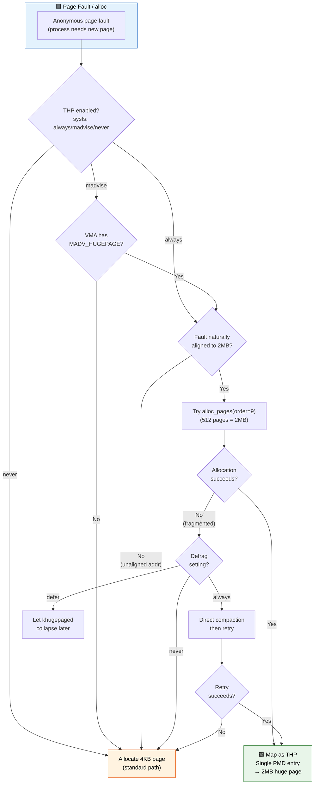
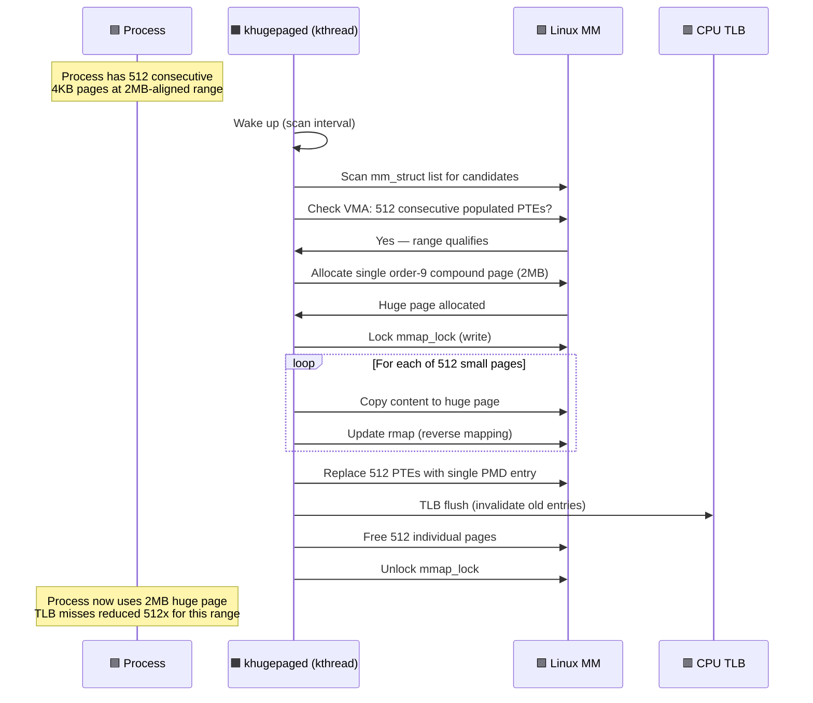

# Q11: Huge Pages and Transparent Huge Pages (THP) in Linux Kernel

## Interview Question
**"Explain huge pages in the Linux kernel — both explicit (hugetlbfs) and transparent huge pages (THP). How do they reduce TLB pressure? How does THP work internally? What is khugepaged? When would you use huge pages in a driver context?"**

---

## 1. The TLB Pressure Problem

```
Standard 4KB pages:
  1 GB of memory = 262,144 pages = 262,144 TLB entries needed!
  Typical TLB: 512-2048 entries
  → Massive TLB miss rate → performance degradation

Huge pages (2MB on x86_64):
  1 GB of memory = 512 pages = 512 TLB entries
  → TLB can cover ENTIRE working set!

Gigantic pages (1GB on x86_64):
  1 GB = 1 page = 1 TLB entry
```

### Performance Impact

```
Workload: Large database with 64GB working set

With 4KB pages:
  TLB entries needed: 16,777,216
  TLB capacity: ~1500
  TLB miss rate: Very high
  Each TLB miss: ~20-100 cycles (4-level page walk)
  Performance hit: 10-30%

With 2MB huge pages:
  TLB entries needed: 32,768
  TLB capacity: ~1500 (+ 32 for huge pages on most CPUs)
  TLB miss rate: Much lower
  Performance improvement: 5-20%
```

---

## 2. Page Table Differences

### 4KB Page

```
PGD → PUD → PMD → PTE → 4KB Page

4 levels of page table walk for every TLB miss
```

### 2MB Huge Page

```
PGD → PUD → PMD ──→ 2MB Page (PMD entry has PS bit set)

Only 3 levels! PMD entry directly maps a 2MB physical page.
No PTE level needed.
```

### 1GB Gigantic Page

```
PGD → PUD ──→ 1GB Page (PUD entry has PS bit set)

Only 2 levels! PUD entry directly maps a 1GB physical page.
No PMD or PTE levels needed.
```

---

## 3. Explicit Huge Pages (hugetlbfs)

### Configuration

```bash
# Reserve huge pages at boot (reliable)
# Kernel boot parameter:
hugepages=512              # Reserve 512 × 2MB = 1GB
hugepagesz=2M hugepages=512
hugepagesz=1G hugepages=4  # Reserve 4 × 1GB pages

# Runtime reservation (may fail due to fragmentation)
echo 512 > /proc/sys/vm/nr_hugepages

# Per-node
echo 256 > /sys/devices/system/node/node0/hugepages/hugepages-2048kB/nr_hugepages

# Check status
cat /proc/meminfo | grep Huge
HugePages_Total:    512
HugePages_Free:     480
HugePages_Rsvd:       0
HugePages_Surp:       0
Hugepagesize:      2048 kB
```

### Using hugetlbfs from User Space

```c
/* Method 1: hugetlbfs mount */
// mount -t hugetlbfs nodev /mnt/huge

int fd = open("/mnt/huge/my_region", O_CREAT | O_RDWR, 0600);
void *addr = mmap(NULL, size, PROT_READ | PROT_WRITE,
                   MAP_SHARED, fd, 0);

/* Method 2: Anonymous huge pages */
void *addr = mmap(NULL, size, PROT_READ | PROT_WRITE,
                   MAP_PRIVATE | MAP_ANONYMOUS | MAP_HUGETLB, -1, 0);

/* Method 3: shmget */
int shmid = shmget(key, size, SHM_HUGETLB | IPC_CREAT | 0600);
void *addr = shmat(shmid, NULL, 0);
```

### Kernel Internal: Huge Page Allocation

```
hugetlb_alloc_hugepage()
  → alloc_contig_pages() or use pre-reserved pool
  → Each huge page = compound page of 512 base pages
  → struct page for head page has:
     - compound_head set
     - compound_order = 9 (2^9 = 512 pages = 2MB)
     - compound_dtor = HUGETLB_PAGE_DTOR
```

---

## 4. Transparent Huge Pages (THP)

### What is THP?

THP automatically promotes groups of 4KB pages to 2MB huge pages **without application changes**. The kernel detects opportunities and handles promotion/demotion transparently.

### THP Configuration

```bash
# Enable/disable THP
echo always > /sys/kernel/mm/transparent_hugepage/enabled    # Always try
echo madvise > /sys/kernel/mm/transparent_hugepage/enabled   # Only with madvise
echo never > /sys/kernel/mm/transparent_hugepage/enabled     # Disabled

# Defrag (how aggressively to compact for THP)
echo always > /sys/kernel/mm/transparent_hugepage/defrag     # Stall for compaction
echo defer > /sys/kernel/mm/transparent_hugepage/defrag      # Compact asynchronously
echo madvise > /sys/kernel/mm/transparent_hugepage/defrag    # Only for madvise regions
echo never > /sys/kernel/mm/transparent_hugepage/defrag      # Never compact for THP

# khugepaged settings
/sys/kernel/mm/transparent_hugepage/khugepaged/
  scan_sleep_millisecs = 10000  # How often khugepaged scans (10s)
  pages_to_scan = 4096          # Pages to scan per cycle
  max_ptes_none = 511           # Max empty PTEs in a potential huge page
```

### How THP Works

```
Scenario 1: Fault-time promotion (anonymous memory)

Process does: mmap(2MB, MAP_ANONYMOUS)
First access (page fault):
  → Kernel checks: can we allocate a 2MB compound page?
  → YES: Map as 2MB huge page in PMD entry directly
  → NO:  Map as regular 4KB page, try promotion later

Scenario 2: khugepaged (background promotion)

┌──────────────────────────────────────────────────────┐
│ Step 1: khugepaged scans process VMAs                 │
│                                                        │
│ PTE-mapped 4KB pages:                                  │
│ [p1][p2][p3]...[p510][p511][p512]                     │
│  ← 512 consecutive mapped 4KB pages found! →           │
│                                                        │
│ Step 2: Allocate a fresh 2MB compound page             │
│                                                        │
│ Step 3: Copy all 512 × 4KB pages into 2MB page        │
│                                                        │
│ Step 4: Replace 512 PTEs with one PMD entry            │
│         PMD → 2MB compound page                        │
│                                                        │
│ Step 5: Free the original 512 base pages               │
│                                                        │
│ Step 6: Flush TLB                                      │
└──────────────────────────────────────────────────────┘
```

### THP Page Fault Path

```c
static vm_fault_t do_huge_pmd_anonymous_page(struct vm_fault *vmf)
{
    struct vm_area_struct *vma = vmf->vma;
    struct page *page;

    /* Try to allocate a transparent huge page */
    page = alloc_pages(GFP_TRANSHUGE, HPAGE_PMD_ORDER);  /* order 9 */
    if (!page) {
        /* Fallback to regular 4KB page */
        return do_anonymous_page(vmf);
    }

    /* Zero the huge page */
    clear_huge_page(page, vmf->address, HPAGE_PMD_NR);

    /* Create PMD entry pointing to huge page */
    entry = mk_huge_pmd(page, vma->vm_page_prot);
    set_pmd_at(vma->vm_mm, vmf->address & HPAGE_PMD_MASK,
               vmf->pmd, entry);

    return 0;
}
```

---

## 5. Compound Pages — The Building Block

```c
/* A compound page is a group of contiguous pages treated as one unit */

struct page *page = alloc_pages(GFP_KERNEL, order);
/* Returns a compound page for order > 0 */

/* Head page (first page): */
page[0].compound_head = 0;           /* It IS the head */
page[0].compound_order = order;
page[0].compound_dtor = destructor;
page[0].compound_mapcount = 0;

/* Tail pages: */
page[1].compound_head = (unsigned long)&page[0] | 1;  /* Points to head */
page[2].compound_head = (unsigned long)&page[0] | 1;
/* ... etc ... */

/* APIs: */
struct page *head = compound_head(any_page_in_compound);
int order = compound_order(head);
unsigned int nr = compound_nr(head);   /* Total pages: 1 << order */
bool is_head = PageHead(page);
bool is_tail = PageTail(page);
```

---

## 6. THP Splitting

When a huge page needs to be split back into 4KB pages:

```
Reasons for splitting:
  - mprotect on partial range within huge page
  - munmap on partial range
  - Swap — swapping individual 4KB pages
  - NUMA migration of subset
  - Writing to shared huge page (COW)
  - mlock on partial range

Split process (split_huge_page):
  1. Lock the page
  2. Un-map the PMD entry
  3. Create 512 PTE entries pointing to individual base pages
  4. Update page flags (clear compound, set individual refcounts)
  5. Flush TLB
  6. Update RSS counters
```

```c
/* Force split via debugfs */
echo 1 > /sys/kernel/debug/split_huge_pages

/* madvise MADV_NOHUGEPAGE prevents THP for a range */
madvise(addr, len, MADV_NOHUGEPAGE);

/* madvise MADV_HUGEPAGE hints for THP */
madvise(addr, len, MADV_HUGEPAGE);
```

---

## 7. Multi-Size THP (mTHP, Linux 6.8+)

```
Traditional THP: Only 2MB (order 9, 512 pages)
mTHP: Supports multiple sizes:
  - 64KB  (order 4,  16 pages)
  - 128KB (order 5,  32 pages)
  - 256KB (order 6,  64 pages)
  - 512KB (order 7,  128 pages)
  - 1MB   (order 8,  256 pages)
  - 2MB   (order 9,  512 pages)

Benefits:
  - Easier to allocate smaller huge pages
  - Less wasteful for applications with < 2MB working set
  - ARM64 benefits greatly (contiguous PTE hint)

Configuration:
/sys/kernel/mm/transparent_hugepage/hugepages-<size>kB/enabled
  echo always > /sys/kernel/mm/transparent_hugepage/hugepages-64kB/enabled
```

---

## 8. Huge Pages in Device Drivers

### Mapping Huge Pages to User Space

```c
/* When implementing mmap in a driver and the VMA has VM_HUGETLB */
static int my_huge_mmap(struct file *f, struct vm_area_struct *vma)
{
    unsigned long size = vma->vm_end - vma->vm_start;
    unsigned long pfn = dev->phys_base >> PAGE_SHIFT;

    /* remap_pfn_range works with huge pages if:
       - Size and alignment are 2MB-aligned
       - pfn is 2MB-aligned
       - Architecture supports PMD-level mappings */
    return remap_pfn_range(vma, vma->vm_start, pfn, size,
                           vma->vm_page_prot);
}
```

### Using Huge Pages for DMA

```c
/* CMA-allocated coherent DMA buffers can be huge-page aligned */
void *buf = dma_alloc_coherent(dev, SZ_2M, &dma_handle, GFP_KERNEL);
/* Kernel may back this with a compound page on IOMMU systems */

/* For GPU/RDMA drivers that pin user pages: */
struct page **pages;
long nr = pin_user_pages(user_addr, nr_pages, FOLL_WRITE, pages);
/* If user provided huge-page backed memory, pages will be
   compound tail pages — use compound_head() to get the actual page */
```

---

## 9. Monitoring Huge Pages

```bash
# THP statistics
cat /proc/vmstat | grep thp
thp_fault_alloc 12345        # Successful THP allocations on fault
thp_fault_fallback 678       # Fallback to 4KB on fault (THP alloc failed)
thp_collapse_alloc 234       # khugepaged successful collapses
thp_collapse_alloc_failed 56 # khugepaged failed collapses
thp_split_page 89            # Number of THP splits
thp_zero_page_alloc 12       # Zero-page THP allocations

# Per-process
grep -i huge /proc/<pid>/smaps
AnonHugePages:      2048 kB  # THP usage per VMA

# Summary
grep -i huge /proc/<pid>/smaps_rollup
AnonHugePages:    524288 kB  # Total THP for process

# Detailed huge page info
cat /proc/<pid>/smaps | grep -E "^(Size|AnonHuge|ShmemHuge)"
```

---

## 10. Common Interview Follow-ups

**Q: hugetlbfs vs THP — when to use which?**
hugetlbfs: Guaranteed allocation (reserved at boot), no splitting, no overhead. Best for databases (PostgreSQL, MySQL), DPDK, large shared memory. THP: Automatic, no code changes needed, but may have compaction overhead, splitting, and unpredictable behavior. Better for general workloads.

**Q: Why might THP hurt performance?**
1. Compaction stalls — waiting for 2MB contiguous memory
2. Memory waste — 2MB page for a 4KB access
3. Splitting locks — contention under mixed access patterns
4. Swap amplification — swapping 2MB instead of 4KB
5. COW amplification — copying 2MB on fork

**Q: What is the difference between HugePages and THP in /proc/meminfo?**
`HugePages_*`: explicit (hugetlbfs) — reserved, won't change. `AnonHugePages`: THP — dynamically allocated and can be split.

**Q: How does NUMA affect huge pages?**
Huge pages should be allocated on the local NUMA node. `numactl --membind=0` or `set_mempolicy(MPOL_BIND, ...)`. Remote NUMA huge pages have higher access latency, negating TLB benefits.

---

## 11. Key Source Files

| File | Purpose |
|------|---------|
| `mm/huge_memory.c` | THP core implementation |
| `mm/khugepaged.c` | khugepaged daemon |
| `mm/hugetlb.c` | Explicit huge pages (hugetlbfs) |
| `fs/hugetlbfs/inode.c` | hugetlbfs filesystem |
| `include/linux/huge_mm.h` | THP API and macros |
| `arch/x86/mm/hugetlbpage.c` | x86 huge page support |
| `mm/page_alloc.c` | Compound page allocation |
| `Documentation/admin-guide/mm/hugetlbpage.rst` | Admin guide |
| `Documentation/admin-guide/mm/transhuge.rst` | THP admin guide |

---

## Mermaid Diagrams

### THP Allocation Decision Flow



### khugepaged Collapse Sequence


