# Qualcomm — System Design Interview: Linux Kernel Memory Management

## Target Role: Senior Linux Kernel / Qualcomm SoC Driver Engineer (9+ years)

These questions focus on **Qualcomm Snapdragon SoC** memory management — SMMU (ARM IOMMU), Adreno GPU memory, DSP shared memory (FastRPC), shared memory heaps (ION→DMA-BUF), Qualcomm SCM (Secure Channel Manager), and multimedia pipeline DMA.

---

## Q1: Qualcomm SMMU (System MMU) — ARM IOMMU for SoC Peripherals

### Interview Question
**"Explain the ARM SMMU architecture as used in Qualcomm SoCs. How does the SMMU protect DMA from misbehaving peripherals? How do stream IDs, context banks, and page tables work? What is SID→CBNDX mapping?"**

### Deep Answer

On Qualcomm Snapdragon SoCs, every DMA-capable peripheral (GPU, display, camera, video codec, DSP) must go through the SMMU for address translation and isolation.

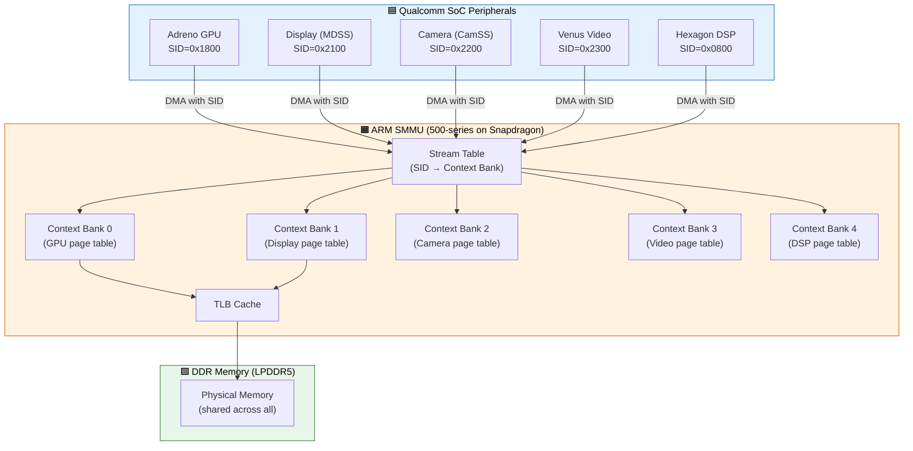
```mermaid
flowchart TB
    subgraph Peripherals["🟦 Qualcomm SoC Peripherals"]
        GPU["Adreno GPU\nSID=0x1800"]
        DISP["Display (MDSS)\nSID=0x2100"]
        CAM["Camera (CamSS)\nSID=0x2200"]
        VIDEO["Venus Video\nSID=0x2300"]
        DSP["Hexagon DSP\nSID=0x0800"]
    end

    subgraph SMMU["🟧 ARM SMMU (500-series on Snapdragon)"]
        direction TB
        STR["Stream Table\n(SID → Context Bank)"]
        CB0["Context Bank 0\n(GPU page table)"]
        CB1["Context Bank 1\n(Display page table)"]
        CB2["Context Bank 2\n(Camera page table)"]
        CB3["Context Bank 3\n(Video page table)"]
        CB4["Context Bank 4\n(DSP page table)"]
        TLB["TLB Cache"]
    end

    subgraph DDR["🟩 DDR Memory (LPDDR5)"]
        MEM["Physical Memory\n(shared across all)"]
    end

    GPU -->|"DMA with SID"| STR
    DISP -->|"DMA with SID"| STR
    CAM -->|"DMA with SID"| STR
    VIDEO -->|"DMA with SID"| STR
    DSP -->|"DMA with SID"| STR

    STR --> CB0
    STR --> CB1
    STR --> CB2
    STR --> CB3
    STR --> CB4

    CB0 --> TLB
    CB1 --> TLB
    TLB --> MEM

    style Peripherals fill:#e3f2fd,stroke:#1565c0,color:#000
    style SMMU fill:#fff3e0,stroke:#e65100,color:#000
    style DDR fill:#e8f5e9,stroke:#2e7d32,color:#000
```

### SMMU Page Table Walk Sequence

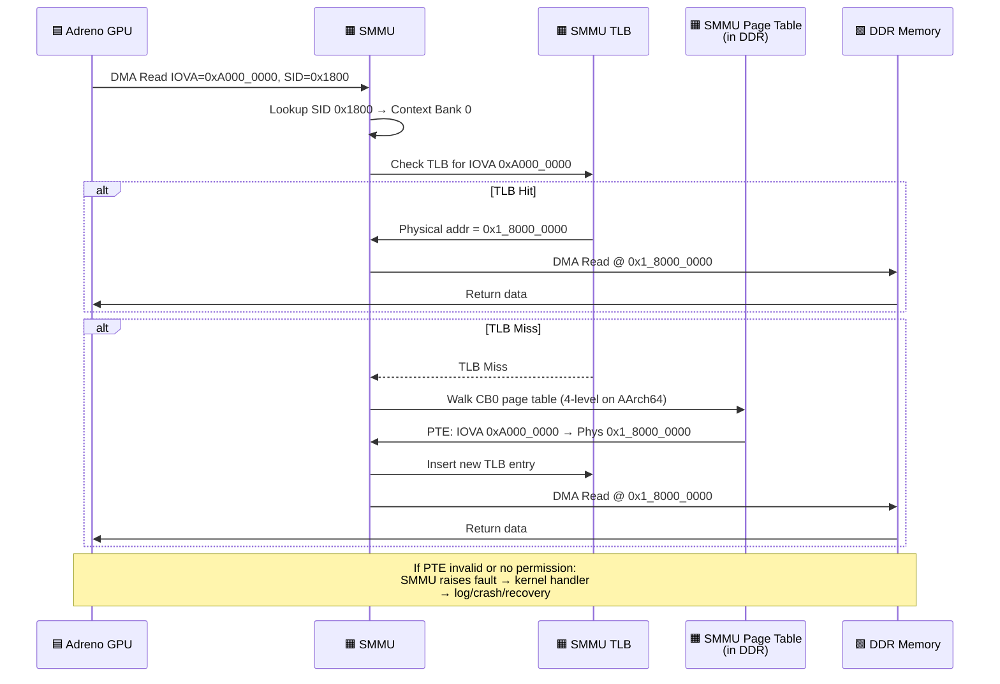
```mermaid
sequenceDiagram
    participant GPU as 🟦 Adreno GPU
    participant SMMU as 🟧 SMMU
    participant TLB as 🟧 SMMU TLB
    participant PT as 🟧 SMMU Page Table<br/>(in DDR)
    participant DDR as 🟩 DDR Memory

    GPU->>SMMU: DMA Read IOVA=0xA000_0000, SID=0x1800
    SMMU->>SMMU: Lookup SID 0x1800 → Context Bank 0
    SMMU->>TLB: Check TLB for IOVA 0xA000_0000

    alt TLB Hit
        TLB->>SMMU: Physical addr = 0x1_8000_0000
        SMMU->>DDR: DMA Read @ 0x1_8000_0000
        DDR->>GPU: Return data
    end

    alt TLB Miss
        TLB-->>SMMU: TLB Miss
        SMMU->>PT: Walk CB0 page table (4-level on AArch64)
        PT->>SMMU: PTE: IOVA 0xA000_0000 → Phys 0x1_8000_0000
        SMMU->>TLB: Insert new TLB entry
        SMMU->>DDR: DMA Read @ 0x1_8000_0000
        DDR->>GPU: Return data
    end

    Note over GPU,DDR: If PTE invalid or no permission:<br/>SMMU raises fault → kernel handler<br/>→ log/crash/recovery
```

### SMMU Fault Handling

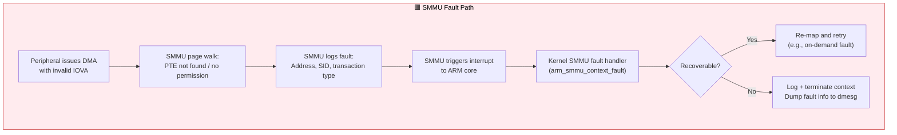
```mermaid
flowchart TB
    subgraph FaultPath["🟥 SMMU Fault Path"]
        F1["Peripheral issues DMA\nwith invalid IOVA"]
        F2["SMMU page walk:\nPTE not found / no permission"]
        F3["SMMU logs fault:\nAddress, SID, transaction type"]
        F4["SMMU triggers interrupt\nto ARM core"]
        F5["Kernel SMMU fault handler\n(arm_smmu_context_fault)"]
        F6{"Recoverable?"}
        F7["Re-map and retry\n(e.g., on-demand fault)"]
        F8["Log + terminate context\nDump fault info to dmesg"]

        F1 --> F2 --> F3 --> F4 --> F5 --> F6
        F6 -->|"Yes"| F7
        F6 -->|"No"| F8
    end

    style FaultPath fill:#ffebee,stroke:#c62828,color:#000
```

---

## Q2: ION → DMA-BUF Heap — Qualcomm Shared Memory Allocation

### Interview Question
**"Explain how Qualcomm SoCs handle shared memory buffers between CPU, GPU, display, and camera. What was ION and why did it migrate to DMA-BUF heaps? How does a camera frame flow from ISP to display through shared buffers?"**

### Deep Answer

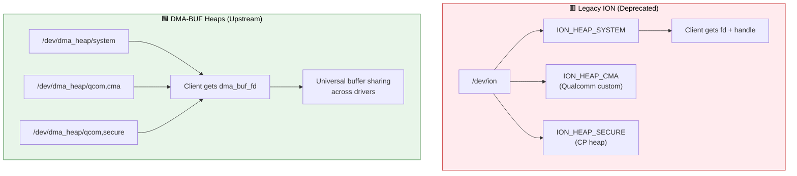
```mermaid
flowchart TB
    subgraph Legacy["🟥 Legacy ION (Deprecated)"]
        I1["/dev/ion"]
        I2["ION_HEAP_SYSTEM"]
        I3["ION_HEAP_CMA\n(Qualcomm custom)"]
        I4["ION_HEAP_SECURE\n(CP heap)"]
        I5["Client gets fd + handle"]
        I1 --> I2
        I1 --> I3
        I1 --> I4
        I2 --> I5
    end

    subgraph Modern["🟩 DMA-BUF Heaps (Upstream)"]
        D1["/dev/dma_heap/system"]
        D2["/dev/dma_heap/qcom,cma"]
        D3["/dev/dma_heap/qcom,secure"]
        D4["Client gets dma_buf_fd"]
        D5["Universal buffer sharing\nacross drivers"]
        D1 --> D4
        D2 --> D4
        D3 --> D4
        D4 --> D5
    end

    style Legacy fill:#ffebee,stroke:#c62828,color:#000
    style Modern fill:#e8f5e9,stroke:#2e7d32,color:#000
```

### Camera-to-Display Buffer Sharing Flow

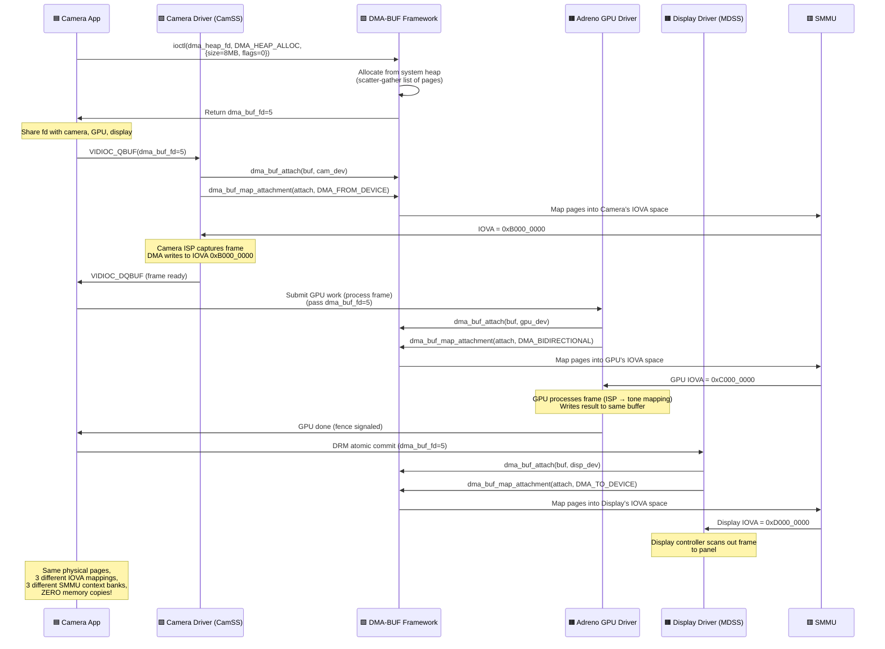
```mermaid
sequenceDiagram
    participant APP as 🟦 Camera App
    participant CAM_DRV as 🟩 Camera Driver (CamSS)
    participant DMA_BUF as 🟩 DMA-BUF Framework
    participant GPU_DRV as 🟧 Adreno GPU Driver
    participant DISP_DRV as 🟧 Display Driver (MDSS)
    participant SMMU as 🟥 SMMU

    APP->>DMA_BUF: ioctl(dma_heap_fd, DMA_HEAP_ALLOC,<br/>{size=8MB, flags=0})
    DMA_BUF->>DMA_BUF: Allocate from system heap<br/>(scatter-gather list of pages)
    DMA_BUF->>APP: Return dma_buf_fd=5

    Note over APP: Share fd with camera, GPU, display

    APP->>CAM_DRV: VIDIOC_QBUF(dma_buf_fd=5)
    CAM_DRV->>DMA_BUF: dma_buf_attach(buf, cam_dev)
    CAM_DRV->>DMA_BUF: dma_buf_map_attachment(attach, DMA_FROM_DEVICE)
    DMA_BUF->>SMMU: Map pages into Camera's IOVA space
    SMMU->>CAM_DRV: IOVA = 0xB000_0000

    Note over CAM_DRV: Camera ISP captures frame<br/>DMA writes to IOVA 0xB000_0000

    CAM_DRV->>APP: VIDIOC_DQBUF (frame ready)

    APP->>GPU_DRV: Submit GPU work (process frame)<br/>(pass dma_buf_fd=5)
    GPU_DRV->>DMA_BUF: dma_buf_attach(buf, gpu_dev)
    GPU_DRV->>DMA_BUF: dma_buf_map_attachment(attach, DMA_BIDIRECTIONAL)
    DMA_BUF->>SMMU: Map pages into GPU's IOVA space
    SMMU->>GPU_DRV: GPU IOVA = 0xC000_0000

    Note over GPU_DRV: GPU processes frame (ISP → tone mapping)<br/>Writes result to same buffer

    GPU_DRV->>APP: GPU done (fence signaled)

    APP->>DISP_DRV: DRM atomic commit (dma_buf_fd=5)
    DISP_DRV->>DMA_BUF: dma_buf_attach(buf, disp_dev)
    DISP_DRV->>DMA_BUF: dma_buf_map_attachment(attach, DMA_TO_DEVICE)
    DMA_BUF->>SMMU: Map pages into Display's IOVA space
    SMMU->>DISP_DRV: Display IOVA = 0xD000_0000

    Note over DISP_DRV: Display controller scans out frame<br/>to panel

    Note over APP: Same physical pages,<br/>3 different IOVA mappings,<br/>3 different SMMU context banks,<br/>ZERO memory copies!
```

---

## Q3: Adreno GPU Memory Management on Qualcomm SoCs

### Interview Question
**"How does the Adreno GPU driver (KGSL or msm_drm) manage GPU memory? Explain GPU buffer objects, GPU page tables, GMEM (on-chip tile memory), and the GPU's Memory Management Unit."**

### Deep Answer

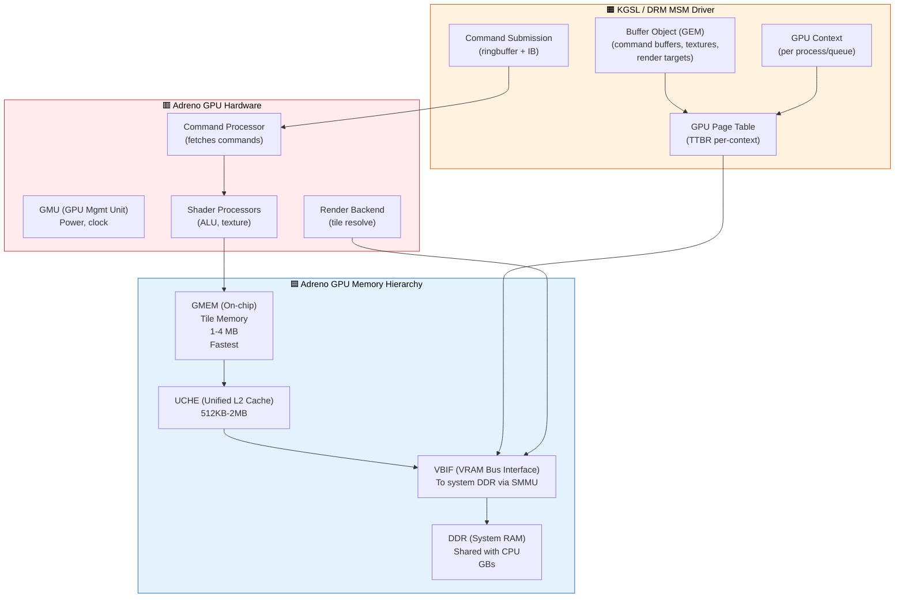
```mermaid
flowchart TB
    subgraph GPU_Memory["🟦 Adreno GPU Memory Hierarchy"]
        GMEM["GMEM (On-chip)\nTile Memory\n1-4 MB\nFastest"]
        UCHE["UCHE (Unified L2 Cache)\n512KB-2MB"]
        VBIF["VBIF (VRAM Bus Interface)\nTo system DDR via SMMU"]
        DDR["DDR (System RAM)\nShared with CPU\nGBs"]

        GMEM --> UCHE --> VBIF --> DDR
    end

    subgraph KGSL["🟧 KGSL / DRM MSM Driver"]
        BO["Buffer Object (GEM)\n(command buffers, textures,\nrender targets)"]
        PT["GPU Page Table\n(TTBR per-context)"]
        CTX["GPU Context\n(per process/queue)"]
        SUBMIT["Command Submission\n(ringbuffer + IB)"]
    end

    subgraph HW["🟥 Adreno GPU Hardware"]
        GMU["GMU (GPU Mgmt Unit)\nPower, clock"]
        CP["Command Processor\n(fetches commands)"]
        SP["Shader Processors\n(ALU, texture)"]
        RB["Render Backend\n(tile resolve)"]
    end

    BO --> PT
    PT --> VBIF
    CTX --> PT
    SUBMIT --> CP
    CP --> SP
    SP --> GMEM
    RB --> VBIF

    style GPU_Memory fill:#e3f2fd,stroke:#1565c0,color:#000
    style KGSL fill:#fff3e0,stroke:#e65100,color:#000
    style HW fill:#ffebee,stroke:#c62828,color:#000
```

### GPU Command Submission Sequence

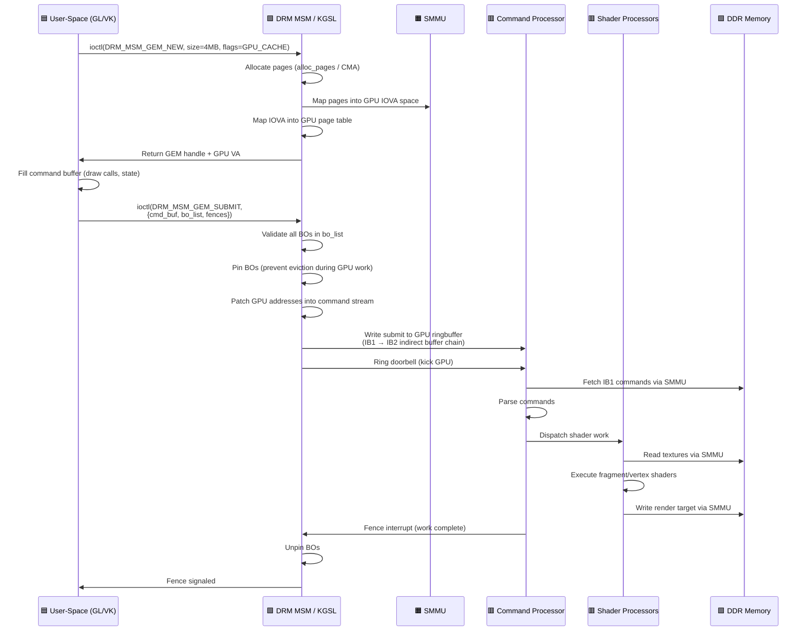
```mermaid
sequenceDiagram
    participant APP as 🟦 User-Space (GL/VK)
    participant DRV as 🟩 DRM MSM / KGSL
    participant SMMU as 🟧 SMMU
    participant CP as 🟥 Command Processor
    participant SP as 🟥 Shader Processors
    participant DDR as 🟩 DDR Memory

    APP->>DRV: ioctl(DRM_MSM_GEM_NEW, size=4MB, flags=GPU_CACHE)
    DRV->>DRV: Allocate pages (alloc_pages / CMA)
    DRV->>SMMU: Map pages into GPU IOVA space
    DRV->>DRV: Map IOVA into GPU page table
    DRV->>APP: Return GEM handle + GPU VA

    APP->>APP: Fill command buffer (draw calls, state)

    APP->>DRV: ioctl(DRM_MSM_GEM_SUBMIT,<br/>{cmd_buf, bo_list, fences})

    DRV->>DRV: Validate all BOs in bo_list
    DRV->>DRV: Pin BOs (prevent eviction during GPU work)
    DRV->>DRV: Patch GPU addresses into command stream

    DRV->>CP: Write submit to GPU ringbuffer<br/>(IB1 → IB2 indirect buffer chain)
    DRV->>CP: Ring doorbell (kick GPU)

    CP->>DDR: Fetch IB1 commands via SMMU
    CP->>CP: Parse commands
    CP->>SP: Dispatch shader work
    SP->>DDR: Read textures via SMMU
    SP->>SP: Execute fragment/vertex shaders
    SP->>DDR: Write render target via SMMU

    CP->>DRV: Fence interrupt (work complete)
    DRV->>DRV: Unpin BOs
    DRV->>APP: Fence signaled
```

---

## Q4: Qualcomm Secure Memory — TrustZone and Content Protection

### Interview Question
**"How does Qualcomm handle secure (protected) memory for DRM video playback, camera secure preview, and TrustZone? How does the kernel driver allocate and manage memory that the CPU cannot read?"**

### Deep Answer

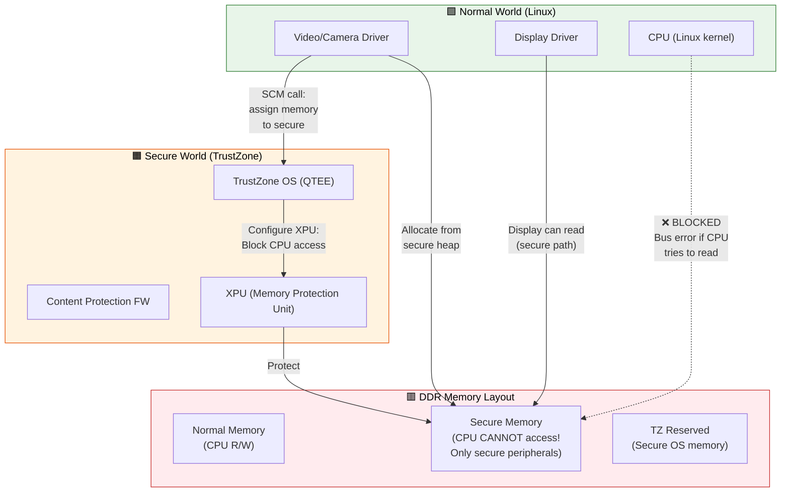
```mermaid
flowchart TB
    subgraph Normal_World["🟩 Normal World (Linux)"]
        NW_CPU["CPU (Linux kernel)"]
        NW_DRV["Video/Camera Driver"]
        NW_DISP["Display Driver"]
    end

    subgraph Secure_World["🟧 Secure World (TrustZone)"]
        TZ["TrustZone OS (QTEE)"]
        CP_FW["Content Protection FW"]
        XPU["XPU (Memory Protection Unit)"]
    end

    subgraph Memory_Layout["🟥 DDR Memory Layout"]
        NORMAL["Normal Memory\n(CPU R/W)"]
        SECURE["Secure Memory\n(CPU CANNOT access!\nOnly secure peripherals)"]
        TZ_MEM["TZ Reserved\n(Secure OS memory)"]
    end

    NW_DRV -->|"SCM call:\nassign memory\nto secure"| TZ
    TZ -->|"Configure XPU:\nBlock CPU access"| XPU
    XPU -->|"Protect"| SECURE

    NW_DRV -->|"Allocate from\nsecure heap"| SECURE
    NW_DISP -->|"Display can read\n(secure path)"| SECURE
    NW_CPU -.->|"❌ BLOCKED\nBus error if CPU\ntries to read"| SECURE

    style Normal_World fill:#e8f5e9,stroke:#2e7d32,color:#000
    style Secure_World fill:#fff3e0,stroke:#e65100,color:#000
    style Memory_Layout fill:#ffebee,stroke:#c62828,color:#000
```

### Secure Buffer Lifecycle

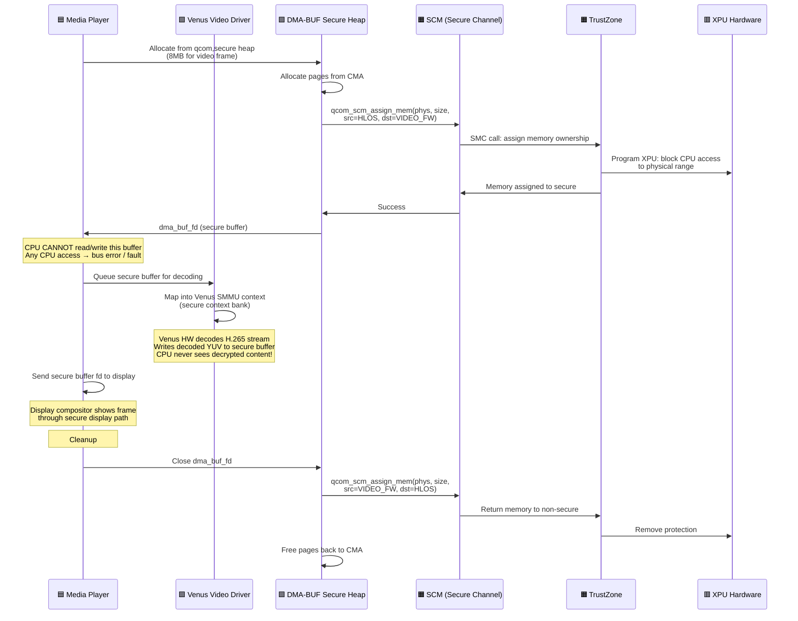
```mermaid
sequenceDiagram
    participant APP as 🟦 Media Player
    participant VID_DRV as 🟩 Venus Video Driver
    participant DMA_HEAP as 🟩 DMA-BUF Secure Heap
    participant SCM as 🟧 SCM (Secure Channel)
    participant TZ as 🟧 TrustZone
    participant XPU as 🟥 XPU Hardware

    APP->>DMA_HEAP: Allocate from qcom,secure heap<br/>(8MB for video frame)
    DMA_HEAP->>DMA_HEAP: Allocate pages from CMA
    DMA_HEAP->>SCM: qcom_scm_assign_mem(phys, size,<br/>src=HLOS, dst=VIDEO_FW)
    SCM->>TZ: SMC call: assign memory ownership
    TZ->>XPU: Program XPU: block CPU access<br/>to physical range

    TZ->>SCM: Memory assigned to secure
    SCM->>DMA_HEAP: Success
    DMA_HEAP->>APP: dma_buf_fd (secure buffer)

    Note over APP: CPU CANNOT read/write this buffer<br/>Any CPU access → bus error / fault

    APP->>VID_DRV: Queue secure buffer for decoding
    VID_DRV->>VID_DRV: Map into Venus SMMU context<br/>(secure context bank)

    Note over VID_DRV: Venus HW decodes H.265 stream<br/>Writes decoded YUV to secure buffer<br/>CPU never sees decrypted content!

    APP->>APP: Send secure buffer fd to display
    Note over APP: Display compositor shows frame<br/>through secure display path

    Note over APP: Cleanup
    APP->>DMA_HEAP: Close dma_buf_fd
    DMA_HEAP->>SCM: qcom_scm_assign_mem(phys, size,<br/>src=VIDEO_FW, dst=HLOS)
    SCM->>TZ: Return memory to non-secure
    TZ->>XPU: Remove protection
    DMA_HEAP->>DMA_HEAP: Free pages back to CMA
```

---

## Q5: Qualcomm FastRPC — DSP Shared Memory

### Interview Question
**"Explain the FastRPC mechanism for sharing memory between the ARM CPU and Qualcomm Hexagon DSP. How does the kernel manage shared memory for compute offload to the DSP? What is the SMMU's role?"**

### Deep Answer

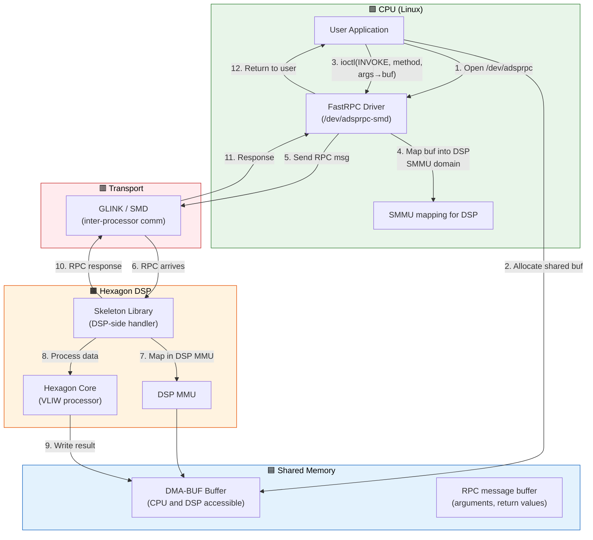
```mermaid
flowchart TB
    subgraph CPU_Side["🟩 CPU (Linux)"]
        APP["User Application"]
        FASTRPC_DRV["FastRPC Driver\n(/dev/adsprpc-smd)"]
        SMMU_CPU["SMMU mapping for DSP"]
    end

    subgraph DSP_Side["🟧 Hexagon DSP"]
        SKEL["Skeleton Library\n(DSP-side handler)"]
        DSP_MMU["DSP MMU"]
        DSP_CORE["Hexagon Core\n(VLIW processor)"]
    end

    subgraph Shared_Mem["🟦 Shared Memory"]
        ION_BUF["DMA-BUF Buffer\n(CPU and DSP accessible)"]
        RPC_BUF["RPC message buffer\n(arguments, return values)"]
    end

    subgraph Transport["🟥 Transport"]
        GLINK["GLINK / SMD\n(inter-processor comm)"]
    end

    APP -->|"1. Open /dev/adsprpc"| FASTRPC_DRV
    APP -->|"2. Allocate shared buf"| ION_BUF
    APP -->|"3. ioctl(INVOKE, method,\nargs→buf)"| FASTRPC_DRV
    FASTRPC_DRV -->|"4. Map buf into DSP\nSMMU domain"| SMMU_CPU
    FASTRPC_DRV -->|"5. Send RPC msg"| GLINK
    GLINK -->|"6. RPC arrives"| SKEL
    SKEL -->|"7. Map in DSP MMU"| DSP_MMU
    DSP_MMU --> ION_BUF
    SKEL -->|"8. Process data"| DSP_CORE
    DSP_CORE -->|"9. Write result"| ION_BUF
    SKEL -->|"10. RPC response"| GLINK
    GLINK -->|"11. Response"| FASTRPC_DRV
    FASTRPC_DRV -->|"12. Return to user"| APP

    style CPU_Side fill:#e8f5e9,stroke:#2e7d32,color:#000
    style DSP_Side fill:#fff3e0,stroke:#e65100,color:#000
    style Shared_Mem fill:#e3f2fd,stroke:#1565c0,color:#000
    style Transport fill:#ffebee,stroke:#c62828,color:#000
```

### FastRPC Memory Mapping Sequence

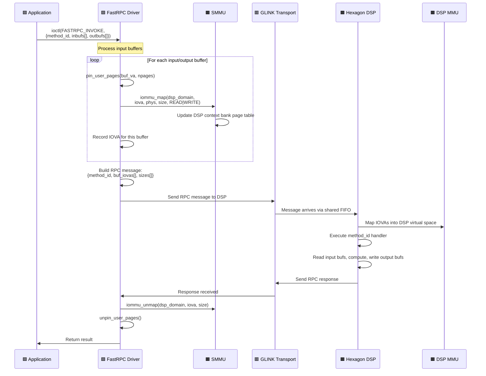
```mermaid
sequenceDiagram
    participant APP as 🟦 Application
    participant RPC as 🟩 FastRPC Driver
    participant SMMU as 🟧 SMMU
    participant GLINK as 🟥 GLINK Transport
    participant DSP as 🟧 Hexagon DSP
    participant DSP_MMU as 🟧 DSP MMU

    APP->>RPC: ioctl(FASTRPC_INVOKE,<br/>{method_id, inbufs[], outbufs[]})

    Note over RPC: Process input buffers

    loop For each input/output buffer
        RPC->>RPC: pin_user_pages(buf_va, npages)
        RPC->>SMMU: iommu_map(dsp_domain,<br/>iova, phys, size, READ|WRITE)
        SMMU->>SMMU: Update DSP context bank page table
        RPC->>RPC: Record IOVA for this buffer
    end

    RPC->>RPC: Build RPC message:<br/>{method_id, buf_iovas[], sizes[]}

    RPC->>GLINK: Send RPC message to DSP

    GLINK->>DSP: Message arrives via shared FIFO
    DSP->>DSP_MMU: Map IOVAs into DSP virtual space
    DSP->>DSP: Execute method_id handler
    DSP->>DSP: Read input bufs, compute, write output bufs
    DSP->>GLINK: Send RPC response

    GLINK->>RPC: Response received
    RPC->>SMMU: iommu_unmap(dsp_domain, iova, size)
    RPC->>RPC: unpin_user_pages()
    RPC->>APP: Return result
```

---

## Q6: Qualcomm CMA and Contiguous Memory for Multimedia

### Interview Question
**"Qualcomm SoCs need large contiguous buffers for video, camera, and display. How is CMA configured on Qualcomm platforms? How does the firmware/device-tree define CMA regions? What happens when CMA allocation fails?"**

### Deep Answer

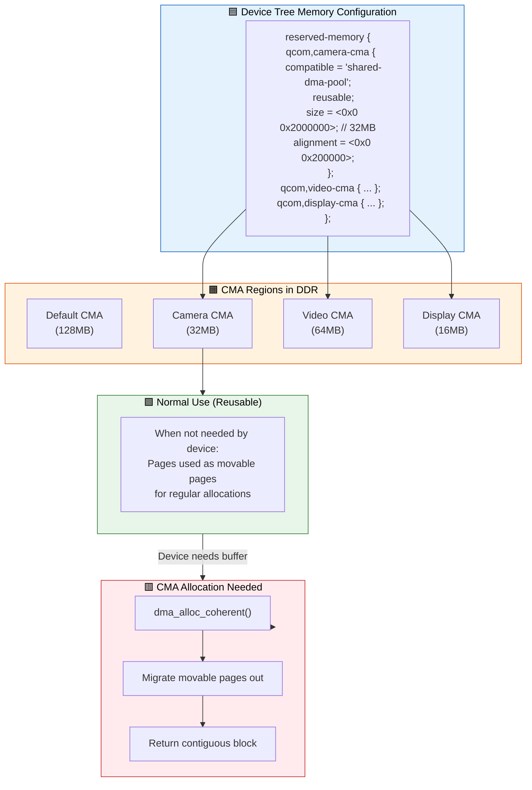
```mermaid
flowchart TB
    subgraph DT_Config["🟦 Device Tree Memory Configuration"]
        DT1["reserved-memory {\n  qcom,camera-cma {\n    compatible = 'shared-dma-pool';\n    reusable;\n    size = <0x0 0x2000000>; // 32MB\n    alignment = <0x0 0x200000>;\n  };\n  qcom,video-cma { ... };\n  qcom,display-cma { ... };\n};"]
    end

    subgraph CMA_Regions["🟧 CMA Regions in DDR"]
        DEFAULT["Default CMA\n(128MB)"]
        CAM_CMA["Camera CMA\n(32MB)"]
        VID_CMA["Video CMA\n(64MB)"]
        DISP_CMA["Display CMA\n(16MB)"]
    end

    subgraph Normal_Use["🟩 Normal Use (Reusable)"]
        N1["When not needed by device:\nPages used as movable pages\nfor regular allocations"]
    end

    subgraph CMA_Alloc["🟥 CMA Allocation Needed"]
        C1["dma_alloc_coherent()"]
        C2["Migrate movable pages out"]
        C3["Return contiguous block"]
    end

    DT1 --> CAM_CMA
    DT1 --> VID_CMA
    DT1 --> DISP_CMA

    CAM_CMA --> Normal_Use
    Normal_Use -->|"Device needs buffer"| CMA_Alloc
    CMA_Alloc --> C1 --> C2 --> C3

    style DT_Config fill:#e3f2fd,stroke:#1565c0,color:#000
    style CMA_Regions fill:#fff3e0,stroke:#e65100,color:#000
    style Normal_Use fill:#e8f5e9,stroke:#2e7d32,color:#000
    style CMA_Alloc fill:#ffebee,stroke:#c62828,color:#000
```

### CMA Allocation Failure Recovery

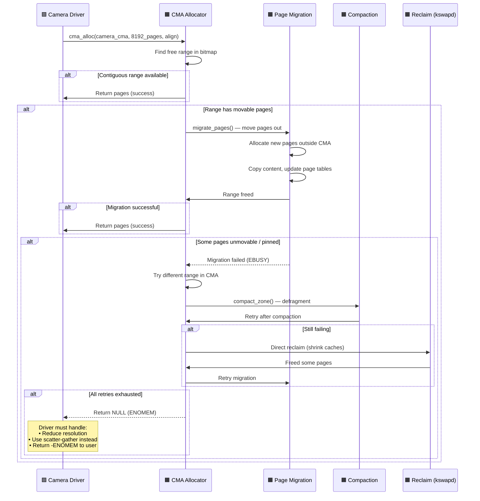
```mermaid
sequenceDiagram
    participant DRV as 🟩 Camera Driver
    participant CMA as 🟧 CMA Allocator
    participant MIGRATE as 🟧 Page Migration
    participant COMPACT as 🟧 Compaction
    participant RECLAIM as 🟧 Reclaim (kswapd)

    DRV->>CMA: cma_alloc(camera_cma, 8192_pages, align)
    CMA->>CMA: Find free range in bitmap

    alt Contiguous range available
        CMA->>DRV: Return pages (success)
    end

    alt Range has movable pages
        CMA->>MIGRATE: migrate_pages() — move pages out
        MIGRATE->>MIGRATE: Allocate new pages outside CMA
        MIGRATE->>MIGRATE: Copy content, update page tables
        MIGRATE->>CMA: Range freed

        alt Migration successful
            CMA->>DRV: Return pages (success)
        end

        alt Some pages unmovable / pinned
            MIGRATE-->>CMA: Migration failed (EBUSY)
            CMA->>CMA: Try different range in CMA
            CMA->>COMPACT: compact_zone() — defragment
            COMPACT->>CMA: Retry after compaction

            alt Still failing
                CMA->>RECLAIM: Direct reclaim (shrink caches)
                RECLAIM->>CMA: Freed some pages
                CMA->>MIGRATE: Retry migration
            end

            alt All retries exhausted
                CMA-->>DRV: Return NULL (ENOMEM)
                Note over DRV: Driver must handle:<br/>• Reduce resolution<br/>• Use scatter-gather instead<br/>• Return -ENOMEM to user
            end
        end
    end
```

---

## Q7: Qualcomm Display Memory — DPU/MDP Buffer Management

### Interview Question
**"How does the Qualcomm display driver (DPU/MDSS) manage memory? Explain scanout buffers, plane types, overlay composition, and the writeback path. How does display interact with GPU allocated buffers?"**

### Deep Answer

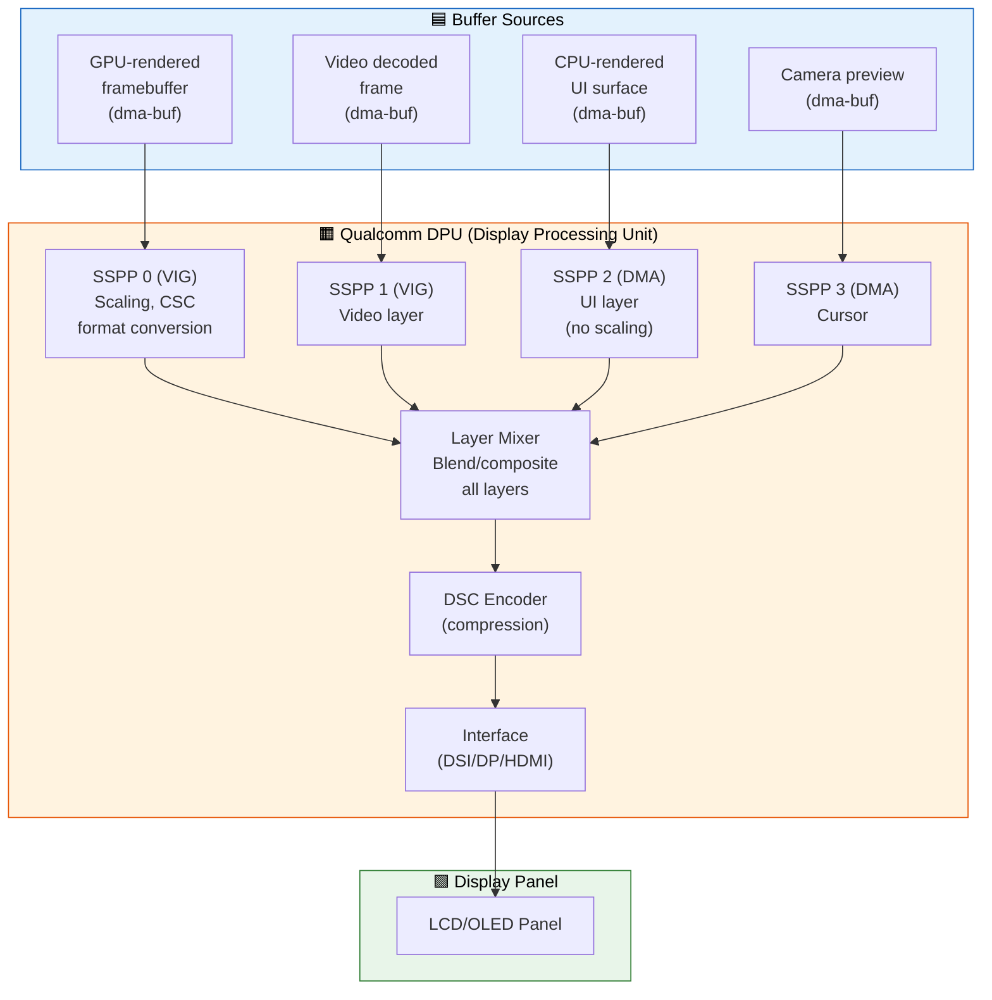
```mermaid
flowchart TB
    subgraph Buffers["🟦 Buffer Sources"]
        FB_GPU["GPU-rendered\nframebuffer\n(dma-buf)"]
        FB_VID["Video decoded\nframe\n(dma-buf)"]
        FB_CAM["Camera preview\n(dma-buf)"]
        FB_UI["CPU-rendered\nUI surface\n(dma-buf)"]
    end

    subgraph DPU["🟧 Qualcomm DPU (Display Processing Unit)"]
        SSPP0["SSPP 0 (VIG)\nScaling, CSC\nformat conversion"]
        SSPP1["SSPP 1 (VIG)\nVideo layer"]
        SSPP2["SSPP 2 (DMA)\nUI layer\n(no scaling)"]
        SSPP3["SSPP 3 (DMA)\nCursor"]

        LM["Layer Mixer\nBlend/composite\nall layers"]

        DSC_ENC["DSC Encoder\n(compression)"]

        INTF["Interface\n(DSI/DP/HDMI)"]
    end

    subgraph Panel["🟩 Display Panel"]
        LCD["LCD/OLED Panel"]
    end

    FB_GPU --> SSPP0
    FB_VID --> SSPP1
    FB_UI --> SSPP2
    FB_CAM --> SSPP3

    SSPP0 --> LM
    SSPP1 --> LM
    SSPP2 --> LM
    SSPP3 --> LM
    LM --> DSC_ENC --> INTF --> LCD

    style Buffers fill:#e3f2fd,stroke:#1565c0,color:#000
    style DPU fill:#fff3e0,stroke:#e65100,color:#000
    style Panel fill:#e8f5e9,stroke:#2e7d32,color:#000
```

### Display Atomic Commit Sequence

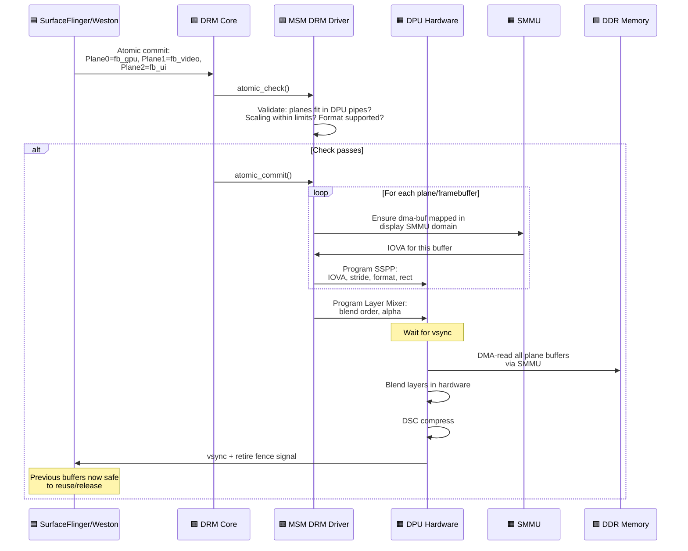
```mermaid
sequenceDiagram
    participant COMP as 🟦 SurfaceFlinger/Weston
    participant DRM as 🟩 DRM Core
    participant MSM as 🟩 MSM DRM Driver
    participant DPU as 🟧 DPU Hardware
    participant SMMU as 🟧 SMMU
    participant DDR as 🟩 DDR Memory

    COMP->>DRM: Atomic commit:<br/>Plane0=fb_gpu, Plane1=fb_video,<br/>Plane2=fb_ui

    DRM->>MSM: atomic_check()
    MSM->>MSM: Validate: planes fit in DPU pipes?<br/>Scaling within limits? Format supported?

    alt Check passes
        DRM->>MSM: atomic_commit()

        loop For each plane/framebuffer
            MSM->>SMMU: Ensure dma-buf mapped in<br/>display SMMU domain
            SMMU->>MSM: IOVA for this buffer
            MSM->>DPU: Program SSPP:<br/>IOVA, stride, format, rect
        end

        MSM->>DPU: Program Layer Mixer:<br/>blend order, alpha

        Note over DPU: Wait for vsync
        DPU->>DDR: DMA-read all plane buffers<br/>via SMMU
        DPU->>DPU: Blend layers in hardware
        DPU->>DPU: DSC compress
        DPU->>COMP: vsync + retire fence signal

        Note over COMP: Previous buffers now safe<br/>to reuse/release
    end
```

---

## Q8: Qualcomm Memory Subsystem — Bandwidth Voting and NoC

### Interview Question
**"Explain the Qualcomm memory subsystem from an OS perspective. What is interconnect (NoC) bandwidth voting? How does the kernel ensure sufficient DDR bandwidth for multimedia pipelines? How does this relate to memory allocation?"**

### Deep Answer

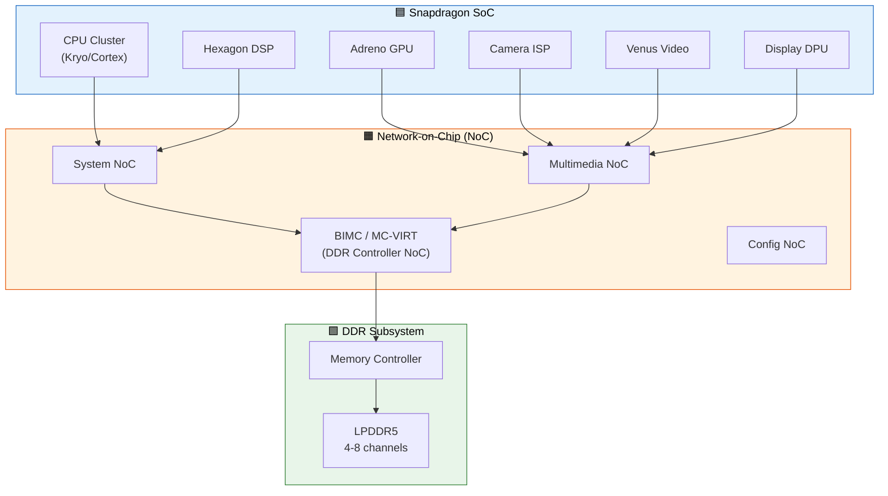
```mermaid
flowchart TB
    subgraph SoC["🟦 Snapdragon SoC"]
        CPU["CPU Cluster\n(Kryo/Cortex)"]
        GPU["Adreno GPU"]
        CAM["Camera ISP"]
        VID["Venus Video"]
        DISP["Display DPU"]
        DSP["Hexagon DSP"]
    end

    subgraph NoC["🟧 Network-on-Chip (NoC)"]
        BIMC["BIMC / MC-VIRT\n(DDR Controller NoC)"]
        SNOC["System NoC"]
        CNOC["Config NoC"]
        MNOC["Multimedia NoC"]
    end

    subgraph DDR_Sub["🟩 DDR Subsystem"]
        MC["Memory Controller"]
        DDR["LPDDR5\n4-8 channels"]
    end

    CPU --> SNOC
    GPU --> MNOC
    CAM --> MNOC
    VID --> MNOC
    DISP --> MNOC
    DSP --> SNOC

    SNOC --> BIMC
    MNOC --> BIMC
    BIMC --> MC --> DDR

    style SoC fill:#e3f2fd,stroke:#1565c0,color:#000
    style NoC fill:#fff3e0,stroke:#e65100,color:#000
    style DDR_Sub fill:#e8f5e9,stroke:#2e7d32,color:#000
```

### Bandwidth Voting Sequence

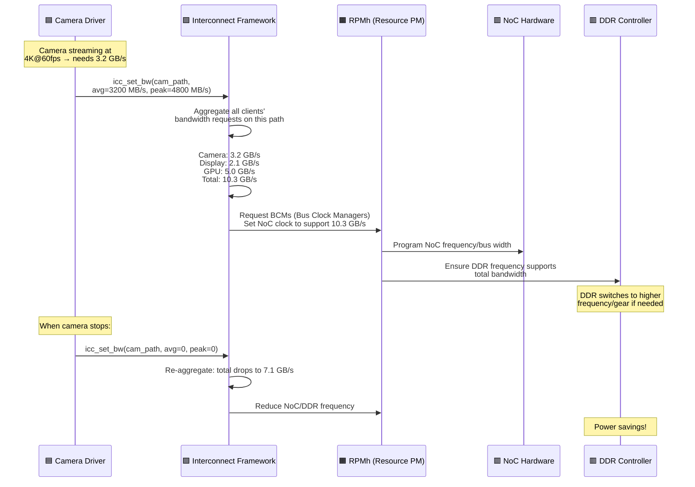
```mermaid
sequenceDiagram
    participant CAM_DRV as 🟦 Camera Driver
    participant ICC as 🟩 Interconnect Framework
    participant RPMh as 🟧 RPMh (Resource PM)
    participant NoC as 🟥 NoC Hardware
    participant DDR as 🟥 DDR Controller

    Note over CAM_DRV: Camera streaming at<br/>4K@60fps → needs 3.2 GB/s

    CAM_DRV->>ICC: icc_set_bw(cam_path,<br/>avg=3200 MB/s, peak=4800 MB/s)

    ICC->>ICC: Aggregate all clients'<br/>bandwidth requests on this path
    ICC->>ICC: Camera: 3.2 GB/s<br/>Display: 2.1 GB/s<br/>GPU: 5.0 GB/s<br/>Total: 10.3 GB/s

    ICC->>RPMh: Request BCMs (Bus Clock Managers)<br/>Set NoC clock to support 10.3 GB/s

    RPMh->>NoC: Program NoC frequency/bus width
    RPMh->>DDR: Ensure DDR frequency supports<br/>total bandwidth

    Note over DDR: DDR switches to higher<br/>frequency/gear if needed

    Note over CAM_DRV: When camera stops:
    CAM_DRV->>ICC: icc_set_bw(cam_path, avg=0, peak=0)
    ICC->>ICC: Re-aggregate: total drops to 7.1 GB/s
    ICC->>RPMh: Reduce NoC/DDR frequency
    Note over DDR: Power savings!
```

---

## Q9: Qualcomm Hypervisor (Gunyah) and Memory Partitioning

### Interview Question
**"Modern Qualcomm automotive/compute SoCs use a hypervisor. How does memory partitioning work between VMs? How does the Gunyah hypervisor manage second-stage translation? How do virtio devices share memory across VM boundaries?"**

### Deep Answer

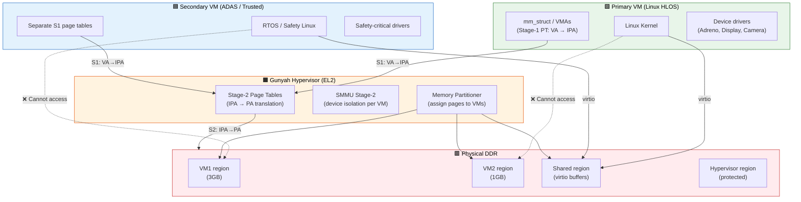
```mermaid
flowchart TB
    subgraph Hypervisor["🟧 Gunyah Hypervisor (EL2)"]
        HV_MM["Stage-2 Page Tables\n(IPA → PA translation)"]
        HV_SMMU["SMMU Stage-2\n(device isolation per VM)"]
        MEM_PART["Memory Partitioner\n(assign pages to VMs)"]
    end

    subgraph VM1["🟩 Primary VM (Linux HLOS)"]
        VM1_K["Linux Kernel"]
        VM1_MM["mm_struct / VMAs\n(Stage-1 PT: VA → IPA)"]
        VM1_DRV["Device drivers\n(Adreno, Display, Camera)"]
    end

    subgraph VM2["🟦 Secondary VM (ADAS / Trusted)"]
        VM2_K["RTOS / Safety Linux"]
        VM2_MM["Separate S1 page tables"]
        VM2_DRV["Safety-critical drivers"]
    end

    subgraph Memory["🟥 Physical DDR"]
        M1["VM1 region\n(3GB)"]
        M2["VM2 region\n(1GB)"]
        M3["Shared region\n(virtio buffers)"]
        M4["Hypervisor region\n(protected)"]
    end

    VM1_MM -->|"S1: VA→IPA"| HV_MM
    VM2_MM -->|"S1: VA→IPA"| HV_MM
    HV_MM -->|"S2: IPA→PA"| Memory

    VM1_K -.->|"❌ Cannot access"| M2
    VM2_K -.->|"❌ Cannot access"| M1

    VM1_K -->|"virtio"| M3
    VM2_K -->|"virtio"| M3

    MEM_PART --> M1
    MEM_PART --> M2
    MEM_PART --> M3

    style Hypervisor fill:#fff3e0,stroke:#e65100,color:#000
    style VM1 fill:#e8f5e9,stroke:#2e7d32,color:#000
    style VM2 fill:#e3f2fd,stroke:#1565c0,color:#000
    style Memory fill:#ffebee,stroke:#c62828,color:#000
```

### Memory Donation Between VMs

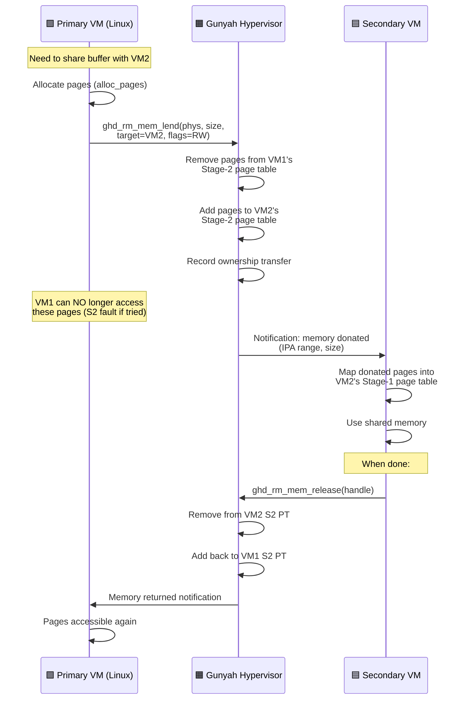
```mermaid
sequenceDiagram
    participant VM1 as 🟩 Primary VM (Linux)
    participant HV as 🟧 Gunyah Hypervisor
    participant VM2 as 🟦 Secondary VM

    Note over VM1: Need to share buffer with VM2

    VM1->>VM1: Allocate pages (alloc_pages)
    VM1->>HV: ghd_rm_mem_lend(phys, size,<br/>target=VM2, flags=RW)

    HV->>HV: Remove pages from VM1's<br/>Stage-2 page table
    HV->>HV: Add pages to VM2's<br/>Stage-2 page table
    HV->>HV: Record ownership transfer

    Note over VM1: VM1 can NO longer access<br/>these pages (S2 fault if tried)

    HV->>VM2: Notification: memory donated<br/>(IPA range, size)

    VM2->>VM2: Map donated pages into<br/>VM2's Stage-1 page table
    VM2->>VM2: Use shared memory

    Note over VM2: When done:
    VM2->>HV: ghd_rm_mem_release(handle)
    HV->>HV: Remove from VM2 S2 PT
    HV->>HV: Add back to VM1 S2 PT
    HV->>VM1: Memory returned notification
    VM1->>VM1: Pages accessible again
```

---

## Q10: Qualcomm Memory Debug — LLCC (Last Level Cache Controller) and Bus Hang

### Interview Question
**"When debugging memory-related crashes on Qualcomm SoCs — bus hangs, SMMU faults, NoC errors — what tools and approaches do you use? How does the LLCC (System Cache) affect memory allocation decisions?"**

### Deep Answer

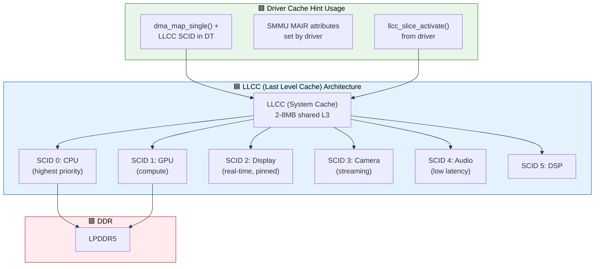
```mermaid
flowchart TB
    subgraph LLCC_Arch["🟦 LLCC (Last Level Cache) Architecture"]
        LLCC["LLCC (System Cache)\n2-8MB shared L3"]
        SCID0["SCID 0: CPU\n(highest priority)"]
        SCID1["SCID 1: GPU\n(compute)"]
        SCID2["SCID 2: Display\n(real-time, pinned)"]
        SCID3["SCID 3: Camera\n(streaming)"]
        SCID4["SCID 4: Audio\n(low latency)"]
        SCID5["SCID 5: DSP"]

        LLCC --> SCID0
        LLCC --> SCID1
        LLCC --> SCID2
        LLCC --> SCID3
        LLCC --> SCID4
        LLCC --> SCID5
    end

    subgraph Driver_Use["🟩 Driver Cache Hint Usage"]
        D1["dma_map_single() +\nLLCC SCID in DT"]
        D2["SMMU MAIR attributes\nset by driver"]
        D3["llcc_slice_activate()\nfrom driver"]
    end

    subgraph DDR["🟥 DDR"]
        DDR_MEM["LPDDR5"]
    end

    SCID0 --> DDR_MEM
    SCID1 --> DDR_MEM
    D1 --> LLCC
    D3 --> LLCC

    style LLCC_Arch fill:#e3f2fd,stroke:#1565c0,color:#000
    style Driver_Use fill:#e8f5e9,stroke:#2e7d32,color:#000
    style DDR fill:#ffebee,stroke:#c62828,color:#000
```

### Memory Debug Triage Flow

```mermaid
flowchart TB
    subgraph Crash["🟥 System Crash / Hang"]
        C1["Device crash or\nmemory corruption detected"]
    end

    C1 --> Q1{"Crash type?"}

    Q1 -->|"SMMU fault"| SMMU_DBG["Check:\n• Fault address (FAR)\n• Fault SID (which device)\n• Fault type (trans/perm)\n• Was IOVA ever mapped?\n• Use iommu_debug"]

    Q1 -->|"Bus hang\n(NoC error)"| NOC_DBG["Check:\n• NoC error registers\n• Which master/slave\n• CBCR clock status\n• Power domain on?\n• Interconnect BW voted?"]

    Q1 -->|"Kernel panic\n(memory corruption)"| MEM_DBG["Enable:\n• KASAN\n• SLUB debug\n• Page owner tracking\n• dma_debug\n• iommu fault handler logs"]

    Q1 -->|"OOM / alloc failure"| OOM_DBG["Check:\n• /proc/meminfo\n• CMA fragmentation\n• ION/DMA-BUF leak\n• dmabuf_debug\n• Per-heap statistics"]

    SMMU_DBG --> FIX1["Fix: Map missing IOVA\nor fix driver unmap/map order"]
    NOC_DBG --> FIX2["Fix: Vote BW before DMA\nor enable clocks properly"]
    MEM_DBG --> FIX3["Fix: Use-after-free,\nwild pointer, DMA to freed buf"]
    OOM_DBG --> FIX4["Fix: Close dma_buf fds,\nreduce CMA fragmentation"]

    style Crash fill:#ffebee,stroke:#c62828,color:#000
    style SMMU_DBG fill:#fff3e0,stroke:#e65100,color:#000
    style NOC_DBG fill:#fff3e0,stroke:#e65100,color:#000
    style MEM_DBG fill:#e3f2fd,stroke:#1565c0,color:#000
    style OOM_DBG fill:#e3f2fd,stroke:#1565c0,color:#000
    style FIX1 fill:#e8f5e9,stroke:#2e7d32,color:#000
    style FIX2 fill:#e8f5e9,stroke:#2e7d32,color:#000
    style FIX3 fill:#e8f5e9,stroke:#2e7d32,color:#000
    style FIX4 fill:#e8f5e9,stroke:#2e7d32,color:#000
```

---

## Common Qualcomm Interview Follow-ups

| Question | Key Points |
|----------|------------|
| **What is PIL (Peripheral Image Loader)?** | Loads firmware into DSP/modem. Allocates contiguous DMA memory, copies firmware, authenticates via TrustZone, then assigns memory to subsystem |
| **How does QSEECOM work with memory?** | Secure app communication. Shared buffers allocated from secure heap, assigned to TZ via SCM call |
| **What is SMMU S1 bypass?** | Some Qualcomm firmwares bypass SMMU stage-1 for performance (modem); uses physical addresses directly — security tradeoff |
| **How do you debug DMA-BUF leaks?** | `cat /sys/kernel/debug/dma_buf/bufinfo` shows all dma-buf allocations, their attachments, and which processes hold FDs |
| **What is Cache Stashing?** | Qualcomm LLCC feature: DMA data placed directly in cache (specific SCID) instead of DDR; reduces latency for camera/network |

---

## Key Source Files

| Component | Source |
|-----------|--------|
| ARM SMMU v3 driver | `drivers/iommu/arm/arm-smmu-v3/` |
| ARM SMMU v2 (Qualcomm) | `drivers/iommu/arm/arm-smmu/arm-smmu-qcom.c` |
| DMA-BUF heaps | `drivers/dma-buf/heaps/` |
| DRM MSM (Adreno) | `drivers/gpu/drm/msm/` |
| Qualcomm SCM | `drivers/firmware/qcom_scm.c` |
| Qualcomm LLCC | `drivers/soc/qcom/llcc-qcom.c` |
| Qualcomm CMA/memory | `drivers/soc/qcom/memory/` |
| Interconnect framework | `drivers/interconnect/qcom/` |
| FastRPC | `drivers/misc/fastrpc.c` |
| Gunyah hypervisor | `drivers/virt/gunyah/` |
| Venus video | `drivers/media/platform/qcom/venus/` |
| DPU display | `drivers/gpu/drm/msm/disp/dpu1/` |
