# NVIDIA — System Design Interview Part 2: Advanced Memory & Driver Architecture

## Target Role: Senior Linux Kernel / GPU Driver Engineer (9+ years)

This document covers **advanced NVIDIA-specific** system design topics: GPU power management and memory, display/KMS scanout buffers, GPU context isolation, error handling (Xid errors), firmware memory (GSP-RM), compute shader memory model, GPU virtualization (vGPU/SR-IOV), and performance profiling.

---

## Q11: GPU Power Management and Memory State Transitions

### Interview Question
**"When an NVIDIA GPU enters a low-power state (D3, runtime suspend), what happens to VRAM contents? How does the kernel driver save and restore GPU memory state? What is the difference between D3hot and D3cold for GPU memory?"**

### Deep Answer

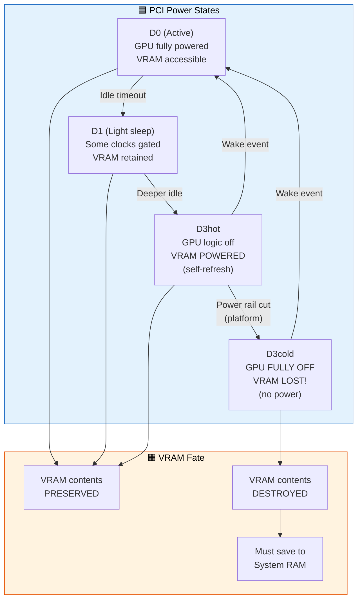
```mermaid
flowchart TB
    subgraph PowerStates["🟦 PCI Power States"]
        D0["D0 (Active)\nGPU fully powered\nVRAM accessible"]
        D1["D1 (Light sleep)\nSome clocks gated\nVRAM retained"]
        D3H["D3hot\nGPU logic off\nVRAM POWERED\n(self-refresh)"]
        D3C["D3cold\nGPU FULLY OFF\nVRAM LOST!\n(no power)"]
    end

    D0 -->|"Idle timeout"| D1
    D1 -->|"Deeper idle"| D3H
    D3H -->|"Power rail cut\n(platform)"| D3C
    D3C -->|"Wake event"| D0
    D3H -->|"Wake event"| D0

    subgraph VRAM_Fate["🟧 VRAM Fate"]
        V_OK["VRAM contents\nPRESERVED"]
        V_LOST["VRAM contents\nDESTROYED"]
        V_SAVE["Must save to\nSystem RAM"]
    end

    D0 --> V_OK
    D1 --> V_OK
    D3H --> V_OK
    D3C --> V_LOST
    V_LOST --> V_SAVE

    style PowerStates fill:#e3f2fd,stroke:#1565c0,color:#000
    style VRAM_Fate fill:#fff3e0,stroke:#e65100,color:#000
```

### VRAM Save/Restore Sequence (D3cold)

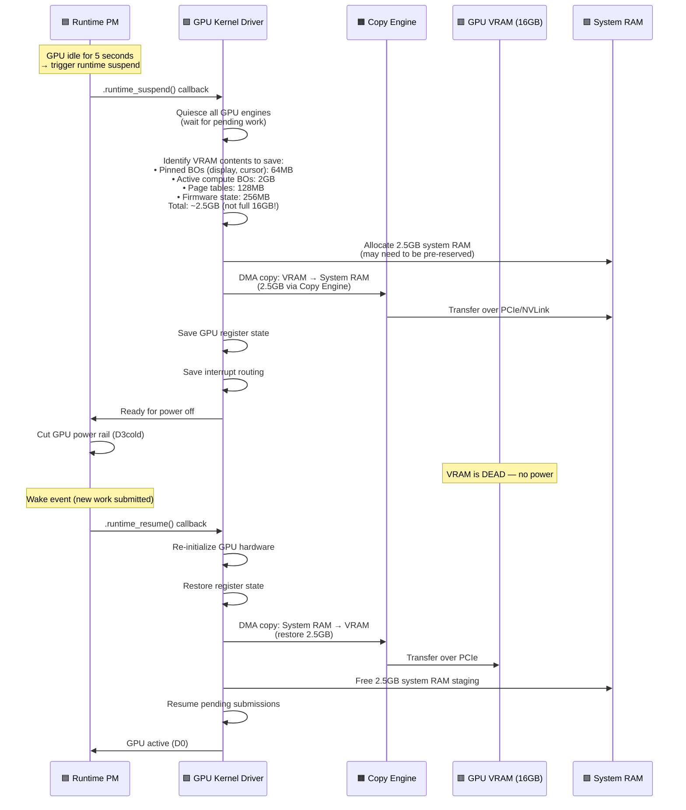
```mermaid
sequenceDiagram
    participant RT_PM as 🟦 Runtime PM
    participant DRV as 🟩 GPU Kernel Driver
    participant CE as 🟧 Copy Engine
    participant VRAM as 🟥 GPU VRAM (16GB)
    participant RAM as 🟩 System RAM

    Note over RT_PM: GPU idle for 5 seconds<br/>→ trigger runtime suspend

    RT_PM->>DRV: .runtime_suspend() callback

    DRV->>DRV: Quiesce all GPU engines<br/>(wait for pending work)

    DRV->>DRV: Identify VRAM contents to save:<br/>• Pinned BOs (display, cursor): 64MB<br/>• Active compute BOs: 2GB<br/>• Page tables: 128MB<br/>• Firmware state: 256MB<br/>Total: ~2.5GB (not full 16GB!)

    DRV->>RAM: Allocate 2.5GB system RAM<br/>(may need to be pre-reserved)

    DRV->>CE: DMA copy: VRAM → System RAM<br/>(2.5GB via Copy Engine)
    CE->>RAM: Transfer over PCIe/NVLink

    DRV->>DRV: Save GPU register state
    DRV->>DRV: Save interrupt routing
    DRV->>RT_PM: Ready for power off

    RT_PM->>RT_PM: Cut GPU power rail (D3cold)
    Note over VRAM: VRAM is DEAD — no power

    Note over RT_PM: Wake event (new work submitted)
    RT_PM->>DRV: .runtime_resume() callback

    DRV->>DRV: Re-initialize GPU hardware
    DRV->>DRV: Restore register state

    DRV->>CE: DMA copy: System RAM → VRAM<br/>(restore 2.5GB)
    CE->>VRAM: Transfer over PCIe

    DRV->>RAM: Free 2.5GB system RAM staging
    DRV->>DRV: Resume pending submissions
    DRV->>RT_PM: GPU active (D0)
```

### Key Design Considerations

```c
/*
 * Not ALL VRAM is saved — only allocated/pinned BOs.
 * Free VRAM is not saved (nothing useful there).
 *
 * Strategies to minimize save/restore time:
 * 1. Evict non-essential BOs to GTT BEFORE suspend
 *    (TTM already keeps them in system RAM)
 * 2. Only save pinned BOs that can't be evicted
 * 3. Use GPU Copy Engine (faster than CPU memcpy)
 * 4. Compress VRAM contents (some drivers do this)
 *
 * Laptop hybrid graphics (NVIDIA Optimus):
 *   - dGPU often in D3cold when not rendering
 *   - Display on iGPU (Intel/AMD)
 *   - GPU VRAM save/restore on every suspend/resume
 */
```

---

## Q12: Display/KMS Scanout Buffer Memory Management

### Interview Question
**"How does the NVIDIA kernel driver manage display scanout buffers? Explain framebuffer pinning, double/triple buffering, cursor BOs, and how page flips interact with memory management. What happens if VRAM is exhausted and the display buffer needs space?"**

### Deep Answer

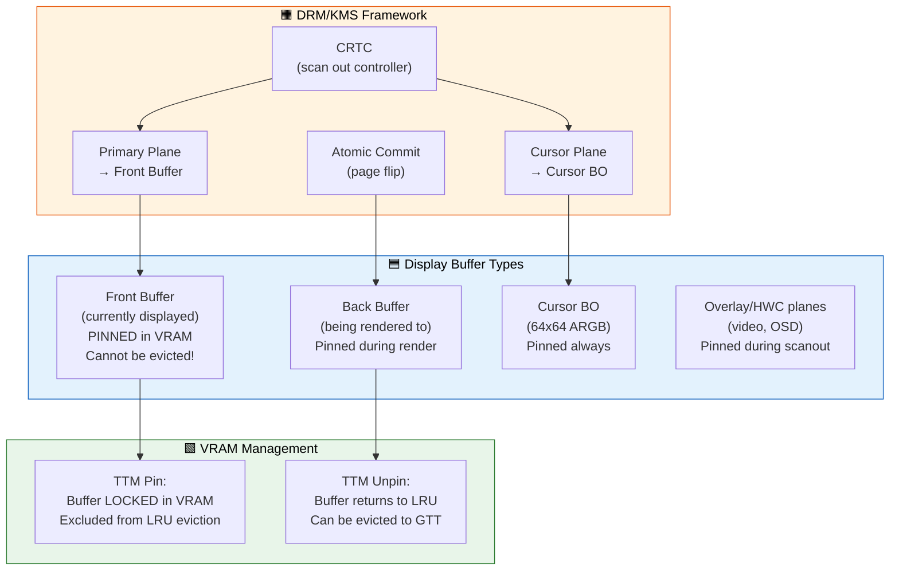
```mermaid
flowchart TB
    subgraph Buffers["🟦 Display Buffer Types"]
        FB_FRONT["Front Buffer\n(currently displayed)\nPINNED in VRAM\nCannot be evicted!"]
        FB_BACK["Back Buffer\n(being rendered to)\nPinned during render"]
        FB_CURSOR["Cursor BO\n(64x64 ARGB)\nPinned always"]
        FB_OVERLAY["Overlay/HWC planes\n(video, OSD)\nPinned during scanout"]
    end

    subgraph DRM_KMS["🟧 DRM/KMS Framework"]
        CRTC["CRTC\n(scan out controller)"]
        PLANE["Primary Plane\n→ Front Buffer"]
        CURSOR_P["Cursor Plane\n→ Cursor BO"]
        ATOMIC["Atomic Commit\n(page flip)"]
    end

    subgraph VRAM_Mgmt["🟩 VRAM Management"]
        TTM_PIN["TTM Pin:\nBuffer LOCKED in VRAM\nExcluded from LRU eviction"]
        TTM_UNPIN["TTM Unpin:\nBuffer returns to LRU\nCan be evicted to GTT"]
    end

    CRTC --> PLANE --> FB_FRONT
    CRTC --> CURSOR_P --> FB_CURSOR
    ATOMIC --> FB_BACK
    FB_FRONT --> TTM_PIN
    FB_BACK --> TTM_UNPIN

    style Buffers fill:#e3f2fd,stroke:#1565c0,color:#000
    style DRM_KMS fill:#fff3e0,stroke:#e65100,color:#000
    style VRAM_Mgmt fill:#e8f5e9,stroke:#2e7d32,color:#000
```

### Page Flip (Double Buffering) Sequence

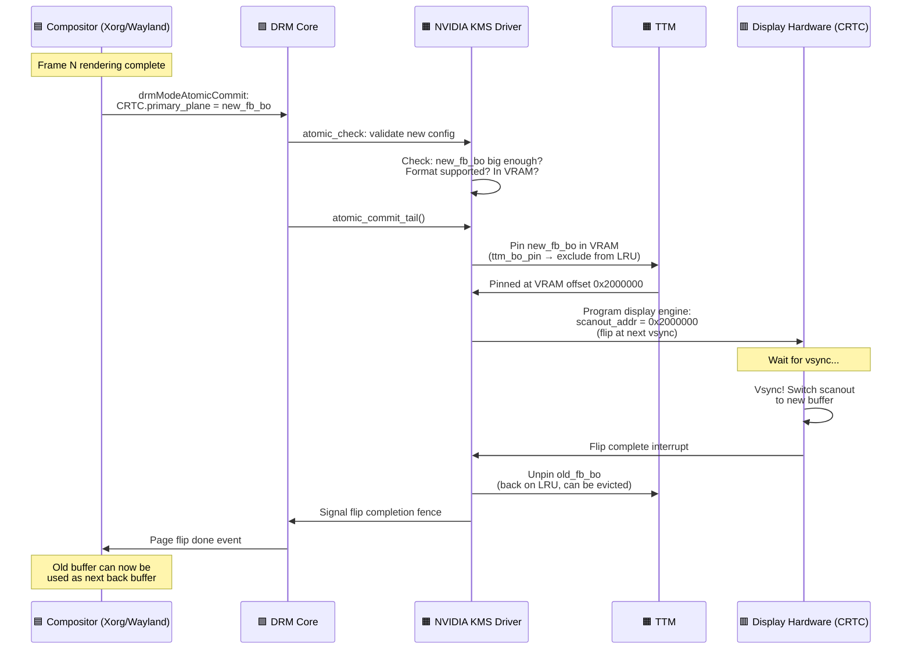
```mermaid
sequenceDiagram
    participant COMP as 🟦 Compositor (Xorg/Wayland)
    participant DRM as 🟩 DRM Core
    participant NV_DRV as 🟧 NVIDIA KMS Driver
    participant TTM as 🟧 TTM
    participant CRTC as 🟥 Display Hardware (CRTC)

    Note over COMP: Frame N rendering complete

    COMP->>DRM: drmModeAtomicCommit:<br/>CRTC.primary_plane = new_fb_bo

    DRM->>NV_DRV: atomic_check: validate new config
    NV_DRV->>NV_DRV: Check: new_fb_bo big enough?<br/>Format supported? In VRAM?

    DRM->>NV_DRV: atomic_commit_tail()

    NV_DRV->>TTM: Pin new_fb_bo in VRAM<br/>(ttm_bo_pin → exclude from LRU)
    TTM->>NV_DRV: Pinned at VRAM offset 0x2000000

    NV_DRV->>CRTC: Program display engine:<br/>scanout_addr = 0x2000000<br/>(flip at next vsync)

    Note over CRTC: Wait for vsync...
    CRTC->>CRTC: Vsync! Switch scanout<br/>to new buffer

    CRTC->>NV_DRV: Flip complete interrupt
    NV_DRV->>TTM: Unpin old_fb_bo<br/>(back on LRU, can be evicted)
    NV_DRV->>DRM: Signal flip completion fence
    DRM->>COMP: Page flip done event

    Note over COMP: Old buffer can now be<br/>used as next back buffer
```

---

## Q13: GPU Context Isolation and Per-Process GPU Memory

### Interview Question
**"How does the NVIDIA driver ensure memory isolation between different GPU processes? If two CUDA applications run simultaneously, how are their GPU address spaces kept separate? What is a GPU channel/context? How does this relate to GPU page tables?"**

### Deep Answer

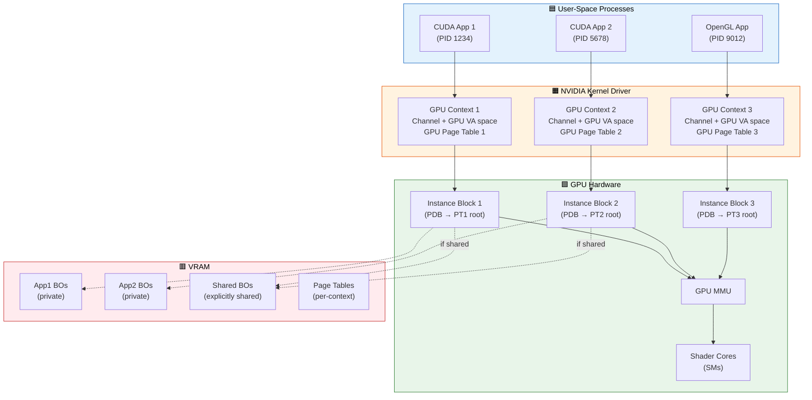
```mermaid
flowchart TB
    subgraph Processes["🟦 User-Space Processes"]
        P1["CUDA App 1\n(PID 1234)"]
        P2["CUDA App 2\n(PID 5678)"]
        P3["OpenGL App\n(PID 9012)"]
    end

    subgraph Driver["🟧 NVIDIA Kernel Driver"]
        CTX1["GPU Context 1\nChannel + GPU VA space\nGPU Page Table 1"]
        CTX2["GPU Context 2\nChannel + GPU VA space\nGPU Page Table 2"]
        CTX3["GPU Context 3\nChannel + GPU VA space\nGPU Page Table 3"]
    end

    subgraph GPU["🟩 GPU Hardware"]
        GMMU["GPU MMU"]
        INST1["Instance Block 1\n(PDB → PT1 root)"]
        INST2["Instance Block 2\n(PDB → PT2 root)"]
        INST3["Instance Block 3\n(PDB → PT3 root)"]
        SM["Shader Cores\n(SMs)"]
    end

    subgraph VRAM_Layout["🟥 VRAM"]
        V1["App1 BOs\n(private)"]
        V2["App2 BOs\n(private)"]
        V3["Shared BOs\n(explicitly shared)"]
        VPT["Page Tables\n(per-context)"]
    end

    P1 --> CTX1
    P2 --> CTX2
    P3 --> CTX3
    CTX1 --> INST1
    CTX2 --> INST2
    CTX3 --> INST3
    INST1 --> GMMU
    INST2 --> GMMU
    INST3 --> GMMU
    GMMU --> SM

    INST1 -.-> V1
    INST2 -.-> V2
    INST1 -.->|"if shared"| V3
    INST2 -.->|"if shared"| V3

    style Processes fill:#e3f2fd,stroke:#1565c0,color:#000
    style Driver fill:#fff3e0,stroke:#e65100,color:#000
    style GPU fill:#e8f5e9,stroke:#2e7d32,color:#000
    style VRAM_Layout fill:#ffebee,stroke:#c62828,color:#000
```

### GPU Context Switch Sequence

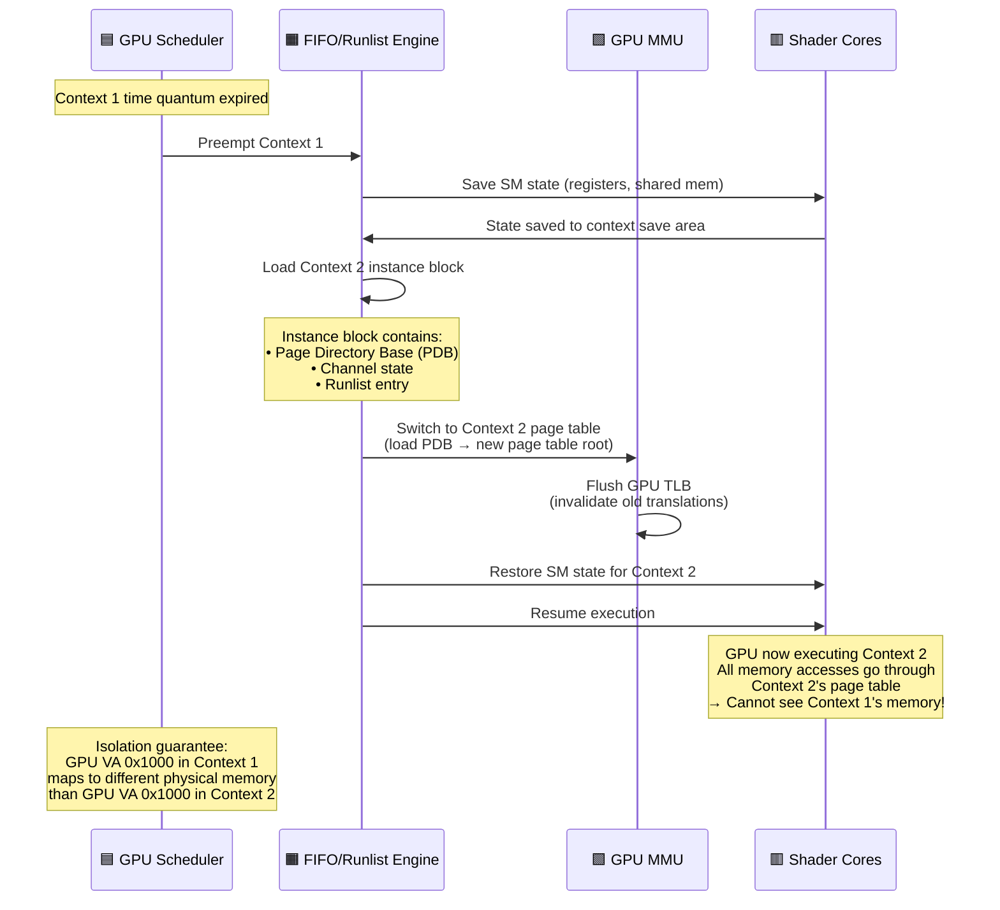
```mermaid
sequenceDiagram
    participant SCHED as 🟦 GPU Scheduler
    participant FIFO as 🟧 FIFO/Runlist Engine
    participant GMMU as 🟩 GPU MMU
    participant SM as 🟥 Shader Cores

    Note over SCHED: Context 1 time quantum expired

    SCHED->>FIFO: Preempt Context 1

    FIFO->>SM: Save SM state (registers, shared mem)
    SM->>FIFO: State saved to context save area

    FIFO->>FIFO: Load Context 2 instance block
    Note over FIFO: Instance block contains:<br/>• Page Directory Base (PDB)<br/>• Channel state<br/>• Runlist entry

    FIFO->>GMMU: Switch to Context 2 page table<br/>(load PDB → new page table root)
    GMMU->>GMMU: Flush GPU TLB<br/>(invalidate old translations)

    FIFO->>SM: Restore SM state for Context 2
    FIFO->>SM: Resume execution

    Note over SM: GPU now executing Context 2<br/>All memory accesses go through<br/>Context 2's page table<br/>→ Cannot see Context 1's memory!

    Note over SCHED: Isolation guarantee:<br/>GPU VA 0x1000 in Context 1<br/>maps to different physical memory<br/>than GPU VA 0x1000 in Context 2
```

---

## Q14: Xid Errors — GPU Error Handling and Memory Fault Recovery

### Interview Question
**"What are NVIDIA Xid errors? How does the kernel driver handle GPU memory faults, hang recovery (TDR), and error reporting? Walk through what happens when a GPU shader accesses invalid memory."**

### Deep Answer

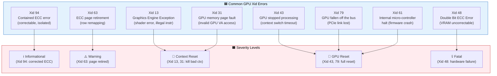
```mermaid
flowchart TB
    subgraph ErrorTypes["🟦 Common GPU Xid Errors"]
        X13["Xid 13\nGraphics Engine Exception\n(shader error, illegal instr)"]
        X31["Xid 31\nGPU memory page fault\n(invalid GPU VA access)"]
        X43["Xid 43\nGPU stopped processing\n(context switch timeout)"]
        X48["Xid 48\nDouble Bit ECC Error\n(VRAM uncorrectable)"]
        X61["Xid 61\nInternal micro-controller\nhalt (firmware crash)"]
        X63["Xid 63\nECC page retirement\n(row remapping)"]
        X79["Xid 79\nGPU fallen off the bus\n(PCIe link lost)"]
        X94["Xid 94\nContained ECC error\n(correctable, isolated)"]
    end

    subgraph Severity["🟧 Severity Levels"]
        INFO["ℹ️ Informational\n(Xid 94: corrected ECC)"]
        WARN["⚠️ Warning\n(Xid 63: page retired)"]
        CTX_RESET["🔄 Context Reset\n(Xid 13, 31: kill bad ctx)"]
        GPU_RESET["🔴 GPU Reset\n(Xid 43, 79: full reset)"]
        FATAL["💀 Fatal\n(Xid 48: hardware failure)"]
    end

    X94 --> INFO
    X63 --> WARN
    X13 --> CTX_RESET
    X31 --> CTX_RESET
    X43 --> GPU_RESET
    X79 --> GPU_RESET
    X48 --> FATAL
    X61 --> GPU_RESET

    style ErrorTypes fill:#e3f2fd,stroke:#1565c0,color:#000
    style Severity fill:#ffebee,stroke:#c62828,color:#000
```

### GPU Memory Fault Recovery Sequence (Xid 31)

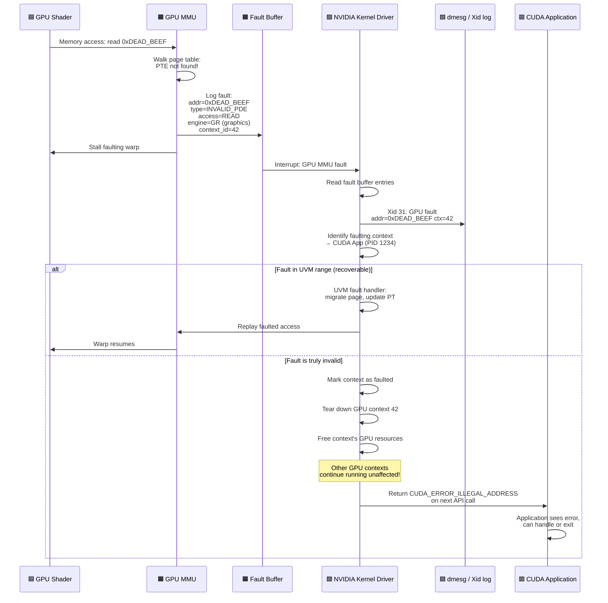
```mermaid
sequenceDiagram
    participant SHADER as 🟦 GPU Shader
    participant GMMU as 🟧 GPU MMU
    participant FAULT_BUF as 🟧 Fault Buffer
    participant DRV as 🟩 NVIDIA Kernel Driver
    participant DMESG as 🟩 dmesg / Xid log
    participant APP as 🟥 CUDA Application

    SHADER->>GMMU: Memory access: read 0xDEAD_BEEF
    GMMU->>GMMU: Walk page table:<br/>PTE not found!

    GMMU->>FAULT_BUF: Log fault:<br/>addr=0xDEAD_BEEF<br/>type=INVALID_PDE<br/>access=READ<br/>engine=GR (graphics)<br/>context_id=42

    GMMU->>SHADER: Stall faulting warp

    FAULT_BUF->>DRV: Interrupt: GPU MMU fault

    DRV->>DRV: Read fault buffer entries
    DRV->>DMESG: Xid 31: GPU fault<br/>addr=0xDEAD_BEEF ctx=42

    DRV->>DRV: Identify faulting context<br/>→ CUDA App (PID 1234)

    alt Fault in UVM range (recoverable)
        DRV->>DRV: UVM fault handler:<br/>migrate page, update PT
        DRV->>GMMU: Replay faulted access
        GMMU->>SHADER: Warp resumes
    else Fault is truly invalid
        DRV->>DRV: Mark context as faulted
        DRV->>DRV: Tear down GPU context 42
        DRV->>DRV: Free context's GPU resources

        Note over DRV: Other GPU contexts<br/>continue running unaffected!

        DRV->>APP: Return CUDA_ERROR_ILLEGAL_ADDRESS<br/>on next API call
        APP->>APP: Application sees error,<br/>can handle or exit
    end
```

---

## Q15: GSP-RM Firmware and GPU Memory Partitioning

### Interview Question
**"Modern NVIDIA GPUs (Turing+) run a firmware called GSP-RM on a RISC-V microcontroller inside the GPU. How does this firmware interact with kernel memory management? How is memory partitioned between the firmware and the kernel driver? What is the communication protocol?"**

### Deep Answer

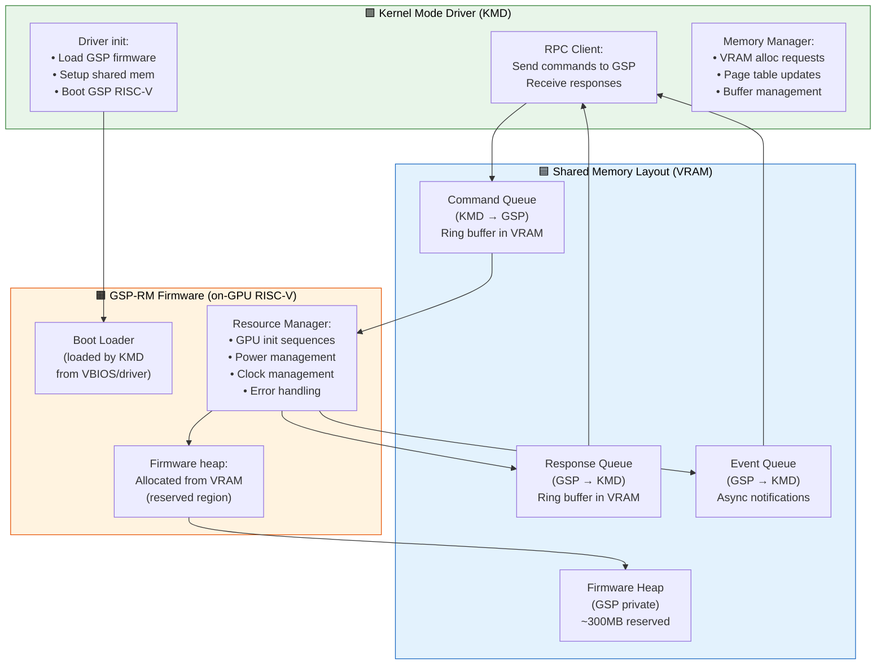
```mermaid
flowchart TB
    subgraph KernelDriver["🟩 Kernel Mode Driver (KMD)"]
        KMD_INIT["Driver init:\n• Load GSP firmware\n• Setup shared mem\n• Boot GSP RISC-V"]
        KMD_RPC["RPC Client:\nSend commands to GSP\nReceive responses"]
        KMD_MEM["Memory Manager:\n• VRAM alloc requests\n• Page table updates\n• Buffer management"]
    end

    subgraph GSP_FW["🟧 GSP-RM Firmware (on-GPU RISC-V)"]
        GSP_BOOT["Boot Loader\n(loaded by KMD\nfrom VBIOS/driver)"]
        GSP_RM["Resource Manager:\n• GPU init sequences\n• Power management\n• Clock management\n• Error handling"]
        GSP_MEM["Firmware heap:\nAllocated from VRAM\n(reserved region)"]
    end

    subgraph SharedMem["🟦 Shared Memory Layout (VRAM)"]
        CMD_Q["Command Queue\n(KMD → GSP)\nRing buffer in VRAM"]
        RSP_Q["Response Queue\n(GSP → KMD)\nRing buffer in VRAM"]
        EVENT_Q["Event Queue\n(GSP → KMD)\nAsync notifications"]
        FW_HEAP["Firmware Heap\n(GSP private)\n~300MB reserved"]
    end

    KMD_INIT --> GSP_BOOT
    KMD_RPC --> CMD_Q
    CMD_Q --> GSP_RM
    GSP_RM --> RSP_Q
    RSP_Q --> KMD_RPC
    GSP_RM --> EVENT_Q
    EVENT_Q --> KMD_RPC
    GSP_RM --> GSP_MEM
    GSP_MEM --> FW_HEAP

    style KernelDriver fill:#e8f5e9,stroke:#2e7d32,color:#000
    style GSP_FW fill:#fff3e0,stroke:#e65100,color:#000
    style SharedMem fill:#e3f2fd,stroke:#1565c0,color:#000
```

### GSP-RM RPC Communication Sequence

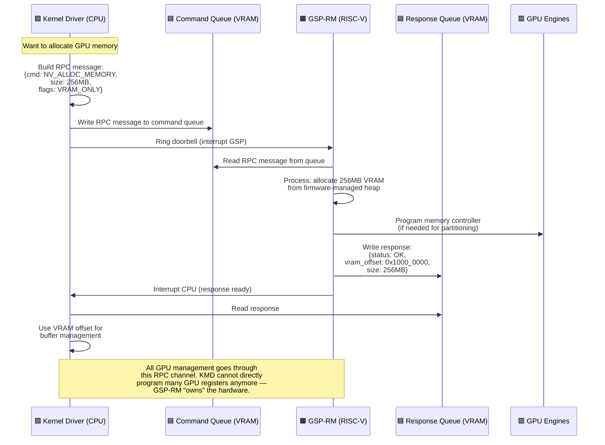
```mermaid
sequenceDiagram
    participant KMD as 🟩 Kernel Driver (CPU)
    participant CMD as 🟦 Command Queue (VRAM)
    participant GSP as 🟧 GSP-RM (RISC-V)
    participant RSP as 🟦 Response Queue (VRAM)
    participant GPU_HW as 🟥 GPU Engines

    Note over KMD: Want to allocate GPU memory

    KMD->>KMD: Build RPC message:<br/>{cmd: NV_ALLOC_MEMORY,<br/> size: 256MB,<br/> flags: VRAM_ONLY}

    KMD->>CMD: Write RPC message to command queue
    KMD->>GSP: Ring doorbell (interrupt GSP)

    GSP->>CMD: Read RPC message from queue
    GSP->>GSP: Process: allocate 256MB VRAM<br/>from firmware-managed heap

    GSP->>GPU_HW: Program memory controller<br/>(if needed for partitioning)

    GSP->>RSP: Write response:<br/>{status: OK,<br/> vram_offset: 0x1000_0000,<br/> size: 256MB}

    GSP->>KMD: Interrupt CPU (response ready)

    KMD->>RSP: Read response
    KMD->>KMD: Use VRAM offset for<br/>buffer management

    Note over KMD,GSP: All GPU management goes through<br/>this RPC channel. KMD cannot directly<br/>program many GPU registers anymore —<br/>GSP-RM "owns" the hardware.
```

### VRAM Partitioning with GSP

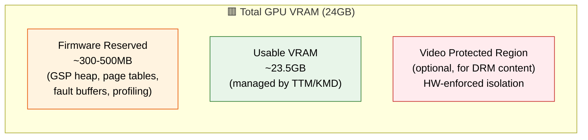
```mermaid
flowchart LR
    subgraph VRAM["🟥 Total GPU VRAM (24GB)"]
        FW["Firmware Reserved\n~300-500MB\n(GSP heap, page tables,\nfault buffers, profiling)"]
        USABLE["Usable VRAM\n~23.5GB\n(managed by TTM/KMD)"]
        VPR["Video Protected Region\n(optional, for DRM content)\nHW-enforced isolation"]
    end

    style FW fill:#fff3e0,stroke:#e65100,color:#000
    style USABLE fill:#e8f5e9,stroke:#2e7d32,color:#000
    style VPR fill:#ffebee,stroke:#c62828,color:#000
```

---

## Q16: GPU Virtualization — vGPU and SR-IOV Memory Partitioning

### Interview Question
**"How does NVIDIA GPU virtualization (vGPU / SR-IOV) partition GPU memory between VMs? How does each VM get isolated VRAM? What is the role of the hypervisor in GPU memory management? How does MIG (Multi-Instance GPU) differ?"**

### Deep Answer

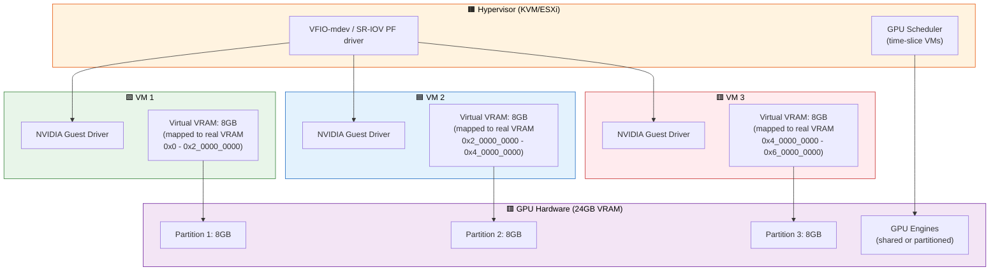
```mermaid
flowchart TB
    subgraph Hypervisor["🟧 Hypervisor (KVM/ESXi)"]
        VFIO["VFIO-mdev / SR-IOV PF driver"]
        SCHED_VM["GPU Scheduler\n(time-slice VMs)"]
    end

    subgraph VM1["🟩 VM 1"]
        VM1_DRV["NVIDIA Guest Driver"]
        VM1_VRAM["Virtual VRAM: 8GB\n(mapped to real VRAM\n0x0 - 0x2_0000_0000)"]
    end

    subgraph VM2["🟦 VM 2"]
        VM2_DRV["NVIDIA Guest Driver"]
        VM2_VRAM["Virtual VRAM: 8GB\n(mapped to real VRAM\n0x2_0000_0000 - 0x4_0000_0000)"]
    end

    subgraph VM3["🟥 VM 3"]
        VM3_DRV["NVIDIA Guest Driver"]
        VM3_VRAM["Virtual VRAM: 8GB\n(mapped to real VRAM\n0x4_0000_0000 - 0x6_0000_0000)"]
    end

    subgraph GPU_HW["🟥 GPU Hardware (24GB VRAM)"]
        VRAM_1["Partition 1: 8GB"]
        VRAM_2["Partition 2: 8GB"]
        VRAM_3["Partition 3: 8GB"]
        GPC["GPU Engines\n(shared or partitioned)"]
    end

    VFIO --> VM1_DRV
    VFIO --> VM2_DRV
    VFIO --> VM3_DRV
    VM1_VRAM --> VRAM_1
    VM2_VRAM --> VRAM_2
    VM3_VRAM --> VRAM_3
    SCHED_VM --> GPC

    style Hypervisor fill:#fff3e0,stroke:#e65100,color:#000
    style VM1 fill:#e8f5e9,stroke:#2e7d32,color:#000
    style VM2 fill:#e3f2fd,stroke:#1565c0,color:#000
    style VM3 fill:#ffebee,stroke:#c62828,color:#000
    style GPU_HW fill:#f3e5f5,stroke:#6a1b9a,color:#000
```

### MIG (Multi-Instance GPU) Memory Isolation

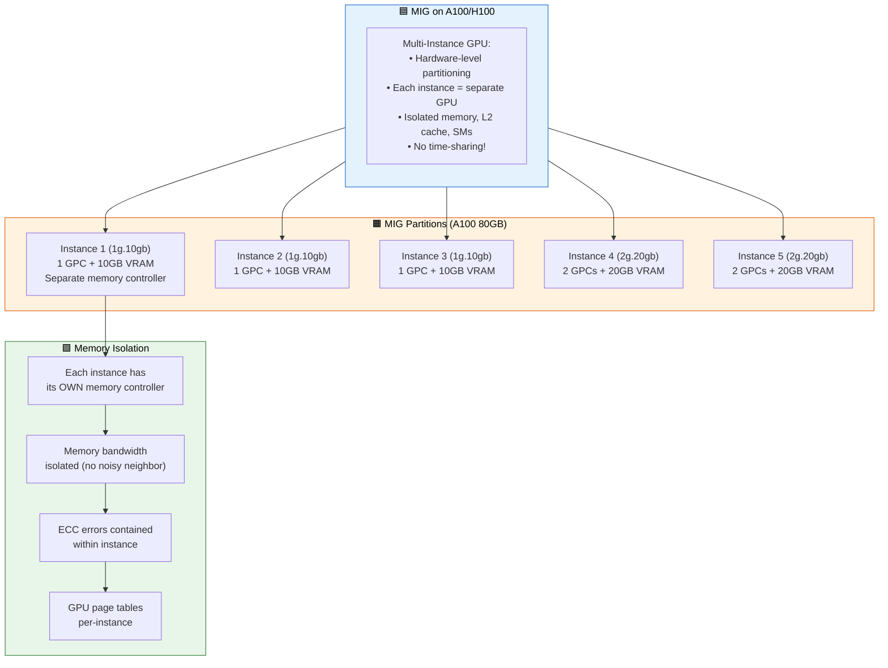
```mermaid
flowchart TB
    subgraph MIG["🟦 MIG on A100/H100"]
        direction TB
        MIG_INFO["Multi-Instance GPU:\n• Hardware-level partitioning\n• Each instance = separate GPU\n• Isolated memory, L2 cache, SMs\n• No time-sharing!"]
    end

    subgraph Partitions["🟧 MIG Partitions (A100 80GB)"]
        I1["Instance 1 (1g.10gb)\n1 GPC + 10GB VRAM\nSeparate memory controller"]
        I2["Instance 2 (1g.10gb)\n1 GPC + 10GB VRAM"]
        I3["Instance 3 (1g.10gb)\n1 GPC + 10GB VRAM"]
        I4["Instance 4 (2g.20gb)\n2 GPCs + 20GB VRAM"]
        I5["Instance 5 (2g.20gb)\n2 GPCs + 20GB VRAM"]
    end

    subgraph Isolation["🟩 Memory Isolation"]
        ISO1["Each instance has\nits OWN memory controller"]
        ISO2["Memory bandwidth\nisolated (no noisy neighbor)"]
        ISO3["ECC errors contained\nwithin instance"]
        ISO4["GPU page tables\nper-instance"]
    end

    MIG --> I1 & I2 & I3 & I4 & I5
    I1 --> ISO1
    ISO1 --> ISO2 --> ISO3 --> ISO4

    style MIG fill:#e3f2fd,stroke:#1565c0,color:#000
    style Partitions fill:#fff3e0,stroke:#e65100,color:#000
    style Isolation fill:#e8f5e9,stroke:#2e7d32,color:#000
```

### vGPU Live Migration Memory Sequence

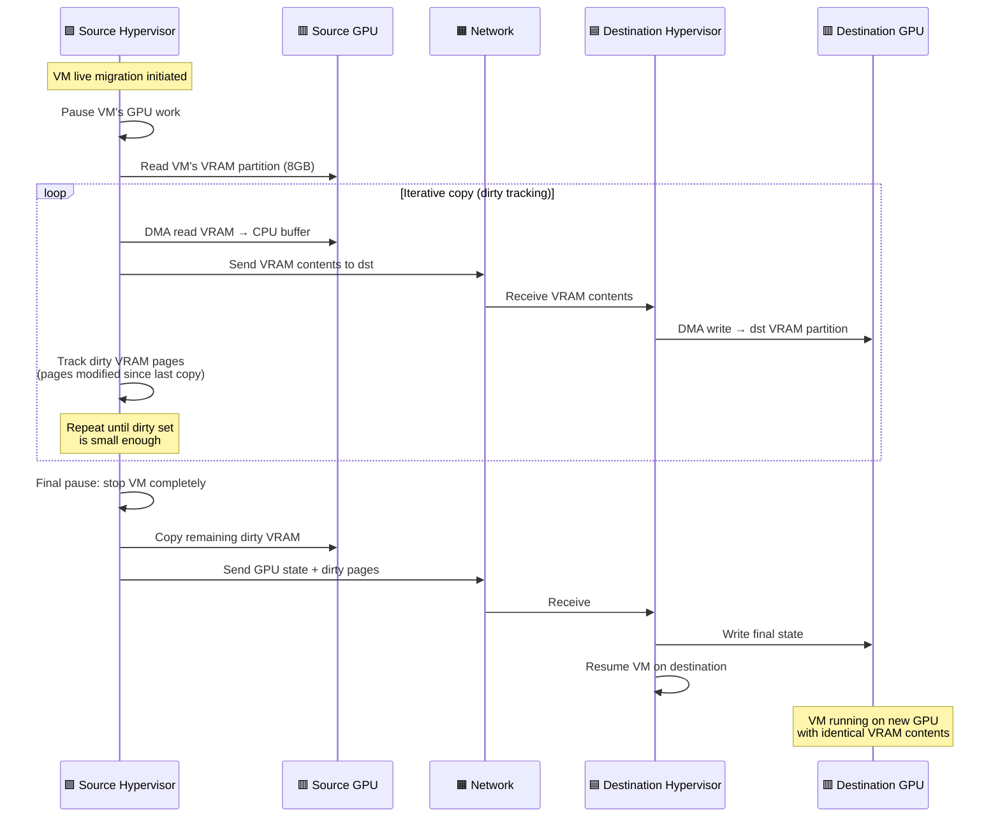
```mermaid
sequenceDiagram
    participant SRC_HV as 🟩 Source Hypervisor
    participant SRC_GPU as 🟥 Source GPU
    participant NET as 🟧 Network
    participant DST_HV as 🟦 Destination Hypervisor
    participant DST_GPU as 🟥 Destination GPU

    Note over SRC_HV: VM live migration initiated

    SRC_HV->>SRC_HV: Pause VM's GPU work
    SRC_HV->>SRC_GPU: Read VM's VRAM partition (8GB)

    loop Iterative copy (dirty tracking)
        SRC_HV->>SRC_GPU: DMA read VRAM → CPU buffer
        SRC_HV->>NET: Send VRAM contents to dst
        NET->>DST_HV: Receive VRAM contents
        DST_HV->>DST_GPU: DMA write → dst VRAM partition

        SRC_HV->>SRC_HV: Track dirty VRAM pages<br/>(pages modified since last copy)
        Note over SRC_HV: Repeat until dirty set<br/>is small enough
    end

    SRC_HV->>SRC_HV: Final pause: stop VM completely
    SRC_HV->>SRC_GPU: Copy remaining dirty VRAM
    SRC_HV->>NET: Send GPU state + dirty pages
    NET->>DST_HV: Receive
    DST_HV->>DST_GPU: Write final state

    DST_HV->>DST_HV: Resume VM on destination
    Note over DST_GPU: VM running on new GPU<br/>with identical VRAM contents
```

---

## Q17: NVIDIA GPU Memory Performance Profiling

### Interview Question
**"How do you profile and debug GPU memory performance issues in the kernel driver? What tools exist for analyzing VRAM usage, memory bandwidth, PCIe throughput, and cache hit rates? How does the driver expose this information?"**

### Deep Answer

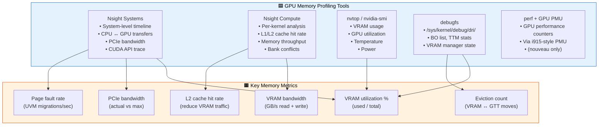
```mermaid
flowchart TB
    subgraph Tools["🟦 GPU Memory Profiling Tools"]
        NSYS["Nsight Systems\n• System-level timeline\n• CPU ↔ GPU transfers\n• PCIe bandwidth\n• CUDA API trace"]
        NCOMP["Nsight Compute\n• Per-kernel analysis\n• L1/L2 cache hit rate\n• Memory throughput\n• Bank conflicts"]
        NVTOP["nvtop / nvidia-smi\n• VRAM usage\n• GPU utilization\n• Temperature\n• Power"]
        DEBUGFS["debugfs\n• /sys/kernel/debug/dri/\n• BO list, TTM stats\n• VRAM manager state"]
        PERF["perf + GPU PMU\n• GPU performance counters\n• Via i915-style PMU\n• (nouveau only)"]
    end

    subgraph Metrics["🟧 Key Memory Metrics"]
        M1["VRAM utilization %\n(used / total)"]
        M2["VRAM bandwidth\n(GB/s read + write)"]
        M3["PCIe bandwidth\n(actual vs max)"]
        M4["L2 cache hit rate\n(reduce VRAM traffic)"]
        M5["Page fault rate\n(UVM migrations/sec)"]
        M6["Eviction count\n(VRAM ↔ GTT moves)"]
    end

    NSYS --> M1 & M3 & M5
    NCOMP --> M2 & M4
    NVTOP --> M1
    DEBUGFS --> M1 & M6

    style Tools fill:#e3f2fd,stroke:#1565c0,color:#000
    style Metrics fill:#fff3e0,stroke:#e65100,color:#000
```

### Memory Bottleneck Diagnosis Sequence

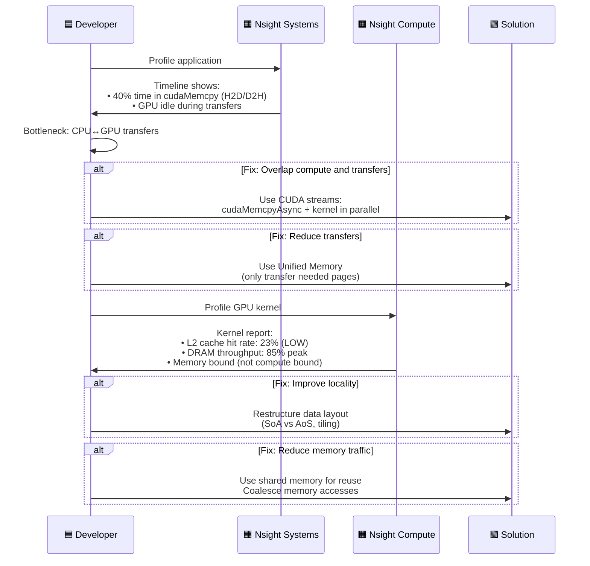
```mermaid
sequenceDiagram
    participant DEV as 🟦 Developer
    participant NSYS as 🟧 Nsight Systems
    participant NCOMP as 🟧 Nsight Compute
    participant FIX as 🟩 Solution

    DEV->>NSYS: Profile application

    NSYS->>DEV: Timeline shows:<br/>• 40% time in cudaMemcpy (H2D/D2H)<br/>• GPU idle during transfers

    DEV->>DEV: Bottleneck: CPU↔GPU transfers

    alt Fix: Overlap compute and transfers
        DEV->>FIX: Use CUDA streams:<br/>cudaMemcpyAsync + kernel in parallel
    end

    alt Fix: Reduce transfers
        DEV->>FIX: Use Unified Memory<br/>(only transfer needed pages)
    end

    DEV->>NCOMP: Profile GPU kernel

    NCOMP->>DEV: Kernel report:<br/>• L2 cache hit rate: 23% (LOW)<br/>• DRAM throughput: 85% peak<br/>• Memory bound (not compute bound)

    alt Fix: Improve locality
        DEV->>FIX: Restructure data layout<br/>(SoA vs AoS, tiling)
    end

    alt Fix: Reduce memory traffic
        DEV->>FIX: Use shared memory for reuse<br/>Coalesce memory accesses
    end
```

---

## Q18: GPU Compute Shader Memory Model and Coherency

### Interview Question
**"Explain the GPU memory model from a kernel driver perspective. How does memory coherency work between CPU and GPU? What are GPU memory scopes (CTA, SM, GPU, System)? How does the driver ensure correctness when CPU and GPU access the same memory?"**

### Deep Answer

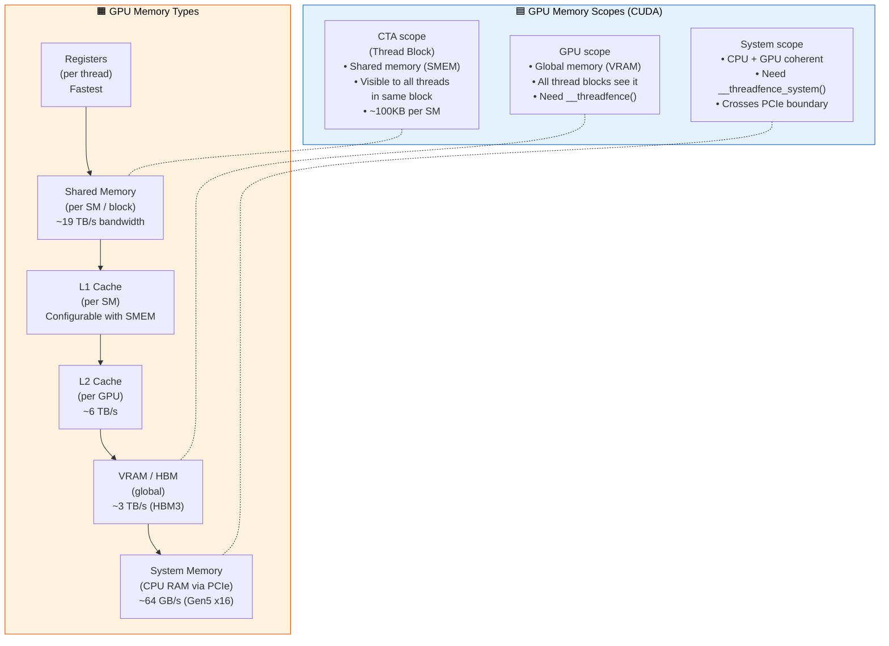
```mermaid
flowchart TB
    subgraph GPU_Scopes["🟦 GPU Memory Scopes (CUDA)"]
        CTA["CTA scope\n(Thread Block)\n• Shared memory (SMEM)\n• Visible to all threads\n  in same block\n• ~100KB per SM"]
        GPU_S["GPU scope\n• Global memory (VRAM)\n• All thread blocks see it\n• Need __threadfence()"]
        SYS_S["System scope\n• CPU + GPU coherent\n• Need __threadfence_system()\n• Crosses PCIe boundary"]
    end

    subgraph Memory_Types["🟧 GPU Memory Types"]
        REG["Registers\n(per thread)\nFastest"]
        SMEM["Shared Memory\n(per SM / block)\n~19 TB/s bandwidth"]
        L1["L1 Cache\n(per SM)\nConfigurable with SMEM"]
        L2["L2 Cache\n(per GPU)\n~6 TB/s"]
        VRAM_T["VRAM / HBM\n(global)\n~3 TB/s (HBM3)"]
        SYS_MEM["System Memory\n(CPU RAM via PCIe)\n~64 GB/s (Gen5 x16)"]
    end

    REG --> SMEM --> L1 --> L2 --> VRAM_T --> SYS_MEM

    CTA -.- SMEM
    GPU_S -.- VRAM_T
    SYS_S -.- SYS_MEM

    style GPU_Scopes fill:#e3f2fd,stroke:#1565c0,color:#000
    style Memory_Types fill:#fff3e0,stroke:#e65100,color:#000
```

### CPU-GPU Coherency Protocol Sequence

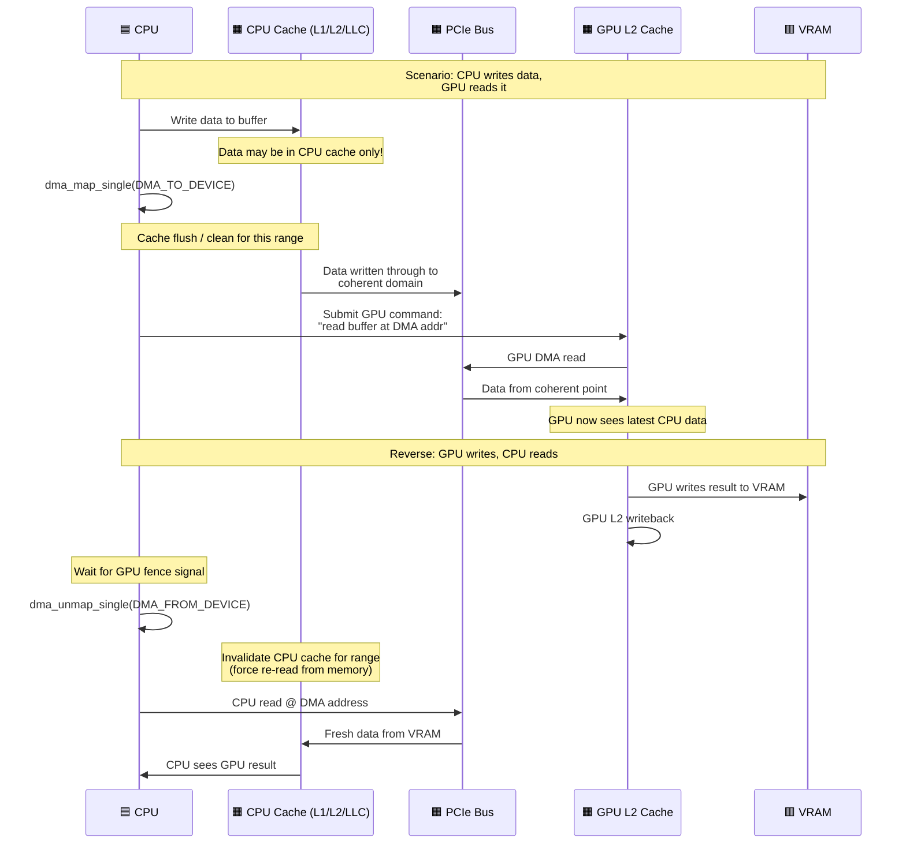
```mermaid
sequenceDiagram
    participant CPU as 🟦 CPU
    participant CPU_CACHE as 🟧 CPU Cache (L1/L2/LLC)
    participant PCIE as 🟧 PCIe Bus
    participant GPU_L2 as 🟧 GPU L2 Cache
    participant VRAM as 🟥 VRAM

    Note over CPU,VRAM: Scenario: CPU writes data,<br/>GPU reads it

    CPU->>CPU_CACHE: Write data to buffer
    Note over CPU_CACHE: Data may be in CPU cache only!

    CPU->>CPU: dma_map_single(DMA_TO_DEVICE)
    Note over CPU,CPU_CACHE: Cache flush / clean for this range

    CPU_CACHE->>PCIE: Data written through to<br/>coherent domain

    CPU->>GPU_L2: Submit GPU command:<br/>"read buffer at DMA addr"

    GPU_L2->>PCIE: GPU DMA read
    PCIE->>GPU_L2: Data from coherent point

    Note over GPU_L2: GPU now sees latest CPU data

    Note over CPU,VRAM: Reverse: GPU writes, CPU reads

    GPU_L2->>VRAM: GPU writes result to VRAM
    GPU_L2->>GPU_L2: GPU L2 writeback

    Note over CPU: Wait for GPU fence signal

    CPU->>CPU: dma_unmap_single(DMA_FROM_DEVICE)
    Note over CPU_CACHE: Invalidate CPU cache for range<br/>(force re-read from memory)

    CPU->>PCIE: CPU read @ DMA address
    PCIE->>CPU_CACHE: Fresh data from VRAM
    CPU_CACHE->>CPU: CPU sees GPU result
```

---

## Q19: ECC Memory Management — Page Retirement and Row Remapping

### Interview Question
**"How does the NVIDIA driver handle ECC errors in GPU VRAM? What is page retirement? How does row remapping work in HBM? What happens when too many pages are retired?"**

### Deep Answer

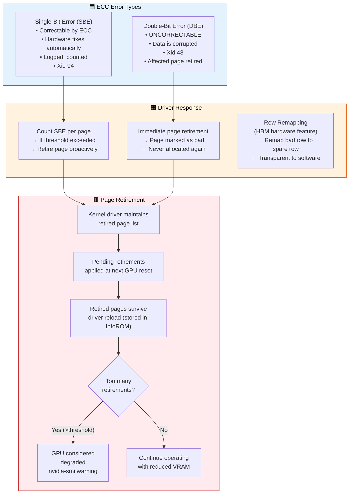
```mermaid
flowchart TB
    subgraph ECC_Errors["🟦 ECC Error Types"]
        SBE["Single-Bit Error (SBE)\n• Correctable by ECC\n• Hardware fixes automatically\n• Logged, counted\n• Xid 94"]
        DBE["Double-Bit Error (DBE)\n• UNCORRECTABLE\n• Data is corrupted\n• Xid 48\n• Affected page retired"]
    end

    subgraph Response["🟧 Driver Response"]
        SBE_R["Count SBE per page\n→ If threshold exceeded\n→ Retire page proactively"]
        DBE_R["Immediate page retirement\n→ Page marked as bad\n→ Never allocated again"]
        ROW_R["Row Remapping\n(HBM hardware feature)\n→ Remap bad row to spare row\n→ Transparent to software"]
    end

    subgraph Retirement["🟥 Page Retirement"]
        R1["Kernel driver maintains\nretired page list"]
        R2["Pending retirements\napplied at next GPU reset"]
        R3["Retired pages survive\ndriver reload (stored in InfoROM)"]
        R4{"Too many\nretirements?"}
        R5["GPU considered\n'degraded'\nnvidia-smi warning"]
        R6["Continue operating\nwith reduced VRAM"]
    end

    SBE --> SBE_R --> R1
    DBE --> DBE_R --> R1
    R1 --> R2 --> R3 --> R4
    R4 -->|"Yes (>threshold)"| R5
    R4 -->|"No"| R6

    style ECC_Errors fill:#e3f2fd,stroke:#1565c0,color:#000
    style Response fill:#fff3e0,stroke:#e65100,color:#000
    style Retirement fill:#ffebee,stroke:#c62828,color:#000
```

### ECC Error Handling Sequence

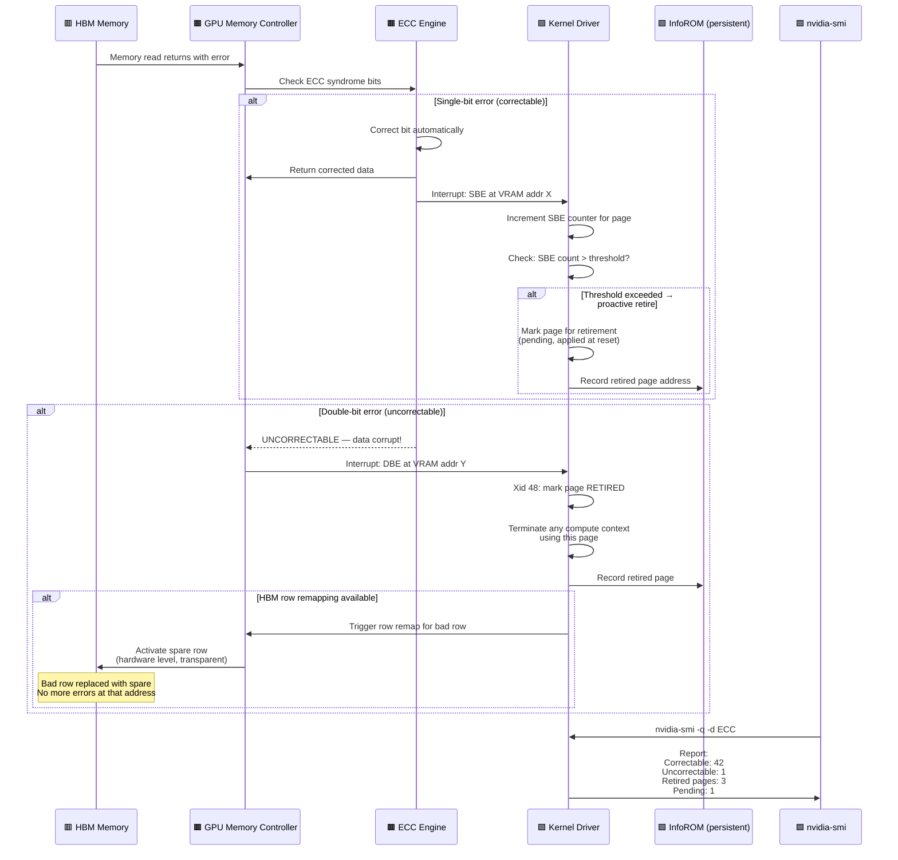
```mermaid
sequenceDiagram
    participant HBM as 🟥 HBM Memory
    participant MC as 🟧 GPU Memory Controller
    participant ECC as 🟧 ECC Engine
    participant DRV as 🟩 Kernel Driver
    participant INFOROM as 🟩 InfoROM (persistent)
    participant ADMIN as 🟦 nvidia-smi

    HBM->>MC: Memory read returns with error
    MC->>ECC: Check ECC syndrome bits

    alt Single-bit error (correctable)
        ECC->>ECC: Correct bit automatically
        ECC->>MC: Return corrected data
        ECC->>DRV: Interrupt: SBE at VRAM addr X
        DRV->>DRV: Increment SBE counter for page
        DRV->>DRV: Check: SBE count > threshold?
        alt Threshold exceeded → proactive retire
            DRV->>DRV: Mark page for retirement<br/>(pending, applied at reset)
            DRV->>INFOROM: Record retired page address
        end
    end

    alt Double-bit error (uncorrectable)
        ECC-->>MC: UNCORRECTABLE — data corrupt!
        MC->>DRV: Interrupt: DBE at VRAM addr Y
        DRV->>DRV: Xid 48: mark page RETIRED
        DRV->>DRV: Terminate any compute context<br/>using this page
        DRV->>INFOROM: Record retired page

        alt HBM row remapping available
            DRV->>MC: Trigger row remap for bad row
            MC->>HBM: Activate spare row<br/>(hardware level, transparent)
            Note over HBM: Bad row replaced with spare<br/>No more errors at that address
        end
    end

    ADMIN->>DRV: nvidia-smi -q -d ECC
    DRV->>ADMIN: Report:<br/>Correctable: 42<br/>Uncorrectable: 1<br/>Retired pages: 3<br/>Pending: 1
```

---

## Q20: GPU Memory Bandwidth Optimization in Kernel Drivers

### Interview Question
**"How does the kernel driver optimize GPU memory bandwidth? Explain compression, memory tiling, cache policies, and how the driver programs these. What kernel-level decisions affect GPU memory throughput?"**

### Deep Answer

```mermaid
flowchart TB
    subgraph Bandwidth_Opts["🟦 GPU Memory Bandwidth Optimizations"]
        COMP["Hardware Compression\n(delta-color, lossless)\n• 2-4x bandwidth saving\n• Programmed via PTE 'kind' bits\n• Transparent to shaders"]

        TILING["Memory Tiling\n(block-linear layout)\n• 2D locality → fewer cache misses\n• GPU native format\n• CPU sees swizzled data"]

        L2_POLICY["L2 Cache Policies\n• Streaming (don't cache)\n• Last-use (evict after read)\n• Persistent (pin in L2)\n• Programmed per-surface"]

        COALESCE["Access Coalescing\n• GPU warps: 32 threads\n• Coalesced = 1 transaction\n• Uncoalesced = 32 transactions\n• Layout affects this"]
    end

    subgraph Driver_Role["🟧 Driver's Role"]
        PTE_KIND["Set PTE 'kind' field\n→ tells GPU how to\n  decompress/swizzle"]
        SURFACE_FMT["Program surface format\nregisters (pitch, tiling,\nblock size)"]
        CACHE_CTRL["Program L2 cache\ncontrol registers"]
        PAGE_SIZE["Choose GPU page size\n(4KB, 64KB, 2MB)\n→ TLB efficiency"]
    end

    COMP --> PTE_KIND
    TILING --> SURFACE_FMT
    L2_POLICY --> CACHE_CTRL
    COALESCE --> PAGE_SIZE

    style Bandwidth_Opts fill:#e3f2fd,stroke:#1565c0,color:#000
    style Driver_Role fill:#fff3e0,stroke:#e65100,color:#000
```

### Driver Surface Format Programming Sequence

```mermaid
sequenceDiagram
    participant APP as 🟦 Application
    participant UMD as 🟧 User-Mode Driver
    participant KMD as 🟩 Kernel Driver
    participant GPU_PT as 🟩 GPU Page Table
    participant GPU_MC as 🟥 Memory Controller

    APP->>UMD: Create texture (1920x1080, RGBA)

    UMD->>UMD: Choose optimal format:<br/>• Tiling type: block-linear (GOB)<br/>• GOB height: 8 (for this size)<br/>• Compression: enabled<br/>• Kind: 0xE0 (compressed color)

    UMD->>KMD: ioctl: create BO<br/>{size=8MB, kind=0xE0, tile=BL}

    KMD->>KMD: Allocate 8MB VRAM via TTM
    KMD->>KMD: Allocate compression tags<br/>(metadata for decompression)

    KMD->>GPU_PT: Set PTEs with kind=0xE0<br/>→ GPU MMU tells MC to decompress

    KMD->>UMD: Return handle + GPU VA

    Note over APP: GPU renders to this texture

    APP->>GPU_MC: Shader writes pixel data
    GPU_MC->>GPU_MC: Compress data inline<br/>(4:1 or 2:1 ratio)
    GPU_MC->>GPU_MC: Write compressed + tags

    Note over APP: GPU reads texture later
    GPU_MC->>GPU_MC: Read compressed data
    GPU_MC->>GPU_MC: Decompress using tags
    GPU_MC->>APP: Shader sees uncompressed data

    Note over APP,GPU_MC: Bandwidth used: 2-4x less<br/>than uncompressed!<br/>Transparent to shader code
```

---

## Key Source Files (Part 2)

| Component | Source |
|-----------|--------|
| Runtime PM | `drivers/gpu/drm/nouveau/nouveau_drm.c` (open-source reference) |
| KMS/Display | `drivers/gpu/drm/drm_atomic.c`, `drm_crtc.c` |
| TTM memory (pin/unpin) | `drivers/gpu/drm/ttm/ttm_bo.c` |
| GPU context (DRM scheduler) | `drivers/gpu/drm/scheduler/` |
| NVIDIA open-gpu-kernel | `github.com/NVIDIA/open-gpu-kernel-modules` |
| GSP-RM RPC | `src/nvidia/src/kernel/rmapi/` (in open-gpu-kernel-modules) |
| VFIO mdev (vGPU) | `drivers/vfio/mdev/` |
| MIG | `nvidia-smi mig` commands |
| ECC / InfoROM | `nvidia-smi -q -d ECC` |
| Nsight Systems | `nsys profile` CLI |
