# Qualcomm — System Design Interview Part 2: Advanced SoC Memory & Driver Architecture

## Target Role: Senior Linux Kernel / SoC Platform Engineer (9+ years)

This document covers **advanced Qualcomm-specific** system design topics: modem (5G/LTE) memory management, audio DSP (ADSP) memory, camera ISP pipeline memory, Qualcomm watchdog/crashdump/minidump, boot memory handoff (XBL→HLOS), WiFi driver memory (ath11k), power management & memory (RPMh/LPM), thermal throttling & memory bandwidth, USB/Type-C driver memory, and V4L2 media pipeline memory.

---

## Q11: Qualcomm Modem (5G/LTE) Memory Isolation and Shared Buffers

### Interview Question
**"How does the Qualcomm modem subsystem manage memory? The modem (MSS) runs its own RTOS — how does the Linux kernel share data buffers with the modem? How is modem memory isolated from the application processor? What happens during modem crash recovery?"**

### Deep Answer

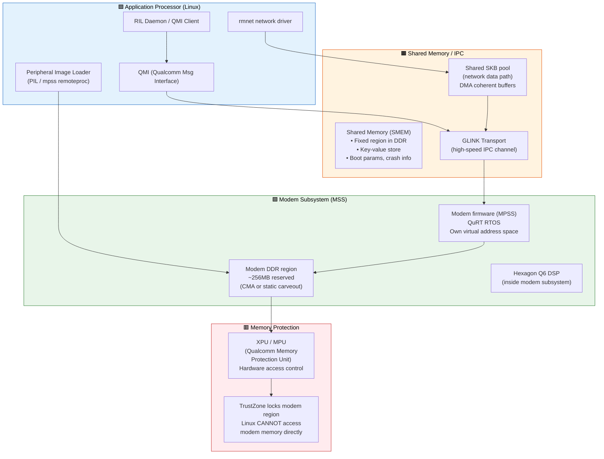
```mermaid
flowchart TB
    subgraph APPS_CPU["🟦 Application Processor (Linux)"]
        RILD["RIL Daemon / QMI Client"]
        RMNET["rmnet network driver"]
        QMI["QMI (Qualcomm Msg Interface)"]
        PIL["Peripheral Image Loader\n(PIL / mpss remoteproc)"]
    end

    subgraph SMEM_IPC["🟧 Shared Memory / IPC"]
        SMEM["Shared Memory (SMEM)\n• Fixed region in DDR\n• Key-value store\n• Boot params, crash info"]
        GLINK["GLINK Transport\n(high-speed IPC channel)"]
        SKB_POOL["Shared SKB pool\n(network data path)\nDMA coherent buffers"]
    end

    subgraph MSS["🟩 Modem Subsystem (MSS)"]
        MPSS_FW["Modem firmware (MPSS)\nQuRT RTOS\nOwn virtual address space"]
        MPSS_MEM["Modem DDR region\n~256MB reserved\n(CMA or static carveout)"]
        Q6_DSP["Hexagon Q6 DSP\n(inside modem subsystem)"]
    end

    subgraph Protection["🟥 Memory Protection"]
        XPU["XPU / MPU\n(Qualcomm Memory\n Protection Unit)\nHardware access control"]
        TZ_LOCK["TrustZone locks modem region\nLinux CANNOT access\nmodem memory directly"]
    end

    RILD --> QMI --> GLINK --> MPSS_FW
    RMNET --> SKB_POOL --> GLINK
    PIL --> MPSS_MEM
    MPSS_FW --> MPSS_MEM
    MPSS_MEM --> XPU
    XPU --> TZ_LOCK

    style APPS_CPU fill:#e3f2fd,stroke:#1565c0,color:#000
    style SMEM_IPC fill:#fff3e0,stroke:#e65100,color:#000
    style MSS fill:#e8f5e9,stroke:#2e7d32,color:#000
    style Protection fill:#ffebee,stroke:#c62828,color:#000
```

### Modem Crash Recovery Memory Sequence

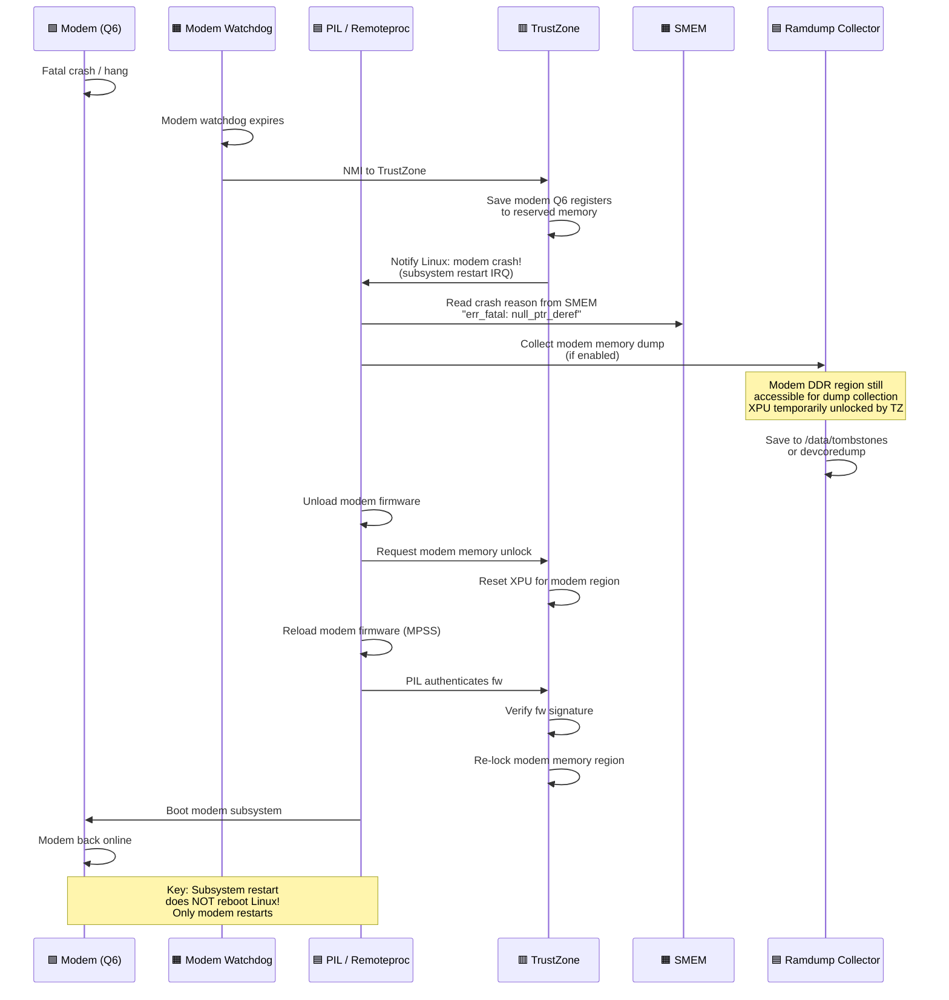
```mermaid
sequenceDiagram
    participant MSS as 🟩 Modem (Q6)
    participant WDOG as 🟧 Modem Watchdog
    participant PIL as 🟦 PIL / Remoteproc
    participant TZ as 🟥 TrustZone
    participant SMEM as 🟧 SMEM
    participant DUMP as 🟦 Ramdump Collector

    MSS->>MSS: Fatal crash / hang
    WDOG->>WDOG: Modem watchdog expires

    WDOG->>TZ: NMI to TrustZone
    TZ->>TZ: Save modem Q6 registers<br/>to reserved memory

    TZ->>PIL: Notify Linux: modem crash!<br/>(subsystem restart IRQ)

    PIL->>SMEM: Read crash reason from SMEM<br/>"err_fatal: null_ptr_deref"

    PIL->>DUMP: Collect modem memory dump<br/>(if enabled)

    Note over DUMP: Modem DDR region still<br/>accessible for dump collection<br/>XPU temporarily unlocked by TZ

    DUMP->>DUMP: Save to /data/tombstones<br/>or devcoredump

    PIL->>PIL: Unload modem firmware
    PIL->>TZ: Request modem memory unlock
    TZ->>TZ: Reset XPU for modem region

    PIL->>PIL: Reload modem firmware (MPSS)
    PIL->>TZ: PIL authenticates fw
    TZ->>TZ: Verify fw signature
    TZ->>TZ: Re-lock modem memory region

    PIL->>MSS: Boot modem subsystem
    MSS->>MSS: Modem back online

    Note over PIL,MSS: Key: Subsystem restart<br/>does NOT reboot Linux!<br/>Only modem restarts
```

---

## Q12: Audio DSP (ADSP) Memory Management

### Interview Question
**"How does the Qualcomm Audio DSP (ADSP/Hexagon) manage memory for audio processing? How are audio buffers shared between the Linux kernel audio driver and the DSP? What memory is used for low-power audio playback?"**

### Deep Answer

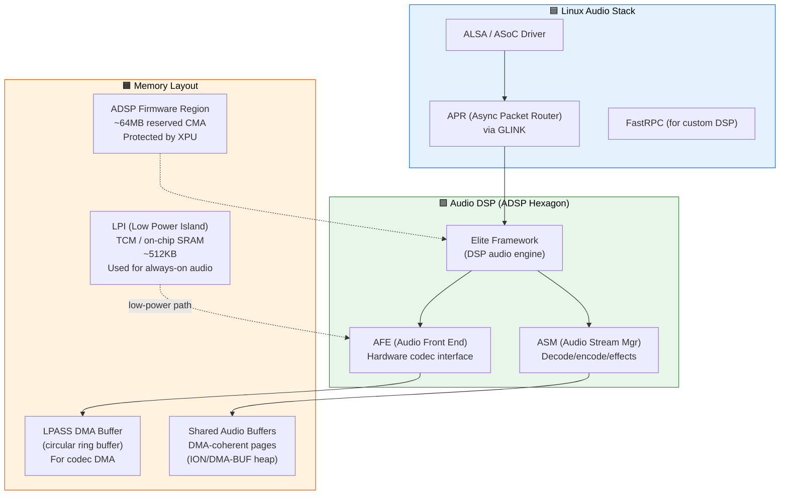
```mermaid
flowchart TB
    subgraph Linux_Audio["🟦 Linux Audio Stack"]
        ALSA["ALSA / ASoC Driver"]
        APR["APR (Async Packet Router)\nvia GLINK"]
        FASTRPC_A["FastRPC (for custom DSP)"]
    end

    subgraph ADSP["🟩 Audio DSP (ADSP Hexagon)"]
        ELITE["Elite Framework\n(DSP audio engine)"]
        AFE["AFE (Audio Front End)\nHardware codec interface"]
        ASM["ASM (Audio Stream Mgr)\nDecode/encode/effects"]
    end

    subgraph Memory["🟧 Memory Layout"]
        ADSP_FW["ADSP Firmware Region\n~64MB reserved CMA\nProtected by XPU"]
        SHARED_BUF["Shared Audio Buffers\nDMA-coherent pages\n(ION/DMA-BUF heap)"]
        LPI_MEM["LPI (Low Power Island)\nTCM / on-chip SRAM\n~512KB\nUsed for always-on audio"]
        LPASS_MEM["LPASS DMA Buffer\n(circular ring buffer)\nFor codec DMA"]
    end

    ALSA --> APR --> ELITE
    ELITE --> AFE
    ELITE --> ASM
    ASM --> SHARED_BUF
    AFE --> LPASS_MEM

    ADSP_FW -.-> ELITE
    LPI_MEM -.->|"low-power path"| AFE

    style Linux_Audio fill:#e3f2fd,stroke:#1565c0,color:#000
    style ADSP fill:#e8f5e9,stroke:#2e7d32,color:#000
    style Memory fill:#fff3e0,stroke:#e65100,color:#000
```

### Audio Playback Buffer Lifecycle Sequence

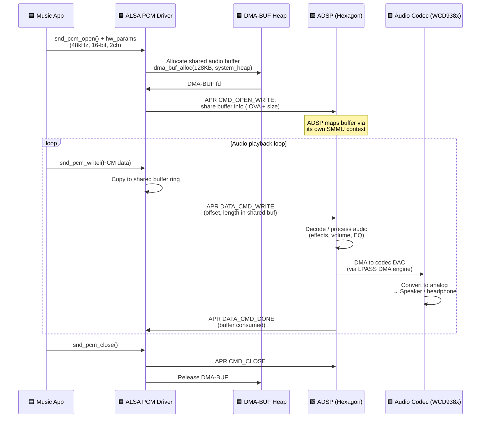
```mermaid
sequenceDiagram
    participant APP as 🟦 Music App
    participant ALSA as 🟧 ALSA PCM Driver
    participant ION as 🟧 DMA-BUF Heap
    participant ADSP as 🟩 ADSP (Hexagon)
    participant CODEC as 🟥 Audio Codec (WCD938x)

    APP->>ALSA: snd_pcm_open() + hw_params<br/>(48kHz, 16-bit, 2ch)

    ALSA->>ION: Allocate shared audio buffer<br/>dma_buf_alloc(128KB, system_heap)
    ION->>ALSA: DMA-BUF fd

    ALSA->>ADSP: APR CMD_OPEN_WRITE:<br/>share buffer info (IOVA + size)

    Note over ADSP: ADSP maps buffer via<br/>its own SMMU context

    loop Audio playback loop
        APP->>ALSA: snd_pcm_writei(PCM data)
        ALSA->>ALSA: Copy to shared buffer ring

        ALSA->>ADSP: APR DATA_CMD_WRITE<br/>(offset, length in shared buf)

        ADSP->>ADSP: Decode / process audio<br/>(effects, volume, EQ)

        ADSP->>CODEC: DMA to codec DAC<br/>(via LPASS DMA engine)

        CODEC->>CODEC: Convert to analog<br/>→ Speaker / headphone

        ADSP->>ALSA: APR DATA_CMD_DONE<br/>(buffer consumed)
    end

    APP->>ALSA: snd_pcm_close()
    ALSA->>ADSP: APR CMD_CLOSE
    ALSA->>ION: Release DMA-BUF
```

---

## Q13: Camera ISP Multi-Frame Pipeline Memory

### Interview Question
**"How does the Qualcomm Camera ISP (Spectra) manage memory for multi-frame processing? A modern camera pipeline might process HDR with 3 exposure frames simultaneously plus a preview stream — how is all this memory allocated, shared, and recycled?"**

### Deep Answer

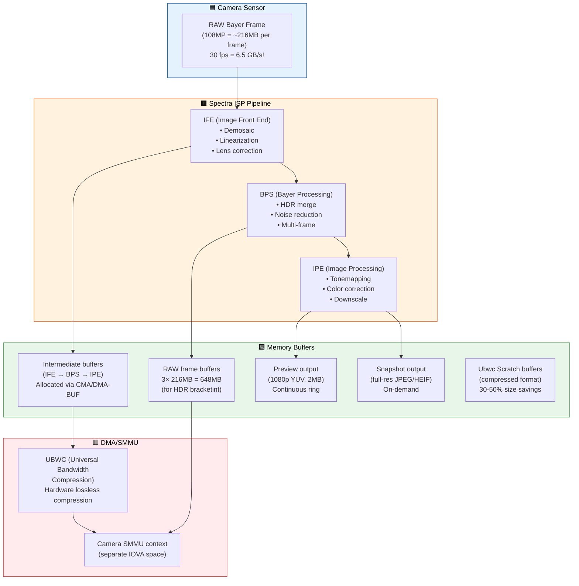
```mermaid
flowchart TB
    subgraph Sensor_Input["🟦 Camera Sensor"]
        RAW["RAW Bayer Frame\n(108MP = ~216MB per frame)\n30 fps = 6.5 GB/s!"]
    end

    subgraph ISP_Pipeline["🟧 Spectra ISP Pipeline"]
        IFE["IFE (Image Front End)\n• Demosaic\n• Linearization\n• Lens correction"]
        BPS["BPS (Bayer Processing)\n• HDR merge\n• Noise reduction\n• Multi-frame"]
        IPE["IPE (Image Processing)\n• Tonemapping\n• Color correction\n• Downscale"]
    end

    subgraph Memory_Pools["🟩 Memory Buffers"]
        RAW_BUF["RAW frame buffers\n3× 216MB = 648MB\n(for HDR bracketint)"]
        INTER_BUF["Intermediate buffers\n(IFE → BPS → IPE)\nAllocated via CMA/DMA-BUF"]
        OUT_PREVIEW["Preview output\n(1080p YUV, 2MB)\nContinuous ring"]
        OUT_SNAP["Snapshot output\n(full-res JPEG/HEIF)\nOn-demand"]
        UB_SCRATCH["Ubwc Scratch buffers\n(compressed format)\n30-50% size savings"]
    end

    subgraph DMA_Engine["🟥 DMA/SMMU"]
        SMMU_CAM["Camera SMMU context\n(separate IOVA space)"]
        UBWC["UBWC (Universal Bandwidth\nCompression)\nHardware lossless compression"]
    end

    RAW --> IFE --> BPS --> IPE
    IFE --> INTER_BUF
    BPS --> RAW_BUF
    IPE --> OUT_PREVIEW
    IPE --> OUT_SNAP
    INTER_BUF --> UBWC
    UBWC --> SMMU_CAM
    RAW_BUF --> SMMU_CAM

    style Sensor_Input fill:#e3f2fd,stroke:#1565c0,color:#000
    style ISP_Pipeline fill:#fff3e0,stroke:#e65100,color:#000
    style Memory_Pools fill:#e8f5e9,stroke:#2e7d32,color:#000
    style DMA_Engine fill:#ffebee,stroke:#c62828,color:#000
```

### Multi-Frame HDR Memory Lifecycle Sequence

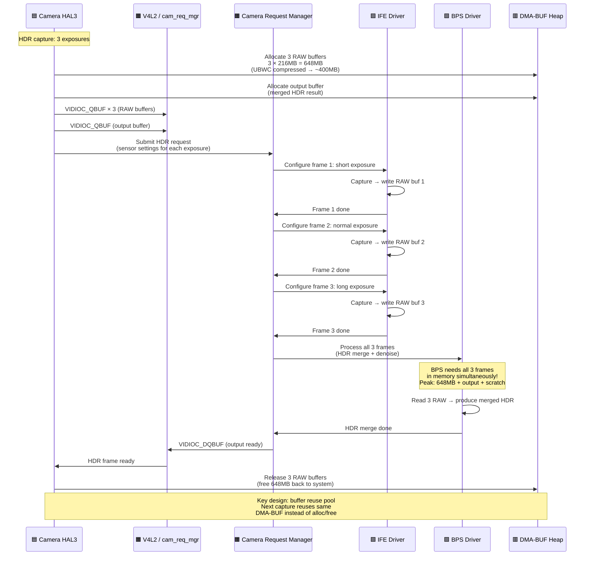
```mermaid
sequenceDiagram
    participant HAL as 🟦 Camera HAL3
    participant V4L2 as 🟧 V4L2 / cam_req_mgr
    participant CRM as 🟧 Camera Request Manager
    participant IFE_D as 🟩 IFE Driver
    participant BPS_D as 🟩 BPS Driver
    participant HEAP as 🟥 DMA-BUF Heap

    Note over HAL: HDR capture: 3 exposures

    HAL->>HEAP: Allocate 3 RAW buffers<br/>3 × 216MB = 648MB<br/>(UBWC compressed → ~400MB)

    HAL->>HEAP: Allocate output buffer<br/>(merged HDR result)

    HAL->>V4L2: VIDIOC_QBUF × 3 (RAW buffers)
    HAL->>V4L2: VIDIOC_QBUF (output buffer)

    HAL->>CRM: Submit HDR request<br/>(sensor settings for each exposure)

    CRM->>IFE_D: Configure frame 1: short exposure
    IFE_D->>IFE_D: Capture → write RAW buf 1
    IFE_D->>CRM: Frame 1 done

    CRM->>IFE_D: Configure frame 2: normal exposure
    IFE_D->>IFE_D: Capture → write RAW buf 2
    IFE_D->>CRM: Frame 2 done

    CRM->>IFE_D: Configure frame 3: long exposure
    IFE_D->>IFE_D: Capture → write RAW buf 3
    IFE_D->>CRM: Frame 3 done

    CRM->>BPS_D: Process all 3 frames<br/>(HDR merge + denoise)
    Note over BPS_D: BPS needs all 3 frames<br/>in memory simultaneously!<br/>Peak: 648MB + output + scratch

    BPS_D->>BPS_D: Read 3 RAW → produce merged HDR
    BPS_D->>CRM: HDR merge done

    CRM->>V4L2: VIDIOC_DQBUF (output ready)
    V4L2->>HAL: HDR frame ready

    HAL->>HEAP: Release 3 RAW buffers<br/>(free 648MB back to system)

    Note over HAL,HEAP: Key design: buffer reuse pool<br/>Next capture reuses same<br/>DMA-BUF instead of alloc/free
```

---

## Q14: Qualcomm Minidump and Crashdump Memory Architecture

### Interview Question
**"How does Qualcomm's minidump system work? When the system crashes, how does the kernel preserve memory contents for post-mortem analysis? What is the difference between full crash dump and minidump? How is the dump memory protected?"**

### Deep Answer

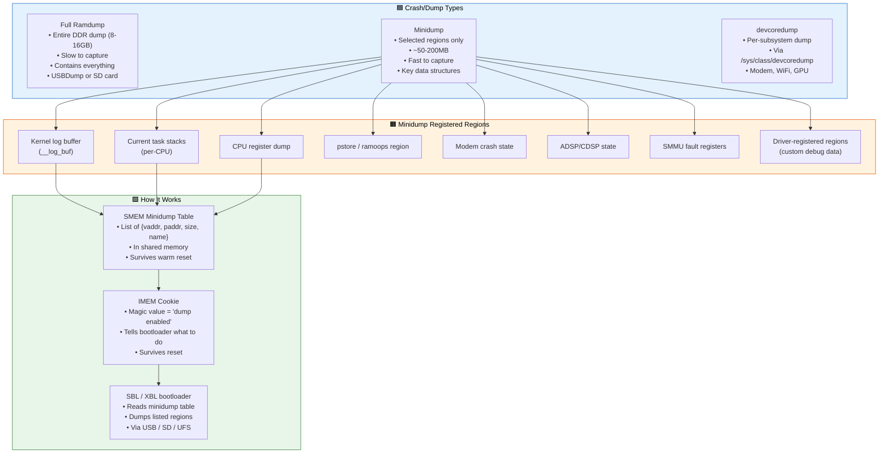
```mermaid
flowchart TB
    subgraph Crash_Types["🟦 Crash/Dump Types"]
        FULL["Full Ramdump\n• Entire DDR dump (8-16GB)\n• Slow to capture\n• Contains everything\n• USBDump or SD card"]
        MINI["Minidump\n• Selected regions only\n• ~50-200MB\n• Fast to capture\n• Key data structures"]
        DEV_CORE["devcoredump\n• Per-subsystem dump\n• Via /sys/class/devcoredump\n• Modem, WiFi, GPU"]
    end

    subgraph Mini_Regions["🟧 Minidump Registered Regions"]
        KLOG["Kernel log buffer\n(__log_buf)"]
        STACK["Current task stacks\n(per-CPU)"]
        REGS["CPU register dump"]
        PSTORE["pstore / ramoops region"]
        MODEM_D["Modem crash state"]
        DSP_D["ADSP/CDSP state"]
        IOMMU_D["SMMU fault registers"]
        CUSTOM["Driver-registered regions\n(custom debug data)"]
    end

    subgraph Mechanism["🟩 How It Works"]
        SMEM_TBL["SMEM Minidump Table\n• List of {vaddr, paddr, size, name}\n• In shared memory\n• Survives warm reset"]
        SBL["SBL / XBL bootloader\n• Reads minidump table\n• Dumps listed regions\n• Via USB / SD / UFS"]
        IMEM["IMEM Cookie\n• Magic value = 'dump enabled'\n• Tells bootloader what to do\n• Survives reset"]
    end

    MINI --> KLOG & STACK & REGS & PSTORE & MODEM_D & DSP_D & IOMMU_D & CUSTOM
    KLOG & STACK & REGS --> SMEM_TBL
    SMEM_TBL --> IMEM
    IMEM --> SBL

    style Crash_Types fill:#e3f2fd,stroke:#1565c0,color:#000
    style Mini_Regions fill:#fff3e0,stroke:#e65100,color:#000
    style Mechanism fill:#e8f5e9,stroke:#2e7d32,color:#000
```

### Minidump Collection Sequence (Kernel Panic)

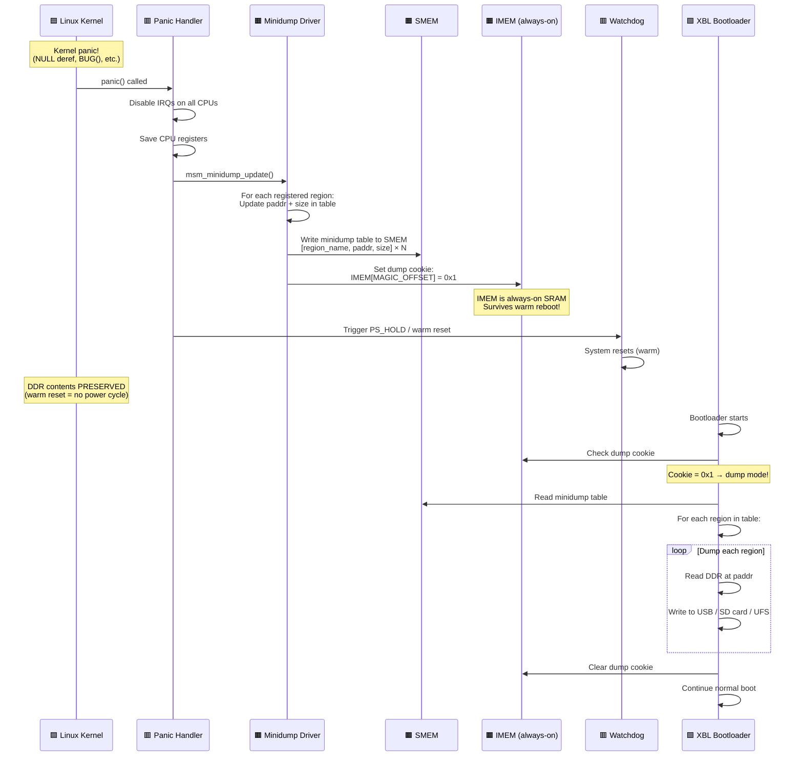
```mermaid
sequenceDiagram
    participant KERNEL as 🟦 Linux Kernel
    participant PANIC as 🟥 Panic Handler
    participant MINI_DRV as 🟧 Minidump Driver
    participant SMEM as 🟧 SMEM
    participant IMEM as 🟧 IMEM (always-on)
    participant WDT as 🟥 Watchdog
    participant SBL as 🟩 XBL Bootloader

    Note over KERNEL: Kernel panic!<br/>(NULL deref, BUG(), etc.)

    KERNEL->>PANIC: panic() called

    PANIC->>PANIC: Disable IRQs on all CPUs
    PANIC->>PANIC: Save CPU registers

    PANIC->>MINI_DRV: msm_minidump_update()

    MINI_DRV->>MINI_DRV: For each registered region:<br/>Update paddr + size in table

    MINI_DRV->>SMEM: Write minidump table to SMEM<br/>[region_name, paddr, size] × N

    MINI_DRV->>IMEM: Set dump cookie:<br/>IMEM[MAGIC_OFFSET] = 0x1

    Note over IMEM: IMEM is always-on SRAM<br/>Survives warm reboot!

    PANIC->>WDT: Trigger PS_HOLD / warm reset
    WDT->>WDT: System resets (warm)

    Note over KERNEL: DDR contents PRESERVED<br/>(warm reset = no power cycle)

    SBL->>SBL: Bootloader starts

    SBL->>IMEM: Check dump cookie
    Note over SBL: Cookie = 0x1 → dump mode!

    SBL->>SMEM: Read minidump table
    SBL->>SBL: For each region in table:

    loop Dump each region
        SBL->>SBL: Read DDR at paddr
        SBL->>SBL: Write to USB / SD card / UFS
    end

    SBL->>IMEM: Clear dump cookie
    SBL->>SBL: Continue normal boot
```

---

## Q15: Qualcomm Boot Memory Handoff (XBL → HLOS)

### Interview Question
**"Walk through the Qualcomm boot memory setup from power-on to Linux kernel. How do XBL/SBL, TrustZone, and Hypervisor carve out memory before Linux starts? How does Linux discover available memory? What are the reserved memory regions?"**

### Deep Answer

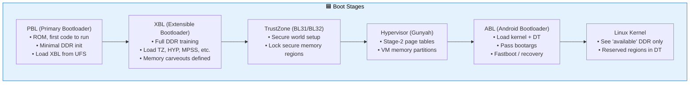
```mermaid
flowchart TB
    subgraph Boot_Stages["🟦 Boot Stages"]
        PBL["PBL (Primary Bootloader)\n• ROM, first code to run\n• Minimal DDR init\n• Load XBL from UFS"]
        XBL["XBL (Extensible Bootloader)\n• Full DDR training\n• Load TZ, HYP, MPSS, etc.\n• Memory carveouts defined"]
        TZ_B["TrustZone (BL31/BL32)\n• Secure world setup\n• Lock secure memory regions"]
        HYP_B["Hypervisor (Gunyah)\n• Stage-2 page tables\n• VM memory partitions"]
        ABL["ABL (Android Bootloader)\n• Load kernel + DT\n• Pass bootargs\n• Fastboot / recovery"]
        LINUX["Linux Kernel\n• See 'available' DDR only\n• Reserved regions in DT"]
    end

    PBL --> XBL --> TZ_B --> HYP_B --> ABL --> LINUX

    style Boot_Stages fill:#e3f2fd,stroke:#1565c0,color:#000
```

### Memory Map After Boot

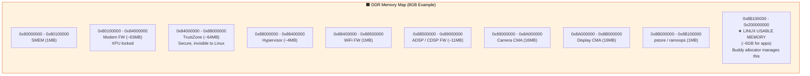
```mermaid
flowchart LR
    subgraph DDR_MAP["🟧 DDR Memory Map (8GB Example)"]
        direction TB
        R1["0x80000000 - 0x80100000\nSMEM (1MB)"]
        R2["0x80100000 - 0x84000000\nModem FW (~63MB)\nXPU locked"]
        R3["0x84000000 - 0x88000000\nTrustZone (~64MB)\nSecure, invisible to Linux"]
        R4["0x88000000 - 0x88400000\nHypervisor (~4MB)"]
        R5["0x88400000 - 0x88500000\nWiFi FW (1MB)"]
        R6["0x88500000 - 0x89000000\nADSP / CDSP FW (~11MB)"]
        R7["0x89000000 - 0x8A000000\nCamera CMA (16MB)"]
        R8["0x8A000000 - 0x8B000000\nDisplay CMA (16MB)"]
        R9["0x8B000000 - 0x8B100000\npstore / ramoops (1MB)"]
        R10["0x8B100000 - 0x200000000\n★ LINUX USABLE MEMORY\n(~6GB for apps)\nBuddy allocator manages this"]
    end

    style DDR_MAP fill:#fff3e0,stroke:#e65100,color:#000
```

### Boot Memory Setup Sequence

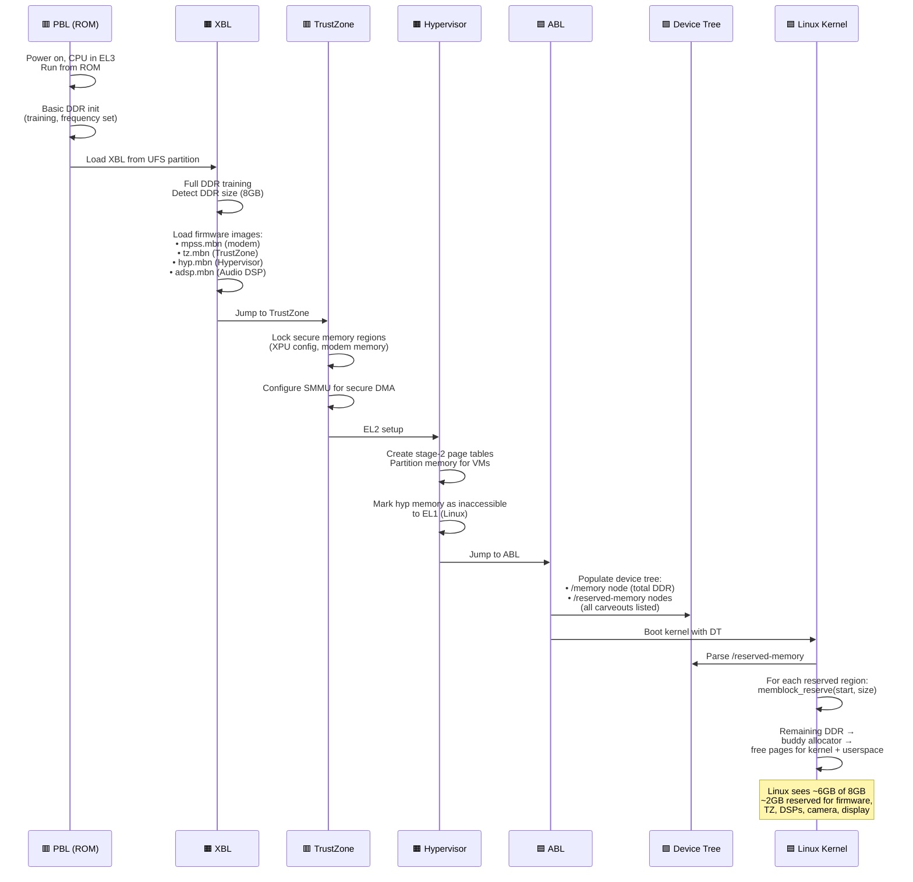
```mermaid
sequenceDiagram
    participant PBL as 🟥 PBL (ROM)
    participant XBL as 🟧 XBL
    participant TZ as 🟥 TrustZone
    participant HYP as 🟧 Hypervisor
    participant ABL as 🟦 ABL
    participant DT as 🟩 Device Tree
    participant LINUX as 🟦 Linux Kernel

    PBL->>PBL: Power on, CPU in EL3<br/>Run from ROM
    PBL->>PBL: Basic DDR init<br/>(training, frequency set)
    PBL->>XBL: Load XBL from UFS partition

    XBL->>XBL: Full DDR training<br/>Detect DDR size (8GB)

    XBL->>XBL: Load firmware images:<br/>• mpss.mbn (modem)<br/>• tz.mbn (TrustZone)<br/>• hyp.mbn (Hypervisor)<br/>• adsp.mbn (Audio DSP)

    XBL->>TZ: Jump to TrustZone

    TZ->>TZ: Lock secure memory regions<br/>(XPU config, modem memory)
    TZ->>TZ: Configure SMMU for secure DMA

    TZ->>HYP: EL2 setup

    HYP->>HYP: Create stage-2 page tables<br/>Partition memory for VMs
    HYP->>HYP: Mark hyp memory as inaccessible<br/>to EL1 (Linux)

    HYP->>ABL: Jump to ABL

    ABL->>DT: Populate device tree:<br/>• /memory node (total DDR)<br/>• /reserved-memory nodes<br/>  (all carveouts listed)

    ABL->>LINUX: Boot kernel with DT

    LINUX->>DT: Parse /reserved-memory

    LINUX->>LINUX: For each reserved region:<br/>memblock_reserve(start, size)

    LINUX->>LINUX: Remaining DDR →<br/>buddy allocator →<br/>free pages for kernel + userspace

    Note over LINUX: Linux sees ~6GB of 8GB<br/>~2GB reserved for firmware,<br/>TZ, DSPs, camera, display
```

---

## Q16: WiFi Driver Memory Management (ath11k/ath12k)

### Interview Question
**"How does the Qualcomm WiFi driver (ath11k for WiFi 6 / ath12k for WiFi 7) manage DMA buffers for packet tx/rx? Explain the ring buffer architecture, DMA coherent vs streaming mappings, and how the driver handles high-throughput packet memory."**

### Deep Answer

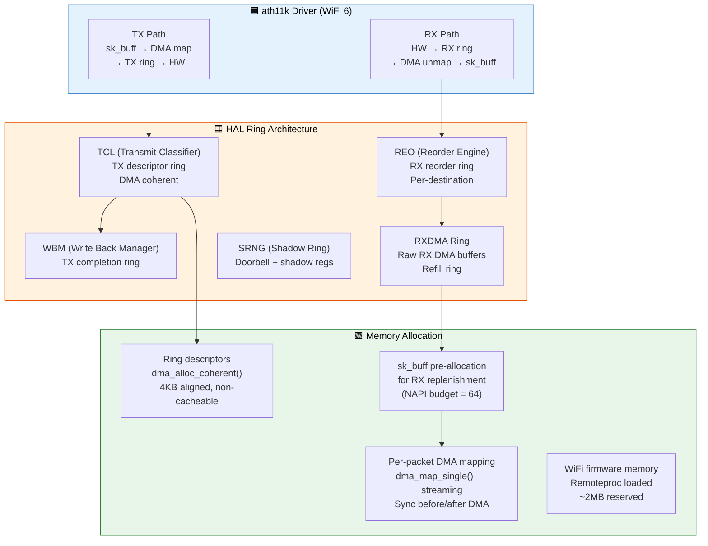
```mermaid
flowchart TB
    subgraph ATH11K["🟦 ath11k Driver (WiFi 6)"]
        TX_PATH["TX Path\nsk_buff → DMA map\n→ TX ring → HW"]
        RX_PATH["RX Path\nHW → RX ring\n→ DMA unmap → sk_buff"]
    end

    subgraph HAL_Rings["🟧 HAL Ring Architecture"]
        TCL["TCL (Transmit Classifier)\nTX descriptor ring\nDMA coherent"]
        WBM["WBM (Write Back Manager)\nTX completion ring"]
        REO["REO (Reorder Engine)\nRX reorder ring\nPer-destination"]
        RXDMA["RXDMA Ring\nRaw RX DMA buffers\nRefill ring"]
        SRNG["SRNG (Shadow Ring)\nDoorbell + shadow regs"]
    end

    subgraph DMA_Alloc["🟩 Memory Allocation"]
        RING_MEM["Ring descriptors\ndma_alloc_coherent()\n4KB aligned, non-cacheable"]
        SKB_POOL["sk_buff pre-allocation\nfor RX replenishment\n(NAPI budget = 64)"]
        DMA_MAP["Per-packet DMA mapping\ndma_map_single() — streaming\nSync before/after DMA"]
        FW_MEM["WiFi firmware memory\nRemoteproc loaded\n~2MB reserved"]
    end

    TX_PATH --> TCL --> WBM
    RX_PATH --> REO --> RXDMA
    TCL --> RING_MEM
    RXDMA --> SKB_POOL
    SKB_POOL --> DMA_MAP

    style ATH11K fill:#e3f2fd,stroke:#1565c0,color:#000
    style HAL_Rings fill:#fff3e0,stroke:#e65100,color:#000
    style DMA_Alloc fill:#e8f5e9,stroke:#2e7d32,color:#000
```

### WiFi RX Packet DMA Lifecycle Sequence

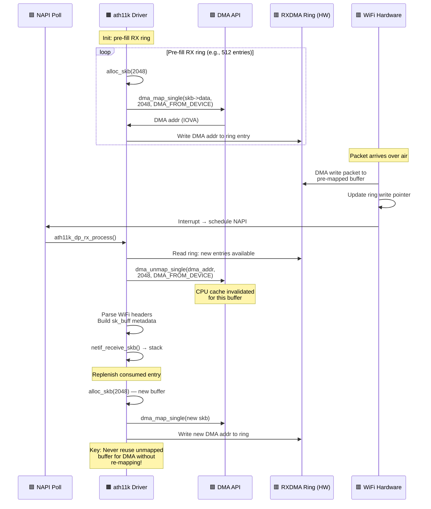
```mermaid
sequenceDiagram
    participant NAPI as 🟦 NAPI Poll
    participant DRV as 🟧 ath11k Driver
    participant DMA_API as 🟩 DMA API
    participant RXDMA as 🟥 RXDMA Ring (HW)
    participant WIFI_HW as 🟥 WiFi Hardware

    Note over DRV: Init: pre-fill RX ring

    loop Pre-fill RX ring (e.g., 512 entries)
        DRV->>DRV: alloc_skb(2048)
        DRV->>DMA_API: dma_map_single(skb->data,<br/>2048, DMA_FROM_DEVICE)
        DMA_API->>DRV: DMA addr (IOVA)
        DRV->>RXDMA: Write DMA addr to ring entry
    end

    Note over WIFI_HW: Packet arrives over air

    WIFI_HW->>RXDMA: DMA write packet to<br/>pre-mapped buffer
    WIFI_HW->>WIFI_HW: Update ring write pointer

    WIFI_HW->>NAPI: Interrupt → schedule NAPI

    NAPI->>DRV: ath11k_dp_rx_process()

    DRV->>RXDMA: Read ring: new entries available
    DRV->>DMA_API: dma_unmap_single(dma_addr,<br/>2048, DMA_FROM_DEVICE)
    Note over DMA_API: CPU cache invalidated<br/>for this buffer

    DRV->>DRV: Parse WiFi headers<br/>Build sk_buff metadata

    DRV->>DRV: netif_receive_skb() → stack

    Note over DRV: Replenish consumed entry

    DRV->>DRV: alloc_skb(2048) — new buffer
    DRV->>DMA_API: dma_map_single(new skb)
    DRV->>RXDMA: Write new DMA addr to ring

    Note over DRV: Key: Never reuse unmapped<br/>buffer for DMA without<br/>re-mapping!
```

---

## Q17: Qualcomm Power Management and Memory (RPMh / LPM)

### Interview Question
**"How does Qualcomm power management interact with memory? When the SoC enters deep sleep (CX collapse), what happens to DDR? How does RPMh manage memory controller power states? What is the relationship between LPM levels and memory self-refresh?"**

### Deep Answer

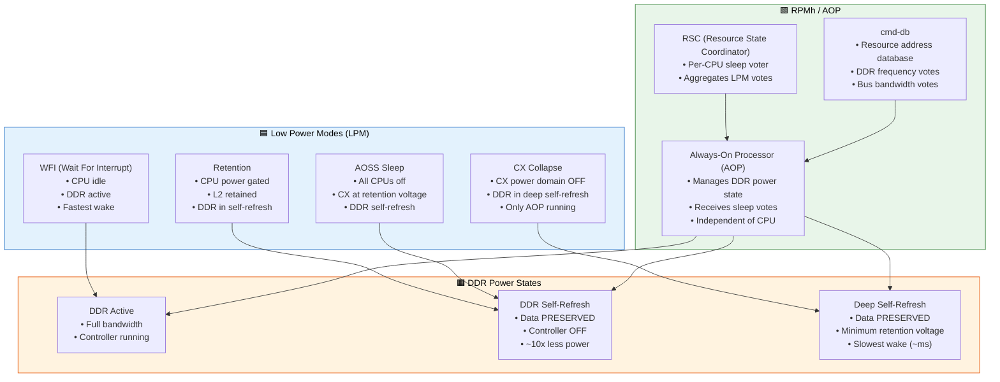
```mermaid
flowchart TB
    subgraph LPM_Levels["🟦 Low Power Modes (LPM)"]
        WFI["WFI (Wait For Interrupt)\n• CPU idle\n• DDR active\n• Fastest wake"]
        RET["Retention\n• CPU power gated\n• L2 retained\n• DDR in self-refresh"]
        AOSS["AOSS Sleep\n• All CPUs off\n• CX at retention voltage\n• DDR self-refresh"]
        CX_COLLAPSE["CX Collapse\n• CX power domain OFF\n• DDR in deep self-refresh\n• Only AOP running"]
    end

    subgraph DDR_States["🟧 DDR Power States"]
        ACTIVE["DDR Active\n• Full bandwidth\n• Controller running"]
        SELF_REF["DDR Self-Refresh\n• Data PRESERVED\n• Controller OFF\n• ~10x less power"]
        DEEP_SR["Deep Self-Refresh\n• Data PRESERVED\n• Minimum retention voltage\n• Slowest wake (~ms)"]
    end

    subgraph RPMh["🟩 RPMh / AOP"]
        AOP["Always-On Processor (AOP)\n• Manages DDR power state\n• Receives sleep votes\n• Independent of CPU"]
        CMD_DB["cmd-db\n• Resource address database\n• DDR frequency votes\n• Bus bandwidth votes"]
        RSC["RSC (Resource State Coordinator)\n• Per-CPU sleep voter\n• Aggregates LPM votes"]
    end

    WFI --> ACTIVE
    RET --> SELF_REF
    AOSS --> SELF_REF
    CX_COLLAPSE --> DEEP_SR

    RSC --> AOP
    AOP --> ACTIVE & SELF_REF & DEEP_SR
    CMD_DB --> AOP

    style LPM_Levels fill:#e3f2fd,stroke:#1565c0,color:#000
    style DDR_States fill:#fff3e0,stroke:#e65100,color:#000
    style RPMh fill:#e8f5e9,stroke:#2e7d32,color:#000
```

### System Sleep / Wake Memory Sequence

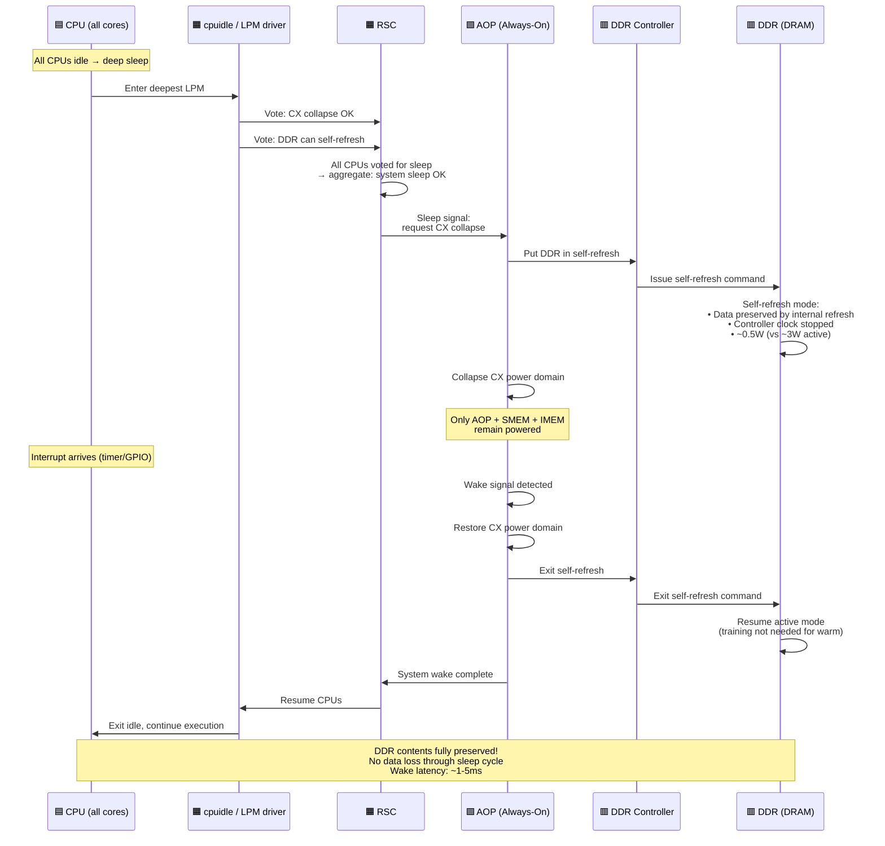
```mermaid
sequenceDiagram
    participant CPU as 🟦 CPU (all cores)
    participant LPMH as 🟧 cpuidle / LPM driver
    participant RSC as 🟧 RSC
    participant AOP as 🟩 AOP (Always-On)
    participant DDR_CTRL as 🟥 DDR Controller
    participant DDR as 🟥 DDR (DRAM)

    Note over CPU: All CPUs idle → deep sleep

    CPU->>LPMH: Enter deepest LPM

    LPMH->>RSC: Vote: CX collapse OK
    LPMH->>RSC: Vote: DDR can self-refresh

    RSC->>RSC: All CPUs voted for sleep<br/>→ aggregate: system sleep OK

    RSC->>AOP: Sleep signal:<br/>request CX collapse

    AOP->>DDR_CTRL: Put DDR in self-refresh
    DDR_CTRL->>DDR: Issue self-refresh command
    DDR->>DDR: Self-refresh mode:<br/>• Data preserved by internal refresh<br/>• Controller clock stopped<br/>• ~0.5W (vs ~3W active)

    AOP->>AOP: Collapse CX power domain
    Note over AOP: Only AOP + SMEM + IMEM<br/>remain powered

    Note over CPU: Interrupt arrives (timer/GPIO)

    AOP->>AOP: Wake signal detected

    AOP->>AOP: Restore CX power domain

    AOP->>DDR_CTRL: Exit self-refresh
    DDR_CTRL->>DDR: Exit self-refresh command
    DDR->>DDR: Resume active mode<br/>(training not needed for warm)

    AOP->>RSC: System wake complete

    RSC->>LPMH: Resume CPUs
    LPMH->>CPU: Exit idle, continue execution

    Note over CPU,DDR: DDR contents fully preserved!<br/>No data loss through sleep cycle<br/>Wake latency: ~1-5ms
```

---

## Q18: Thermal Throttling and Memory Bandwidth

### Interview Question
**"How does the Qualcomm thermal management framework interact with memory bandwidth? When the SoC overheats, how does the kernel reduce memory bandwidth consumption? What is DCVS and how does it relate to DDR frequency scaling?"**

### Deep Answer

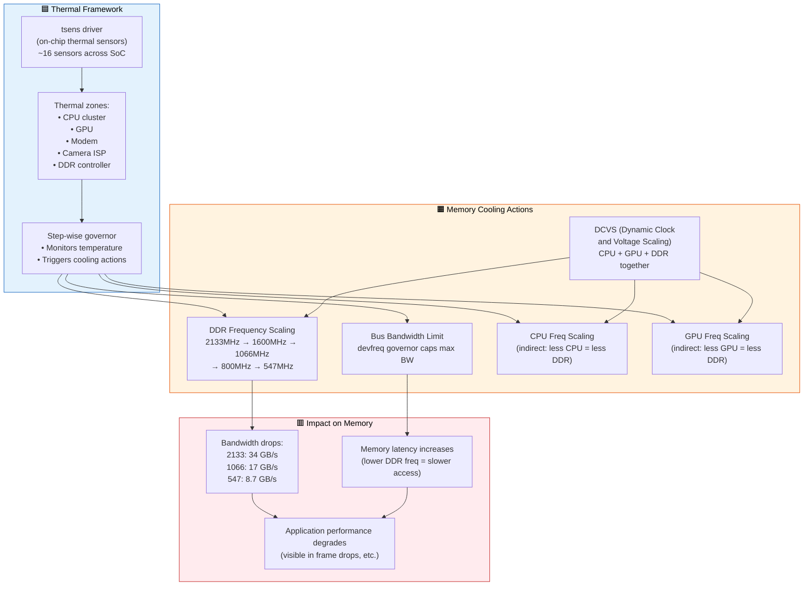
```mermaid
flowchart TB
    subgraph Thermal["🟦 Thermal Framework"]
        TSENS["tsens driver\n(on-chip thermal sensors)\n~16 sensors across SoC"]
        ZONES["Thermal zones:\n• CPU cluster\n• GPU\n• Modem\n• Camera ISP\n• DDR controller"]
        GOV["Step-wise governor\n• Monitors temperature\n• Triggers cooling actions"]
    end

    subgraph Cooling["🟧 Memory Cooling Actions"]
        DDR_FREQ["DDR Frequency Scaling\n2133MHz → 1600MHz → 1066MHz\n→ 800MHz → 547MHz"]
        BW_LIMIT["Bus Bandwidth Limit\ndevfreq governor caps max BW"]
        CPU_FREQ["CPU Freq Scaling\n(indirect: less CPU = less DDR)"]
        GPU_FREQ["GPU Freq Scaling\n(indirect: less GPU = less DDR)"]
        DCVS["DCVS (Dynamic Clock\nand Voltage Scaling)\nCPU + GPU + DDR together"]
    end

    subgraph Impact["🟥 Impact on Memory"]
        BW_DROP["Bandwidth drops:\n2133: 34 GB/s\n1066: 17 GB/s\n547: 8.7 GB/s"]
        LATENCY["Memory latency increases\n(lower DDR freq = slower access)"]
        PERF["Application performance degrades\n(visible in frame drops, etc.)"]
    end

    TSENS --> ZONES --> GOV
    GOV --> DDR_FREQ & BW_LIMIT & CPU_FREQ & GPU_FREQ
    DDR_FREQ --> BW_DROP
    BW_LIMIT --> LATENCY
    BW_DROP & LATENCY --> PERF
    DCVS --> DDR_FREQ & CPU_FREQ & GPU_FREQ

    style Thermal fill:#e3f2fd,stroke:#1565c0,color:#000
    style Cooling fill:#fff3e0,stroke:#e65100,color:#000
    style Impact fill:#ffebee,stroke:#c62828,color:#000
```

### Thermal Throttle Memory Bandwidth Sequence

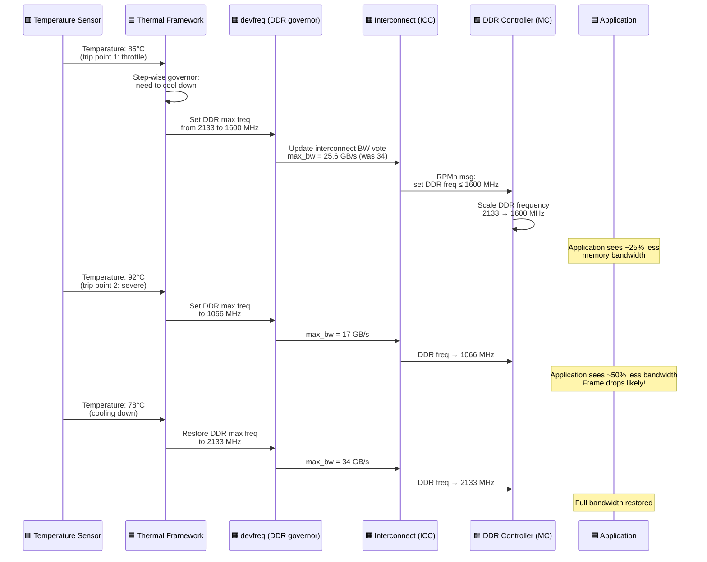
```mermaid
sequenceDiagram
    participant TSENS as 🟥 Temperature Sensor
    participant THERM as 🟦 Thermal Framework
    participant DEVFREQ as 🟧 devfreq (DDR governor)
    participant ICC as 🟧 Interconnect (ICC)
    participant DDR_CTRL as 🟩 DDR Controller (MC)
    participant APP as 🟦 Application

    TSENS->>THERM: Temperature: 85°C<br/>(trip point 1: throttle)

    THERM->>THERM: Step-wise governor:<br/>need to cool down

    THERM->>DEVFREQ: Set DDR max freq<br/>from 2133 to 1600 MHz

    DEVFREQ->>ICC: Update interconnect BW vote<br/>max_bw = 25.6 GB/s (was 34)

    ICC->>DDR_CTRL: RPMh msg:<br/>set DDR freq ≤ 1600 MHz

    DDR_CTRL->>DDR_CTRL: Scale DDR frequency<br/>2133 → 1600 MHz

    Note over APP: Application sees ~25% less<br/>memory bandwidth

    TSENS->>THERM: Temperature: 92°C<br/>(trip point 2: severe)

    THERM->>DEVFREQ: Set DDR max freq<br/>to 1066 MHz

    DEVFREQ->>ICC: max_bw = 17 GB/s
    ICC->>DDR_CTRL: DDR freq → 1066 MHz

    Note over APP: Application sees ~50% less bandwidth<br/>Frame drops likely!

    TSENS->>THERM: Temperature: 78°C<br/>(cooling down)

    THERM->>DEVFREQ: Restore DDR max freq<br/>to 2133 MHz

    DEVFREQ->>ICC: max_bw = 34 GB/s
    ICC->>DDR_CTRL: DDR freq → 2133 MHz

    Note over APP: Full bandwidth restored
```

---

## Q19: USB/Type-C Driver Memory Management

### Interview Question
**"How does the Qualcomm USB driver (DWC3 + QC-specific PHY) manage DMA buffers for USB transfers? Explain TRB ring buffers, the relationship between URBs and DMA, and how the driver handles USB mass storage large transfers."**

### Deep Answer

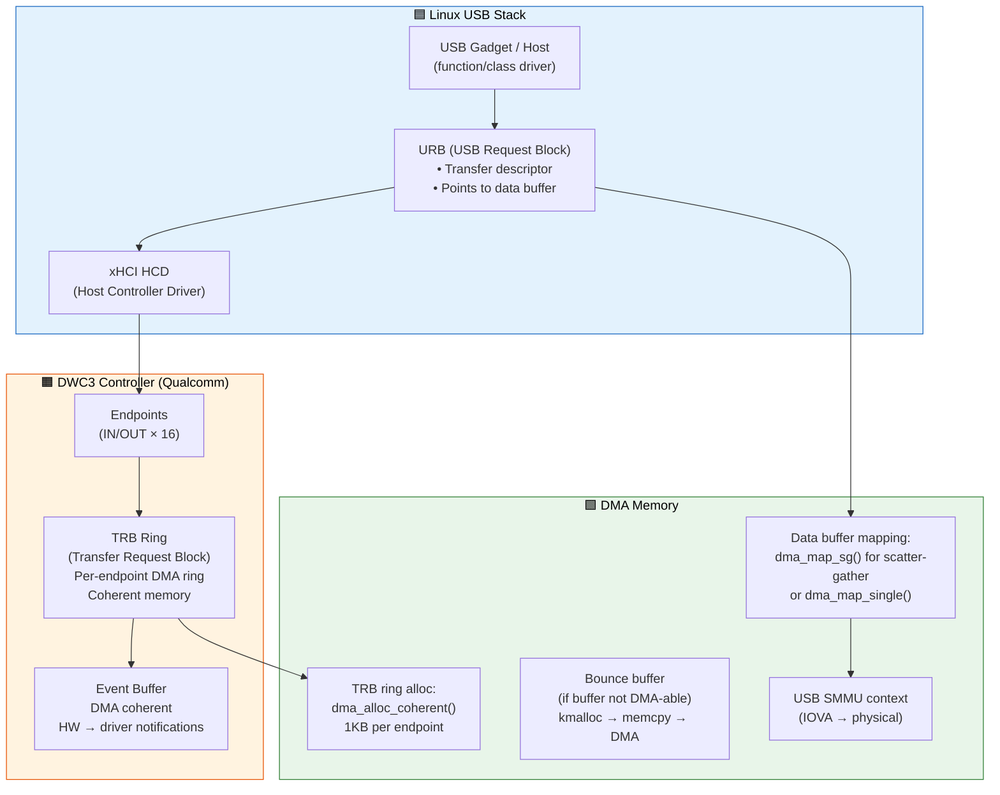
```mermaid
flowchart TB
    subgraph USB_Stack["🟦 Linux USB Stack"]
        GADGET["USB Gadget / Host\n(function/class driver)"]
        URB["URB (USB Request Block)\n• Transfer descriptor\n• Points to data buffer"]
        HCD["xHCI HCD\n(Host Controller Driver)"]
    end

    subgraph DWC3["🟧 DWC3 Controller (Qualcomm)"]
        EP["Endpoints\n(IN/OUT × 16)"]
        TRB_RING["TRB Ring\n(Transfer Request Block)\nPer-endpoint DMA ring\nCoherent memory"]
        EVT_BUF["Event Buffer\nDMA coherent\nHW → driver notifications"]
    end

    subgraph DMA_Mem["🟩 DMA Memory"]
        TRB_ALLOC["TRB ring alloc:\ndma_alloc_coherent()\n1KB per endpoint"]
        BUF_MAP["Data buffer mapping:\ndma_map_sg() for scatter-gather\nor dma_map_single()"]
        BOUNCE["Bounce buffer\n(if buffer not DMA-able)\nkmalloc → memcpy → DMA"]
        IOMMU_USB["USB SMMU context\n(IOVA → physical)"]
    end

    GADGET --> URB --> HCD
    HCD --> EP --> TRB_RING
    TRB_RING --> TRB_ALLOC
    URB --> BUF_MAP
    BUF_MAP --> IOMMU_USB
    TRB_RING --> EVT_BUF

    style USB_Stack fill:#e3f2fd,stroke:#1565c0,color:#000
    style DWC3 fill:#fff3e0,stroke:#e65100,color:#000
    style DMA_Mem fill:#e8f5e9,stroke:#2e7d32,color:#000
```

### USB Bulk Transfer DMA Sequence

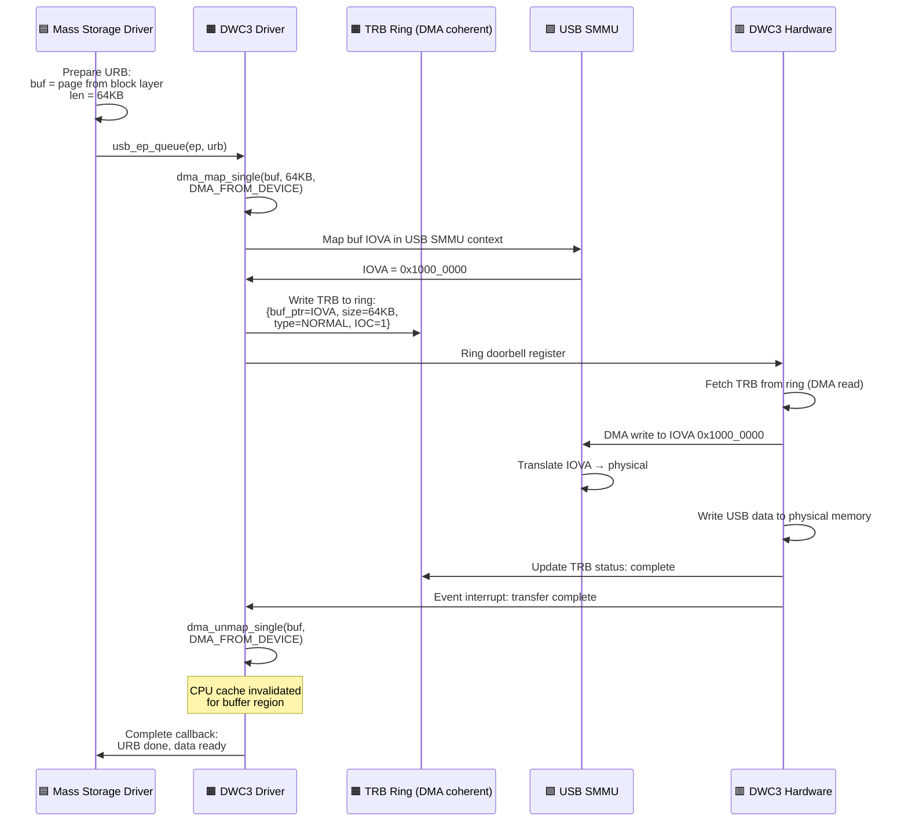
```mermaid
sequenceDiagram
    participant CLASS as 🟦 Mass Storage Driver
    participant DWC3 as 🟧 DWC3 Driver
    participant TRB as 🟧 TRB Ring (DMA coherent)
    participant SMMU as 🟩 USB SMMU
    participant DWC3_HW as 🟥 DWC3 Hardware

    CLASS->>CLASS: Prepare URB:<br/>buf = page from block layer<br/>len = 64KB

    CLASS->>DWC3: usb_ep_queue(ep, urb)

    DWC3->>DWC3: dma_map_single(buf, 64KB,<br/>DMA_FROM_DEVICE)

    DWC3->>SMMU: Map buf IOVA in USB SMMU context
    SMMU->>DWC3: IOVA = 0x1000_0000

    DWC3->>TRB: Write TRB to ring:<br/>{buf_ptr=IOVA, size=64KB,<br/> type=NORMAL, IOC=1}

    DWC3->>DWC3_HW: Ring doorbell register

    DWC3_HW->>DWC3_HW: Fetch TRB from ring (DMA read)
    DWC3_HW->>SMMU: DMA write to IOVA 0x1000_0000
    SMMU->>SMMU: Translate IOVA → physical
    DWC3_HW->>DWC3_HW: Write USB data to physical memory

    DWC3_HW->>TRB: Update TRB status: complete
    DWC3_HW->>DWC3: Event interrupt: transfer complete

    DWC3->>DWC3: dma_unmap_single(buf,<br/>DMA_FROM_DEVICE)
    Note over DWC3: CPU cache invalidated<br/>for buffer region

    DWC3->>CLASS: Complete callback:<br/>URB done, data ready
```

---

## Q20: V4L2 Media Pipeline Memory Management

### Interview Question
**"How does the Qualcomm V4L2 media pipeline manage video buffer memory? Explain VIDIOC_REQBUFS allocation modes (MMAP vs DMABUF vs USERPTR), how buffers flow through a multi-node pipeline, and the role of the media controller in buffer routing."**

### Deep Answer

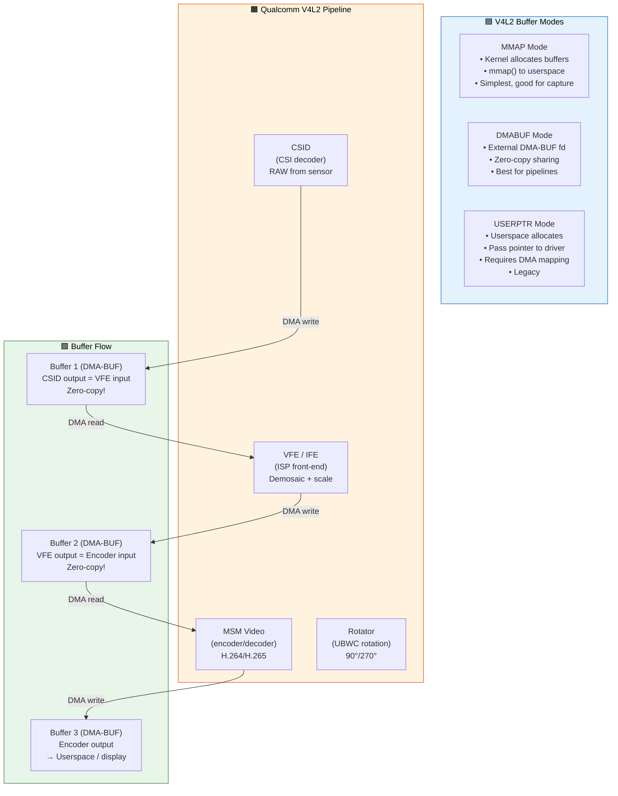
```mermaid
flowchart TB
    subgraph V4L2_Modes["🟦 V4L2 Buffer Modes"]
        MMAP["MMAP Mode\n• Kernel allocates buffers\n• mmap() to userspace\n• Simplest, good for capture"]
        DMABUF["DMABUF Mode\n• External DMA-BUF fd\n• Zero-copy sharing\n• Best for pipelines"]
        USERPTR["USERPTR Mode\n• Userspace allocates\n• Pass pointer to driver\n• Requires DMA mapping\n• Legacy"]
    end

    subgraph Pipeline["🟧 Qualcomm V4L2 Pipeline"]
        CSID["CSID\n(CSI decoder)\nRAW from sensor"]
        VFE["VFE / IFE\n(ISP front-end)\nDemosaic + scale"]
        MSMP["MSM Video\n(encoder/decoder)\nH.264/H.265"]
        ROTATOR["Rotator\n(UBWC rotation)\n90°/270°"]
    end

    subgraph Buffers["🟩 Buffer Flow"]
        B1["Buffer 1 (DMA-BUF)\nCSID output = VFE input\nZero-copy!"]
        B2["Buffer 2 (DMA-BUF)\nVFE output = Encoder input\nZero-copy!"]
        B3["Buffer 3 (DMA-BUF)\nEncoder output\n→ Userspace / display"]
    end

    CSID -->|"DMA write"| B1
    B1 -->|"DMA read"| VFE
    VFE -->|"DMA write"| B2
    B2 -->|"DMA read"| MSMP
    MSMP -->|"DMA write"| B3

    style V4L2_Modes fill:#e3f2fd,stroke:#1565c0,color:#000
    style Pipeline fill:#fff3e0,stroke:#e65100,color:#000
    style Buffers fill:#e8f5e9,stroke:#2e7d32,color:#000
```

### V4L2 DMA-BUF Pipeline Buffer Flow Sequence

```mermaid
sequenceDiagram
    participant APP as 🟦 Camera App / GStreamer
    participant V4L2_CAP as 🟧 V4L2 Capture (VFE)
    participant V4L2_ENC as 🟧 V4L2 Encoder (Venus)
    participant HEAP as 🟩 DMA-BUF Heap
    participant CAM_SMMU as 🟥 Camera SMMU
    participant VID_SMMU as 🟥 Video SMMU

    APP->>HEAP: Allocate DMA-BUF (YUV 1080p, 3MB)
    HEAP->>APP: DMA-BUF fd = 5

    APP->>V4L2_CAP: VIDIOC_REQBUFS(DMABUF, 4)
    APP->>V4L2_CAP: VIDIOC_QBUF(fd=5, type=CAPTURE)

    V4L2_CAP->>CAM_SMMU: dma_buf_map_attachment()<br/>Map fd=5 into Camera IOVA space
    CAM_SMMU->>V4L2_CAP: Camera IOVA = 0xA000_0000

    APP->>V4L2_CAP: VIDIOC_STREAMON

    V4L2_CAP->>V4L2_CAP: ISP processes frame<br/>DMA writes to Camera IOVA

    V4L2_CAP->>APP: VIDIOC_DQBUF → fd=5 ready

    Note over APP: Same fd=5 now goes to encoder<br/>NO COPY needed!

    APP->>V4L2_ENC: VIDIOC_QBUF(fd=5, type=OUTPUT)

    V4L2_ENC->>VID_SMMU: dma_buf_map_attachment()<br/>Map SAME fd=5 into Video IOVA
    VID_SMMU->>V4L2_ENC: Video IOVA = 0xB000_0000

    Note over V4L2_ENC: Same physical pages,<br/>different IOVA!<br/>Zero-copy pipeline!

    V4L2_ENC->>V4L2_ENC: Encode H.265<br/>Read from Video IOVA

    V4L2_ENC->>APP: Encoded frame ready

    APP->>V4L2_ENC: Release: dma_buf_unmap()
    APP->>V4L2_CAP: Release: dma_buf_unmap()

    Note over APP: DMA-BUF refcount → 0<br/>Physical pages freed
```

---

## Key Source Files (Part 2)

| Component | Source |
|-----------|--------|
| Modem PIL/Remoteproc | `drivers/remoteproc/qcom_q6v5_mss.c` |
| GLINK transport | `drivers/rpmsg/qcom_glink_smem.c` |
| SMEM | `drivers/soc/qcom/smem.c` |
| Audio (ADSP) | `sound/soc/qcom/qdsp6/` |
| Camera ISP | `drivers/media/platform/qcom/camss/` |
| Minidump | `drivers/soc/qcom/qcom_minidump.c` |
| Boot memory (DT) | `arch/arm64/boot/dts/qcom/*-reserved-memory.dtsi` |
| ath11k WiFi | `drivers/net/wireless/ath/ath11k/dp.c` |
| RPMh / AOP | `drivers/soc/qcom/rpmh.c` |
| Thermal (tsens) | `drivers/thermal/qcom/tsens.c` |
| Interconnect (ICC) | `drivers/interconnect/qcom/` |
| DWC3 USB | `drivers/usb/dwc3/dwc3-qcom.c` |
| V4L2 Qualcomm | `drivers/media/platform/qcom/venus/` |
| devfreq (DDR) | `drivers/devfreq/` |
