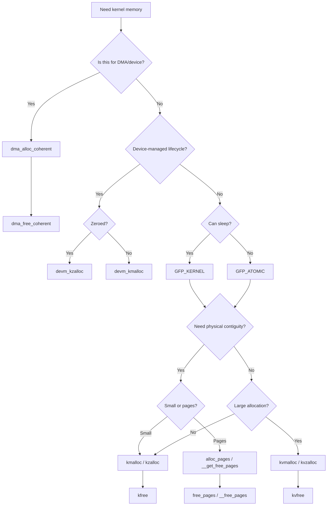
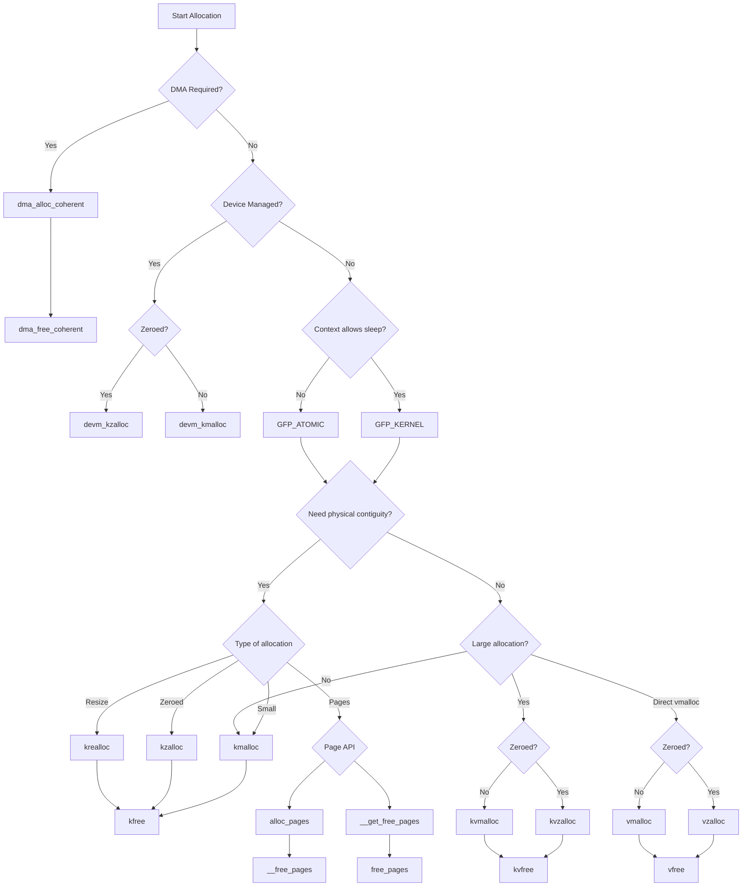
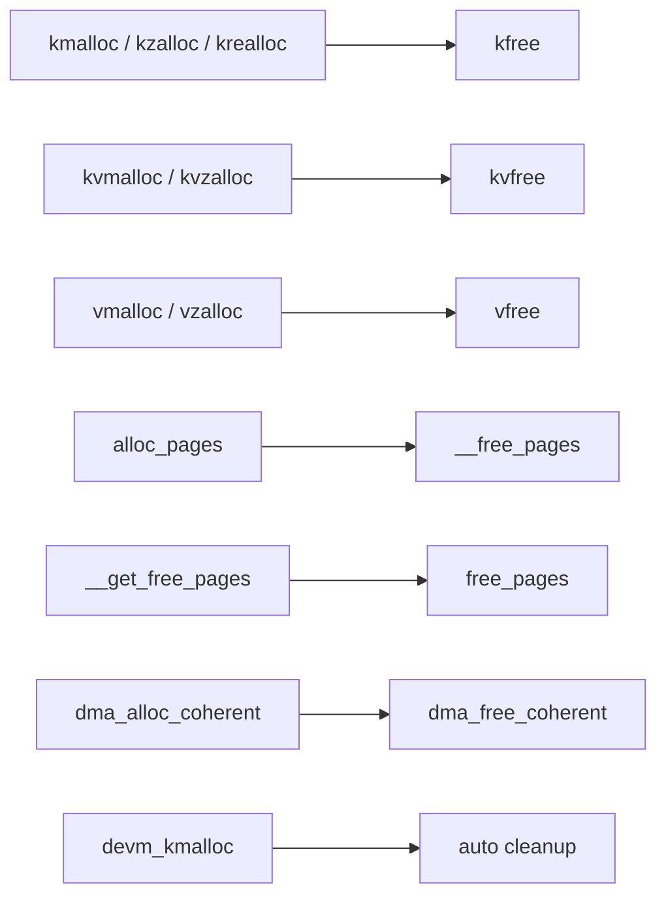

Here’s a **complete Markdown document** (ready for GitHub / Notion / Confluence) with structured sections and embedded **Mermaid flowcharts**.

---

# 🧾 Linux Kernel Memory Allocation: API Selection Guide and Decision Flow

---

## 📌 Overview

Memory allocation in the Linux kernel is **not one-size-fits-all**.
Different APIs exist because of constraints like:

* Physical vs virtual contiguity
* Allocation size
* Performance requirements
* Execution context (sleep vs atomic)
* Hardware/DMA requirements

This guide explains:

* Which API to use
* When to use it
* Matching free APIs
* Decision flow

---

## 🧠 Core Concepts

### 🔹 Physical vs Virtual Memory

| Type     | Description                                      |
| -------- | ------------------------------------------------ |
| Physical | Actual RAM, contiguous in hardware               |
| Virtual  | Kernel mapping, may not be physically contiguous |

---

### 🔹 Allocation Constraints

| Constraint  | Impact                             |
| ----------- | ---------------------------------- |
| Size        | kmalloc (small) vs vmalloc (large) |
| Contiguity  | Hardware may require physical      |
| Context     | GFP flags matter                   |
| Performance | kmalloc faster than vmalloc        |

---

## ⚙️ GFP Flags (Allocation Context)

| Flag         | Use Case                   |
| ------------ | -------------------------- |
| `GFP_KERNEL` | Normal context (can sleep) |
| `GFP_ATOMIC` | Interrupt/atomic context   |
| `GFP_DMA`    | DMA-capable memory         |

---

## 🧩 Allocation APIs Summary

| API                  | Use Case           | Contiguity | Free API            |
| -------------------- | ------------------ | ---------- | ------------------- |
| `kmalloc`            | Small allocations  | Physical   | `kfree`             |
| `kzalloc`            | Zeroed memory      | Physical   | `kfree`             |
| `krealloc`           | Resize buffer      | Physical   | `kfree`             |
| `kvmalloc`           | Large-safe alloc   | Virtual    | `kvfree`            |
| `kvzalloc`           | Large + zeroed     | Virtual    | `kvfree`            |
| `vmalloc`            | Large memory       | Virtual    | `vfree`             |
| `vzalloc`            | Large + zeroed     | Virtual    | `vfree`             |
| `alloc_pages`        | Page-level control | Physical   | `__free_pages`      |
| `__get_free_pages`   | Pages + VA         | Physical   | `free_pages`        |
| `devm_kmalloc`       | Device-managed     | Physical   | Auto                |
| `dma_alloc_coherent` | DMA buffers        | Physical   | `dma_free_coherent` |

---

## 🚀 Primary Decision Flow



---

## 🧭 Detailed Allocation Flow



---

## 🧪 Matching Free APIs (Important)



---

## ⚠️ Common Mistakes

* ❌ Using `vmalloc` when physical contiguity is required
* ❌ Using `kfree` on `vmalloc` memory
* ❌ Using `GFP_KERNEL` in interrupt context
* ❌ Using `kmalloc` for large allocations (> few MB)
* ❌ Using `dma_alloc_coherent` unnecessarily

---

## 🧠 Rules of Thumb

```text
Small + fast + contiguous      → kmalloc / kzalloc
Resize buffer                  → krealloc
Large but flexible             → kvmalloc / kvzalloc
Very large                     → vmalloc / vzalloc
Need page control              → alloc_pages
Driver lifecycle memory        → devm_kmalloc
Hardware DMA                   → dma_alloc_coherent
```

---

## 🏁 Conclusion

There is no single “best” allocation API in the Linux kernel.

Each exists to solve a **specific constraint combination**:

* Performance → `kmalloc`
* Size → `vmalloc`
* Flexibility → `kvmalloc`
* Control → `alloc_pages`
* Hardware → `dma_alloc_coherent`
* Lifecycle → `devm_*`

👉 Choosing the right API is about understanding **requirements, not just syntax**.

---

If you want next step, I can extend this into:

* 🔍 slab allocator internals (SLUB vs SLAB)
* 🧠 memory fragmentation behavior
* 🐞 debugging kernel memory leaks (kmemleak, slabinfo)
* ⚡ real driver examples using each API
