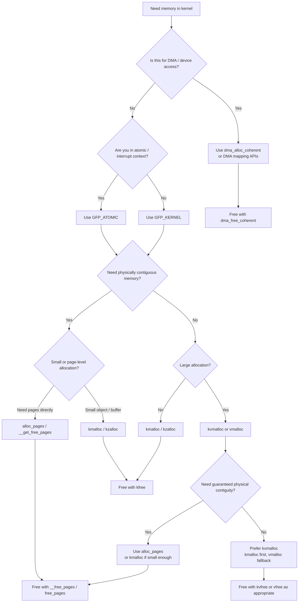
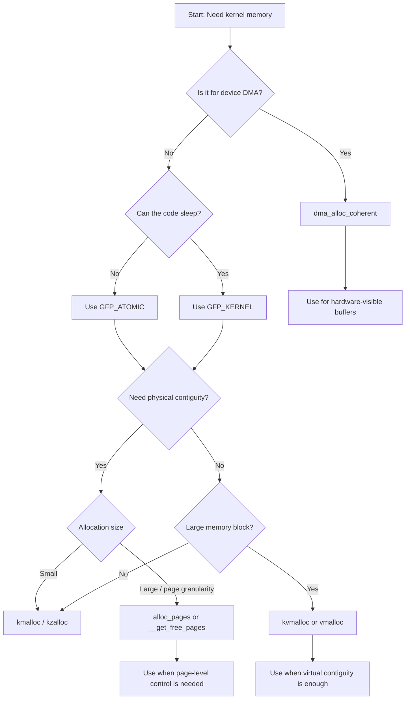
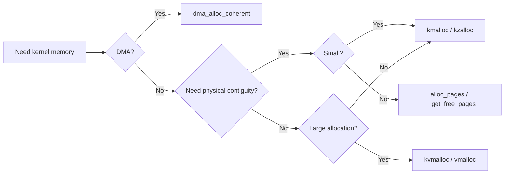
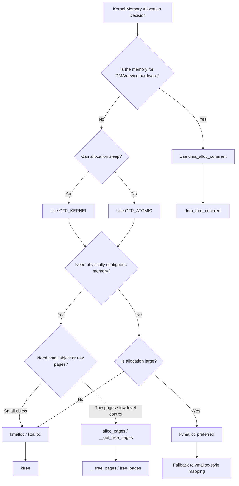
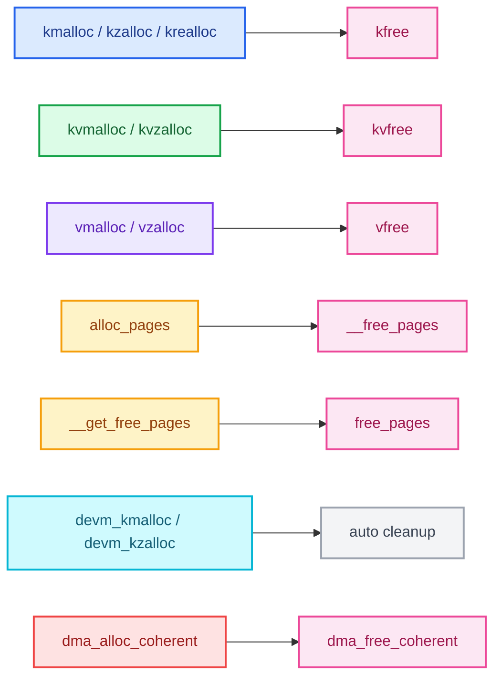

Great question — this is a **core kernel concept** and also one of the most confusing areas at first. Let’s build it **from scratch**, step by step, and then map it to the actual Linux kernel APIs and *when to use which one*.

---

# 🧠 1. First Principles: What is Memory in Kernel?

In the kernel, you deal with **two different realities of memory**:

### 🧩 Physical Memory

* Actual RAM (hardware)
* Example: address like `0x1A3F000`
* Managed by kernel

### 🧠 Virtual Memory

* Abstracted view given to kernel and processes
* Kernel **does NOT directly use physical addresses most of the time**
* Uses **virtual addresses → mapped to physical**

---

# ⚙️ 2. Two Big Questions Every Allocation Answers

Whenever you allocate memory in kernel, you're deciding:

### 1. *Where is memory coming from?*

* Slab allocator
* Page allocator
* vmalloc area

### 2. *What properties do you need?*

* Contiguous (physically?)
* Size (small vs large)
* Performance
* Can sleep or not?

---

# 🧱 3. Kernel Memory Layers (Very Important)

Think of memory allocation as **layers**:

```
[ kmalloc / kzalloc ]   → Small, fast
[ vmalloc ]             → Large, flexible
[ alloc_pages ]         → Low-level page allocation
```

---

# 🚀 4. Most Important APIs (with WHEN to use)

---

## 🔹 4.1 `kmalloc` / `kzalloc`

### ✅ What it does:

* Allocates **physically contiguous memory**
* Very fast (uses slab allocator)

### 🔧 APIs:

```c
void *kmalloc(size_t size, gfp_t flags);
void *kzalloc(size_t size, gfp_t flags); // zeroed
```

### 📌 When to use:

* Small allocations (typically < few KB)
* Need **physical contiguity** (DMA, hardware)
* Performance critical paths

### ⚠️ Notes:

* May fail for large sizes
* Uses slab allocator internally

---

## 🔹 4.2 `vmalloc`

### ✅ What it does:

* Allocates **virtually contiguous memory**
* NOT physically contiguous

### 🔧 API:

```c
void *vmalloc(unsigned long size);
```

### 📌 When to use:

* Large allocations (MBs)
* Physical contiguity NOT required
* Example: buffers, tables

### ⚠️ Tradeoffs:

* Slower (page table setup)
* TLB overhead

---

## 🔹 4.3 `alloc_pages` (Page Allocator)

### ✅ What it does:

* Allocates memory in **pages (4KB units typically)**
* Low-level API

### 🔧 API:

```c
struct page *alloc_pages(gfp_t flags, unsigned int order);
```

* `order = n → 2^n pages`

### 📌 When to use:

* Kernel subsystems
* Drivers needing page-level control
* Building your own allocator

### Example:

```c
alloc_pages(GFP_KERNEL, 2); // 4 pages (16KB)
```

---

## 🔹 4.4 `get_free_pages`

### ✅ What it does:

* Wrapper over `alloc_pages`
* Returns **virtual address directly**

```c
unsigned long __get_free_pages(gfp_t flags, unsigned int order);
```

### 📌 When to use:

* Need contiguous pages
* Want simpler API than `alloc_pages`

---

## 🔹 4.5 `kvmalloc` (Modern Hybrid)

### ✅ What it does:

* Tries `kmalloc` first
* Falls back to `vmalloc` if needed

```c
void *kvmalloc(size_t size, gfp_t flags);
```

### 📌 When to use:

* You don’t care about physical contiguity
* Want safe large allocation

👉 **Best general-purpose API today**

---

## 🔹 4.6 `dma_alloc_coherent`

### ✅ What it does:

* Allocates memory for **DMA devices**
* Physically contiguous + device-accessible

```c
dma_alloc_coherent(...)
```

### 📌 When to use:

* Hardware drivers
* Device DMA buffers

---

# 🧠 5. GFP Flags (CRITICAL)

Every allocation uses **GFP flags**:

### Common ones:

| Flag           | Meaning                          |
| -------------- | -------------------------------- |
| `GFP_KERNEL`   | Normal allocation (can sleep)    |
| `GFP_ATOMIC`   | Cannot sleep (interrupt context) |
| `GFP_DMA`      | For DMA memory                   |
| `GFP_HIGHUSER` | User-space pages                 |

---

### 📌 Rule:

* **Interrupt context → use `GFP_ATOMIC`**
* **Normal kernel code → use `GFP_KERNEL`**

---

# 🔥 6. Decision Tree (Very Important)

Here’s how you decide:

### 👉 Step 1: Size?

* Small (< 8KB) → `kmalloc`
* Large → go next

---

### 👉 Step 2: Need physical contiguity?

* YES → `kmalloc` or `alloc_pages`
* NO → `vmalloc` or `kvmalloc`

---

### 👉 Step 3: Safe general usage?

* Use `kvmalloc`

---

### 👉 Step 4: Hardware / DMA?

* Use `dma_alloc_coherent`

---

# ⚡ 7. Summary Table

| API                | Size  | Physical Contiguous | Speed       | Use Case       |
| ------------------ | ----- | ------------------- | ----------- | -------------- |
| kmalloc            | Small | ✅ Yes               | 🚀 Fast     | General        |
| kzalloc            | Small | ✅ Yes               | 🚀 Fast     | Zeroed memory  |
| vmalloc            | Large | ❌ No                | 🐢 Slower   | Big buffers    |
| kvmalloc           | Any   | Maybe               | 👍 Balanced | Safe choice    |
| alloc_pages        | Any   | ✅ Yes               | ⚡ Low-level | Advanced       |
| dma_alloc_coherent | Any   | ✅ Yes               | ⚡           | Device drivers |

---

# 🧩 8. Deep Insight (Important Understanding)

### Why so many APIs?

Because memory has **conflicting constraints**:

| Constraint      | Impact      |
| --------------- | ----------- |
| Speed           | kmalloc     |
| Size            | vmalloc     |
| Hardware access | dma_alloc   |
| Control         | alloc_pages |

👉 No single API solves all problems.

---

# 🧠 9. Mental Model (Remember This)

Think like this:

> "Do I need **fast + small + contiguous** → kmalloc
> Do I need **big + flexible** → vmalloc
> Do I need **hardware access** → dma_alloc
> Do I need **full control** → alloc_pages"

---
Yes — here’s a clean **Mermaid decision flowchart** for **which kernel memory allocation API to use and when**.



Here is a slightly more practical version with the main decision points:



And here is a **compact cheat-sheet flow**:



A few important notes to keep with the diagram:

* `kmalloc` / `kzalloc`:

  * best for small allocations
  * physically contiguous
  * `kzalloc` also zeroes memory

* `kvmalloc`:

  * best when size may become large
  * tries `kmalloc`, falls back to `vmalloc`
  * good default when physical contiguity is not required

* `vmalloc`:

  * for large allocations
  * virtually contiguous, not physically contiguous
  * slower than `kmalloc`

* `alloc_pages` / `__get_free_pages`:

  * for page-level control
  * physically contiguous pages
  * useful in lower-level kernel code

* `dma_alloc_coherent`:

  * for DMA buffers used by devices
  * do not replace this with `kmalloc` just because it is contiguous

* Context rule:

  * use `GFP_KERNEL` in normal process context
  * use `GFP_ATOMIC` in interrupt/atomic context

Here’s a version you can paste into docs with a title:



Absolutely — here is a **very detailed colored Mermaid chart** for Linux kernel memory allocation APIs, including:

* `kmalloc`, `kzalloc`, `krealloc`
* `kvmalloc`, `kvzalloc`
* `vmalloc`, `vzalloc`
* `alloc_pages`, `__get_free_pages`
* `devm_kmalloc`, `devm_kzalloc`
* `dma_alloc_coherent`
* matching free APIs:

  * `kfree`
  * `kvfree`
  * `vfree`
  * `free_pages`
  * `__free_pages`
  * `dma_free_coherent`
  * device-managed auto cleanup

You can paste this directly into any Mermaid-enabled editor.

```mermaid
flowchart TD

    A[Need memory in Linux kernel]:::start --> B{Is memory for<br/>DMA / hardware-visible buffer?}:::decision

    B -->|Yes| DMA[dma_alloc_coherent<br/>Use for DMA-safe, device-visible,<br/>consistent/coherent memory]:::dma
    DMA --> DMAFREE[dma_free_coherent<br/>Matching free API]:::free

    B -->|No| C{Will allocation be tied to<br/>device lifetime automatically?}:::decision

    C -->|Yes| DEVCHK{Need zeroed memory?}:::decision
    DEVCHK -->|Yes| DEVKZ[devm_kzalloc<br/>Device-managed + zeroed]:::devm
    DEVCHK -->|No| DEVKM[devm_kmalloc<br/>Device-managed normal alloc]:::devm

    DEVKM --> DEVNOTE[Freed automatically when device is detached / cleanup runs<br/>Usually no manual kfree needed]:::note
    DEVKZ --> DEVNOTE

    C -->|No| D{Can this allocation sleep?}:::decision

    D -->|Yes| GFPK[GFP_KERNEL<br/>Normal process context<br/>May sleep]:::flag
    D -->|No| GFPA[GFP_ATOMIC<br/>Interrupt / atomic context<br/>Must not sleep]:::flag

    GFPK --> E
    GFPA --> E

    E{Need physically contiguous memory?}:::decision

    E -->|Yes| F{What kind of allocation?}:::decision
    E -->|No| V{Is allocation potentially large<br/>or better as virtually contiguous?}:::decision

    %% Physically contiguous path
    F -->|Small object / buffer / struct| KM0{Need zeroed memory?}:::decision
    KM0 -->|Yes| KZ[kzalloc(size, gfp)<br/>Small, fast, physically contiguous,<br/>memory initialized to zero]:::slab
    KM0 -->|No| KM[kmalloc(size, gfp)<br/>Small, fast, physically contiguous]:::slab

    KM --> KFREE[kfree(ptr)<br/>Free kmalloc/kzalloc/krealloc memory]:::free
    KZ --> KFREE

    F -->|Resize existing kmalloc buffer| KR[krealloc(ptr, new_size, gfp)<br/>Grow/shrink allocation<br/>May move memory]:::slab
    KR --> KRNOTE[Common with kmalloc-family memory<br/>If resized successfully, keep returned pointer]:::note
    KR --> KFREE

    F -->|Need raw pages / page-level control| PG{Need struct page or direct virtual address?}:::decision

    PG -->|struct page *| AP[alloc_pages(gfp, order)<br/>Allocates 2^order physically contiguous pages]:::page
    AP --> APFREE[__free_pages(page, order)<br/>Matching free API]:::free

    PG -->|virtual address directly| GFPAGES[__get_free_pages(gfp, order)<br/>Returns virtual address of contiguous pages]:::page
    GFPAGES --> GFPAGESFREE[free_pages(addr, order)<br/>Matching free API]:::free

    %% Virtually contiguous path
    V -->|Yes| KVQ{Want one API that tries kmalloc first<br/>and falls back to vmalloc?}:::decision
    V -->|No| SMALLCHK{Still small enough for slab allocation?}:::decision

    SMALLCHK -->|Yes| KM1{Need zeroed memory?}:::decision
    KM1 -->|Yes| KZ2[kzalloc(size, gfp)]:::slab
    KM1 -->|No| KM2[kmalloc(size, gfp)]:::slab
    KM2 --> KFREE
    KZ2 --> KFREE

    SMALLCHK -->|No| KVQ

    KVQ -->|Yes| KVZ{Need zeroed memory?}:::decision
    KVZ -->|Yes| KVZALLOC[kvzalloc(size, gfp)<br/>Tries kmalloc first,<br/>falls back to vmalloc,<br/>returns zeroed memory]:::hybrid
    KVZ -->|No| KVMALLOC[kvmalloc(size, gfp)<br/>Tries kmalloc first,<br/>falls back to vmalloc]:::hybrid

    KVMALLOC --> KVFREE[kvfree(ptr)<br/>Use for kvmalloc/kvzalloc memory<br/>Handles kmalloc or vmalloc backing]:::free
    KVZALLOC --> KVFREE

    KVQ -->|No, directly want vmalloc family| VMZ{Need zeroed memory?}:::decision
    VMZ -->|Yes| VZ[vzalloc(size)<br/>Virtually contiguous,<br/>zeroed memory,<br/>not physically contiguous]:::vm
    VMZ -->|No| VM[vmalloc(size)<br/>Virtually contiguous,<br/>not physically contiguous]:::vm

    VM --> VFREE[vfree(ptr)<br/>Matching free API for vmalloc/vzalloc]:::free
    VZ --> VFREE

    %% Warnings / guidance
    KM --> WARN1[Good for small allocations,<br/>fast path, slab allocator]:::good
    KZ --> WARN1
    KR --> WARN2[krealloc is for resizing existing heap-style kernel buffers,<br/>not for vmalloc buffers]:::warn

    KVMALLOC --> GOODKV[Best when size may grow large and<br/>physical contiguity is not required]:::good
    KVZALLOC --> GOODKV

    VM --> WARNVM[vmalloc/vzalloc are slower than kmalloc:<br/>extra page-table setup, TLB costs]:::warn
    VZ --> WARNVM

    AP --> WARNPG[Use when you need low-level page control,<br/>higher-order contiguous pages,<br/>or struct page handling]:::good
    GFPAGES --> WARNPG

    DMA --> WARNDMA[Use only for DMA/device coherent memory needs,<br/>not as a generic replacement for kmalloc]:::warn

    DEVKM --> DEVWARN[devm_* is convenient for driver probe/remove lifecycle,<br/>but not for every generic kernel subsystem path]:::good
    DEVKZ --> DEVWARN

    %% Final decision reminders
    REM1[Rule of thumb:<br/>small + fast + contiguous -> kmalloc/kzalloc<br/>resizing -> krealloc<br/>large and not physically contiguous -> kvmalloc/kvzalloc or vmalloc/vzalloc<br/>page-level control -> alloc_pages / __get_free_pages<br/>device-managed driver memory -> devm_kmalloc/devm_kzalloc<br/>DMA -> dma_alloc_coherent]:::summary

    KFREE --> REM1
    KVFREE --> REM1
    VFREE --> REM1
    APFREE --> REM1
    GFPAGESFREE --> REM1
    DMAFREE --> REM1
    DEVNOTE --> REM1

    %% Styling
    classDef start fill:#1e293b,color:#ffffff,stroke:#0f172a,stroke-width:2px;
    classDef decision fill:#f8fafc,color:#0f172a,stroke:#475569,stroke-width:2px;
    classDef slab fill:#dbeafe,color:#1e3a8a,stroke:#2563eb,stroke-width:2px;
    classDef vm fill:#ede9fe,color:#5b21b6,stroke:#7c3aed,stroke-width:2px;
    classDef hybrid fill:#dcfce7,color:#166534,stroke:#16a34a,stroke-width:2px;
    classDef page fill:#fef3c7,color:#92400e,stroke:#f59e0b,stroke-width:2px;
    classDef dma fill:#fee2e2,color:#991b1b,stroke:#ef4444,stroke-width:2px;
    classDef devm fill:#cffafe,color:#155e75,stroke:#06b6d4,stroke-width:2px;
    classDef free fill:#fce7f3,color:#9d174d,stroke:#ec4899,stroke-width:2px;
    classDef flag fill:#e0f2fe,color:#075985,stroke:#0ea5e9,stroke-width:2px;
    classDef warn fill:#fff7ed,color:#9a3412,stroke:#f97316,stroke-width:2px;
    classDef good fill:#ecfccb,color:#365314,stroke:#84cc16,stroke-width:2px;
    classDef note fill:#f3f4f6,color:#374151,stroke:#9ca3af,stroke-width:2px;
    classDef summary fill:#111827,color:#ffffff,stroke:#000000,stroke-width:2px;
```

Here is a **matching API table** so the chart is easier to remember:

| Allocation API       | Use for                               | Contiguity                                             | Matching free       |
| -------------------- | ------------------------------------- | ------------------------------------------------------ | ------------------- |
| `kmalloc`            | small general allocations             | physically contiguous                                  | `kfree`             |
| `kzalloc`            | small zeroed allocations              | physically contiguous                                  | `kfree`             |
| `krealloc`           | resize kmalloc-family allocation      | physically contiguous result if slab/page path permits | `kfree`             |
| `kvmalloc`           | larger allocations, fallback-friendly | virtually contiguous from caller view                  | `kvfree`            |
| `kvzalloc`           | larger zeroed allocations             | virtually contiguous from caller view                  | `kvfree`            |
| `vmalloc`            | large virtual allocation              | virtually contiguous only                              | `vfree`             |
| `vzalloc`            | large zeroed virtual allocation       | virtually contiguous only                              | `vfree`             |
| `alloc_pages`        | raw page allocation                   | physically contiguous pages                            | `__free_pages`      |
| `__get_free_pages`   | page allocation with virtual address  | physically contiguous pages                            | `free_pages`        |
| `devm_kmalloc`       | driver-managed allocation             | usually kmalloc-backed                                 | automatic cleanup   |
| `devm_kzalloc`       | driver-managed zeroed allocation      | usually kmalloc-backed                                 | automatic cleanup   |
| `dma_alloc_coherent` | DMA-safe device memory                | DMA-appropriate contiguous/coherent memory             | `dma_free_coherent` |

A few very important correctness notes:

* `kfree()` is for `kmalloc`, `kzalloc`, and usually `krealloc` results.
* `kvfree()` is for `kvmalloc` / `kvzalloc`.
* `vfree()` is for `vmalloc` / `vzalloc`.
* `__free_pages()` matches `alloc_pages()`.
* `free_pages()` matches `__get_free_pages()`.
* `devm_kmalloc()` and `devm_kzalloc()` are normally **not manually freed** in the usual path; the device core handles cleanup.
* `dma_alloc_coherent()` must be paired with `dma_free_coherent()`.

Here is a **compact legend** you can keep under the chart:



I can also turn this into a **one-page interview cheat sheet** with:

* API
* context
* contiguity
* sleep allowed or not
* free function
* common mistakes


